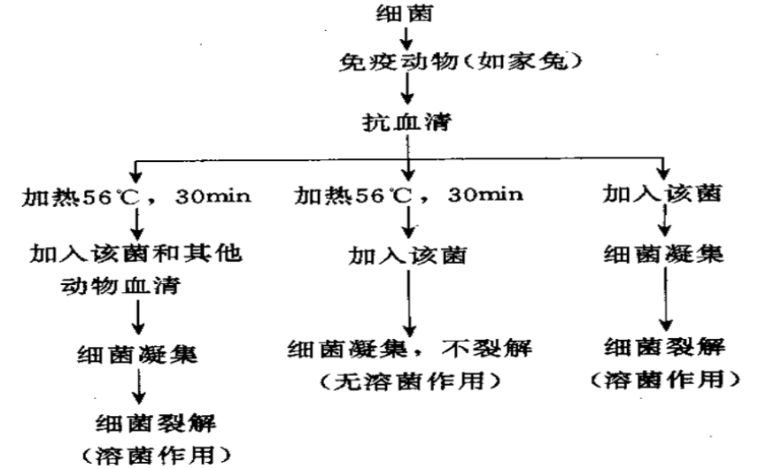
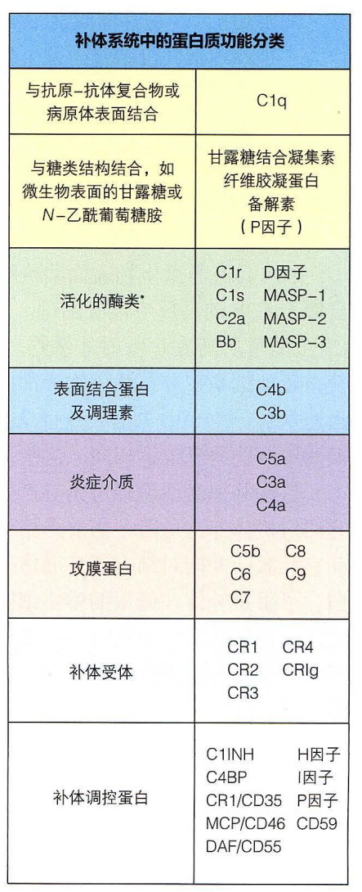
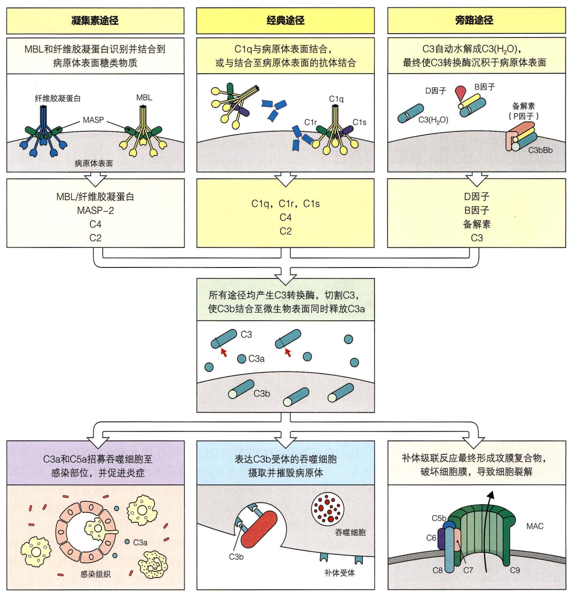
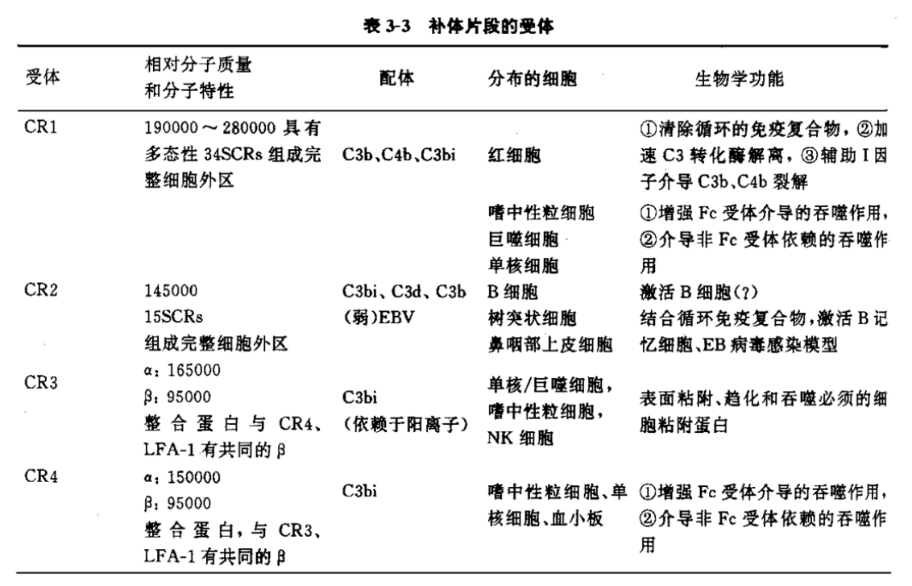

# 第五章 补体系统

## 概述

### 补体的定义

正常人和动物血清中存在的一组不耐热的球蛋白，能补充协助和加强抗体的免疫作用，同时具有独特的生物学作用。

存在于人和脊椎动物血清、组织液中和细胞表面的一组经活化后具有酶活性的糖蛋白。

存在于新鲜免疫血清中的一种不耐热成分，可辅助特异性抗体介导的溶菌作用，是抗体发挥溶细胞作用的必要补充条件。

补体是多种存在于血液和其他体液中可溶性蛋白的总称。早在 1890 年代，Jules Bordet 发现正常血浆中存在一种不耐热的物质，该物质能够「补充」免疫血清的杀菌活性。调理吞噬效应同时也参与杀菌过程，它是指病原体被抗体和（或）补体蛋白标记以后更易被吞噬细胞摄取和杀灭。虽然补体最初是作为抗体应答中的一种效应分子被发现，但它其实是作为固有免疫的一部分而进化产生，在缺乏抗体的情况下，通过更为古老的补体激活途径在感染早期为机体提供保护。

补体存在的实验验证：

### 补体的命名

补体蛋白的命名看似令人困惑，其实不然。首先被发现的补体蛋白属于经典途径，它们均按照大写字母 “C” 后面加一个数字来命名。天然无活性的补体酶原蛋白均有一个简单的数字编号，如 C1、C2，但遗憾的是它们是按照被发现的顺序，而非酶级联反应的顺序来命名。例如，经典途径的反应顺序是 C1、C4、C2、C3、C5、C6、C7、C8 及 C9（应注意这些蛋白质并非都是蛋白酶）。其酶解反应产物则在原有名称后面再添加一个小写字母后缀，如 C3 酶解反应产生的小片段蛋白称为 C3a，而余下的大片段蛋白质则称为 C3b。按照传统定义，酶解反应产生的大片段均在原有名称后再添加后缀小写字母 “b” 来命名，但也有极少数例外。C2 的发现者把 C2 酶解后的大片段蛋白质命名为 C2a，且在后续文献中这一命名得以保留，因此在本书中也沿用这一命名。另外一个例外是 C1q、C1r、C1s 的命名，它们并非 C1 的酶解产物，而是它们共同组装成 C1。旁路途径中的补体蛋白发现得更晚，它们以不同的大写字母命名，如 B 因子和 D 因子。它们的酶解产物也是在原有名称后面添加后缀 “a” 或 “b”，因此 B 因子大片段被称为 “Bb”，而小片段则被称为 “Ba”。活化的补体组分有时会在名称上方标注一条水平线，如 “$\mathrm{\overline{C2a}}$”，但我们在此不会使用这种命名习惯。灭活补体片段在原有名称前加 i 表示，如“iC3b”。

### 补体系统的理化性质

> 上图中，C2a 是指 C2 水解后大的、有活性的片段。

+ 补体系统由近 40 种成分组成，多数组分为糖蛋白，包括：固有成分 13 种，C1q、C1r、C1s、C2 - C9、D 因子及 B 因子；调节蛋白 10 种；补体受体 10 种等。
+ 无特异性
+ 不稳定性
  + 不耐热：56℃、30min，大部分失活
  + 不易保存：室温，1-2 天；1-10°C，3-4 天；冰冻干燥，保存时间较长。
+ 正常生理情况下，通常各成分以非活化形式——酶原存在。

## 补体系统的激活

> **补体是一个由可溶性 PRR 和能够检测并摧毁微生物的效应分子组成的系统**	上图展示三条补体激活途径的病原体识别机制，以及参与酶解级联反应形成 C3 转换酶的补体组分。中图展示 C3 转换酶切割 C3 成 C3a 和 C3b，C3b 共价结合到病原体表面。凝集素途径的激活（左上图）是由 MBL 或纤维胶凝蛋白结合到微生物细胞壁和英膜表面的糖类残基而触发。经典途径的激活（上中图）是由 C1 与病原体表面结合或与结合了病原体的抗体结合而触发。在旁路途径（右上图）中，可溶性 C3 在液相中经过自动水解产生 C3（H2O），通过与 B 因子、D 因子、P 因子（备解素）相互作用这一反应被进一步放大。下图展示所有补体途径均汇合于结合至病原体表面的 C3b，继而产生补体各种效应功能。结合至病原体的 C3b 作为调理素发挥功能，使表达 C3b 受体的吞噬细胞更易摄取已被补体标记的微生物（下中图）。同时，C3b 与 C3 转换酶结合形成 C5 转换酶，切割 C5 成 C5a 和 C5b。C5b 启动 C6、C7、C8、C9 组装成攻膜复合物，破坏病原体膜（右下图）。C3a 和 C5a 作为趋化因子招募免疫细胞至感染部位并诱发炎症（左下图）。

### 凝集素途径

凝集素途径类似于经典途径，重要区别在于起始成分为 C4，而无 C1 成分参与。

1. 活化物质（MBL）的产生过程

   细菌诱导巨噬细胞产生 IL-6-促使肝细胞合成、分泌急性期蛋白（包括甘露聚糖结合凝集素，mannan-bindinglectin,MBL）

2. 活化顺序

   MBL 与细菌（或病毒）表面甘露糖蛋白结合（结合点为甘露糖残基）, 再与丝氨酸蛋白酶结合 - 结合物：MBL-相关丝氨酸蛋白酶 (MASP）（MBL-associated serine protease）表现出丝蛋白酶活性（具有 C1q 相似的作用）使 C4 和 C2 激活 - 产生 C3 转化酶 - 以后的活化步骤与经典途径相同。

### 经典途径

+ 激活剂：Ag-Ab 复合物（由 IgG1、IgG2、IgG3 和 IgM 与相应抗原结合），补体结合部位结合 C1q，使其变构，再激活各成分。（一些非免疫学物质也能激活补体的经典途径（核酸、酸性粘多糖等能与 C1q 结合；纤溶酶及组织蛋白酶可激活 C1r 或 C1s；还有逆转录病毒等病原物的表面也可能直接与 C1q 成分结合）
+ 参与成分：C1q、C1r、C1s - C9 等 11 种成分。
+ 激活过程（三个阶段）
  + 识别阶段
  + 活化阶段
  + 膜攻击阶段
+ 激活顺序：C1q-C1r-C1s-C4-C2-C3-C5-C6...C9

### 旁路途径

+ 不经 C1、C4、C2 激活，而是由 C3、B 因子、D 因子参与的激活过程
+ 必须提供一个吸附或结合补体 C3b 成分的载体表面-激活剂：如酵母多糖、细菌脂多糖、肽聚糖、细胞膜多糖成分、或凝集的 IgG4、IgA、IgE 等。
+ 激活顺序为：C3(B 因子）-C3b(D 因子）-C3bB-C3bBb-C3bBb3b-C5-C6-C7-C8-C9

## 补体激活的调节

+ 体液中或细胞膜上存在多种补体调节因子（C1 抑制物、C4 结合蛋白、促衰变因子等），在不同环节上调控补体激活的级联反应，使补体的激活有效且适度。
+ 这些调节因子主要通过抑制补体激活途径中心环节 C3 的活化及抑制攻膜复合体的形成进行调控，以防止补体活化过程中对宿主自身正常细胞的损伤。

## 补体的生物学活性

### MAC 介导的生物学效应 - 细胞裂解作用

补体系统活化 → 膜攻击复合物 → 溶解靶细胞（如：奈氏细菌等 G-菌，异型红细胞等）

+ 实际意义
  + 抗感染
  + 自身免疫病

### 补体活化片段介导的生物效应

#### 调理作用（补体的调理作用）

靶细胞 → C3b、C4b、iC3b → 结合于吞噬细胞（如单核巨噬细胞、中性粒细胞、NK 细胞）受体 → 促进吞噬

实际意义：抗感染。

#### 免疫粘附作用

Ag-Ab 复合物（可溶性）→ C3b 或 C4b → 与血细胞（如红细胞、血小板）CR 结合 → 便于吞噬细胞清除。

+ 实际意义
  + 清除免疫复合物，如抗病毒感染
  + 引起免疫性疾病，如免疫复合物沉积，引起肾小球肾炎。

#### 炎症介质作用

##### 过敏毒素作用

过敏毒素（anaphylatoxin）：C3a、C4a 和 C5a

C3a、C4a 和 C5a → 单核巨噬细胞、肥大细胞、中性粒细胞和嗜碱性粒细胞等的受体（C5aR、C3aR）→ 释放活性介质（如：组胺、白三烯及前列腺素等）→ 过敏反应性病理变化（引起血管扩张，增加毛细血管的通透性以及使平滑肌收缩等）。

##### 趋化作用

趋化因子（chemotaxin）：C3a、C5a 和 C567

C3a、C5a 和 C567 → 吞噬细胞（如肥大细胞、中性粒细胞等）向感染部位聚集 → 炎症反应。

##### 激肽样作用

C2a、C4a → 能增强血管的通透性 → 炎性渗出、水肿。

+ 实际意义
  + 抗感染及清除异物
  + 引起变态反应性疾病及炎性损伤

#### 中和、溶解病毒作用

在病毒与相应抗体形成的复合物中加入补体，则明显增强抗体对病毒的中和作用，阻止病毒对宿主细胞的吸附和穿入。

## 补体片段的受体及功能

---

+ 补体系统包括 30 余种可溶性和膜蛋白，是体内重要效应系统和效应放大系统。
+ 补体各固有成分可分别经经典、旁路、MBL 途径活化，通过共同的末端途径，最终形成 MAC 参与特异性和非特异性免疫。
+ 补体活化过程中还产生多种活性片段，发挥广泛的生物学作用。
+ 补体活化也可导致病理性免疫损伤。

---

一、名词解释：

补体、膜攻击复合体

二、填空：

补体激活途径包括：

三、选择题

1. 具有激肽样作用的补体裂解片段是

A. C2a	B. C3a	C. C3b	D. C5a	E. Ba

2. 补体系统三种激活途径均必须有哪种成分参加？
A. CIq	B. C4 和 C2	C. C3	D. B 因子	E. D 因子

四、问答题：

1. 补体系统的概念及其组成

2. 比较补体三条激活途径的异同