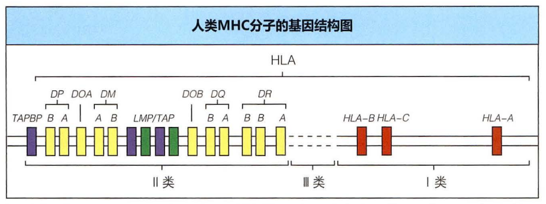

# 第六章 主要组织相容性复合体

## 概述

主要组织相容性复合体（ major histocompatibility complex，MHC），又称主要组织相容性复合基因，是存在于大部分脊椎动物基因组中的一个基因家族，由一群紧密连锁的基因群组成，呈高度多态性，其编码产物（主要组织相容性抗原）是抗原提呈和 T 细胞活化分子，与免疫应答及免疫调节密切相关，也是引起快而强的排斥反应的抗原；其中人类的 MHC 糖蛋白，又称为人类白血球抗原（英语：human leukocyte antigen，简称 HLA）。

主要组织相容性基因复合体最早在近交系小鼠（inbred mice strains）中发现，克拉伦斯・库克・利特尔在做肿瘤组织移植实验时发现不同小鼠个体间会有排异反应。 乔治・斯内尔将移植时引起排异的抗原命名为组织相容性抗原，并指出了 H-2 复合体就是小鼠的主要组织相容性复合体，这是最早发现的 MHC 基因座。因其贡献，斯内尔获得了 1980 年的诺贝尔生理医学奖。

## MHC 的基因组成及定位

MHC 可分为 I 类，Ⅱ类和 III 类三个基因区。

MHC I 组成性表达于所有有核细胞表面。

MHC Ⅱ主要表达于专职抗原递呈细胞表面（树突状细胞：dendritic cell，B 细胞，巨噬细胞）、胸腺上皮细胞和人的活化 T 细胞。

MHC III 类基因区的编码产物主要包括补体蛋白。

### 人类的 MHC 的基因组成及定位

+ 分成三类基因区
  + I 类基因
    + 经典：B、C、A 位点
    + 非典型：E、F、G 位点等
  + II 类基因
    + 经典：DP、DQ、DR 位点
    + 非典型：DN、DM、DO 位点等
  + III 类基因：C4、C2、B 因子、TNF、HSP70 等

定位：第 6 号染色体短臂 (6p21,3)

### 小鼠 H-2 复合体

构成：K、I、S、D/L 等位基因

定位：第 17 号染色体组织结构与人类的 MHC 类似，不同之处：
1. 有一个 MHC I 基因 translocate 到 MHC II 的前边
2. 编码 MHC II 有两个等位基因

### MHC 遗传学特点

高度多态性：一个基因座位上存在多个等位基因，群体中不同个体在等位基因拥有状态上存在差别。

单倍体遗传（共显性遗传）：一条染色体上 HLA 各位点基因紧密连锁组成的基因单位，以单倍型为单位将遗传信息传给子代。

连锁不平衡：分属两个或两个以上基因座位的等位基因同时出现在一条染色体上的几率高于随机出现的频率。

## MHC 分子结构与分布

### HLA-I 类分子的分布、结构

+ 分布：有核细胞（含血小板和网织红细胞）表面。
+ 存在形式
  + 膜结合：不同的组织细胞表达 I 类分子量不同，如：淋巴细胞（最多），肾、肝脏及心脏（其次），神经组织（很少）
  + 可溶性：存在于血清、初乳和尿液等体液中。
+ 结构：二条多肽链（非共价键连接的糖蛋白，Ig 超家族成员）
  + α链（重链）：340 个氨基酸残基，分子量 44kDa，MHC-I 类基因编码，具有高度多态性。
    + 胞外区
      + α1、α2 功能区，抗原结合部位
      + α3 功能区，CD8 分子结合部位
    + 跨膜区
    + 胞内区
  + β2-微球蛋白（β2m）：分子量 12 kDa，由 15 号染色体基因编码。

### HLA-II 类分子的分布、结构

+ 分布
  + APC - B 细胞、单核/巨噬细胞、树突状细胞
  + 激活的 T 细胞，精子和血管内皮细胞
+ 结构
  + 两条异质多肽链（非共价键连接的糖蛋白，Ig 超家族成员）
    + α链：α1 和α2 功能区
    + β链：β1 和β2 功能区
  + α1 和β1-抗原肽结合部位，决定Ⅱ类分子的多态性
  + β2---CD4 分子结合部位

## MHC 分子的生物学作用

### HLA-I 类分子的生物学功能

1. 参与内源性抗原的递呈（诱导对病毒感染细胞和肿瘤细胞的杀伤和溶解）
2. 作为 CD8^+^T 细胞的识别分子（CD8 的配体）
3. 参与胸腺内 T 细胞的分化、发育
4. 参与 NK 细胞的活化或抑制
5. 诱导同种移植排斥反应

### HLA-II 类分子的生物学功能

1. 参与外源性抗原的递呈
2. 作为 CD4^+^T 细胞的识别分子（CD4 的配体）
3. 参与胸腺内 T 细胞的分化、发育
4. 参与免疫应答调节 - Ir 基因产物调节
5. 诱导同种移植排斥反应

---

+ MHC 分子的生物学作用（归纳）
  1. 抗原递呈作用
  2. 参与 T 细胞发育
  3. 参与 NK 细胞的功能调控
  4. 对免疫应答的遗传控制
  5. 参与诱导强烈的器官移植排斥反应

## HLA 与医学应用

### HLA 与器官移植

#### 移植物的供体与受体的 MHC 配型

+ 移植物的供体与受体在 MHC 上需要配型成功
+ 不相关的供体与受体要 MHC 配型成功是难的
+ 兄弟姐妹之间大约有 20%的几率配型成功

### HLA 分子的异常表达和临床疾病

### HLA 与疾病的关联

### HLA 与亲子鉴定和法医学