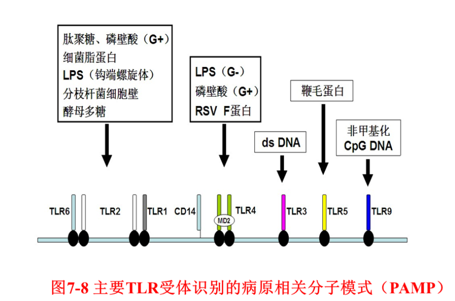
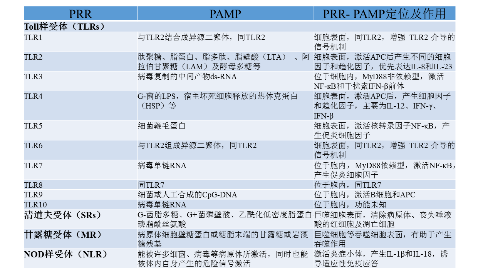

# 第七章 固有免疫

## 概述

固有免疫（innate immunity）：机体中天然存在的、固有的免疫防御功能，即出生后就天生具备的非特异性防御功能，也称之为天然免疫或非特异性免疫（nonspecificimmunity）。

适应性免疫（adaptiveimmunity）或特异性免疫（specificimmunity）：是抗原刺激机体后，机体中特异性免疫细胞识别抗原后，参与活化、增殖-分化并转化为功能性的淋巴细胞发挥生物学效应的一系列过程的总称。

### 固有免疫特点

+ 先天固有，可稳定遗传给后代
+ 个体出生时即具备，不针对特定抗原，没有特异的选择性，作用范围广
+ 反应迅速，率先与入侵异物起作用，将其从体内清除，但作用强度较弱，持续时间短。
+ 无免疫记忆性

## 固有免疫的物质基础

### 屏障结构

#### 皮肤屏障

##### 机械作用

+ 机械屏障
+ 上皮的自我更新
+ 毛囊是相对薄弱的地方，容易招致金黄色葡萄球菌感染，出现痈，“青春痘”

##### 化学作用

+ 汗腺分泌乳酸、脂肪酸，营造酸性环境，抑制细菌的生长
+ 烧伤、化学物质腐蚀、剥脱性皮炎等原因导致大面积皮肤缺失后，患者将面临严重感染的威胁

#### 黏膜屏障

##### 机械作用

+ 管腔（如消化道、呼吸道、泌尿生殖道）流动体液的冲刷（腹泻、尿频或咳嗽）
+ 黏膜粘液粘附各种微生物，阻止其粘附上皮细胞，借助纤毛摆动、管腔蠕动以及咳嗽等清除微生物
+ 黏膜上皮组织也提供一定的机械屏障作用

##### 化学作用

+ 管腔体液具有杀菌物质，如胃酸、溶菌酶口

##### 生物拮抗作用

+ 黏膜表面正常菌群，可以拮抗病原体的入侵

### 固有免疫细胞

#### 肥大细胞 Mast cell

肥大细胞：结缔组织和粘膜上皮内的嗜碱细胞。

+ 强嗜碱颗粒
+ 免疫球蛋白 IgE 的受体，导致“过敏反应”
+ 炎性介质：组胺、5-羟色胺、前列腺素
+ 过敏症状：皮肤潮红、心动过速、低血压、皮肤瘙痒、皮肤划痕症。
+ 形状：圆形或卵圆形，细胞核小，染色浅，位于细胞中央
+ 嗜碱性：细胞质中充满大小一致、染成蓝紫色的颗粒
+ 分布：血管周围、皮肤、呼吸、消化、泌尿生殖系统、肝、脾、淋巴结、胸腺等
+ 功能：能够通过过敏反应迅速招募其它细胞参与免疫反应，因此也被形象称为「哨兵细胞」

#### 巨噬细胞 Macrophages

+ 来源：源自单核细胞，体外培养不增殖，存活 2～3 周
+ 功能：吞噬与抗原提呈，非特异性防卫和特异性防卫
+ 吞噬：以固定细胞或游离细胞的形式对细胞残片及病原体进行吞噬与消化，分泌细胞因子（IL-1、IL-6、TNF-α等）激活淋巴细胞或其它免疫细胞
+ 单核细胞：循环及存在于各种器官（如脾脏、肝脏和肺）间质组织中的细胞，各自具有不同的形态特征，行使各种功能

#### 吞噬细胞

+ 中性粒细胞：多形核中性粒细胞（PMN）数量最多，是血液中白细胞的主要成分（成人约 60%～70%）
+ 嗜碱粒细胞：胞浆内丰富的嗜碱性颗粒，细胞表面 FcRI，与抗体结合后活化细胞，释放颗粒和炎症介质
+ 嗜酸粒细胞：限制嗜碱性粒细胞在速发性过敏反应中的作用；参与对蠕虫的免疫反应（具有 IgE 的 Fc 片段受体和补体 c3 的受体）

#### 自然杀伤细胞（NK 细胞）

+ 自然杀伤细胞：对靶细胞的识别与杀伤活性是非特异性的细胞毒作用，无 MHC 限制，不需抗原预先致敏，因此称为自然杀伤活性。
+ 分布：占循环中淋巴细胞族群的 5%～10%
+ 功能：可分泌穿孔素及 TNF-α等活性物质杀死靶细胞，如病毒感染的细胞和某些肿瘤细胞
+ 机制
  + 需抑制性受体和激活受体参与，许多表达 MHC 分子的细胞都能免遭 NK 细胞介导的细胞毒攻击。
  + 在病毒感染的细胞和某些肿瘤细胞由于 MHC 分子表达下调或结构改变而遭致 NK 细胞的杀伤。
  + 不同于细胞毒 T 细胞（cytotoxic Tlymphocyte，CTL）对靶细胞的特异性识别机制。
+ 分子识别：杀伤细胞活化受体（killeractivatory receptor,KAR），杀伤细胞抑制受体（killer inhibitory receptor,KIR)。
+ KAR: 识别细胞糖类配体，胞内段有 ITAM（免疫受体酪氨酸活化基序）结构，转导活化信号。
+ KIR 的胞外区，识别自身细胞 MHC-I，KIR 有 ITIM（免疫受体酪氨酸活化抑制基序）结构，介导抑制信号。
+ 分泌杀伤介质
  + 穿孔素：能溶解多种肿瘤细胞
  + NK 细胞毒因子（NK cytotoxic factor,NKCF）与靶细胞表面的 NKCF 受体结合，选择性杀伤靶细胞。
  + TNF-a: 通过诱导凋亡等机理杀伤靶细胞，慢于穿孔素对细胞的裂解过程。
+ lgG 的 Fc 受体（FcyRIII）：结合抗体 Fc 段，在针对靶细胞的特异性 IgG 抗体的介导下对靶细胞发挥杀伤作用，称为抗体依赖细胞介导的细胞毒作用 (ADCC)

#### 树突状细胞 (Dendritic cell, DC)

+ 形状：成熟 DC 表面有树突样突起，未成熟 DC 在体内迁移，无明显树枝状突起，有吞噬功能。
+ 功能：最强的专业抗原提呈细胞 (antigen present cell,APC) 高效摄取、加工和递呈抗原，分泌细胞因子，细胞接触等激活 T 淋巴细胞。
+ 分布：外界接触部位，血液中未成熟 DC，活化时迁移到淋巴结等淋巴组织中与 T、B 淋巴细胞互相作用，启动特异性免疫应答。
+ 应用：肿瘤抗原或 mRNA，在体外致敏或者转化 DC，经体外扩增后再回输或免疫接种于肿瘤病人，可诱导特异性 CTL 反应或特异性抗体，从而发挥抗肿瘤的免疫反应。

#### $\gamma\delta$ T 细胞

+ 分布
  + 主要于皮肤、小肠、肺及生殖器官等粘膜及皮下组织，大多 CD4^-^CD8^-^，少数为 CD4^-^CD8^+^。
  + 正常人外周血中，$\gamma\delta$ T 细胞仅占总 T 淋巴细胞数的 5%～10%。
  + 人小肠上皮间淋巴细胞（intestine intraepithelial lymphocyte，IEL）中 v8T 细胞占 10%～18%，大肠 IEL 中的比例高达 25%～37%。
+ 功能：维持上皮细胞的完整性、抗感染、抗肿瘤、维持免疫耐受、免疫监视、免疫调节以及自身免疫。
+ 特性：
  + 不依赖于胸腺，其表面的 T 细胞受体（TCR）由 $\gamma$ 和 $\delta$ 链组成，无 MHC 限制性和不依赖抗原递呈等特性，具有固有免疫的特征。
  + 通过分泌细胞因子调控免疫反应，同时还可通过细胞毒作用毒杀癌细胞与病毒感染的细胞。

### 固有免疫分子

+ 酶：溶酶体中的水解酶、氧化酶和抗氧化酶等酶类
+ 抗菌肽：抗病原微生物和抗肿瘤细胞，如防御素
+ 补体
+ 炎性介质：促炎细胞因子、脂质介质
+ 凝集素：能结合糖的蛋白，因其能凝集红血球（含血型物质），故名凝集素。
  + 功能：模式识别受体、调理素、效应分子，参与吞噬、抗菌、激活酚氧化酶、包囊和结节形成等。

## 固有免疫应答机制

+ **病原相关分子模式（pathogen associated molecular patterns，PAMP）**：不同种类的病原微生物表面某些所共有的、在结构或组成上具有高度保守的分子结构，既是微生物生存或致病性所必需的分子，也是可被宿主固有免疫细胞泛特异性所识别的分子。
+ PAMP 可被非特异性免疫细胞通过表面的模式识别受体（PRR）所识别。
+ PAMP：细菌的脂多糖（LPS）、磷壁酸（LTA）、肽聚糖（PGN）、DNA, 螺旋体的脂蛋白，酵母或真菌细胞的甘露糖、葡聚糖，病毒的双链 RNA，宿主凋亡细胞表面某些共有的分子结构。
+ **模式识别受体（PRR）**：固有免疫细胞表面，识别、结合一种或多种 PAMP，并将结合后信号进行传递的识别分子。
+ 特性：多样性较低，非克隆性表达，无需细胞增殖就可快速介导固有免疫反应。
+ PRR 分子主要种类：
  + 甘露聚糖结合凝集素（MBL）：肝脏合成的急性期反应蛋白，识别并结合多种微生物（G^-^/G^+^菌、酵母菌及某些病毒）表面的甘露糖，激活 MBL 途径的补体反应
  + 甘露糖受体：与微生物细胞壁糖蛋白和糖脂末端的甘露糖和岩藻糖残基特异性结合，介导吞噬细胞对微生物的吞噬和清除
  + 清道夫受体：能够识别并结合细菌细胞壁中的某些组分，从而清除血循环中的细菌
+ Toll 样受体（TLR）：受体分子胞外部分与果蝇蛋白 TolIl 同源，与相应 PAMP 分子结合后诱导免疫应答和炎性反应。
+ NOD 样受体（nucleotide binding oligomerization domain，NLR）：细胞内的感应分子，与相应 PAMP 分子结合后被激活，形成炎症小体激活胱天蛋白酶 Caspase 1，切割 IL-1 和 IL-18 等炎症因子的前体，形成成熟的分子并分泌到胞外，引起炎症反应。
+ NK 细胞识别受体（NKR)

### TOLL 样受体 (Toll-like receptor, TLR)

+ TLRs 的发现：果蝇 TolI 蛋白参与胚胎形成，介导对微生物感染的固有免疫反应。
+ 哺乳动物细胞中 TLR 同源性及结构均与果蝇 ToII 蛋白相似，为一种跨膜蛋白，膜外结构域富含亮氨酸的重复序列。
+ 1996 年在人类基因组中克隆并定位了第一个果蝇 Toll 的同源物基因，称为 TLR1，随后又克隆得到 TLR4 蛋白。
+ 10 种 ToII 同源物（TLR1-TLR10），结合不同的 PAMP 分子。

#### TLRs 的分布

+ 淋巴组织
+ 非淋巴组织口
+ 不同的 TLR 分子在不同的组织和细胞中的表达量和丰度有所不同
  + TLR1：单核细胞、中性粒细胞、B 淋巴细胞、NK 细胞
  + TLR2：单核细胞、中性粒细胞、树突状细胞（DC)
  + TLR3：DC
  + TLR4：内皮细胞、巨噬细胞、中性粒细胞、DC
  + TLR5：巨噬细胞和 DC

#### TLRs 的配体

+ TLRS：跨膜受体，不同的 TLR 识别不同的 PAMP 分子
+ TLR4：G-菌的 LPS、类脂 A、热休克蛋白 60
+ TLR2：G+菌成分如肽聚糖、细菌脂蛋白、脂胞壁酸
+ TLR3：双链病毒的 RNA·TLR5：鞭毛蛋白（flagellin）和有鞭毛的细菌
+ TLR1，TLR2 和 TL6：G-菌成分、酵母多糖（zymosan）、肽聚糖（peptidoglycan）、支原体脂蛋白（mycoplasma lipoprotein）
+ TLR9：原核生物如细菌中保守的非甲基化 CpG DNA

#### TLR 结构与功能

TLR 胞内部分与白细胞介素 (IL)-1 受体的结构类似，称为 TLR 结构域，TLR 和 IL-1R 激活胞内信号基本一致。

+ 激活过程
  + TLR 识别并结合相应配体，然后其本身发生二聚化
  + 二聚化 TLR 通过 TIR 区域与转接蛋白的 TIR 结构域相互作用，从而传递信号和激发下游效应
  + 磷酸化核转录因子 NF-$\kappa$B 的抑制因子 I-$\kappa$B，磷酸化的 I-$\kappa$B 不再结合 NF-$\kappa$B，从而释放 NF-$\kappa$B
  + 释放后的 NF-$\kappa$B 进入细胞核，发生转录因子的作用，导致相关基因发生转录，从而激活相应的免疫应答

#### TLRs 的生物学作用

##### 识别 PAMP

+ TLRs 识别病原体，主要是识别病原体产生的 PAMP 分子，是固有免疫发挥防御作用的关键
+ TLR4：在 LPS 结合蛋白（LBP）及髓样分化蛋白-2（MD-2）的辅助下，识别细菌细胞壁中的成分 LPS，还可识别机体自身细胞坏死后释放的热休克蛋白
+ TLR2：配体更为广泛，如肽聚糖、脂蛋白、脂多肽、脂壁酸、酵母多糖
+ TLR5 识别细菌的鞭毛蛋白
+ TLR9 识别细菌的非甲基化 CpG DNA 序列
+ TLR3 识别病毒的 dsRNA

##### 启动适应性免疫应答

+ APC 细胞：高表达多种 TLR 分子
+ PAMP 刺激 APC：外周血中未成熟 DC，被多种微生物成分（PAMP 分子，如 LPS、非甲基化的 CpG-DNA、肽聚糖、脂蛋白以及分支杆菌的细胞壁成分）刺激后活化。
+ 活化成熟的 DC：上调表达多种 TLRS，如 TLR1，2，4，5

##### 调控适应性免疫应答的类型

+ 免疫应答类型：Th1 型的细胞免疫和 Th2 型的体液免疫
+ Th1 型：IFN-v、IL-12，引起细胞免疫反应应答
+ Th2 型：IL-4 则主要激发细胞的分化，诱导体液反应的发生
+ TLRS：APC 细胞的活化对免疫应答类型的影响

##### 抗病原微生物药物设计的靶标

+ TLR 识别的分子种类
  + 细菌的细胞壁：LPS、胞壁酸、肽聚糖等
  + 细菌的核酸：甲基化的 CpG-DNA
  + 病毒的遗传物质：双链 RNA
+ TLR 靶点
  + 新型抗菌药物
  + 抗病毒药物
  + 抗炎药物
  + 抗感染药物
  + 脓毒性休克

### 自然杀伤细胞识别受体

NK 细胞受体 (Natural Killing Cell Receptor, NKCR)：非抗原特异性受体

+ 结构：Ig 超家族和 c 型凝集素超家族
+ 功能
  + 激活性受体（NKAR）
  + 抑制性受体（NKIR）：监测靶细胞表面是否表达 MHC I 类分子来区分自身或异己，进而激活或抑制 NK 细胞的杀伤功能
  + NKIR 与配体结合的亲和力大于 NKAR，以抑制性信号为主

+ 与细胞毒 T 淋巴细胞（CTL）的关系
  + 区别：非特异性与特异性
  + 互补：完成机体的免疫监视，维持机体的免疫稳定

### NOD 样受体 (NLR)

NOD 样受体：细胞质内的核苷酸结合寡聚化结构域（nucleotide bindingoligomerization domain，NOD）蛋白家族。

+ 特点
  + 分布：胞内受体，不同于 TLRs
  + 结构：N 端的效应域（结合下游的效应分子），中间的寡聚域（介导自身的寡聚反应）和 C 端富含亮氨酸的重复序列（LRR）（能够识别配体
+ 主要种类
  + NOD1：配体是作为细菌细胞壁成分的 PAMP 类分子 $\gamma$-D-谷氨酸-meso-二氨基庚二酸（$\gamma$-D-glu-meso-DAP）
  + NOD2：配体是细菌细胞壁成分的 PAMP 类分子胞壁酸二肽（MurNAc-L-Ala-D-isoGIn, MDP)

#### NLR 家族和炎症小体

+ 种类：人类，23 种；小鼠，34 种
+ NLR 的 N 端结构域
  + 功能：效应结构域，主要通过结合下游的效应分子介导蛋白之间的相互作用。
  + 种类：CARD 结构域、PYD 结构域、BIR 结构域和转录激活结构域
+ NOD 结构域：NLR 的中间部分，NLR 分子与配体结合后被激活，在此过程中 NOD 结构可以介导自身的寡聚化
+ 亮氨酸富集结构域（LRR）：NLR 的 C 端，介导自身的调控和识别病原物的 PAMP 类分子
+ 根据 N 端结构域分类
  + NALP (nachto domain, leucin-rich repeat and pyrin domain-containing protein）：又称为 NLRP，N 端为 Pyrin 域，能够在激活情况下形成炎症小体，激活下游效应物 Caspase 1（胱天蛋白酶），促使 IL-1 活化成熟
  + NOD 蛋白亚家族：N 端为胱冬酶募集域（caspase recruitment domain, CARD)·
  + IPAF/NAIP 亚家族：效应域为杆状病毒细胞凋亡抑制蛋白（baculovirus inhibitor of apoptosis-repeats, BIR)

### NLRP3(NALP3) 炎症小体

+ NLRP3 炎症小体：被多种 PAMP 分子激活
  + 真菌 （白色念珠菌和酿酒酵母）
  + 细菌 （金黄色葡萄球菌和李斯特菌
  + 病毒
  + 病原体分泌的毒素
    + 尼日利亚菌素 nigericin
    + 藻类产生的刺尾鱼毒素 maitotoxin
    + 机制：改变细胞膜通透性，导致胞内钾离子外流，激活 NLRP3
  + 自身危险信号：ATP 和尿酸盐
+ 自身危险信号和代谢产物
  + 来源：宿主细胞凋亡或坏死，释放胞内能量物质 ATP 和代谢产物尿酸盐
  + 功能：配体或信号分子，激活 NLRP3 炎症小体，进而激活下游效应物 Caspase1，促进 IL-1 的成熟与释放，并引起炎症反应
  + 其他自身危险信号
    + 葡萄糖：糖尿病
    + 淀粉样蛋白：老年痴呆
    + 氧化型低密度脂蛋白（Ox-LDL）：动脉粥样硬化口
  + 外源危险信号
    + 铝佐剂：佐剂的作用机制
    + 硅石（石棉）：尘肺病

#### NLRP3 炎症小体的激活机制

+ 激活过程
  + 结合与寡聚化：与配体结合后，NLRP3 分子通过中间寡聚域（NACHTII 结构域）进行自身寡聚化而激活
  + 焦亡小体（ASC pyroptosome）：激活的 NLPR3 再通过其 N 端的 PYD 结构域招募 ASC 接头蛋白分子，形成的巨大的复合体
  + Caspase 1 的激活：焦亡小体作用于 Caspase 1 的前体，将 Caspase 1 进行切割加工形成有活性的 Caspase 1
  + IL-1β的生成：成熟的 Caspase1 切割 IL-1β的前体，生成并分泌释有活性的 IL-1β，促进炎症反应的发生
+ 激活的三种模型
  + 半通道模型：ATP 激活细胞表面受体，诱导 ATP 介导的离子通道，使胞内的钾离子外流，并在细胞膜上形成小孔，有助于配体通过小孔进入胞内结合并诱导 NLRP3 炎症小体的形成
  + 溶酶体破坏模型：晶体类物质如尿酸钠、硅石、石棉、淀粉样蛋白、铝佐剂以及胆固醇能够以内吞的方式进入细胞，进入并破坏溶酶体，蛋白酶释放到胞浆，激活 NLRP3 炎症小体
  + 活性氧（reactive oxygen species，ROS）模型：NLRP3 激活剂诱导 ROs 的产生，并以 ROS 作为共同信号激活 NLRP3 炎症小体，有一些能够诱导 ROS 的物质（如 TNF-α）却不能激活 NLRP3 炎症小体。

#### NLRP3 炎症小体的调控

+ 调控蛋白
  + CARD 结构域的调控蛋白：可通过其具有的 CARD 结构域与接头蛋白 ASC 中的 CARD 结构域相互作用，从而阻断 Caspase 1 与 ASC 之间的相互作用。
  + PYD 结构域的调控蛋白：主要通过其具有的 PYD 结构域与 ASC 或 NLRP3 中的 PYD 结构域相互作用，从而阻断或抑制 NLRP3 与 ASC 通过 PYD 结构域相互作用。

#### NLRP3 炎症小体与免疫性疾病

+ 家族冷自主炎症综合症（familial cold autoinflammatory syndrome，FCAs）穆-韦二氏综合症（Muckle Wells syndrome，MWS）：细胞内的 NLRP3 在静息情况下不能自身抑制，而始终处于激活状态形成炎症小体。
+ 痛风：尿酸盐晶体通过溶酶体损伤模型激活 NLRP3 炎症小体
+ 尘肺病：硅石、石棉诱导肺部产生炎症反应，造成炎症损伤
+ 阿尔海默茨病：淀粉样蛋白
+ 动脉粥样硬化症：胆固醇晶体
+ 2 型糖尿病：高浓度的葡萄糖刺激胰岛细胞中的 NLRP3 炎症小体，产生 IL-1, 引发炎症反应，造成胰岛细胞的炎症损伤

#### TLR 与 NLR 之间的相互关系

+ 共同点
  + TLR 和 NLR 存在于多数有核细胞
  + 结构上多样性较少
  + 识别不同 PAMP 分子和危险性信号
  + 病原入侵或组织损伤时能迅速诱导产生免疫反应，并进一步活化适应性免疫应答口
+ 联系
  + 配体/刺激分子
  + 信号通路
  + 炎症分子

### 佐剂 adjuvant

佐剂的定义：和抗原一同注射或预先注射，能增强抗原的免疫原性或改变免疫应答类型的物质。

+ 生物佐剂（微生物及代谢产物）：分支杆菌（结核杆菌或卡介苗）、革兰氏阴性杆菌的内毒素（脂多糖）等、百日咳菌苗、酵母菌细胞壁成分、植物血凝素等。
+ 化合物佐剂
  + 氢氧化铝、明矾、甲基纤维素、维生素 A、磷酸钾、**多聚肌苷酸、多聚胞苷酸（PolyI c、PolyA u）、CpG 序列、干扰素、C3d**、左旋咪唑等。
  + 佐剂 65：用于人的免疫佐剂，使用时较安全，含有花生油、单硬脂酸铝和单磷酸脂质 A
  + MF59 佐剂

---

+ C3d：补体 C3 不可再被酶解的最小片段，在抗原特异性免疫建立之前，c3d 可识别非已抗原并与之共价结合，增强了抗原递呈细胞的递呈能力、降低了 B 细胞的活化阈、提高特异性抗体的滴度、促进抗体亲和力成熟。
+ C3d 还可以促进抗原特异性细胞免疫应答水平并改变机体免疫应答模式。
+ C3d 是连接固有性免疫和获得性免疫的桥梁。

#### 佐剂的作用及作用机理

+ 作用于抗原
  + 增强抗原性：浓集 Ag。
  + 延长 Ag 刺激机体的时间：“油包水”的“Ag 贮存库”，绶慢释放，持续时间长。
  + 保护 Ag：不易被体液、血液中的蛋白酶水解。
+ 作用于机体
  + 非特异性刺激→MΦ、淋巴细胞增殖。
  + 皮下形成“肉芽肿”→出现 MΦ、淋巴细胞、浆细胞聚集→加速 Ab 形成。

#### 佐剂的配方及配制方法

+ 弗氏佐剂
  + 完全氏佐剂：石蜡油 3—6 份，羊毛脂 1 份，卡介苗 3 - 5 mg/mL。石蜡油+羊毛脂（溶化按比例吸取）+卡介苗→混合→分装→保存。
  + 不完全氏佐剂：不完全弗氏佐剂不加卡介苗，配制方法同上。
+ 氢氧化铝佐剂：在 Ag 免疫动物前，加适当浓度的硫酸铝钾溶液与抗原混匀，再加低浓度的氢氧化铵中和，便可形成大量的氢氧化铝絮状沉淀，抗原被吸附于沉淀中形成聚集状的颗粒抗原。

## 固有免疫的生物学作用

### 屏障功能

#### 体表屏障

##### 皮肤粘膜

+ 皮肤粘膜的机械阻挡作用和附属物（如纤毛）的清除作用
+ 皮肤粘膜分泌物（如汗腺分泌的乳酸、胃粘膜分泌的胃酸等）的杀菌作用
+ 体表和与外界相通的腔道中寄居的正常微生物对入侵微生物的拮抗作用

#### 内部屏障

+ 淋巴屏障：微生物组织细胞间隙淋巴液经淋巴管到达淋巴结，淋巴结内的巨噬细胞作用
+ 单核吞噬细胞屏障：微生物到血液循环后，受单核吞噬细胞系统屏障的阻挡。中性粒细胞和嗜酸粒细胞，不属于单核吞噬细胞系统，但对入侵的微生物和大分子物质也有吞噬、消化和消除作用。
+ 体液非特异性杀菌物质：补体、调理素、溶菌酶、干扰素、乙型溶素、吞噬细胞杀菌素
+ 血脑屏障和胎盘屏障

### 识别“自己”和“非己”

+ 识别“微生物非己”：PAMPs - PRRs，宿主识别微生物独有而自己不产生的代谢产物
+ 识别“遗失的自己”(missing self)
  + 探测“正常自己的标志”（markers ofnormal self），结合各种抑制途径阻止机体对自身的免疫应答。
  + NK 细胞选择性地杀伤在细胞表面表达很少量或不表达 MHC-I 分子的靶细胞。
  + 补体的旁路激活途径：补体成分 C3，黏附微生物细胞与自体细胞，但 C3 转化酶的仅在微生物细胞表面，因为自体细胞能表达抑制 C3 转化酶的蛋白。
+ 识别“诱导或改变的自己”
  + 识别由感染或细胞转化而导致的异常自身标志：糖蛋白修饰的碳水化合物结构和细胞表面的糖脂，末端为唾液酸，被参与细胞通讯的受体识别，但大部分微生物缺乏唾液酸。
  + 病毒感染和转化的细胞表面（由于感染、转化和衰老而失去唾液酸）也作为“遗失自己”的信号被识别，可直接使这些细胞吞噬“微生物非己”（缺乏唾液酸的生物合成途径）和“异常的自己”
  + 自己特有标志表达在宿主的正常细胞表面，通过启动抑制性受体防止被吞噬细胞吞噬、被 NK 细胞杀伤和被树突状细胞将自身正常细胞抗原所递呈。
  + 微生物细胞表面缺乏这些标志，感染的、转化的和衰老的宿主细胞表面，这些标志表达下降，易被 NK 细胞杀伤和被巨噬细胞吞噬。
+ 尽管“遗失自己”策略是一个区分正常“自己”与“非己”或“异常自己”的有效方法，但却易被欺骗。
  + 盗窃身份：病原体通过基因水平转移获得编码宿主自身标志的基因，可保护其不被宿主细胞识别和破坏。
+ 凋亡细胞：表达一些被吞噬细胞所识别的细胞表面标志，被邻近细胞或巨噬细胞吞噬。
  + 标志：活细胞质膜的内小叶上磷脂酰丝氨酸，在凋亡细胞中位于外小叶上，能被吞噬细胞表面磷脂酰丝氨酸受体识别。

### 固有免疫参与适应性免疫

+ 活化 T 细胞
  + APC 表面的 PRR（甘露糖受体、清道夫受体等）识别 PAMPS，介导 APC 吞噬、摄取病原体并提呈抗原，从而提供 T 细胞活化的第一信号
  + APC 表达的 TLR 和 NLR 识别 PAMPS，从而启动胞内信号转导，激活相关基因的转录，上调 APC 细胞的 MHC 类分子和共刺激分子 B7（CD80/CD86）的表达，从而进一步促进和提高 APC 抗原提呈的能力
+ 产生细胞因子调节免疫应答：TLR 或 NLR 与配体结合后，启动胞内信号转导，诱导产生细胞因子，如 IL-1、IL-12、趋化因子等表达，从而进一步启动和激活适应性免疫应答。

---

+ 固有免疫在机体非特异性抗感染免疫过程、特异性免疫应答的启动、调节和效应阶段起着不可或缺的作用。
+ 构成固有免疫的物质基础有屏障结构，免疫细胞（巨噬细胞、肥大细胞、粒细胞、树突状细胞、自然杀伤细胞、$\gamma$6T 细胞等），免疫分子（酶类、抗菌肽、补体、炎性介质）。
+ 固有免疫，通过免疫细胞各种受体分子，识别病原生物相关分子模式，诱导信号转导，从而激活免疫反应。病原生物相关分子模式是微生物所特有的，如革兰阴性菌的脂多糖、革兰阳性菌的肽聚糖、病毒的 RNA、细菌的 CpG 序列等。而识别这些病原生物相关分子模式的受体则有 TOLL 受体、NOD 样受体等模式识别受体，前者有位于细胞膜表面，也有位于胞内，与病原物相关分子模式结合，诱导细胞因子的表达，促使炎症反应的发生；后者一般都位于胞内，与配体结合后，诱导炎症小体，产生 L-1, 激活炎症反应。
+ 固有免疫可通过识别“微生物非己”（依赖于宿主识别微生物的独特代谢产物，而这些产物宿主并不产生），“遗失的自己”（依赖于探测“正常自己的标志”，为宿主所独有而微生物所缺乏），识别“诱导或改变的自己”（识别由感染或细胞转化而导致的异常自身标志），从而达到快速清除病原微生物、病毒或细菌感染的细胞、肿瘤细胞以及衰老的细胞，维持机体的平衡。