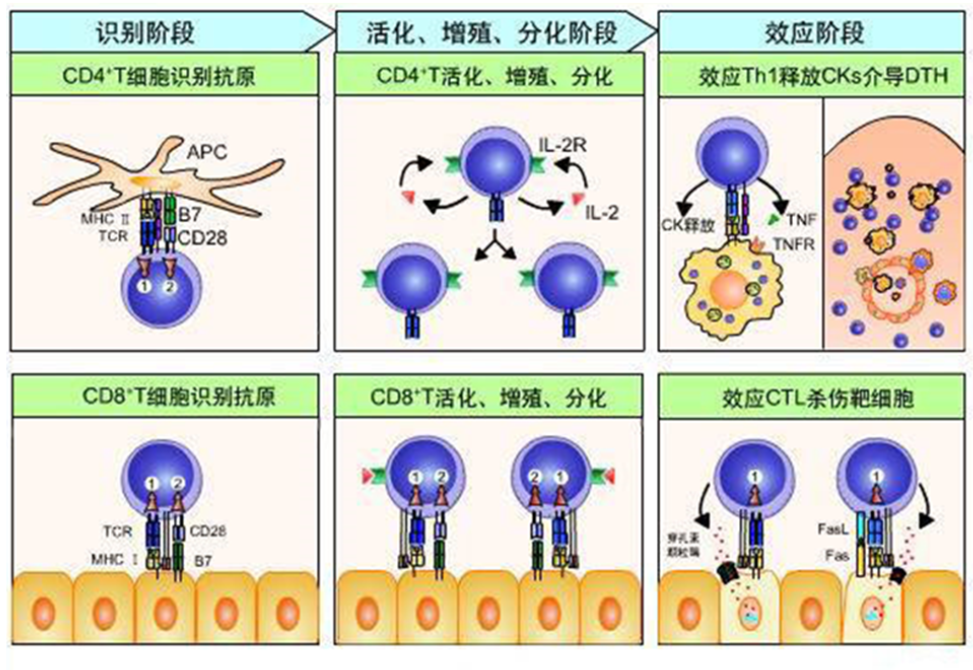
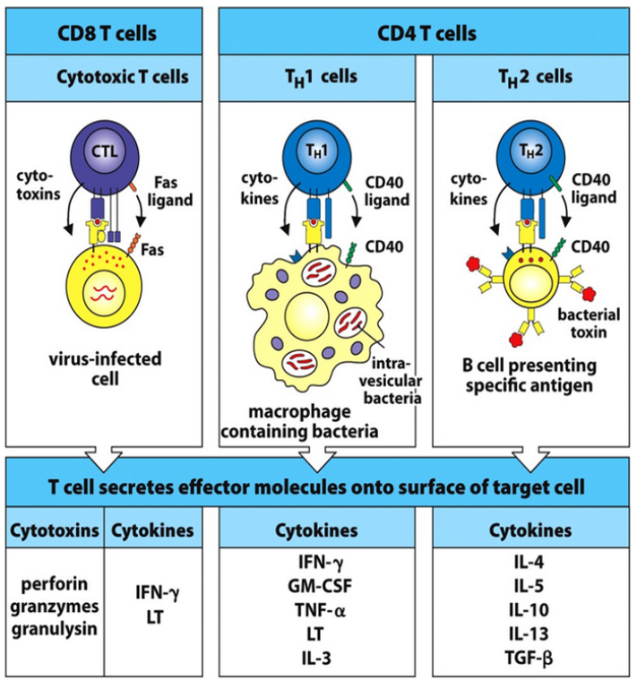
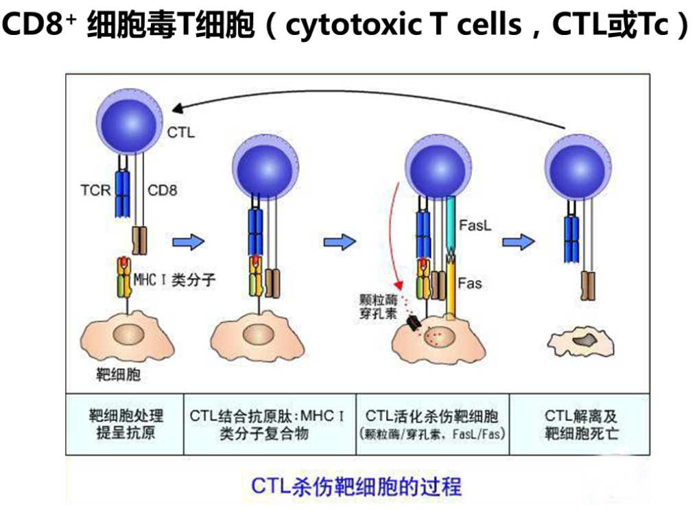
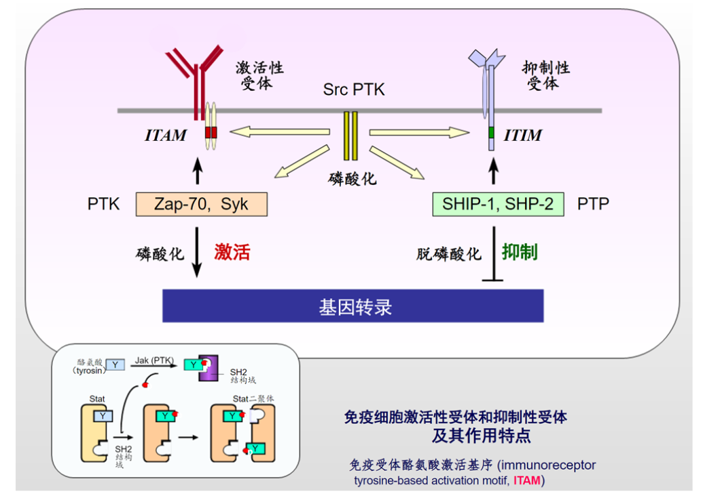
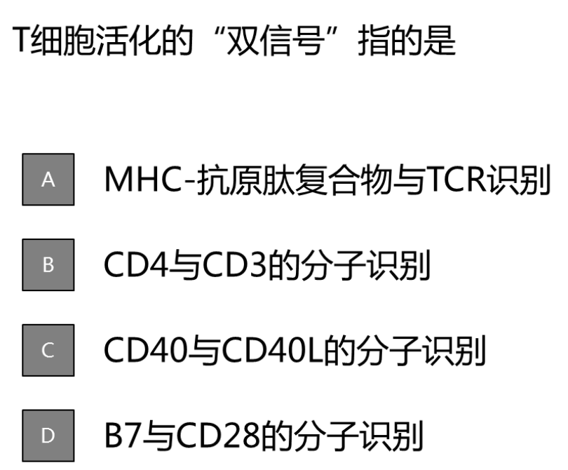
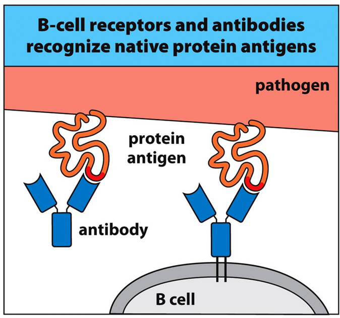
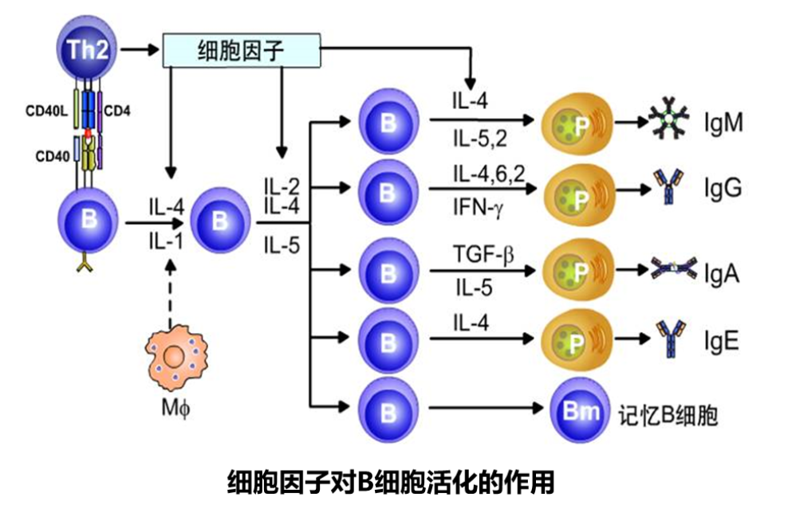
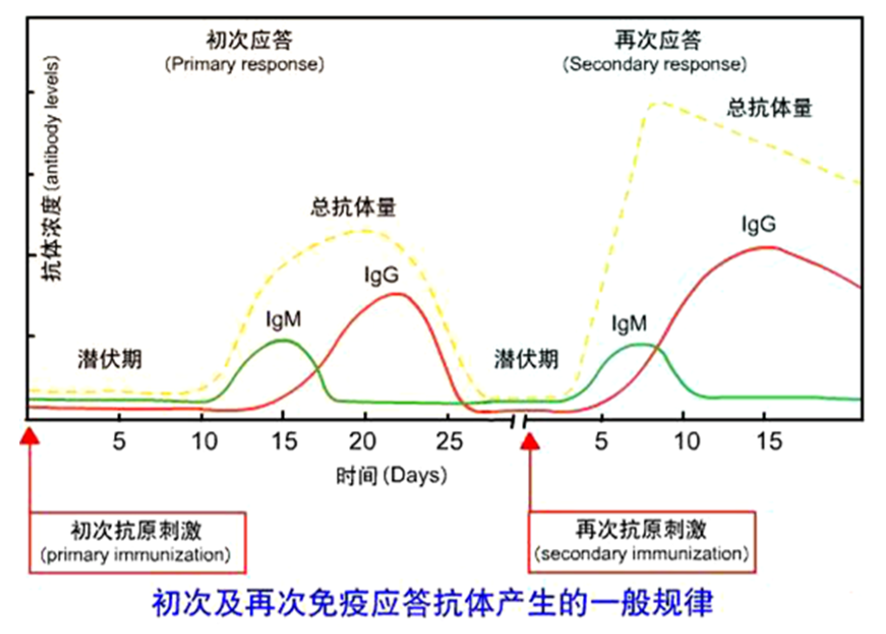
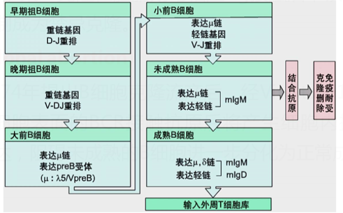
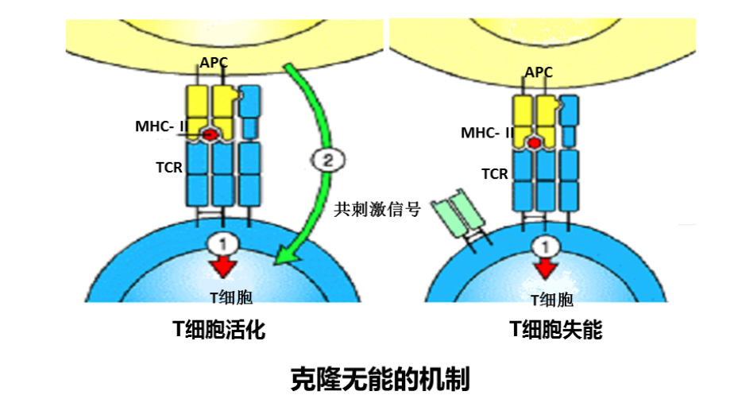

# 免疫应答与调节

## 概述

免疫应答(immune response , IR)：抗原刺激机体后，机体中特异性免疫细胞识别抗原后参与活化、增殖、分化并转化为功能性的淋巴细胞发挥生物学效应的一系列过程的总称。

+ 免疫功能正常：清除“异物”，维持稳定
+ 免疫功能异常：出现组织损伤等病理现象

### 免疫的类型

+ 非特异性免疫Non-specificimmunity
+ 特异性免疫Specificimmunity
  + 被动免疫：天然的（母源抗体）、人工的（免疫血清）
  + 主动免疫：天然的（自然感染）、人工的（各类疫苗）
  + 细胞免疫
  + 体液免疫

#### 非特异性免疫 Nonspecific immunity

又叫做先天性免疫或固有免疫，是人类在长期进化过程中逐渐建立起来的一种天然防御功能。

+ 特点
  + 无特异性
  + 有遗传性，人人生来就有
  + 作用快、广
  + 无回忆反应和再次反应（无记忆细胞）

##### 非特异性免疫机制

1. 屏障结构

   1. 皮肤及粘膜的屏障作用
   2. 血脑屏障和胎盘屏障等

2. 非特异性细胞防护作用

   血小板、NK细胞、吞噬细胞（噬中性粒细胞、单核吞噬细胞）→吞噬作用及炎症反应3

3. 正常体液非特异性防护作用

   血清、体液和组织分泌物，如溶菌酶、补体、白细胞素、干扰素、乳素等→抑菌、杀菌、或溶菌。

#### 特异性免疫 Specific immunity

当机体受到抗原刺激后，机体中与抗原相对应的淋巴细胞活化如B细胞、T细胞等，从而导致的一系列的免疫应答反应。

+ 特点
  + 有特异性
  + 无遗传性
  + 作用慢、窄
  + 有再次反应和回忆反应

## 细胞免疫 Cell-mediated immunity

T细胞在抗原的刺激下分化、增殖，形成致敏淋巴细胞和淋巴因子（细胞因子），并出现特异性免疫效应的过程。

+ 三阶段

  + 抗原识别阶段

    抗原递呈细胞（APC）捕获、加工、处理T细胞抗原，然后将处理好的抗原递呈至TCR进行特异性识别

  + T细胞活化阶段

    T细胞识别抗原后产生的第一信号及T细胞与APC表面分子间的相互作用产生的第二信号促进T细胞活化、增殖、分化，形成效应性T细胞（Tc）和分泌细胞因子的辅助性T细胞

  + 效应阶段

    Tc和细胞因子共同作用清除异已物质，保持机体处于正常的生理状态或产生病理疾病

### 细胞免疫应答基本过程

#### 识别阶段（抗原提呈）

+ T细胞与APC的非特异性结合
  + T细胞表面的粘附分子（LFA-1、CD2、ICAM-3）和APC表面相应的配体分子（ICAM-1或者ICAM-2、LFA-3）非特异可逆结合
+ T细胞和APC特异性结合
  + CD8分子与APC或靶细胞表面的MHCI分子结合，而CD4与MHCII分子结合
+ T细胞和APC细胞表面共刺激分子的相互作用
  + 多种共刺激分子（co-stimulatory molecule），APC和T细胞表面的共刺激分子对有CD80/B7-1、CD86/B7-2、CD40等

#### 增殖、分化阶段

+ T细胞的活化
  + T细胞的完全活化，是来源于MHC分子的第一信号、协同刺激分子的第二信号及APC及T细胞分泌的细胞因子的共作用的结果。
+ T细胞的增殖和分化
  + CD4^+^ T细胞的增殖分化
  + CD8^+^ T细胞的增殖分化
  + 活化T细胞的最终命运

##### CD8^+^ T细胞的增殖分化

1. Th细胞非依赖的CD8^+^ T细胞的激活

   感染病原微生物的APC，高表达MHC和共刺激分子，直接激活CD8+T细胞，分泌IL-2等细胞因子促使自身增殖并分化为细胞毒性T细胞（CTL）。

2. Th细胞依赖的激活

   如CD8^+^ T细胞作用的靶细胞，低量或不表达共刺激分子，不能有效地激活初始CD8^+^ T细胞，因此需要活化的APC和CD4^+^ T细胞的辅助作用。

### T细胞免疫应答效应及其机制

+ Th1细胞的免疫学效应
  + 激活巨噬细胞
  + 诱生并招募巨噬细胞
  + 对T细胞、B细胞和中性粒细胞的作用
+ CTL介导的细胞毒效应

### 细胞免疫的激活与抑制

+ 激活性受体
  + TCR和带有ITAM的CD3分子 $\gamma\varepsilon,~\delta\varepsilon,~\zeta\zeta$链；CD28，胞内段带有ITAM 
+ 抑制性受体
  + 提供负向协同刺激信号的 CTLA-4、PD-1和BTLA分子，胞内段带有ITIM
  + BTLA（CD272）：共抑制受体，配体为疱疹病毒侵入介质（HVEM）。HVEM在多种肿瘤中表达上调，靶向BTLA和HVEM在肿瘤免疫治疗中表现出非常富有前景的应用潜力

TCR 识别 MHC，这是第一信号。第二信号是共刺激分子的信号。

## 体液免疫

体液免疫应答（Humoralimmunity）主要由B细胞活化启动。B细胞在Ag物质直接或间接刺激下，转化为浆细胞并分泌Ab，Ab又与该Ag发生特异反应。

### 体液免疫应答过程

#### 细胞对抗原的特异性识别

+ T细胞非依赖性抗原（TI-Ag）
  + 某些抗原，如细菌多糖、多聚蛋白质、LPS等在激活初始B细胞时无需Th细胞辅助的抗原。
  + 此类抗原刺激B细胞产生应答反应，不受MHC的限制，也不需要APC的递呈。
+ Th细胞依赖性抗原（TD）
  + TD抗原刺激B细胞产生免疫应答，需要抗原特异性Th细胞的辅助作用。
  + 应答过程中，BCR分子可直接识别天然抗原的表位。
  + 双信号活化B细胞

+ B细胞不具吞噬功能，而是通过BCR即细胞表面lgM特异性地摄取可溶性抗原并通过胞吞作用摄入BCR抗原复合物，加工后经MHCII递呈给CD4+T细胞
+ B细胞高表达MHCII类分子，但不能组成性表达B7

B细胞对抗原的识别和结合是特异性的，且可递呈低剂量抗原而且激活或记忆B细胞表达高亲和力BCR、I类分子和协同刺激分子，故有很强的抗原递呈活性，因而在再次免疫时起重要作用

#### 细胞的活化增殖及分化

相互作用反复发生，效应不断积累和放大，从而完成T、B细胞相互合作，为获得性免疫提供了全面的效应功能

细胞既是T细胞活化的APC，又是Th2辅助的对象：抗原与BCR结合是B细胞激活的第一信号;活化T细胞表达CD40L与B细胞的CD40结合成为B细胞活化的第二信号；活化后的B细胞表达B7分子与T细胞的CD28结合为T细胞活化提供第二信号;活化的T细胞分泌的细胞因子尤其是L-4，与B细胞上的IL-4R结合，也是B细胞活化所需的第二信号。。

#### 效应阶段

### B细胞介导的体液免疫应答的规律

+ 初次免疫应答（primary immune response）
  + 宿主B细胞第一次识别特异性抗原
  + 抗体产生慢，量少
  + 先合成IgM，再在细胞因子作用下转为IgG
  + 初次免疫应答形成记忆B细胞
+ 再次免疫应答（secondary immune response）
  + 相同抗原再次进入机体时，免疫系统产生迅速、高效的特异性免疫应答反应
  + 由记忆淋巴细胞介导
  + 只需低剂量抗原即可激活
  + 免疫应答迅速
  + 抗体产量高（为初次的10倍以上），且维持时间长

### B细胞介导的体液免疫应答效应

#### 中和效应

+ IgG(血液）和IgA(粘膜)
  + 结合外毒素 - 中和毒性
  + 结合病毒 - 阻止病毒吸附进入宿主细胞
  + 结合酶 - 使酶失活

#### 调理效应

#### 补体激活效应

#### 免疫损伤效应

+ 超敏反应与自身免疫病

+ 移植超急排斥反应
  + 异种器官移植（心、肺、肾)
  + 同种器官移植：血管吻合的实质性器官
  + 发生：数分钟、几小时、不可逆、切除移植物
+ 发生机制：
  + 移植前已经存在的抗血型类抗原的抗体与血管内皮细胞相应抗原结合激活补体系统和凝血系统
    + ABO血型不相容（一般天然抗体是IgM）
    + 受者血中含抗供者白细胞、血小板的抗体
    + 非免疫因素：缺血过长、灌洗不彻底等

---

+ 肿瘤免疫促进
  + 肿瘤细胞抗原可以诱导人体产生特异性抗体，然而，抗体的肿瘤免疫作用毕竟有限，而不是主要的肿瘤免疫渠道。在某些情况下，抗体反过来可以阻拦免疫系统对肿瘤细胞的应答机制系统，减弱了细胞毒性带来的杀伤作用。

## 免疫耐受

机体对特定抗原刺激表现为无应答，而对其他抗原刺激仍表现出正常免疫应答的现象。

+ 固有免疫耐受
  + 机体对自身组织成分不发生免疫应答，也即自身耐受性。
  + 一定条件下，也可对“非已”抗原产生免疫耐受性
+ 获得性免疫耐受
  + 通过接种耐受诱导产生

---

+ 免疫耐受与免疫缺陷和免疫抑制的区别
  + 免疫耐受有抗原特异性，而免疫缺陷和免疫抑制均无抗原特异性
  + 免疫缺陷起因于遗传或疾病等因素，主要是机体免疫系统对多种抗原物质的不应答或应答低下，表现为体液免疫功能缺陷、细胞免疫功能缺陷或联合免疫缺陷
  + 免疫抑制主要是抑制剂抑制整个机体免疫系统的功能，受抑制的机体对多种抗原物质不应答或应答低下，可通过去除抑制剂恢复机体的免疫应答功能。

### 免疫耐受的形成机制

#### 中枢免疫耐受

+ 在中枢免疫器官（胸腺和骨髓）内，「和B淋巴细胞在发育中，尚未成熟前，能识别自身抗原的细胞克隆被清除或处于无反应性状态而形成的自身耐受。
+ 如：B细胞在骨髓内发育到表达mIgM的未成熟B细胞，经过阴性选择自身反应性细胞克隆消除或处于无反应性状态。

#### 外周免疫耐受

在外周免疫器官，成熟的T和B淋巴细胞遇到自身或外源性抗原形成的耐受。

+ 克隆清除（排除或丢失）
  + 1959年提出，某一克隆在胚胎期与相应Ag接触后，该克隆即被破坏清除，或被抑制成为禁忌克隆。
+ 克隆流产(clonalabortion)
  + 由Nossal1974年提出B细胞克隆流产后，经Vitetta于1975年补充：认为未成熟B细胞表面的BCR接触抗原后将产生细胞内抑制信号，抑制BCR继续表达，阻碍未成熟的B细胞进一步分化为正常成熟的细胞。
+ 克隆无能（clonalanergy）
  + 淋巴细胞具有与特异性Ag相结合的能力，但其细胞内的信息传递过程发生障碍，从而不能引起免疫应答
    

### 免疫耐受的意义

1. 理论上

   机体如何识别“自身”和“非自身”是免疫学理论研究的核心问题之一。免疫耐受的研究在理论上较好地解释了免疫系统识别“自身”和“非自身”的机制。

2. 医学实践中

   免疫耐受的维持和诱导：防治超敏反应、自身免疫性疾病和器官移植排斥反应

   免疫耐受的终止：对某些传染性疾病和肿瘤等，则可通过解除免疫耐受、激发免疫应答来促进机体对病原体的清除和肿瘤的控制。

## 免疫调节

免疫调节（Immunoregulation）：在免疫应答过程中，免疫细胞、免疫分子间及其与神经、内分泌系统间的相互作用，通过相互协助和相互制约的网络系统调控机体免疫应答过程，以维持机体免疫应答的平衡。

+ 作用
  1. 提高机体免疫力，排除外来抗原
  2. 减少对自身组织的损伤。

### 