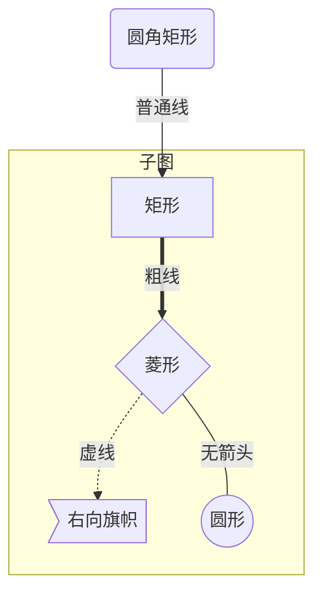
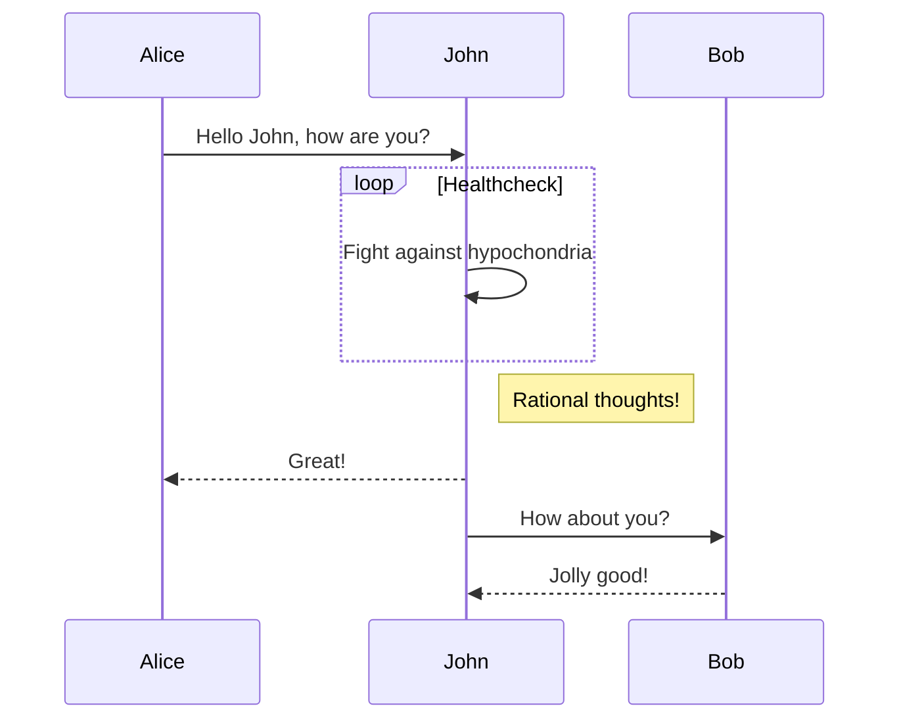
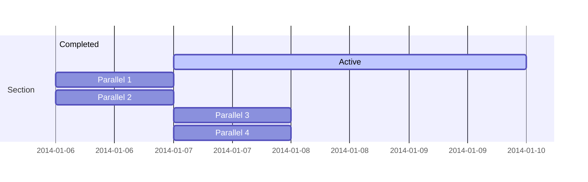
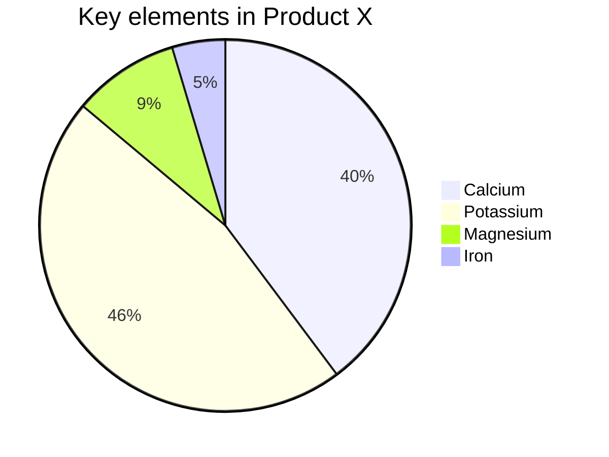
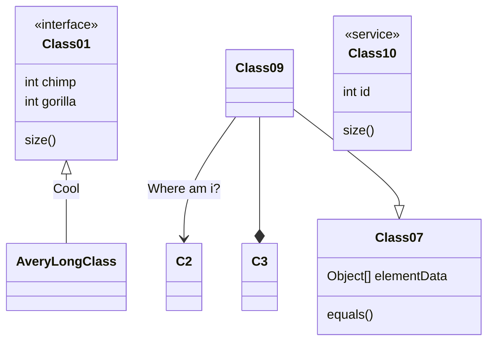
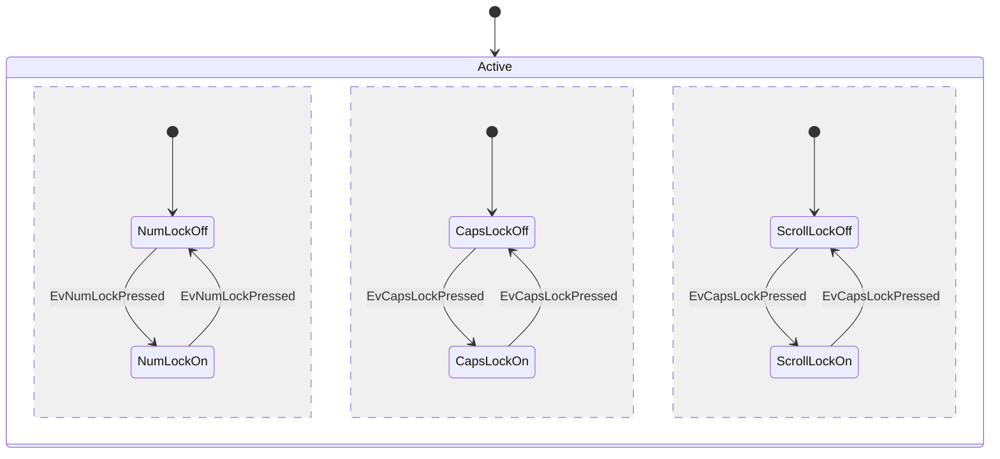
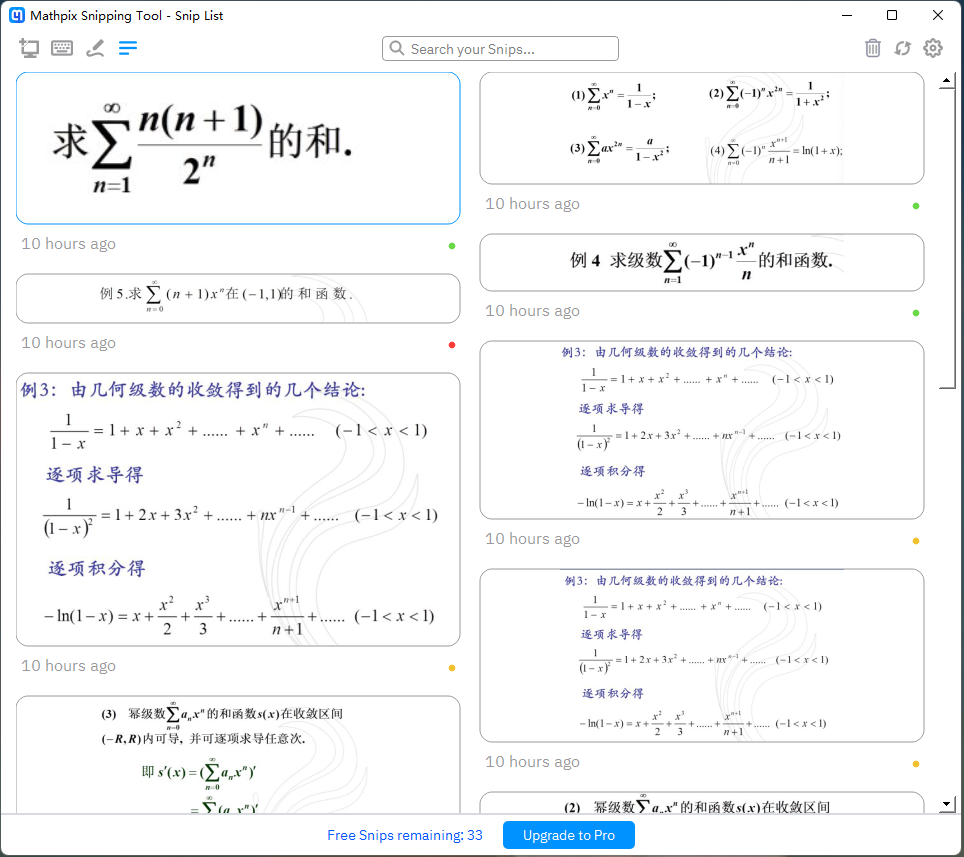
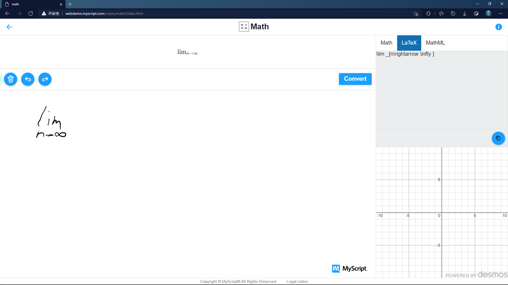
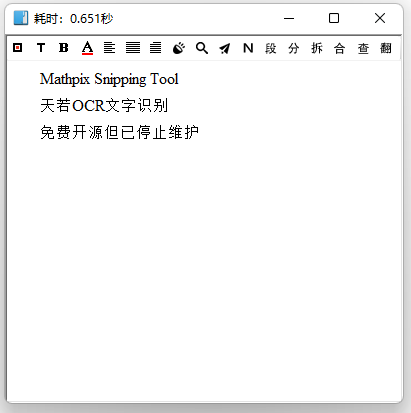

[TOC]

# 基于 Markdown 与 Git 的知识管理系统

适合理工科笔记使用

与现有的笔记软件相比 所具有的优缺点

+   优点
    +   方便开源, 直接将 `.md` 文件 `push` 到 GitHub 或 Gitee
    +   可以离线编辑, 在线时再使用 Git 同步
    +   配合 OCR , 可编辑性强
+   缺点
    +   入门较难

## Markdown

### 基础语法

>   以下所有语法 Typora 均支持
>   包括 Mermaid 的渲染

+   标题 `#` 

+   使用 html 标签 设置字体 字号 与 颜色

    +   ```plaintext
        <font color="red" face="楷体" size=20> </font>
        ```

    +   颜色可以使用十六进制 RGB 色号

    +   <font color="red" face="楷体" size=20>楷体</font>

+   代码

    +   \`\`\`

+   公式

    +   \$行内\$

    +   \$\$
        跨行
        \$\$

    +   $$
        \begin{aligned}
            let \ t&=x-\frac{1}{2}\quad \sum_{n=1}^{\infty}(-1)^n\frac{2^n}{\sqrt{n}}t^n\\
            \rho&=\lim_{n\to \infty}\left| \frac{a_{n+1}}{a_n} \right| =\lim_{n\to \infty}
        \end{aligned}
        $$

+   锚点 \<span>

### 支持 Markdown 的编辑器

#### Typora

+   所见即所得
+   支持 $\LaTeX$ 公式
+   配合 PanDoc 可以导出其他格式

#### Obsidian

+   一边编辑 一边渲染
+   全平台支持
+   支持插件
+   支持双向链接
+   支持 $\LaTeX$ 公式

#### VS Code + 插件

+   一边编辑 一遍渲染
+   插件功能强大 支持 $\LaTeX$ 代码补全

#### 坚果云 Markdown 编辑器

+   主要在移动端编辑
+   可以脱离 git , 配合 坚果云 使用

## Mermaid

### 流程图




### 时序图




### 甘特图



### 饼图



### 类图



### 状态图



## Git

+   `git init` 初始化本地仓库
+   `git remote add ` 添加远端仓库
+   `git add .` 提交到本地缓冲区
+   `git commit -m "massage"` 提交到 HEAD
+   `git push origin main` 推送到远端仓库

>   GitHub 直接在线显示图片 需要科学上网 可考虑在 Gitee 建立仓库 而且 Gitee 支持在线显示 $\LaTeX$ 公式

以下只介绍 git 的命令行使用

### bat 脚本

Windows 下可以使用 bat 批处理文件 进行 git 命令行操作

也可以编写 Shell 脚本 (Linux 或 Mac) 使用 `git bash` 执行

```powershell
@echo off
echo "GIT PUSH BAT"

echo "Moving to working directory" 
D:
cd D:\program\MarkdownNotes

echo "Start submitting code to the local repository"
git add *
 
echo "Commit the changes to the local repository"
set now=%date% %time%
echo "Time:" %now%
git commit -m "%now% update"
 
echo "Push the changes to the remote git server"
git push origin main
 
echo "Execution complete!"
exit
```

## LaTeX

$$
\LaTeX
$$


LaTeX 是一个排版系统, 在 Markdown 编辑器中主要用作编辑公式
功能十分强大的宏语言

### 基础语法


## 使用OCR

### Mathpix Snipping Tool



识别 $\LaTeX$ 公式

每个账号每月有 50 次免费识别次数

>   也可以使用基于此软件的免费识别网站 https://latexlive.com

### MyScript Webdemo



支持手写识别

网站 : [MyScript Webdemo](http://webdemo.myscript.com/)

### 天若 OCR 文字识别

免费开源 但已停止维护



>   其他方案
>
>   如果不需要将笔记开源, 也不需要离线编辑, 可以考虑使用 Notion
>   使用学生邮箱 可以免费使用 Notion 的个人高级版
>   Notion 是类似 Typora 的所见即所得 Markdown 编辑器

