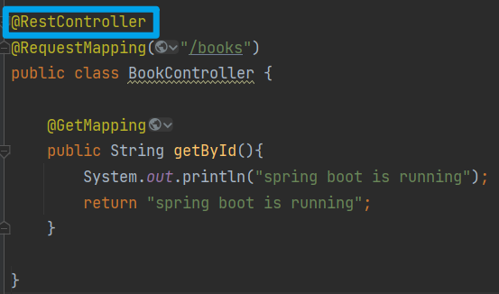
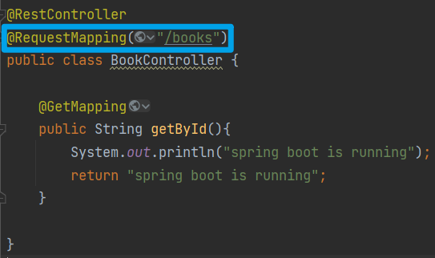

[toc]

# `StringBuilder` & `StringBuffer`

```Java
// StringBuilder： 继承了AbstractStringBuilder类，实现了Serializable、CharSequence
public final class StringBuilder extends AbstractStringBuilder implements java.io.Serializable, CharSequence {
    // 属性
    static final long serialVersionUID = 4383685877147921099L;
    // 构造方法
    public StringBuilder() {
      super(16); 
    }
    // 核心方法 来自父类方法
    @Override
    public StringBuilder append(StringBuffer sb) {
      super.append(sb);
      return this;
    }
}

// -----------------------------

// StringBuffer： 继承了AbstractStringBuilder类，实现了Serializable、CharSequence
public final class StringBuffer extends AbstractStringBuilder implements java.io.Serializable, CharSequence {
    
    // 属性
	private transient char[] toStringCache; // 缓存
	static final long serialVersionUID = 3388685877147921107L;
    
	// 构造方法
    public StringBuffer() {
      super(16);
    }
    
    // 核心方法：锁、缓存、父类方法
    @Override
    public synchronized StringBuffer append(String str) {
      toStringCache = null;
      super.append(str);
      return this;
    }
}
```


+ `StringBuffer` 线程安全, 但比 `StringBuilder` 更慢
+ 先有 `StringBuffer` 后有 `StringBuilder`
  + 因为没有必要使用线程安全的 `StringBuffer`
  + 从 JDK 1.5 起, 所有 `+` 进行字符串连接, JVM 会隐式改写为 `StringBuilder`
+ 所以在单线程开发下, 使用 `StringBuilder` 性能更好

# `BigDecimal`

+ 计算时规定精度, 如果没有规定精度, 在计算结果设计无限循环(不循环)小数的时候, 会报错
  `Non-terminating decimal expansion; no exact representable decimal result.`
+ 关于保留小数的方法 `RoundingMode`
  + `ROUND_CEILING`
    如果 `BigDecimal` 是正的，则做 `ROUND_UP` 操作；如果为负，则做 `ROUND_DOWN` 操作。
  + `ROUND_DOWN`
    从不在舍弃(即截断)的小数之前增加数字。
  + `ROUND_FLOOR`
    如果 `BigDecimal` 为正，则作 `ROUND_UP` ；如果为负，则作 `ROUND_DOWN` 。
  + `ROUND_HALF_DOWN`
    若舍弃部分 $> 0.5$，则作 `ROUND_UP`；否则，作 `ROUND_DOWN` 。
  + `ROUND_HALF_EVEN`
    如果舍弃部分左边的数字为奇数，则作 `ROUND_HALF_UP` ；如果它为偶数，则作 `ROUND_HALF_DOWN` 。
  + `ROUND_HALF_UP`
    若舍弃部分 $\geq0.5$，则作 `ROUND_UP` ；否则，作 `ROUND_DOWN` 。
  + `ROUND_UNNECESSARY`
    该「伪舍入模式」实际是指明所要求的操作必须是精确的，因此不需要舍入操作。
  + `ROUND_UP`
    总是在非 $0$ 舍弃小数(即截断)之前增加数字。

# RESTful 开发风格

REST（Representational State Transfer），表现形式状态转换

- 传统风格资源描述形式
  - [http://localhost/user/getById?id=1](http://localhost/user/getById%EF%BC%9Fid=1)
    [http://localhost/user/saveUser](http://localhost/user/saveUser)
- REST风格描述形式
  - [http://localhost/user/1](http://localhost/user/1)
    [http://localhost/user](http://localhost/user)
- 隐藏资源的访问行为，无法通过地址得知对资源是何种操作
- 书写简化

---

- 按照REST风格访问资源时使用行为动作区分对资源进行了何种操作
  - [http://localhost/users](http://localhost/users)
    查询全部用户信息 GET
  - [http://localhost/users/1](http://localhost/users/1)
    查询指定用户信息 GET
  - [http://localhost/users](http://localhost/users)
    添加用户信息 POST
  - [http://localhost/users](http://localhost/users)
    修改用户信息 PUT
  - [http://localhost/users/1](http://localhost/users/1)
    删除用户信息 DELETE

> 上述行为是约定方式，约定不是规范，可以打破，所以称REST风格，而不是REST规范
> 描述模块的名称通常使用复数，也就是加s的格式描述，表示此类资源，而非单个资源，例如：users，books，accounts...

根据 REST 风格对资源进行访问称为 RESTful

---

- 名称：`@RequestMapping`
- 类型：方法注解
- 位置：Spring 控制器方法定义上方
- 作用：设置当前控制器方法请求访问路径

```java
@RequestMapping(value = "/users", method = RequestMethod.POST)
@RespondBody
public String save(@RequestBody User user){
System.out.println("user save..." + user);
return "{'module':'user save'}";
}
```

- 属性：
  - `value` （默认）：请求访问路径
  - `method` ：http 请求动作，标准动作（GET/POST/PUT/DELETE）

---

- 名称：`@PathVariable`
- 类型：形参注解
- 位置：Spring 控制器方法形参定义前
- 作用：绑定路径参数与处理器方法形参间的关系，要求路径与形参名一一对应

```java
@RequestMapping(value = "/users/{id}", method = RequestMethod.DELETE)
@RespondBody
public String delete(@PathVariable Integer id){
    System.out.println("user delete..." + id);
    return "user delete";
}
```

---

- 区别
  - `@RequestParam` 用于接收 url 地址传参或表单传参
  - `@RequestBody` 用于接收 json 数据
  - `@PathVariable` 用于接收路径参数，使用 `{参数名称}` 描述路径参数应用
- 应用
  - 后期开发中，发送请求参数超过 1 个时，以 json 格式为主，`@RequestBody` 应用较广
  - 如果发送非 json 格式数据, 选用 `@RequestParam` 接收请求参数
  - 采用 RESTful 进行开发，当参数数量较少时，例如 1 个，可以采用 `@PathVariable` 接收请求路径变量，通常用于传递 `id` 值

## 关于简化写法

1. `controller` 类上的 `@Controller` 和 `@ResponseBody` 可以合并简化为 `@RestController`



1. 每个方法的请求路径开头如 `books` 可以放在类开头，加上注释如 `@RequestMapping("/books")`



1. 每个方法开头的请求方式参数可以简化
   `@RequestMapping(value = "/{id}", method = R`

    简化为

    `@DeleteMapping("/{id}")`

---

- 名称：`@RestController`
- 类型：类注解
- 位置：基于 Spring 的 RESTful 开发控制器类定义上方
- 作用：设置当前控制器为 RESTful 风格，等同于 `@Controller` 和 `@ResponseBody` 两个注解组合功能

---

- 名称：`@GetMapping`  `@PostMapping`  `@PutMapping`  `@DeleteMapping`
- 类型：方法注解
- 位置：基于 Spring 的 RESTful 开发控制器方法定义上方
- 作用：设置当前控制器方法请求访问路径与请求动作，每种对应一个请求动作，例如 `@GetMapping` 对应 GET 请求
- 属性：
  - `value`（默认）：请求访问路径