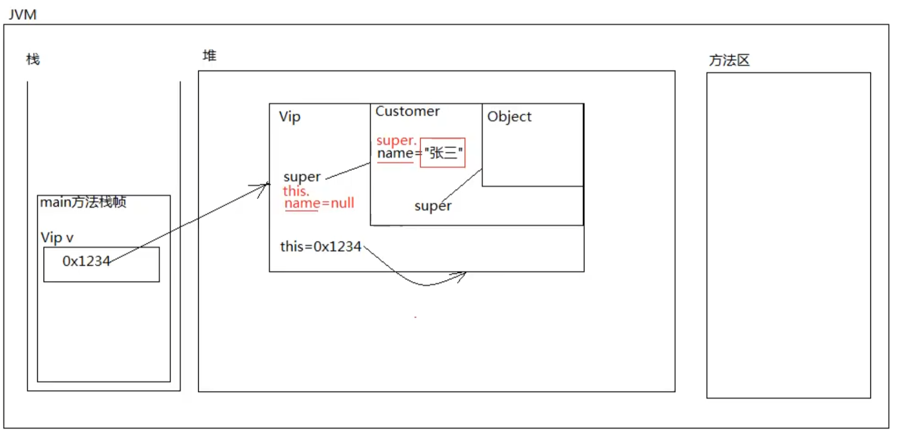

# super

`super` 是一个关键字，全部小写

## super 与 this

+  `this`
   
   +  `this` 能出现在实例方法和构造方法中
   +  `this` 的语法是 this.` `this()`
   +  `this` 不能使用在静态方法中
   +  `this.` 大部分情况下可以省略
   +  `this.` 在区分局部变量和实例变量的时候不能省略
   +  `this()` 只能出现在构造方法的第一行,通过当前的构造方法去调用本类中其他的构造方法,目的是代码复用
   
+  `super`
   
   +  `super` 能出现在实例方法和构造方法中
   
   +  `super` 的语法是`super.`, `super()`
   
   +  `super` 不能使用在静态方法中
   
   +  `super.` 大部分情况下可以省略
   
   +  `super.` 不能省略
   
      ```java
      public class SuperTest04 {
          public static void main(String[] args) {
              Vip v = new Vip("zhangsan");
              v.shopping();
          }
      }
      
      class Customer{
          String name;
      
          public Customer() {
          }
      
          public Customer(String name) {
              this.name = name;
          }
      }
      
      class Vip extends Customer{
          String name;// Java 中允许子类中出现和父类同名的属性(变量)
      
          public Vip() {
          }
      
          public Vip(String name) {
              super(name);
          }
      
          public void shopping(){
              System.out.println(this.name + " is shopping");//null
              //如果子类中有和父类同名的属性,想要在子类中访问父类的这个特征,"super."不能省略
              System.out.println(super.name + " is shopping");//zhangsan
      
              System.out.println(name + " is shopping");//null
          }
      }
      ```
   
      
   
   +  super()只能出现在构造方法的第一行,通过当前的构造方法去调用父类中其他的构造方法,目的是代码复用.目的是:创建子类对象的时候,先初始化父类型特征

```java
public class SuperTest01 {
    public static void main(String[] args) {
    new B();//模拟现实,先有父子类型对象,后有子类型对象
    }
}

class A{
    public A(){
        System.out.println("A类的无参数构造方法");
    }
}

class B extends A{
    public B(){
        System.out.println("B类的无参数构造方法");
    }
}

```

输出结果

```
A类的无参数构造方法
B类的无参数构造方法

Process finished with exit code 0

```

--------

```java
public class SuperTest01 {
    public static void main(String[] args) {
    new B();//模拟现实,先有父子类型对象,后有子类型对象
    }
}

class A{
    /*
    public A(){
        System.out.println("A类的无参数构造方法");
    }
    */
    
    public A(int i){
        
    }
}

class B extends A{
    public B(){
//        super();//这里实际上有个super方法(无参),用来调用父类的构造方法,但是父类的构造方法需要参数
        System.out.println("B类的无参数构造方法");
    }
}

```

输出结果

```
D:\program\Java_learning\chapter14\src\SuperTest01.java:20:15
java: 无法将类 A中的构造器 A应用到给定类型;
  需要: int
  找到: 没有参数
  原因: 实际参数列表和形式参数列表长度不同
```

结论:当一个构造放在第一行:
	既没有this()也没有super()方法的话,会默认有一个super()
	表示通过当前子类的构造方法调用父类的无参数构造方法,所以必须保证父类的无参数构造方法是存在的
	建议在每一个类中,手动添加无参数的构造方法

如果需要使用this()或super()方法,那么这两种方法必须放在构造方法的第一行(this()和super()方法不能共存)

无论new什么类型的对象,Object类中的无参数构造方法一定最先执行

super代表"当前对象(this)"的"父类特征"
super不是引用,super也不保存内存地址,super也不指向任何对象,super只是代表当前对象内部的那一块父类型特征

## 使用super调用父类方法

"super."不仅可以访问父类的属性,也可以访问父类的方法


# 总结

super.属性名 [访问父类的属性]

super.方法名(实参) [访问父类的方法]

super(实参) 调用父类的构造方法

无法在子类中使用"super."访问父类私有数据

