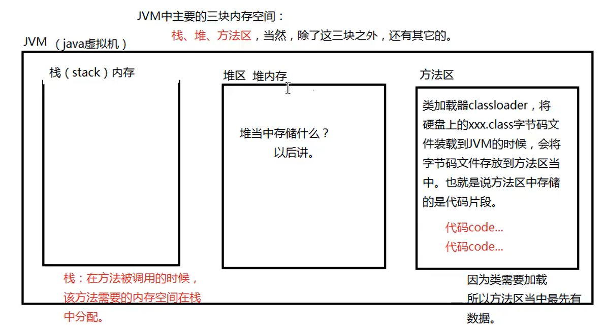
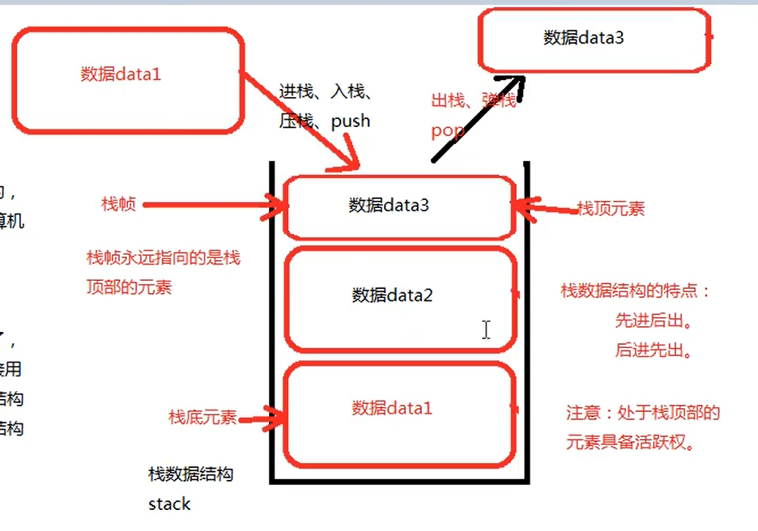

# 方法

## 方法

方法是可以完成某个特定功能，并且可以重复利用的代码片段
在C语言中，方法被称为<font color="red">函数</font>；在java中，不叫函数，叫<font color="red">方法</font>

一般，一个方法就是一个功能单元
如果在开发中，某个功能是可以独立抽取出来的，建议定义为方法
这样以后只要需要这个功能，可以直接调用这个方法，不需要重复编写

<font color="red">类体里面才能写方法</font>

## 对于一个java程序来说，没有方法会存在什么问题

代码无法复用

```java
public class MethodTest01{
    public static void main(String[] args){

        //需求1：编写程序，计算100和200的和
        int x = 100;
        int y = 200;
        int z = x + y;
        System.out.println(x + "+" + y + "=" + z);

        //需求2：编修程序，计算66和88的和
        //需求2和需求1实际上完全相同，只是具体求和时的数据不同
        int a = 66;
        int b = 88;
        int c = a + b;
        System.out.println(a + "+" + b + "=" + c);

        //需求1和需求2本质上相同，只不过参与运算的数值不同
        //代码编写了两份，代码的复用性很差

        //功能相同，能不能只编写一次？
        //需要实现代码复用，需要使用Java中的"方法"
    }
}

```

# 定义方法

注意：程序开始执行的时候是执行的main方法
<font color="red">因为main方法是程序的入口</font>
在Java语言中，所有的方法体中的代码都必须遵循自上而下的顺序逐行执行
main方法不需要程序员手动调用，是由JVM调用的
但是除了main方法以外，其他的方法都需要程序员手动调用
方法只有调用的时候才会执行，方法不调用的时候不会执行

```java
//方法定义在类体中，顺序没有要求（可以写在main方法前）
public class MethodTest02{
    public static void main(String[] args){
        //同样有两个需求：计算100和200的和；计算66和88的和
        sumInt(100,200);//这里调用sumInt方法 程序运行到这里，sunInt方法还没有被定义，程序会停在这里，来调用下面定义的sunInt方法，这个方法此时执行一遍，然后这行代码就运行完毕
        sumInt(66,88);//这里又调用了sumInt方法，程序也会停在这里，去运行下面的sumInt方法
    }

    //专门在这个类体中定义一个方法，这个方法专门用来完成求和
    //同样，这里按照自上而下的顺序执行
    public static void sumInt(int x, int y){
        int z = x + y;
        System.out.println(x + "+" + y + "=" + z);
    }
}
```

## 方法怎么定义，语法机制是什么

修饰符列表 返回值类型 方法名 （形式参数列表）{

方法体；

}

 

其中，修饰符列表不是必须

方法体由Java语句构成

方法定义之后需要去调用，不调用是不会执行的

 

## 关于修饰符列表

修饰符列表不是必选项，

目前为止，直接写成public static

后面会具体学习

## 关于返回值类型

返回值类型可以是任何类型，只要是Java中合法的数据类型

数据类型包括基本数据类型和引用数据类型

### 什么是返回值

返回值一般指一个方法执行结束后的结果

结果通常是一个数据，所以被称为“值”

大部分情况下都是有一个结果的，体现结果的一般都是数据

 

当一个方法执行解释不返回任何值的时候

返回值类型也不能空着，必须写上void关键字

（main方法结束之后不需要返回任何结果）

 

“谁调用返回给谁”

```java
main{
//调用a方法
a();//如果a放啊执行结束之后由返回值，这个返回值会返回给main
}

a(){
}
```

如果返回值类型不是void
那么在方法执行结束的时候必须使用"return 值;"这样的语句
来完成“值”的返回
如果没有"return 值;"这样的语句，编译器会报错
注意：只要有"return"关键字的语句执行，当前方法必然结束
如果返回值类型是void，那么在方法体中不能有“return 值;”这样的语句。但是，可以有“return;”语句，用来终止当前方法

 

## 方法名

方法名要见名知意

方法名在标识符命规则中，要求首个单词的首字母小写
后面每个单词的首字母大写

 

## 形式参数列表

简称：形参

注意：形式参数列表中的每一个参数都是局部变量

方法结束之后内存释放

形参的个数是0~n个

形参有多个的话，用逗号隔开

形参的数据类型其决定性作用，形参对应的变量名是随意的

形参的数据类型可以是Java语言中任意合法的数据类型

 

## 方法体

有Java语句构成，Java语句由;结尾

方法体中编写的是业务逻辑代码，完成某个特定的功能

方法体中的代码遵循自上而下的吮吸一次逐行执行

 

在方法体中处理业务逻辑代码的时候需要数据

数据的来源就是这些形参

 

# 方法的调用

方法必须调用之后才能执行

调用：

类名.方法名(实际参数列表);

```java
public class MethodTest03{
	
	//main方法结束之后不需要给JVM返回任何执行结果
	public static void main(String[] args){
		//如何调用方法
		MethodTest03.division(100, 30);//(100, 30)叫做实参，实参和形参必须一一对应
		
		//怎么接受上行方法调用后的返回值？
		//使用变量接受
		int result = MethodTest01.division(100, 30);

		//对于返回值为void的方法，变量接收不到方法执行的结果
		//对于有返回值的方法，可以选择不接受返回值，但这样没有意义，一般程序返回了执行结果都是需要接受结果的
	}

/*
	public static int division(int x, int y){
		int z = x / y;
		return z;
	}
*/
	//上面被注释的代码中，返回值也可以这样写：
	public static int division01(int x, int y){
		return x / y;
	}

	//如果不需要返回值，直接输出
	public static void division(int x, int y){
		System.out.println(x / y);
	}
}
```


# JVM主要内存空间



## 栈数据结构

### 什么是数据结构
​	数据结构通常是储存数据的容器
​	而该容器可能存在不同的结构
​	

### 常见的数据结构

​	数组、链表、图、二叉树、栈、队列…
​	Java语言把常用的数据结构已经写好了
​	

### 和数据结构出现在一起的通常是算法

算法：排序算法、查找算法…

### Terms

数据存入“栈”中的过程叫做“进栈”、“入栈”、“压栈”。英文是push
最先存入栈的数据最后弹出，最后存入栈的数据最先弹出
数据离开栈的过程叫做“出栈”、“弹栈”。英文是pop



# 堆内存

凡是通过new运算符创建的对象，都储存在堆内存中
new运算符的作用就是在堆内存中开辟一块空间
对象储存在堆内存中

堆内存中存储对象以及对象的实例变量

## 对象和引用的区别

对象是通过new运算符创建出来的

**引用：但凡通过变量，并且该变量中保存了内存地址指向对内存当中的对象的，叫做引用**

# 方法执行时内存变化

## 局部变量

只在方法体中有效，方法结束之后，局部变量的内存就释放了
JVM三块主要的内存：栈内存、堆内存、方法区内存
方法去最先有数据：方法区中存放代码片段、clas字节码

## 堆内存

后面会学到

## 栈内存

方法调用的时候，该方法需要的内存空间在栈中分配
栈内存储存方法执行时的内存空间以及局部变量
方法不调用，不会在栈中分配空间

方法只有在调用的时候才会在栈中分配空间，并且调用时就是压栈
方法执行结束之后，该方法所需要的空间就会释放，此时发生弹栈动作

方法调用叫做：**压栈**——分配空间
方法结束叫做：**弹栈**——释放空间


# 方法重载

## 为什么要使用方法重载


```java
/*
    方法重载机制
        1.以下程序先不使用方法重载机制，分析程序的缺点
            三个方法功能不同，但是相似。

 */
public class OverLoadTest01 {
    public static void main(String[] args) {
        int x = intAddition(10, 20);
        System.out.println(x);
		double y = doubleAddtion(10.0, 20.0);
    	System.out.println(y);

	    long z = longAddtion(10L, 20L);
    	System.out.println(z);
	}

	//定义一个计算int类型数据的求和方法
    public static int intAddition(int a, int b){
        int result = a + b;
        return result;
    }

	//定义一个计算double类型数据的求和方法
    public static double doubleAddtion(double a, double b){
        double result = a + b;
        return result;
    }

	//定义一个计算long类型数据的求和方法
	public static long longAddtion(long a, long b){
    	long result = a + b;
    	return result;
	}
}
```
## 方法重载的使用

```java
/*
    使用方法重载的优点：
        代码整齐美观
        功能相似的，可以让方法名相同

    java语言中的方法区分
        首先java编译器首先会通过方法名区分
        如果方法名如果相同，会根据方法的参数类型进行区分

 */
public class OverLoadTest02 {
    public static void main(String[] args) {
        int x = addition(10, 20);
        System.out.println(x);

        double y = addition(10.0, 20.0);
        System.out.println(y);

        long z = addition(10L, 20L);
        System.out.println(z);
    }

    //定义一个计算int类型数据的求和方法
    public static int addition(int a, int b){
        System.out.println("int求和");
        int result = a + b;
        return result;
    }

    //定义一个计算double类型数据的求和方法
    public static double addition(double a, double b){
        System.out.println("double求和");
        double result = a + b;
        return result;
    }

    //定义一个计算long类型数据的求和方法
    public static long addition(long a, long b){
        System.out.println("long求和");
        long result = a + b;
        return result;
    }
}
```

# 方法递归

方法自己调用自己

递归没有结束条件的时候,栈内存会溢出:Exception in thread "main" java.lang.StackOverflowError
所以<font color ="red">递归必须要有结束条件</font>
如果有合法的结束条件,递归也会有可能出现栈内存溢出错误,可能递归的太深,栈内存不够

JVM发生错误之后只有一个结果:退出JVM

在实际开发的过程中,不建议轻易选择递归,能用for循环while循环带代替的,尽量使用循环来做
    因为循环的效率高,耗费的内存少
    递归耗费的内存比较大,另外递归的使用不当会导致JVM死机

​        如果必须使用方法递归,确认代码无误后仍然内存溢出
​        可以尝试手动分配JVM内存
​    (DOS下使用java -x命令)