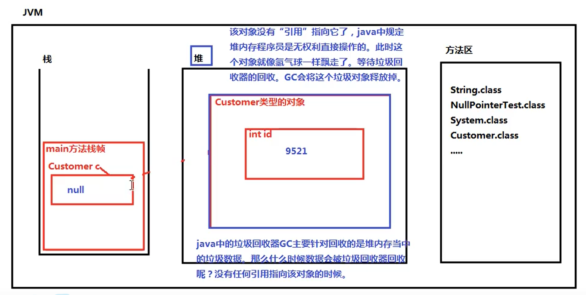

# 对象的创建与使用

## 语法规则

```
类名 变量名 = new 类名();
Xuesheng s1 = new Xuesheng();
```

Xuesheng是变量s1的数据类型（引用数据类型）

对象的创建和使用
		在下面程序的主方法内，可以访问Student类

创建对象的语法
		new 类名（）；

变量类型 对象名    =  new Student;
Student  ZhangSan  =  new Student;
以上，new Student是对象，严格来说，张三不是对象，只是一个变量名（引用）

**数据类型**

+  基本数据类型
   +  byte short int long float double boolean char
+  引用数据类型
   +  String、前面创建的学生类等等

所有类都是引用数据类型

​	类是模板，通过一个类，可以创建多个对象
​	new是一个运算符。专门负责对象的创建

```java
public class StudentTest{
	public static void main(String[] args){
		Student ZhangSan = new Student();//通过Student类实例化了Student对象
	}
}
```


# 构造方法 Constructor

构造方法是类中特殊的方法，通过调用构造方法来完成对象的创建，以及对象属性的初始化操作\

## 构造方法

​		什么是构造方法，有什么用
​			构造方法是一种特殊的方法，通过构造方法可以完成对象的创建
​			以及实例变量的初始化
​			构造方法是用来创建对象，并且同时给对象的属性赋值
​			注意：实例变量没有手动赋值的时候，系统会赋予默认值

**重点**：当一个类没有提供任何构造方法, 系统会默认提供一个无参数的构造方法, 这个方法被称为缺省构造器

## 调用构造方法

使用new运算符来调用构造方法
`new 构造方法名(实际参数列表);`

## 构造方法的语法结构

```java
[修饰符列表] 构造方法名(形式参数列表){
	构造方法体；
	//通常在构造方法体中给属性赋值，完成属性的初始化
}
```

>  注意：	
>  		修饰符列表目前统一写public,不要写public static
>  		构造方法名必须和类名一致
>  		构造方法不需要指定返回值类型，也不能写void，
>  		写上void表示普通方法，就不是构造方法了
>  		没有返回值类型的方法，编译器会判断该方法为构造方法
>  		此时编译器会检测方法名和类名是否一致

**普通方法的语法结构**

```java
[修饰符列表] 返回值类型 方法名(形式参数列表){
	方法体;
}
```

​		当一个类中没有提供任何构造方法，系统默认提供一个无参数的构造方法，这个无参数的构造方法叫做缺省构造器

​		当一个类中手动提供了构造方法，那么系统将不再提供无参数构造方法

## 构造方法支持重载

在一个类中，构造方法可以有多个, 这些构造方法的名字都是一样的，都和类名一致

>  方法重载特点：在同一个类中给，方法名相同，参数列表不同

```java
public class Constructor01{
	public static void main(String[] args){

		//创建Student类型的对象
		Student s1 = new Student();//这里等号右边调用了无参数的构造方法
	
        //输出“引用”
		//只要此处输出的结果不是null，说明这个对象一定是完成了创建
		//此处输出的结果不是null
		System.out.println(s1);//Student@5caf905d
		
		//调用Student类的无参数构造方法
		new Student();//到这里，无参数的构造方法执行了两次，创建了两个Student对象，只是这里创建的对象没有进行引用
	}
}
```

# 空指针异常 NullPointerException



##   关于垃圾回收器GC

​    在Java语言中，垃圾回收器主要针对的是堆内存
​    当一个Java对象没有任何引用指向该对象的时候
​    GC会考虑将该垃圾数据释放回收掉

## 出现空指针异常的前提条件

​    “空引用”访问实例（对象）相关数据时，都会出现空指针异常

```java
public class NullPointerTest {
  public static void main(String[] args) {
    //创建客户对象
    Customer c = new Customer();//默认赋值0
    //访问这个客户的id
    System.out.println(c.id);

    //重新给id赋值
    c.id = 9521;//代号
    System.out.println("客户的代号是：" + c.id);

//    c = null;
//    System.out.println(c.id);//这里符合Java语法机制，编译器不会报错
    //运行错误Exception in thread "main" java.lang.NullPointerException
  }
}

class Customer{
  //客户id
  int id;
}
```

