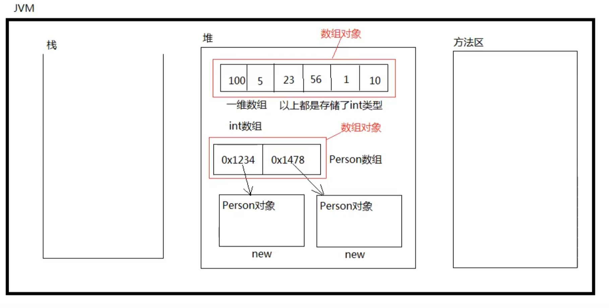

# 数组

+  数组是一种引用数据类型,父类是Object
+  数组实际上是一种容器,可以同时容纳多个元素; 数组是一个数据的集合
+  数组中可以存储基本数据类型的数据, 也可以存储引用数据类型的数据
+  数组是引用数据类型, 所以数组对象存储在堆内存中
+  将对象存入数组 , 存储的是对象的引用/内存地址
+  数组一旦创建,在Java中规定,长度不可变
+  数组包括:一维数组,二维数组,多维数组
+  所有的数组对象都有lenth属性,用来获取数组中元素的个数
+  Java中数组要求数组中元素的类型统一,即一个数组只能存储一种数据类型的数据
+  数组在存储数据时,数组中元素的内存地址是连续的; 数组实际上是一种简单的数据结构
+  所有的数组都是以第一个元素的内存地址作为整个数组对象的内存地址
+  数组中每个元素都有下标,第一元素的下标是0,第二个元素的下标是1,最后一个元素的下标是length-1
   对数组中的元素进行"存取"的时候,都要通过下标来进行

## 数组的内存图

****

## 数组的优点与缺点

优点 : 查询/查找/检索某个下标上的元素时的效率极高,可以说是查询效率最高的一种数据结构

+  为什么查询效率高
   +  每一个元素的内存地址在空间储存上是连续的
   +  每一个元素的类型相同,所以占用的空间大小一样
   +  知道第一个元素内存地址,知道每一个元素占用的空间大小,又知道下标,所以通过一个数学表达式就可以计算出某个下标上元素的内存地址,通过内存地址直接定位元素

缺点 : 

+  由于为了保证数组中每个元素的内存地址连续,所以在数组上随机删除或增加元素的时候的效率较低,因为随机增删元素会涉及后面元素同一向前或者向后位移的操作
+  数组不能存储大数据量,因为很难在内存中找到一块大的连续内存空间

## 声明一维数组的语法

```java
int[] array1;
double[] array2;
boolean[] array3;
String[] array4;
Object[] array5
```

## 初始化一维数组

### 静态初始化

```java
int[] array = {100, 2100, 200, 55};
```


### 动态初始化

```java
int[] array = new int[5];//这里5表示元素的个数
```

初始化一个长度为5的int类型数组,每个元素默认值是0


```java
String[] array = new String[6];
```

初始化一个长度为6的String类型的数组,每个元素的默认值是null

>  当创建数组的时候,确定数组中存储哪些具体的元素时,采用静态初始化方式
>
>  当创建数组的时候不确定数组中存储哪些数据,采用动态初始化的方式,预先分配内存空间

## 一维数组的遍历

```java
for(int i = 0; i < a.lenth; i++){
    System.out.println(a[i]);
}
```


## 输出数组的几种方式

```java
package com.java.array;

public class ArrayTest01 {
    public static void main(String[] args) {
        //静态初始化一维数组
        int[] a1 = {1, 33, 55, 1919};
        printArray(a1);

        System.out.println("-----------------");

        //还可以这样打印:
        printArray(new int[]{11222, 533, 6565, 1321});//如果传递一个静态数组的话,语法必须这样写,方括号内不能有数字

        System.out.println("-----------------");

        //动态初始化一维数组
        int[] a2 = new int[5];
        printArray(a2);

        System.out.println("-----------------");

        printArray(new int[3]);
    }

    public static void printArray(int[] array){
        for(int i : array){
            System.out.println(i);
        }
    }
}

```


# main方法中的数组参数

## 1.main中的String[] args有什么用

 JVM负责调用main方法
 JVM调用main方法的时候，会自动传一个string数组过来

```java
public class ArrayTest05 {
    //这个方法程序员负责写出来，JVM负责调用。JVM调用的时候一定会传一个String数组过来
    public static void main(String[] args) {
        //JVM默认传递过来的数组对象的长度默认为0
        System.out.println(args.length);
        //以下这一行代码代表的含义：数组对象创建了，但是数组中没有任何数据
        //String[] strs = nre String[0];
        //String[] strs = {};//静态初始化数据，里面没有东西

        //这个数组里面什么时候会有值
        //这个数组是留给用户的，用户可以在控制台上输入参数，这个参数会自动被转换为“String[] args”
        //例如这样运行程序：java ArrayTest05 abc def xyz
        //那么这个时候JVM会自动将“abc def xyz”通过空格的方式进行分离，分离完成之后，自动放到“String[] args”数组
        //所以main方法上面的String[] args数组主要是用来接受用户输入参数的
    }

}
```

 