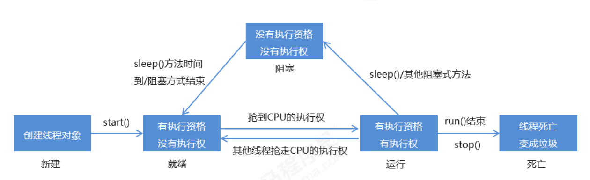

# 多线程

## 什么是进程？什么是线程？

进程是一个应用程序，线程是一个进程中的执行场景(执行单元)。

## 对于 Java 程序来说:

当在 DOS 命令窗口输入 `java helloworld` 回车之后
会前启动 JVM，而 JVM 就是一个进程
JVM 再启动一个主线程调用 `main` 方法
同时再启动一个垃圾回收线程(GC)负责看护，回收垃圾

最起码,现在的Java程序中至少有两个线程并发
一个是垃圾回收线程
一个是执行main方法的主线程

## 进程和线程的关系

进程A和进程B的内存独立不共享

线程A和线程B:
	在Java语言中:
		线程A和线程比,堆内存和放发去内存共享
		栈内存独立,一个线程一个栈

假设启动10个线程,会有10个栈空间,每个栈和每个栈之间互不干扰,自己执行自己的,这就是多线程并发

Java有多线程机制,是为了提高程序的处理效率

## 程序的结束

使用了多线程机制之后,main方法结束,有可能程序不会结束
main方法结束之时主线程结束,主栈空了,其他的栈(线程)可能还在压栈弹栈

## CUP与多线程

对于多核的CPU来说,可以进行真正的多线程并行

对于单核CPU来说,可以做到真正的多线程并发吗?
CPU在多个线程之间频繁切换,在任务执行者看来,多个线程在同时进行

```java
package com.feidain.java.thread;
/*
    以下程序，除了垃圾回收线程之外，只有一个线程，因为只有一个栈
 */
public class ThreadTest01 {
    public static void main(String[] args) {
        System.out.println("main begin");
        m1();
        System.out.println("main begin");
    }

    private static void m1() {
        System.out.println("m1 begin");
        m2();
        System.out.println("m1 begin");
    }

    private static void m2() {
        System.out.println("m2 begin");
        m3();
        System.out.println("m2 begin");
    }

    private static void m3() {
        System.out.println("m3 begin");
        System.out.println("m3 begin");
    }
}

```

# Java语言实现线程有两种方式

## 第一种方式

​	编写一个类,直接继承java.lang.Thread,重写run方法

```java
package com.feidain.java.thread;

public class ThreadTest02 {
    //这里是main方法,这里的代码属于主线程,在主栈中运行
    //创建一个分支线程对象
    public static void main(String[] args) {
        MyThread myThread = new MyThread();
        //启动分支线程
        //start方法的作用是在JVM中开辟一个新的栈空间,这段代码的任务(开辟新的栈空间)完成之后,瞬间就结束了,线程启动成功
        //启动成功的线程会自动调用run方法,并且run方法在分支栈的底部(压栈)
        //run方法在分支栈的栈底,main方法在主栈的栈底;run方法和main方法是平级的
        myThread.start();
        //如果直接调用myThread.run()方法,不会启动线程,不会分配新的分支栈
        //从这里开始的代码任然运行在主线程中
        for (int i = 0; i < 1000; i++){
            System.out.println("主线程-->" + i);
        }
    }
}

class MyThread extends Thread{
    @Override
    public void run() {
        for (int i = 0; i < 1000; i++){
            System.out.println("分支线程-->" + i);
        }
    }
}
```

## 第二种方法

编写一个类,实现java.lang.Runnable接口,实现run方法

```java
package com.feidain.java.thread;

public class ThreadTest02 {
    //这里是main方法,这里的代码属于主线程,在主栈中运行
    //创建一个分支线程对象
    public static void main(String[] args) {
        MyThread myThread = new MyThread();
        //启动分支线程
        //start方法的作用是在JVM中开辟一个新的栈空间,这段代码的任务(开辟新的栈空间)完成之后,瞬间就结束了,线程启动成功
        //启动成功的线程会自动调用run方法,并且run方法在分支栈的底部(压栈)
        //run方法在分支栈的栈底,main方法在主栈的栈底;run方法和main方法是平级的
        myThread.start();
        //如果直接调用myThread.run()方法,不会启动线程,不会分配新的分支栈
        //从这里开始的代码任然运行在主线程中
        for (int i = 0; i < 1000; i++){
            System.out.println("主线程-->" + i);
        }
    }
}

class MyThread extends Thread{
    @Override
    public void run() {
        for (int i = 0; i < 1000; i++){
            System.out.println("分支线程-->" + i);
        }
    }
}
```

+  相比第一种方法(继承Thread类),第二种方法更好(实现Runnable接口),这样是面向接口编程,可以继承多个接口,又不占用单继承的类

## 采用匿名内部类的方法

```java
public class ThreadTest04 {
    public static void main(String[] args) {
        Thread t = new Thread(new Runnable() {
            @Override
            public void run() {
                for (int i = 0; i < 1000; i++){
                    System.out.println("线程类--->" + i);
                }
            }
        });

        t.start();

        for (int i = 0; i < 1000; i++){
            System.out.println("main--->" + i);
        }
    }
}

```

# 线程的生命周期



+  就绪状态的线程又叫做可运行状态,表示当前线程具有抢夺CPU时间片的权利(CPU时间片就是执行权).单一i个线程抢夺到CPU的时间线之后,就开始执行run方法,run方法的开始执行标志着线程进入运行状态
+  run方法的开始标志着执行线程进入运行状态,当之前占有的CPU时间片用完之后,会重新回到就绪状态继续抢夺CPU时间片,当再次抢到CPU时间片之后,会重新进入run方法接着上一次的代码继续往下执行
+  当一个线程遇到阻塞事件(sleep(),接受键盘输入等)时,线程会进图阻塞状态,阻塞状态的线程会放弃之前占有的CPU时间片

##　线程名

## 获取线程名

```java
线程对象.getName();
```

如果没有对线程名进行修改,默认线程名为`Thread-0`

## 修改线程名

```java
线程对象.setName("线程名");
```

## 获取当前线程对象

`Thread  t =  Thread.currentThread();` 

返回值t就是当前线程

```
    Thread currentThread = Thread.currentThread();
    String cThreadName =  currentThread.getName();
    System.out.println(cThreadName);
```

main方法的线程名为`main`

# 线程的sleep()方法

`static void sleep(long millis)`

静态方法:`Thread.sleep(1000)`
参数是毫秒

作用:让当前线程进入休眠,进入"阻塞状态",放弃占有的CPU时间片,让给其他线程使用

>  这行代码出现在A线程中,A线程就进入休眠.

## sleep()是静态方法

```java
public class ThreadTest07 {
    public static void main(String[] args) {
        Thread t = new MyThread03();
        t.setName("t");
        t.start();
        
        //sleep()是一个静态方法,不是实例方法,不是对象级别的方法.使用"引用."调用sleep()
        //与直接用"类名."调用没有区别,结果是让"currentThread"睡眠
        //在下面的代码中,是让主线程睡眠
        try {
            t.sleep(1000 * 5);//在运行的时候会转换成"Thread.sleep();",让当前线程(main)睡眠
        } catch (InterruptedException e) {
            e.printStackTrace();
        }
        
    }
}

class MyThread03 extends Thread{
    @Override
    public void run() {
        for(int  i = 0; i < 1000; i++){
            System.out.println(Thread.currentThread().getName() + "-->" + i);
        }
    }
}

```

## 终止线程的睡眠

```java
public class ThreadTest08 {
    public static void main(String[] args) {
        Thread t = new Thread(new MyRunnable02());
        t.start();
        try {
            Thread.sleep(1000 * 5);//五秒后终断t线程睡眠
        } catch (InterruptedException e) {
            e.printStackTrace();
        }
        t.interrupt();//打断t的睡眠,引起线程t的sleep()异常,执行catch
    }
}

class MyRunnable02 implements Runnable{
    //run()方法中的异常不能抛出,只能try/catch
    @Override
    public void run() {
        System.out.println(Thread.currentThread().getName() + "---> begin");
        try {//这里不能抛出异常,只能try/catch,因为子类不能比父类抛出更多的异常
            Thread.sleep(1000 * 60 * 60 * 24 * 365);//睡眠一年
        } catch (InterruptedException e) {
            e.printStackTrace();//打印异常
        }
        System.out.println(Thread.currentThread().getName() + "---> end");
    }
}

```

## 强行终止线程

 ### stop() -->已过时 

```java
public class ThreadTest09 {
    public static void main(String[] args) {
        Thread t = new Thread(new MyRunnable());
        t.setName("t");
        t.start();
        //模拟5秒
        try {
            Thread.sleep(1000 * 5);
        } catch (InterruptedException e) {
            e.printStackTrace();
        }
        //5秒后强制终止t线程
        t.stop();//已过时(不建议使用)
    }
}

class MyRunnable implements Runnable{

    @Override
    public void run() {
        for (int i = 1; i <= 10; i++){
            System.out.println(Thread.currentThread().getName() + "-->" + i);
            try {
                Thread.sleep(1000 * 1);
            } catch (InterruptedException e) {
                e.printStackTrace();
            }
        }
    }
}

```

>  stop()的缺点:强行终止线程,线程没有保存的数据会丢失

### 添加boolean标记

```java
package com.feidian.java.thread;

public class ThreadTest10 {
    public static void main(String[] args) {
        MyRunnable05 r = new MyRunnable05();
        Thread t = new Thread(r);
        t.setName("t");
        t.start();

        //5秒后终止t线程
        try {
            Thread.sleep(1000 * 5);
        } catch (InterruptedException e) {
            e.printStackTrace();
        }
        //终止线程
        r.run = false;
    }

}

class MyRunnable05 implements Runnable{
    //添加bool标记,控制线程的终止与执行
    boolean run = true;
    @Override
    public void run() {
        for(int i = 0; i < 10; i++){
            if(run){
                System.out.println(Thread.currentThread().getName() + "-->" + (i + 1));
                try {
                    Thread.sleep(1000);
                } catch (InterruptedException e) {
                    e.printStackTrace();
                }
            }else {
                //如果有数据需要保存,可以在return前添加代码保存
                return;//如果外部修改run标记为false,则结束run方法
            }
        }
    }
}
```

# 线程调度

## 抢占式调度模型

哪个线程的优先级比较高,抢到的CPU时间片的概率就高一些
java采用的是抢占式调度模型

## 均分式调度模型

平均分配CPU时间线.每个线程占有的CPU时间片长度一致,平均分配,一切平等

## Java中的线程调度相关方法

最高优先级是10
最低优先级是1
默认优先级是5

### 实例方法

#### void setPriority()

设置线程优先级

#### int getPriority()

获取线程优先级

#### void join()

合并线程

```java
class MyThread01 extends Thread{
    public void doSome(){
        MyThread2 t = new MyThread2();
        t.join;//当前线程进入阻塞,t线程执行,直到t线程结束.当前线程才可以运行
    }
}

class MyThread2 extends Thread{
    
}
```


### 静态方法

#### static void yield() 让位方法

暂停当前正在执行的线程对象,并执行其他线程

yield()方法会让当前线程从"运行状态"回到"就绪状态"

>  回到就绪状态之后还是有可能会抢到CPU时间片

yield()方法不是阻塞方法

# 线程安全

>  在实际开发中,项目都是运行在服务器中,而服务器已经完成了线程的定义,线程对象的创建,线程的启动等,这些代码不需要手动编写

## 什么时候数据在多线程并发的环境下会存在安全问题

+  多线程并发
+  有共享数据
+  共享数据有修改的行为

满足以上三个条件之后就会存在线程安全问题

## 如何解决线程安全问题

线程排队执行(不能并发)
用太对执行解决线程安全问题

这种机制被称为:线程同步机制

>  线程同步会牺牲一部分效率

## 线程同步

### 同步编程模型

线程t1和线程t2,在线程执行的之前,必须等待t2执行结束;或者在t1执行之前,必须等待t2执行结束

两个线程之间发生了等待关系,这就是异步编程模型

### 异步编程模型

线程t1和线程t2各自独立执行(多线程并发),效率较高

```java
package com.feidian.java.threadsafty;

public class Account {
    private String actno;
    private double balance;

    public Account() {
    }

    public Account(String actno, double balance) {
        this.actno = actno;
        this.balance = balance;
    }

    public String getActno() {
        return actno;
    }

    public void setActno(String actno) {
        this.actno = actno;
    }

    public double getBalance() {
        return balance;
    }

    public void setBalance(double balance) {
        this.balance = balance;
    }

    //取款方法
    public void withdraw(double money){
        //多线程并发此方法,会导致线程安全问题
        //取款之前的余额
        double before = this.getBalance();
        //取款之后的余额
        double after = before - money;

        //模拟网络延迟
        try {
            Thread.sleep(24);
        } catch (InterruptedException e) {
            e.printStackTrace();
        }

        //更新余额
        this.setBalance(after);
    }
}

```

```java
package com.feidian.java.threadsafty;

public class AccountThread extends Thread{
    private Account act;

    public AccountThread(Account act){
        this.act = act;
    }

    @Override
    public void run() {
        //run方法的执行表示取款操作
        //假设取款5000
        double money = 5000;
        act.withdraw(money);
        System.out.println(Thread.currentThread().getName() + "对账户:" + act.getActno() + "取款成功,余额:" + act.getBalance());
    }
}

```

```java
package com.feidian.java.threadsafty;

public class Test {
    public static void main(String[] args) {
        //创建账户对象
        Account act = new Account("act-001", 10000);
        //创建两个线程
        Thread t1 = new AccountThread(act);
        Thread t2 = new AccountThread(act);

        //设置name
        t1.setName("t1");
        t2.setName("t2");
        //启动取款线程
        t1.start();
        t2.start();
    }
}

```

以上代码在执行的过程中,由于存在网络延迟,一定会出现线程安全问题

## 同步代码块

线程同步的语法:

```java
synchronized(<共享对象>){
    //线程同步代码块
   
}
```

所以对上面的账户类进行修改

```java
package com.feidian.java.threadsafty;

public class Account {
    private String actno;
    private double balance;

    public Account() {
    }

    public Account(String actno, double balance) {
        this.actno = actno;
        this.balance = balance;
    }

    public String getActno() {
        return actno;
    }

    public void setActno(String actno) {
        this.actno = actno;
    }

    public double getBalance() {
        return balance;
    }

    public void setBalance(double balance) {
        this.balance = balance;
    }

    //取款方法
    public void withdraw(double money){
        //多线程并发此方法,会导致线程安全问题
        synchronized (this){//使用同步代码块;this是账户对象,是被共享的
            //取款之前的余额
            double before = this.getBalance();
            //取款之后的余额
            double after = before - money;

            //模拟网络延迟
            try {
                Thread.sleep(24);
            } catch (InterruptedException e) {
                e.printStackTrace();
            }

            //更新余额
            this.setBalance(after);
        }
    }
}

```

`synchronized`的原理:

+  假设t1和t2并发,开始执行withdraw方法的时候,肯定有一个先一个后
+  假设t1先执行,遇到synchronized,这个时候会自动找到"共享对象(账户类对象act)"的对象锁,找到之后会线程t1会占有这把锁,然后执行同步代码块中的程序,在程序执行的过程中,这把锁一直被占有,直到同步代码块执行结束,这把锁才会释放
+  假设t1已经占有了这把锁,此时t2也遇到synchronized关键字,也会尝试占用共享对象的对象锁,结果对象锁被t1占有,t2只能在同步代码块外等待t1线程的结束,直到t1执行完同步代码块,桂冠对象锁,t2才能拿到对象锁,然后进入同步代码块执行程序

这样就达到了线程排队执行

要注意共享对象的选择,不一定必须是this,共享对象一定要是需要产生等待关系/进行排队的线程所共享的对象

共享对象一定是需要产生等待关系机型

Java三大变量
	实例变量:堆内存中
	静态变量:方法区中
	局部变量:栈内存中
以上三大变量中,局部变量永远不会存在线程安全问题,因为局部变量不共享(一个线程一个栈)局部变量在栈中,所以局部变量永远都不会共享
实例方法在堆内存中,堆只有一个.静态变量在方法区中,方法区只有一个
堆和方法区是多线程共享的,所以可能存在线程安全问题

>  同步代码块越小效率越高

## synchronized出现在实例方法上

synchronized出现在实例方法上锁的一定是this

所以这种方式不灵活
synchronized使用在实例方法上可能会无故扩大同步代码的范围,会倒是程序执行效率低


>  ArrayList是非线程安全的
>  Vector是线程安全的
>  HashMap是非线程安全的
>  Hashtable是线程安全的

## 总结

+  synchronized有两种写法

   +  第一种:同步代码块

      ```java
      synchronized(线程共享对象){
          同步代码块;
      }
      ```

   +  第二种:在实例方法上使用synchronized
      表示共享对象一定是this,并且同步代码块是整个方法体

   +  第三种:在静态方法上使用synchronized
      表示找类锁,类锁只有一把

## 死锁

>有两个对象,
>t1线程从上往下,锁住了第一个对象,准备所第二个对象
>t2线程从下往上,锁住了第二个对象,准备锁第一个对象
>此时两个线程中
>t1无法锁住第二个对象,不能向下继续运行
>t2无法锁住第一个对象,不能向上继续运行

死锁会让程序停止,不出现异常也不出现错误,这种错误最难调试

 ```java
package com.feidian.java.threadsafty;

import javax.crypto.interfaces.PBEKey;
import javax.lang.model.SourceVersion;

public class DeadLock {
    public static void main(String[] args) {
        Object o1 = new Object();
        Object o2 = new Object();
        Thread t1 = new MyThread01(o1, o2);
        Thread t2 = new MyThread02(o1, o2);
        t1.start();
        t2.start();
    }
}

class MyThread01 extends Thread{
    Object o1;
    Object o2;
    public MyThread01(Object o1, Object o2){
        this.o1 = o1;
        this.o2 = o2;
    }

    @Override
    public void run() {
        synchronized (o1){
            try {
                Thread.sleep(1000);
            } catch (InterruptedException e) {
                e.printStackTrace();
            }
            synchronized (o2){

            }
        }
    }
}

class MyThread02 extends Thread{
    Object o1;
    Object o2;
    public MyThread02(Object o1, Object o2){
        this.o1 = o1;
        this.o2 = o2;
    }

    @Override
    public void run() {
        synchronized (o2){
            try {
                Thread.sleep(1000);
            } catch (InterruptedException e) {
                e.printStackTrace();
            }
            synchronized (o1){

            }
        }
    }
}

 ```

`synchronized`在开发中最好不要嵌套使用,因为有可能发生死锁现象

## 如何解决线程安全问题

synchronized要少使用,因为会让程序的执行效率降低

### 第一种方案

尽量使用局部变量代替实例变量和静态变量

### 第二种方案

如果必须是实例变量,那么可以考虑创建多个对象,这样实例变量的内存就不会共享

### 第三种方案

如果不能使用局部变量,对象也不能创建多个,这个时候就只能选择synchronized了

# 守护线程

Java语言中线程分为两大类：

+  用户线程
+  守护线程

垃圾回收线程就是守护线程

main线程是一个用户线程

## 守护线程的特点

一般守护线程是一个死循环，所有的用户线程只要结束，守护线程自动结束

## 守护线程的作用

每天00：00自动备份
这个需要使用到定时器，并且可以将定时器设置为守护线程

# 定时器

## 定时器的作用

间隔特定的时间，执行特定的程序

>  例如每周进行银行账户的总账操作
>  每天要进行数据的备份操作

在实际的开发中,每隔一段时间执行一段特定的程序,这种需求是很常见的,在Java中可以采取多种方式实现

+  可以使用sleep方法,睡眠,设置睡眠时间,每到这个时间点醒来,执行任务,这种方法是最原始的定时器
+  在Java的类库中已经写好了一个定时器java.util.Timer,可以直接用,不过这种方法在目前的开发中也很少使用,因为现在有很多的高级框架都是支持定时任务的
+  目前使用较多的是String框架中提供的SpringTask框架,这个框架只要进行简单的配置,就可以完成定时器的任务.这个框架底层也是通过java.util.Timer实现的

```java
package com.feidian.java.thread;

import java.text.ParseException;
import java.text.SimpleDateFormat;
import java.util.Date;
import java.util.Timer;
import java.util.TimerTask;

public class TimerTest {
    public static void main(String[] args) {
        Timer timer01 = new Timer();
        Timer timer02 = new Timer(true);//也可以在创建timer对象时,设置其为守护线程

        //指定定时任务
        SimpleDateFormat sdf = new SimpleDateFormat("yyyy-MM-dd HH:mm:ss");
        try {
            Date firstTime = sdf.parse("2021-03-21 14:13:00");
            timer01.schedule(new LogTimerTask(), firstTime, 1000 * 10);//可以认为这是一个线程
            //这里的task也可以采用匿名内部类的方式
            //类<LogTimerTask>中的run方法会从<firstTime>起,每隔<period>时长执行一次
        } catch (ParseException e) {
            e.printStackTrace();
        }
    }
}

//编写一个定时任务类
class LogTimerTask extends TimerTask{

    @Override
    public void run() {
        //编写需要执行的任务
        SimpleDateFormat sdf = new SimpleDateFormat("yyyy-MM-dd HH:mm:ss");
        String strTime = sdf.format(new Date());
        System.out.println(strTime + ": 完成备份");
    }
}
```


# 实现线程的第三种方式

实现Callable接口(JDK8新特性)

这种方式实现的线程可以获取线程的返回值
之前的两种方式无法获取线程的返回值,因为run方法返回void

系统委派一个线程去执行一个任务,该线程执行完任务之后可能会有一个执行结果,如何拿到这个执行结果?

## 实现Callable接口

 ```java
package com.feidian.java.thread;

/*
    实现线程的第三种方式
        实现Callable接口
        优点:可与获取到线程的执行结果
        缺点:效率比较低,在获取t线程执行结果的时候,当前线程受阻塞,效率比较低
 */

import java.util.concurrent.Callable;
import java.util.concurrent.ExecutionException;
import java.util.concurrent.FutureTask;//JUC包下,属于Java的并发包,老JDK中没有这个包

public class ThreadTest12 {
    public static void main(String[] args) {
        //第一步:创建一个"未来任务类"对象
        //参数非常重要,需要给一个Callable接口实现类对象
        FutureTask task = new FutureTask(new Callable() {//call()方法就相当于run方法,只不过call方法有返回值
            //线程执行一个任务,执行之后可能有一个执行结果
            //模拟执行
            @Override
            public Object call() throws Exception {
                System.out.println("call方法执行");
                Thread.sleep(1000 * 10);
                System.out.println("call方法结束");
                return new Object();
            }
        });//需要传入参数Callable/Runnable,如果传入Runnable,则没有返回值

        //创建线程对象
        Thread t = new Thread(task);
        //启动线程对象
        t.start();

        //获取t线程的返回结果
        try {
            Object obj = task.get();//在主线程中获取t线程的返回结果,会导致main线程阻塞
            //get()方法的执行会导致当前线程的阻塞
        } catch (InterruptedException e) {
            e.printStackTrace();
        } catch (ExecutionException e) {
            e.printStackTrace();
        }

    }
}

 ```


# Object类中的wait和notify方法 

+  wait方法和notify方法不是线程对象的方法,时java中任何一个java对象的都有的方法,因为这两个方法是Object类中自带的
   wait方法和notify方法不是通过线程对象调用的

+  wait方法作用

   +  ```java
      Object o = new Object();
      o.wait;
      ```

      表示让正在o对象上活动的线程进入等待状态(无期限等待,直到被唤醒为止)

+  notify方法作用

   +  `o.nitify();`方法的调用可以让正在o对象上等待的线程唤醒

## 生产者消费者模型

+  生产者和消费者模式是为了专门解决某个特定需求的
+  假设一个线程负责生产,一个线程负责消费
+  最终必须要达到生产和消费均衡
   +  生产线程生产满了,就不能再继续生产$\rightarrow$必须让消费线程进行消费
   +  消费线程消费完了,就不能再继续消费$\rightarrow$必须让生产线程继续生产

以上例子中,生产线程和消费线程运行在仓库对象上,生产满了,仓库让生产线程wait,然后notify消费线程进行消费
消费完了,仓库让消费线程wait,然后notify生产线程

仓库对象是多线程共享,所以需要考虑仓库的线程安全问题,仓库对象最终调用wait和notify方法
<font color ="red">wait方法和notify方法建立在synchronized线程同步的基础之上</font>

>  <font color = "red">注意:o.wait()方法会让正在o对象上活动的房前线程进入等待状态,并且释放之前占有o对象的锁,o.notify()方法只会通知,不会释放对象锁</font>

```java
package com.feidian.java.thread;

import java.util.ArrayList;
import java.util.List;

/*
    使用wait()方法和notify()方法实现生产者/消费者模型

    模拟:
        仓库采用List集合
        仓库List集合中只能存储一个元素
       做到生产一个消费一个
 */
public class ThreadTest16 {
    public static void main(String[] args) {
        //创建一个仓库对象
        ArrayList list = new ArrayList();

        Thread t1 = new Thread(new Producer(list));//生产者线程
        Thread t2 = new Thread(new Consumer(list));//消费者线程

        t1.setName("ProducerThread");
        t2.setName("ConsumerThread");

        t1.start();
        t2.start();
    }
}

class Producer implements Runnable{
    //共享一个仓库
    private List list;

    public Producer(List list) {
        this.list = list;
    }

    @Override
    public void run() {
        //一直生产
        while(true){
            synchronized (list){//给仓库对象list加锁
                if (list.size() > 0){//仓库满了
                    try {
                        Thread.sleep(1000);
                    } catch (InterruptedException e) {
                        e.printStackTrace();
                    }
                    try {//当前线程进入等待状态,释放t1占有的锁
                        list.wait();
                    } catch (InterruptedException e) {
                        e.printStackTrace();
                    }
                } else {//否则仓库已空,生产者生产
                    Object obj = new Object();
                    list.add(obj);
                    System.out.println(Thread.currentThread().getName() + "--->" + obj);
                    //已完成生产,notify消费者进行消费
                    list.notify();
                }
            }
        }
    }
}

class Consumer implements Runnable{
    //仓库
    private List list;

    public Consumer(List list) {
        this.list = list;
    }

    @Override
    public void run() {
        //一直消费
        while (true) {
            synchronized (list){
                if (list.size() == 0){//仓库空
                    try {
                        Thread.sleep(1000);
                    } catch (InterruptedException e) {
                        e.printStackTrace();
                    }
                    try {
                        list.wait();
                    } catch (InterruptedException e) {
                        e.printStackTrace();
                    }
                } else {//否则仓库满.消费者消费
                    Object obj = list.remove(0);
                    System.out.println(Thread.currentThread().getName() + "--->" + obj);
                    //已完成消费,notify生产者生产
                    list.notify();
                }
            }
        }
    }
}

```

