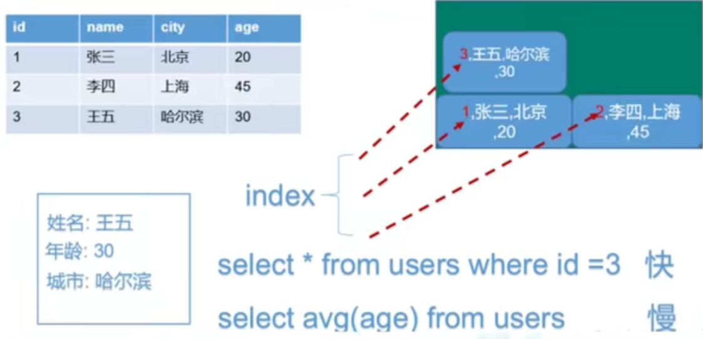
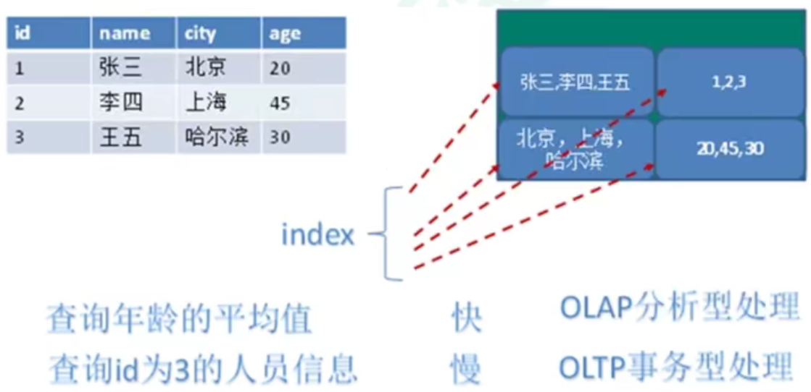

# 关系型数据库和非关系型数据库

## 关系型数据库 SQL

SQL= structure query language

+   以二维表格的关系模型组织数据

## 非关系型数据库

NoSQL = Not Only SQL 泛指非关系型数据库

+   以键值对的形式存储数据，且结构不固定

+   不遵循SQL标准
+   支持事务 不支持ACID　
    +   原子性 Atomicity 
        操作这些指令时，要么全部执行成功，要么全部不执行。只要其中一个指令执行失败，所有的指令都执行失败，数据进行回滚，回到执行指令前的数据状态。
    +   一致性 Consistency 
        事务的执行使数据从一个状态转换为另一个状态，但是对于整个数据的完整性保持稳定。
    +   隔离性 Isolation
        隔离性是当多个用户并发访问数据库时，比如操作同一张表时，数据库为每一个用户开启的事务，不能被其他事务的操作所干扰，多个并发事务之间要相互隔离。
        即要达到这么一种效果：对于任意两个并发的事务T1和T2，在事务T1看来，T2要么在T1开始之前就已经结束，要么在T1结束之后才开始，这样每个事务都感觉不到有其他事务在并发地执行。
    +   持久性 Durability 
        当事务正确完成后，它对于数据的改变是永久性的。
+   远超SQL的性能

### 适用场景

+   对数据高并发的读写
+   海量数据的读写
+   对数据高可扩展性的

### 不适用场景

+   需要事务支持
+   基于sql的结构化查询存储,处理复杂的关系,需要即席查询.
+   用不着sql的和用了sql也不行的情况，请考虑用NoSql

# 数据库的存储方式

## 行式存储数据库

### 行式数据库

### 列式数据库

### 图关系型数据库

主要应用: 社会关系 公共交通网络

# Redis

## 特点

+   数据在内存中，支持持久化
+   支持除键值对模式以外的多种数据结构
+   一般是作为缓存数据库辅助持久化的数据库
+   和Memcached类似,它支持存储的`value`类型相对更多,包括s`tring`(字符串), `list(`链表), `set`(集合), `zset`(sorted set--有序集合)和hash(哈希类型)
+   这些数据类型都支持push/pop, add/remove及取交集并集和差集及更丰富的操作而且这些操作都是**原子性**的

## 使用redis

>   官网只提供linux安装包 只考虑在linux系统中的安装

进入redis官网 redis.io

+   下载redis的安装包(linux)

+   在Linux系统下 解压安装包
+    `cd`到解压好的目录内, 使用`make`命令编译文件(需要先安装`gcc`)
+   使用`make install`安装 默认会安装到 `/usr/local/bin` 目录下

+   后台启动
    +   更改配置文件 `redis.conf`  (`redis x.x.x`目录内)
        +   将`daemonize no`改为`daemonize yes`
        +   建议将配置文件复制到 `/etc` 目录下
    +   在`/usr/local/bin`目录下 使用 `redis-server /etc/redis.conf` 命令启动
+   关闭
    +   在`/usr/local/bin`目录下 使用`redis-cli`命令
    +   然后输入`exit`
    +   也可以直接`kill` redis 的进程

## Redis 基础知识

+   默认16个数据库，类似数组下标从0开始，初始默认使用0号库
+   使用命令select \<dbid\>来切换数据库.如:select 8
+   统一密码管理,所有库同样密码
+   dbsize查看当前数据库的key的数量
+   flushdb清空当前库
+   flushall通杀全部库
+   Redis 是单线程 + 多路IO复用技术

