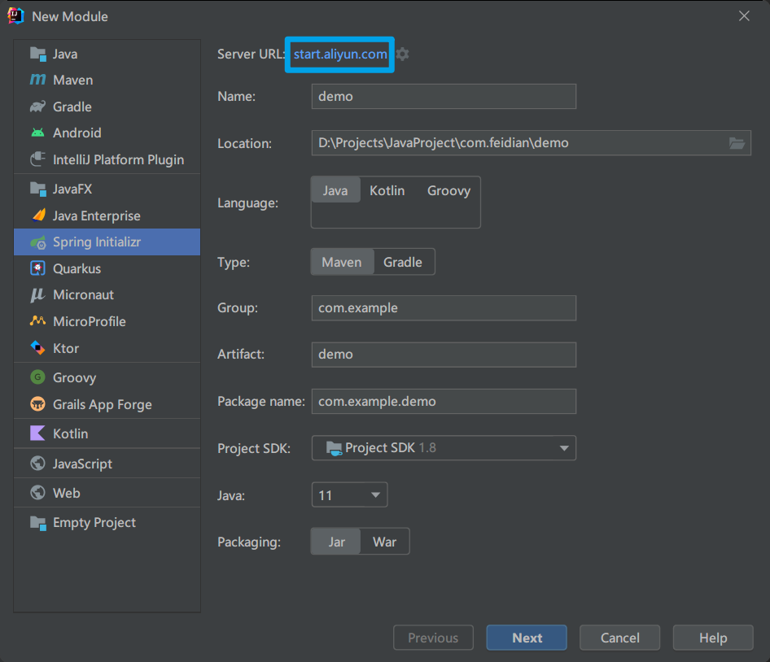
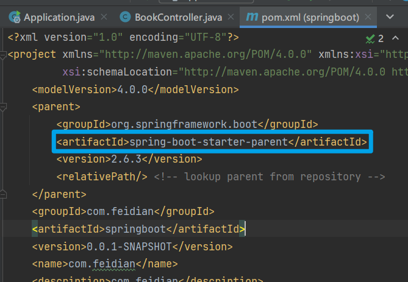
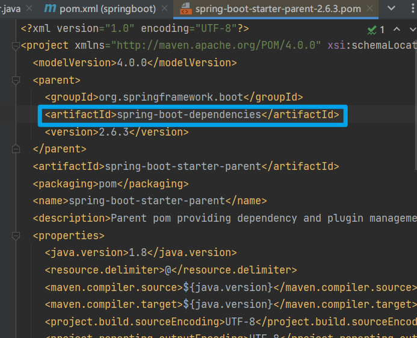
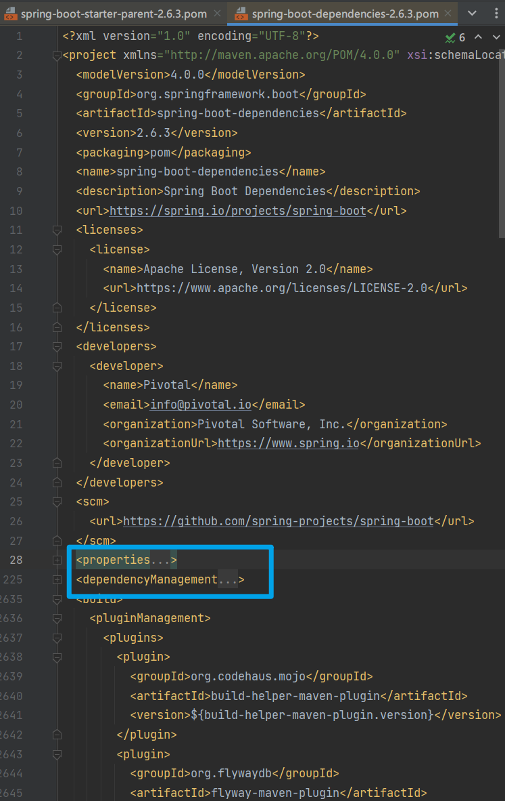
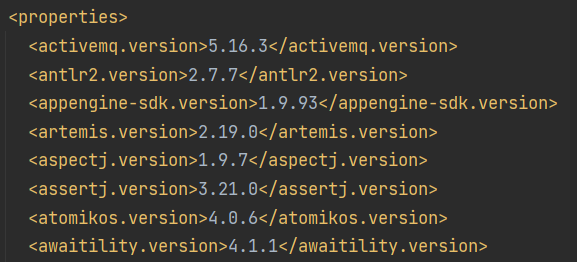
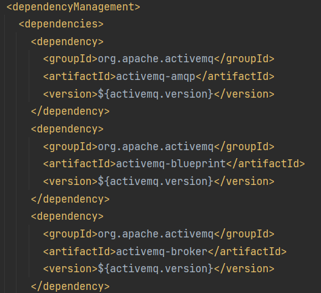
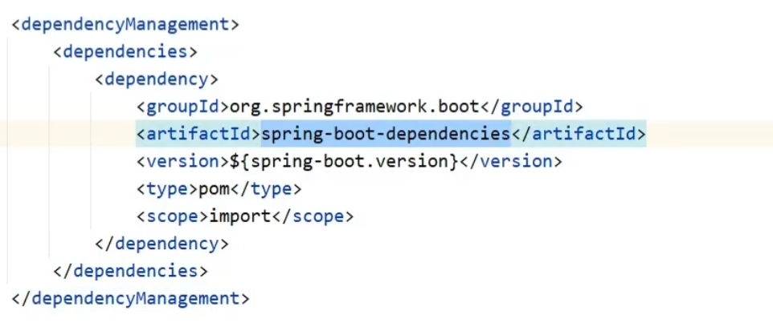
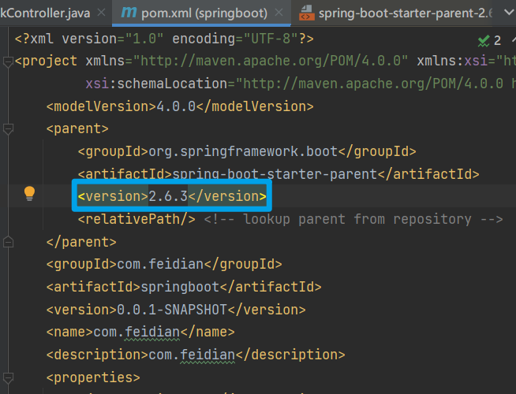
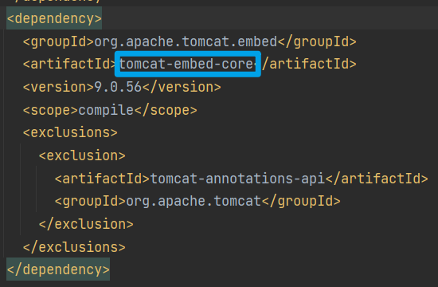

# 添加 Maven 阿里云镜像

在 `maven目录/conf/setting.xml` 中添加镜像坐标

```xml
<mirror>
      <id>nexus-aliyun</id>
      <mirrorOf>central</mirrorOf>
      <name>Nexus aliyun</name>
      <url>http://maven.aliyun.com/nexus/content/groups/public</url>
</mirror>
```

# 使用阿里云创建 SpringBoot 项目



将 `start.spring.io` 改为 `start.aliyun.com`

# SpringBoot 中的 parent & starter

## parent



`CTRL` 点进去可以看到 :




---



通过这里的 `properties` 和 `dependencyManagement` 统一进行版本管理





---

通过阿里云创建的项目会有一点不同

没有继承，而是在 `pom.xml` 文件中直接引用



主要是跟 `Springboot` 的版本有关

### 总结

1. 开发 `SpringBoot` 程序要继承 `spring-boot-starter-parent`
2. `spring-boot-starter-parent` 中定义了若干个依赖管理
3. 继承 `parent` 模块可以避免多个依赖使用相同技术时出现依赖版本冲突
4. 继承 `parent` 的形式也可以采用引入依赖的形式实现效果

> 继承只有一次，用过之后就没有机会了



## starter

在每个 starter 依赖中, 导入了需要使用的其他依赖
不需要再手动导入相关坐标, 减少了依赖配置

---

starter 本质上是依赖
parent 本质上是依赖管理, 管理依赖的版本, 定义了版本坐标

在开发中导入坐标不需要写依赖版本, 只需要写 `groupId` 和 `artifactId`
如果发生版本错误再手动指定版本

1. 开发 SpringBoot 程序需要导入坐标时通常导入对应于的 starter
2. 每个不同的 starter 根据功能不同, 通常包括多个依赖坐标
3. 使用 starter 可以实现快速配置的效果, 达到简化配置的目的

# 引导类

```java
import org.springframework.boot.SpringApplication;
import org.springframework.boot.autoconfigure.SpringBootApplication;

@SpringBootApplication
public class Application {

    public static void main(String[] args) {
        SpringApplication.run(Application.class, args);
    }

}
```

以上为引导类
这里运行 `run` 方法, 就是初始化了一个 Sping 容器

SpringBoot 的引导类时 Boot 工程的执行入口, 运行 main 方法就可以启动项目
SpringBoot 工程运行后初始化 Spring 容器, 扫描引导类所在包加载 Bean

# 内嵌 tomcat

在 `spring-boot-starter-web` 中, 存在以下依赖

```xml
<dependency>
      <groupId>org.springframework.boot</groupId>
      <artifactId>spring-boot-starter-tomcat</artifactId>
      <version>2.6.3</version>
      <scope>compile</scope>
</dependency>
```

这个依赖中, 存在内嵌的 tomcat



1. 内嵌 Tomcat 服务器是 SpringBoot 辅助功能之一
2. 内嵌 Tomcat 工作原理是将 Tomcat 服务器作为对象运行, 并将该对象交给 Spring 容器管理
3. 变更内嵌服务器思想是去除现有服务器, 添加全新的服务器

# RESTful 开发

REST (Representational State Transfer), 表现形式状态转换

- 传统风格资源描述形式
  - [http://localhost/user/getById?id=1](http://localhost/user/getById%EF%BC%9Fid=1)
    [http://localhost/user/saveUser](http://localhost/user/saveUser)
- REST风格描述形式
  - [http://localhost/user/1](http://localhost/user/1)
    [http://localhost/user](http://localhost/user)
- 隐藏资源的访问行为, 无法通过地址得知对资源是何种操作
- 书写简化

---

- 按照REST风格访问资源时使用行为动作区分对资源进行了何种操作
  - [http://localhost/users](http://localhost/users)
    查询全部用户信息 GET
  - [http://localhost/users/1](http://localhost/users/1)
    查询指定用户信息 GET
  - [http://localhost/users](http://localhost/users)
    添加用户信息 POST
  - [http://localhost/users](http://localhost/users)
    修改用户信息 PUT
  - [http://localhost/users/1](http://localhost/users/1)
    删除用户信息 DELETE

> 上述行为是约定方式, 约定不是规范, 可以打破, 所以称REST风格, 而不是REST规范
> 描述模块的名称通常使用复数, 也就是加 s 的格式描述, 表示此类资源, 而非单个资源, 例如: users, books, accounts...

根据 REST 风格对资源进行访问称为 RESTful

---

- 名称: `@RequestMapping`
- 类型: 方法注解
- 位置: Spring 控制器方法定义上方
- 作用: 设置当前控制器方法请求访问路径

```java
@RequestMapping(value = "/users", method = RequestMethod.POST)
@RespondBody
public String save(@RequestBody User user){
System.out.println("user save..." + user);
return "{'module':'user save'}";
}
```

- 属性: 
  - `value` (默认): 请求访问路径
  - `method` : http 请求动作: 标准动作（GET/POST/PUT/DELETE）

---

- 名称: `@PathVariable`
- 类型: 形参注解
- 位置: Spring 控制器方法形参定义前
- 作用: 绑定路径参数与处理器方法形参间的关系, 要求路径与形参名一一对应

```java
@RequestMapping(value = "/users/{id}", method = RequestMethod.DELETE)
@RespondBody
public String delete(@PathVariable Integer id){
    System.out.println("user delete..." + id);
    return "user delete";
}
```

---

- 区别
  - `@RequestParam` 用于接收 url 地址传参或表单传参
  - `@RequestBody` 用于接收 json 数据
  - `@PathVariable` 用于接收路径参数, 使用 `{参数名称}` 描述路径参数应用
- 应用
  - 后期开发中, 发送请求参数超过 1 个时, 以 json 格式为主, `@RequestBody` 应用较广
  - 如果发送非 json 格式数据, 选用 `@RequestParam` 接收请求参数
  - 采用 RESTful 进行开发, 当参数数量较少时, 例如 1 个，可以采用 `@PathVariable` 接收请求路径变量, 通常用于传递 `id` 值

# Thymeleaf

模板引擎

使用 thymeleaf, 只需要导入对应的依赖
将 html 文件放在 templates 目录下

```java
public static final String DEFAULT_PREFIX = "classpath:/templates/";
public static final String DEFAULT_SUFFIX = ".html";
```

在html文件中导入命名空间

```html
<html lang="en" xmlns: th="http://www.thymeleaf.org">
```

基础表达式

```
Variable Expressions:             ${...}
Selection Variable Expressions:   *{...}
Message Expressions:              #{...}
Link URL Expressions:             @{...}
Fragment Expressions:             ~{...}
```

