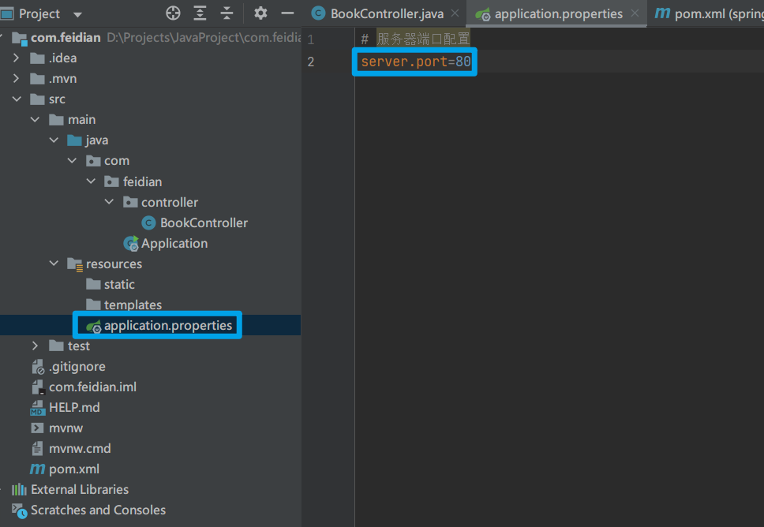
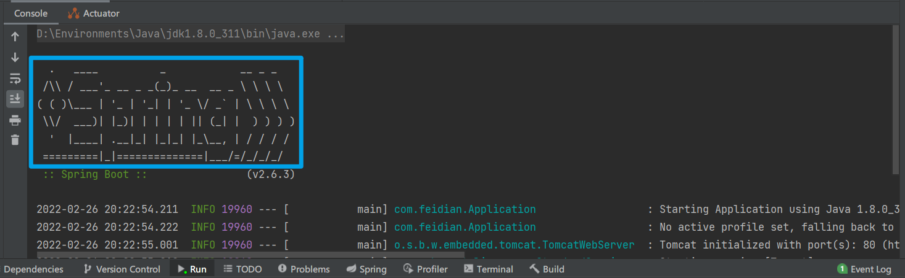
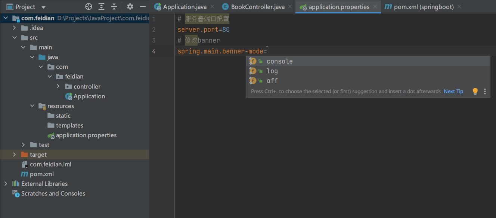
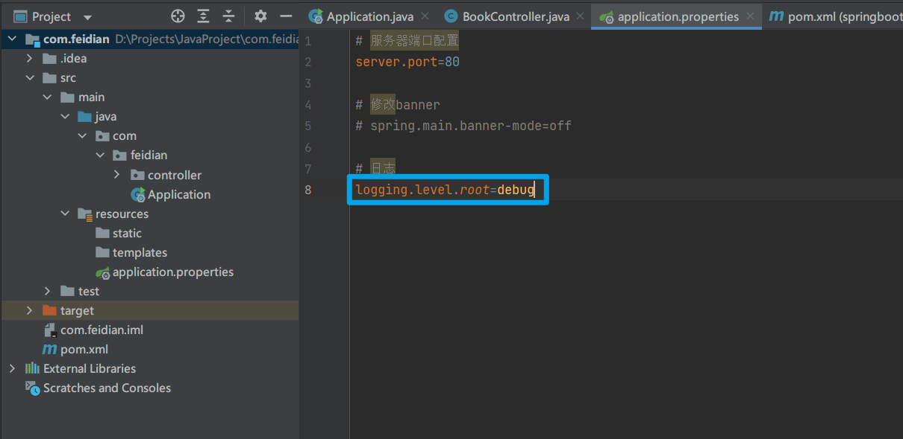
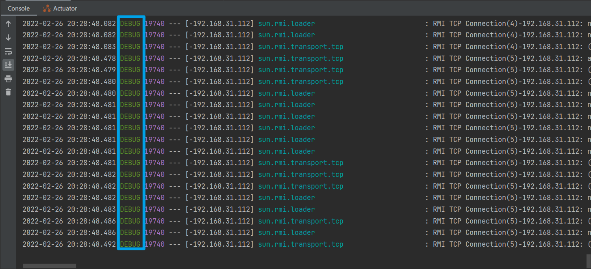

# 属性配置

## 修改服务器端口

http://localhost:8080/books
http://localhost/books （改为 80 端口，不需要在 URI 写端口）



SpringBoot 默认配置文件 `application.properties`，通过键值对配置对应属性

## 修改 Banner



开关及显示位置：



也可以直接选择图片，会自动按照灰度转换为对应文本

## 日志

显示 debug 级别的日志





在官方文档中可以查到相应的配置信息
需要导入相应的依赖，才会在配置文件中出现相应的配置，否则配置是无效的。

# 使用 `yml`

SpringBoot 提供了两种属性配置方式

`application.properties`

```
server.port=80
```

---

`application.yml`

```yaml
server:
	port: 81
```

> `.yml` 和 `.yaml` 是同一种格式

## 读取 `application.yml` 中的数据

```yaml
# 储存对象数组，使用 - 隔开
user:
  - name: zhangsan
    age: 18
  - name: lisi
	  age: 17

country: China

# 数组
likes: [game, music, sleep]

# 对象数组类型
# 冒号后不需要空格
users1: [{name:zhangsan, age:18}, {name:lisi, age:17}]
```

```java
// 使用 @Value 注解读取数据
@Value("${user.name}") // 层级之间使用 . 隔开
private String name1; // 读取结果为 zhangsan

// 读取数组中某一元素
@Value("${likes[1]}")
private String likes1; // 读取结果为 music
```

## `yml` 文件中数据相互引用

使用 `${属性名}` 引用数据

```yaml
baseDir: C:\Windows

# 使用${属性名}引用数据
tempDir: ${baseDir}\temp

# 加上双引号的字符串, 会解析转移字符 \t
tempDir1: "${baseDir}\temp"
```

## 自动装配

```yaml
# 储存对象数组，使用 - 隔开
user:
  - name: zhangsan
    age: 18
  - name: lisi
	  age: 17

country: China

# 数组
likes: [game, music, sleep]

# 对象数组类型
# 冒号后不需要空格
users1: [{name:zhangsan, age:18}, {name:lisi, age:17}]
```

```java
// 使用自动装配讲所有的数据封装到一个对象 Environmen 中
@Autowired
private Environment env;

@GetMapping
public String getById(){
	// 无需再创建多个变量 一个个地取出属性
	System.out.println(env.getProperty("user.name"));
}
```

## 取出特定数据

上面的自动装配会将全部属性都封装到 Environment 中

思路:

1. 创建类, 用于封装数据
2. Spring 加载数据到对象中
3. 从 Spring 中直接获取数据

```yaml
# 需要加载的数据
spring:
  datasource:
    driver: com.mysql.jdbc.Dirver
    url: jdbc:mysql://localhost:3306
    username: root
    password: 123456
```

```java
// 1. 定义数据模型封装 yaml 文件中对应的数据

// 2. @Component 注解 定义为 Spring 管控的 Bean
@Component
// 3. @ConfigurationProperties 注解 指定加载的数据 
@ConfigurationProperties("datasource")
public class MyDataSource {
    private String driver;
    private String url;
    private String username;
    private String password;

// 以下省略 toString 和 getter & setter
}
```

```java
@RestController
@RequestMapping("/book")
public class BookController {

    @Autowired
    public MyDataSource myDataSource;

    @GetMapping
    public String getById(){
        // 在控制台打印
        System.out.println(myDataSource);
        return "spring boot is running";
    }

}
```

运行结果

```
MyDataSource{driver='com.mysql.jdbc.Dirver', url='jdbc:mysql://localhost:3306', username='root', password='123456'}
```

