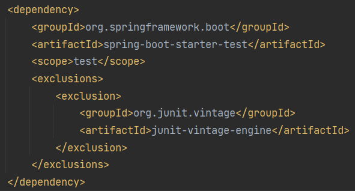
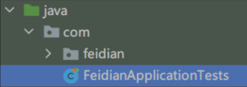
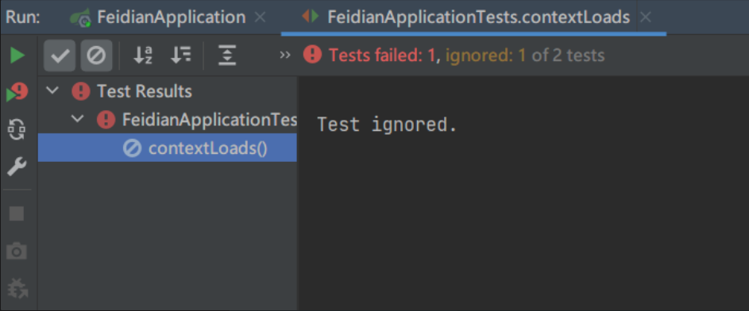
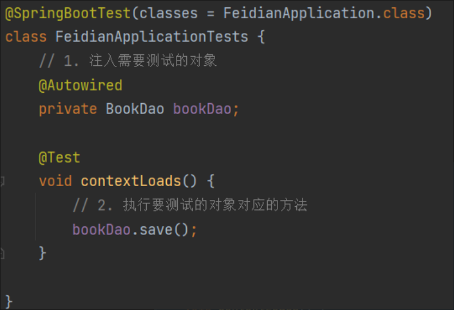
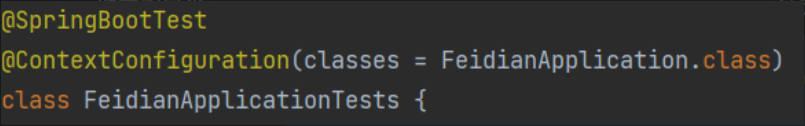
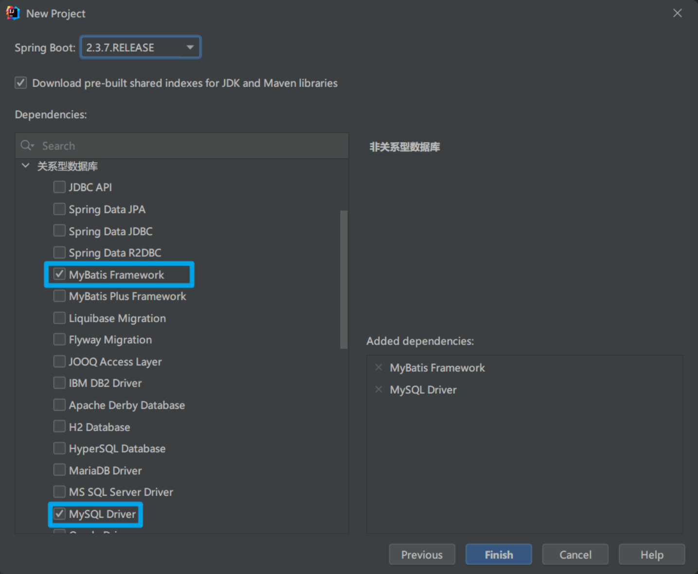
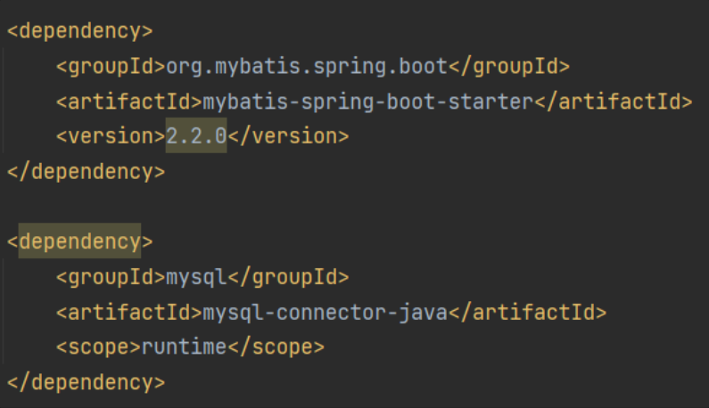
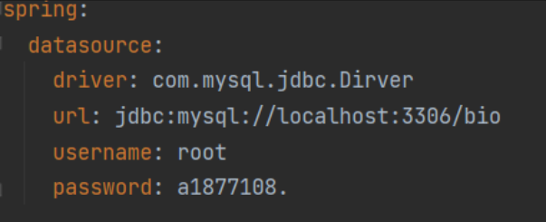
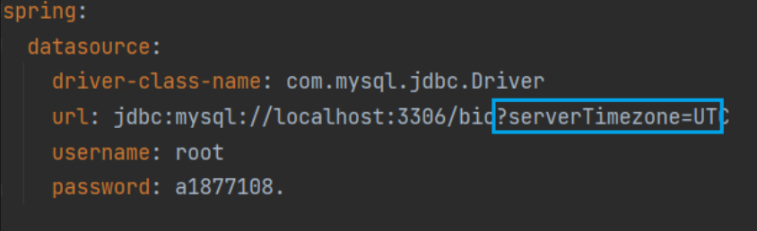
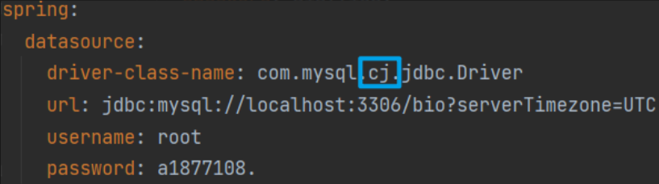

# 整合 JUnit

默认导入 JUnit



进行测试的步骤

1. 导入测试对应的 `starter` (会自动导入)
2. 测试类使用 `@SpringBootTest` 修饰
3. 使用自动装配的形式添加要测试的对象

```java
// @SpringBootTest 注解定义了这个类为测试类
@SpringBootTest
class FeidianApplicationTests {
    // 1. 注入需要测试的对象
    @Autowired
    private BookDao bookDao;

    @Test
    void contextLoads() {
        // 2. 执行要测试的对象对应的方法
        bookDao.save();
    }
}
```

+ 名称: `@SpringBootTest`
+ 类型: 测试类注解
+ 位置: 测试类定义上方
+ 作用: 设置 JUnit 加载的 SpringBoot 启动类
+ 相关属性:
  + `classes` : 设置 SpringBoot 启动类

## `classes` 属性

如果将测试类移动到另一个包下(上一层级), 会报错





原因是测试类的位置与 SpringbootApplication 的位置(全限定名)不一样
SpringbootApplication 所在的位置为 `package com.feidian;`
测试类所在位置为 `package com;`

**解决方法:**

在 `@SpringBootTest` 注解后添加 `classes` 属性 `@SpringBootTest(classes = FeidianApplication.class)`



**原因**

测试类运行取到测试对象, 需要拿到 `Spring` 容器
如果层级不对应且不配置 `classes` 属性, 测试类就拿不到 `Spring` 容器

再看报错信息:

```
java.lang.IllegalStateException: Unable to find a @SpringBootConfiguration, you need to use @ContextConfiguration or @SpringBootTest(classes=...) with your test
```

即需要指定引导类(配置类)
指定引导类 `@ContextConfiguration or @SpringBootTest(classes=...)` 这两个注解都能完成



一般不需要用 `@ContextConfiguration`

报错原因是: `Unable to find a @SpringBootConfiguration` 找不到注解 `@SpringBootConfiguration` . 因为进行测试时, 会在测试类所在同一层级内及其父包中找具有 `@SpringBootConfiguration` 注解的类, 而引导类中的注解 `@SpringBootApplication` 中包含 `@SpringBootConfiguration` 注解

**总结:**

+ 测试类如果存在于引导类所在包或子包中无需指定引导类
+ 测试类如果不存在于引导类所在的包或子包中需要通过 `classes` 属性指定引导类

# 整合 MyBatis

+ 核心配置: 数据库连接相关信息
+ 映射配置: SQL 映射(XML/注解)

## 导入对应 starter

在创建 SpringBoot 项目时, 勾选以下两条:





> SpringBoot 官方启动器依赖为 `spring-boot-starter-xxxx` 
> 非官方启动器为 `xxxx-spring-boot-starter` 


## 配置相关信息

在 application.yml 中配置数据库信息



## 定义数据层接口与映射配置

```java
// 添加 @Mapper 注解 被容器识别
@Mapper
public interface UserDao{
	@Select("select * from user")
	public List<User> getAll();
}
```

## 常见问题

1. MySQL 8.X 驱动强制要求设置时区

   需要在配置 JDBC Driver 时加上时区

2. 驱动类过时, 提醒更换为 `com.mysql.cj.jdbc.Driver`