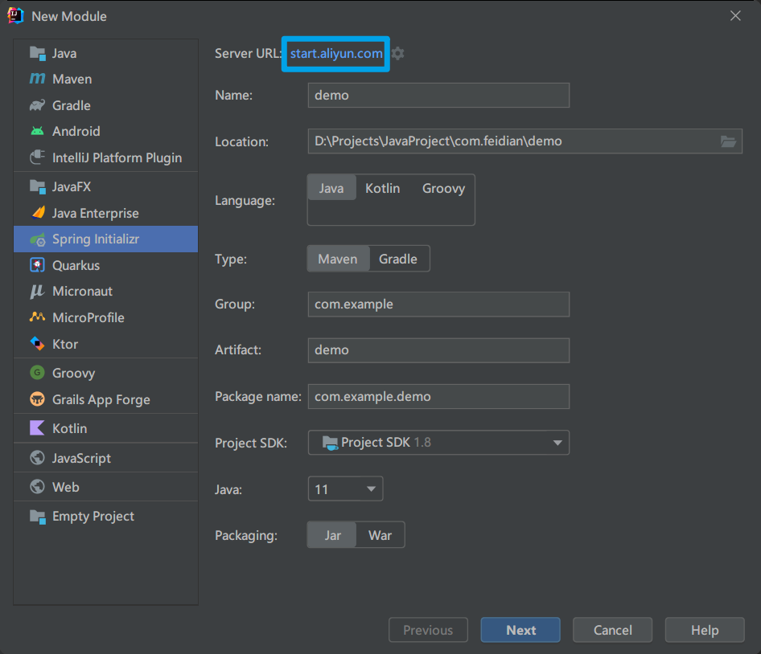
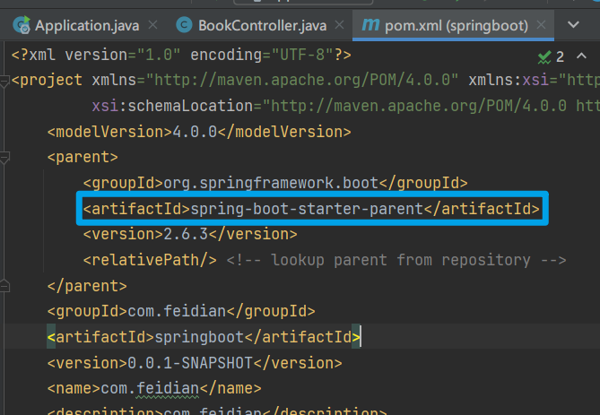
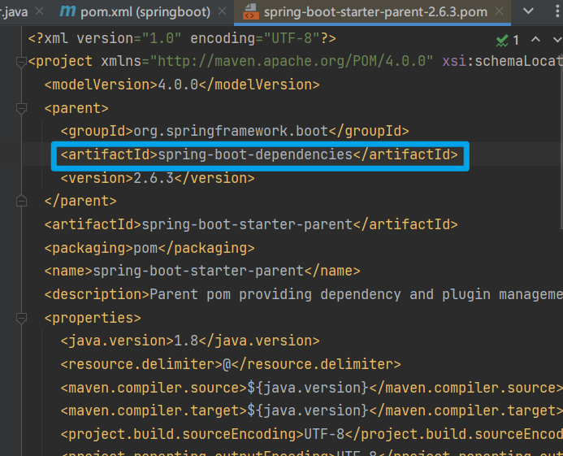
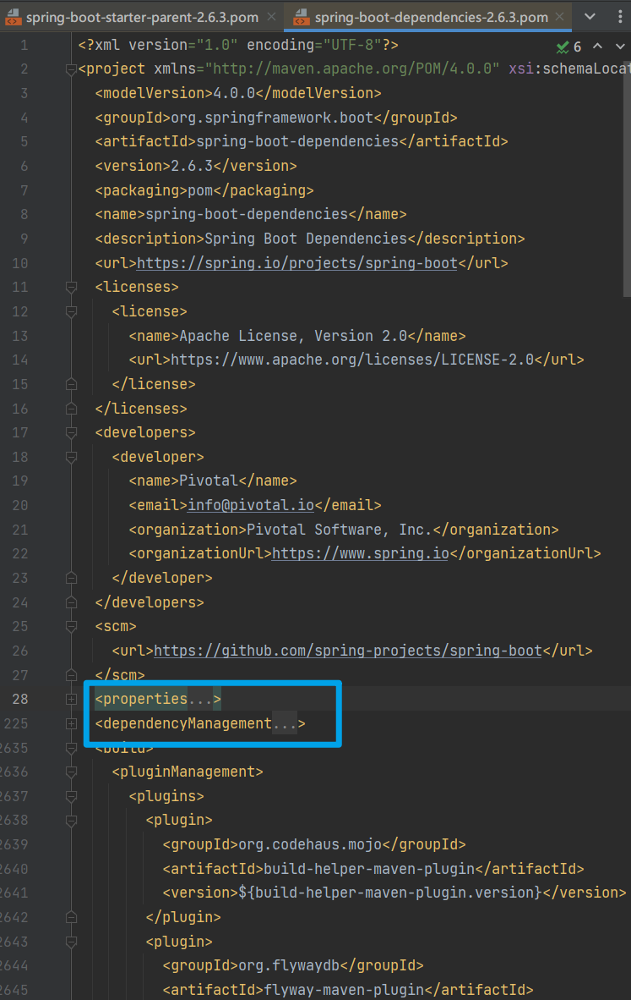
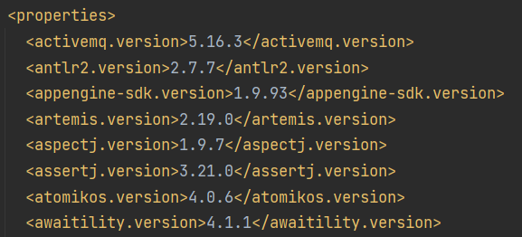
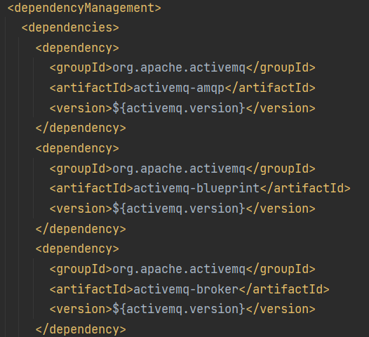
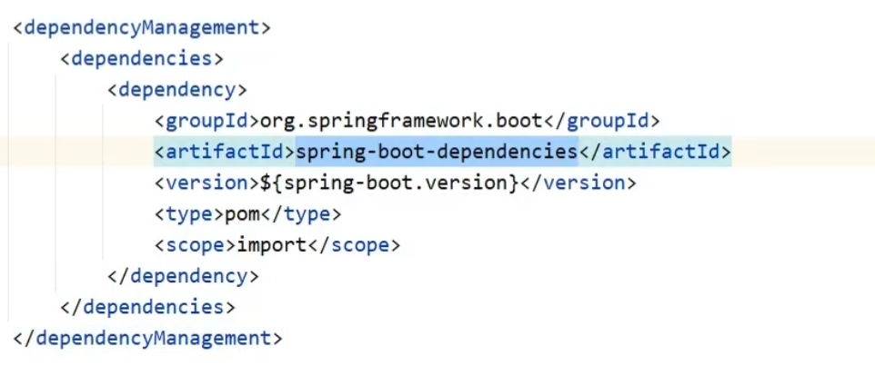
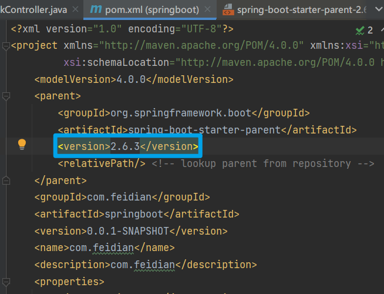

# 添加 Maven 阿里云镜像

在 `maven目录/conf/setting.xml` 中添加镜像坐标

```xml
<mirror>
      <id>nexus-aliyun</id>
      <mirrorOf>central</mirrorOf>
      <name>Nexus aliyun</name>
      <url>http://maven.aliyun.com/nexus/content/groups/public</url>
</mirror>
```

# 使用阿里云创建 SpringBoot 项目



将 `start.spring.io` 改为 `start.aliyun.com`

# SpringBoot 中的 parent & starter

## parent



`CTRL` 点进去可以看到 :




---



通过这里的 `properties` 和 `dependencyManagement` 统一进行版本管理





---

通过阿里云创建的项目会有一点不同

没有继承，而是在 `pom.xml` 文件中直接引用



主要是跟 `Springboot` 的版本有关

### 总结

1. 开发 `SpringBoot` 程序要继承 `spring-boot-starter-parent`
2. `spring-boot-starter-parent` 中定义了若干个依赖管理
3. 继承 `parent` 模块可以避免多个依赖使用相同技术时出现依赖版本冲突
4. 继承 `parent` 的形式也可以采用引入依赖的形式实现效果

> 继承只有一次，用过之后就没有机会了



# 引导类

# 内嵌 tomcat

# RESTful 开发

# Thymeleaf

