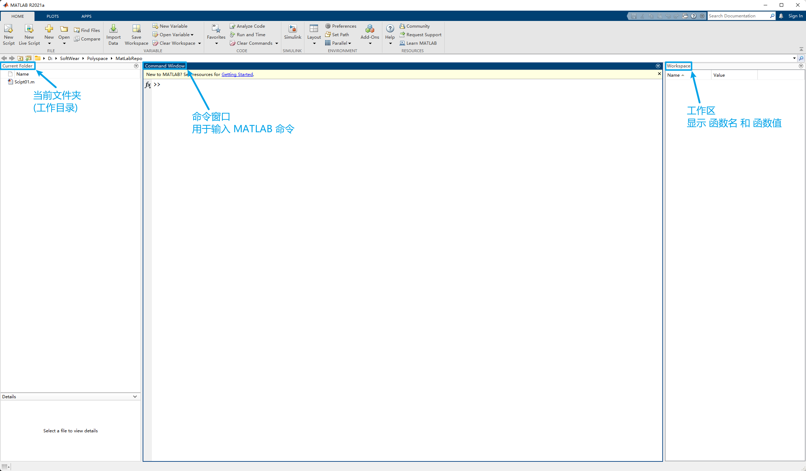
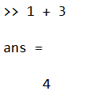

# 01 基本操作与数组输入

## Intro

### 认识 MATLAB 操作界面



可以通过 Layout 选择需要显示的窗口及布局

使用 MATLAB 编程有两种方法

+   命令行 (命令窗口)
+   脚本 (`.m` 文件)

## 像使用计算器一样使用 MATLAB

+   运算符 `+`,`-`,`*`,`/`,`^`

+   计算的结果 以 `ans` 显示

    

+   优先级

    +   同一优先级从左到右
    +   优先级为
        1.   Parenthesis (`()`)
        2.   Power (`^`)
        3.   Multiplication and division (`*`,`/`)
        4.   Addition and subtraction (`+`,`-`)

## Exercise

Calculate:
$$
\begin{aligned}
&\cos \left(\sqrt{\frac{(1+2+3+4)^{3}}{5}}\right) \\
\\
&\sin (\sqrt{\pi})+\ln (\tan (1)) \\
\\
&2^{3.5 \times 1.7} \\
\\
&e^{\sin (10)}
\end{aligned}
$$

## 嵌套函数

```matlab
sin(cos(pi))
```

与下方等价

```matlab
cos(pi)
sin(ans)
```

多行代码 可以合为单行代码执行

>   MATLAB 先计算`cos(pi)` 并将计算结果储存到变量 `ans` 中
>   在计算 `sin(ans)` 时, 与 `sin(cos(pi))` 等价

## 变量

+   变量在赋值前, **不需要**先声明
+   单等号 `=` 是赋值运算符(Assignment Operator)
    +   将等号右边的值 赋值给等号左边
+   大小写敏感
+   变量命名不能以数字开始, 但可以包含数字

### 数据类型

+   `logical`
+   `char`
+   `numeric`
    +   `int8`, `int16`, `int32`, `int64`, `uint8`, `uint16`, `uint32`, `uint64`
    +   `single`
    +   `double`
+   `cell`
+   `struct`

#### `who` 与 `whos`

使用命令 `who` 可以查看当前变量
使用命令 `whos` 可以查看当前变量及其数据类型

```matlab
>> a = 5

a =

     5

>> a * 6

ans =

    30

>> who

Your variables are:

a    ans  

>> whos
  Name      Size            Bytes  Class     Attributes

  a         1x1                 8  double              
  ans       1x1                 8  double  
```

### 特殊变量与常量

+   `ans`
+   `i,j` : complex number
+   `Inf` : $\infty$
+   `eps` : $2.2207e-016$
+   `NaN` : not a number
+   `pi` : $\pi$

```matlab
>> x = 1/0

x =

   Inf

>> x = inf / inf

x =

   NaN
```

以上均是关键字
使用命令 `iskeyword` 显示关键字

```matlab
>> iskeyword

ans =

  20×1 cell array

    {'break'     }
    {'case'      }
    {'catch'     }
    {'classdef'  }
    {'continue'  }
    {'else'      }
    {'elseif'    }
    {'end'       }
    {'for'       }
    {'function'  }
    {'global'    }
    {'if'        }
    {'otherwise' }
    {'parfor'    }
    {'persistent'}
    {'return'    }
    {'spmd'      }
    {'switch'    }
    {'try'       }
    {'while'     }
```

### 标识符查找顺序

1.   Variable 变量
2.   Built-in function 内置函数
3.   Subfunction 子函数
4.   Private function 私有函数
     1.   MEX-file
     2.   P-file
     3.   M-file

例如:

```matlab
>> cos='This String.';
>> cos(8) % 字符向量的第8个元素

ans =

    'r'

>> clear % 清除全部变量
>> cos(8)

ans =

   -0.1455
```

**注意**: 不要使用 内置函数 或 关键字 作为变量名

### 指定数字格式

默认数字格式为 `short` 显示小数点后四位

使用 `format [style]` 指定数字格式

|  Style   |                            Result                            |        Example        |
| :------: | :----------------------------------------------------------: | :-------------------: |
| `short`  | Short, fixed-decimal format with 4 digits after the decimal point. |        3.1416         |
|  `long`  | Long, fixed-decimal format with 15 digits after the decimal point for double values, and 7 digits after the decimal point for single values. |   3.141592653589793   |
| `shortE` | Short scientific notation with 4 digits after the decimal point. |      3.1416e+00       |
| `longE`  | Long scientific notation with 15 digits after the decimal point for double values, and 7 digits after the decimal point for single values. | 3.141592653589793e+00 |
|  `bank`  |    Currency format with 2 digits after the decimal point.    |         3.14          |
|  `hex`   | Hexadecimal representation of a binary double-precision number. |   400921fb54442d18    |
|  `rat`   |        Ratio of small integers. 以有理数形式显示结果         |        355/113        |

## 命令行下使用

观察以下两个命令的不同

```matlab
>> a = 10
>> b = 10;
```

命令后加 `;` 表示不向终端显示结果

与其他终端相同, 使用 $\uparrow$ 快速输入之前的命令

### 一些常用的命令

+   `clc` 清空命令窗口
+   `clear` 清除工作区的所有变量
    +   谨慎使用, 建议只删除不需要的变量 `clear [variable]` 
+   `who` 查看工作区的变量
+   `whos` 查看工作区变量的详细信息

## 数组输入

Array (Vector and Matrix) Input

### 行向量 Row vector

```matlab
>> a = [1 2 3 4]
```

### 列向量 Column vector

```matlab
>> b = [1; 2; 3; 4]
```

---

```matlab
>> a * b

ans =

    30

>> b * a

ans =

     1     2     3     4
     2     4     6     8
     3     6     9    12
     4     8    12    16
```

+   Key in the following matrix in MATLAB

$$
A=
\begin{bmatrix}
1&21&6\\
5&17&9\\
31&2&7
\end{bmatrix}
$$

```matlab
>> A = [1 21 6; 5 17 9; 31 2 7]

A =

     1    21     6
     5    17     9
    31     2     7
```

### 使用下标获取矩阵中的元素

**注意**: 与其他编程语言中不同, MATLAB 中向量的下标从 1 开始

```matlab
>> A = [1 21 6; 5 17 9; 31 2 7]

A =

     1    21     6
     5    17     9
    31     2     7

>> A(8)

ans =

     9

>> A([1 3 5])

ans =

     1    31    17

>> A([1 3; 1 3])

ans =

     1    31
     1    31

>> A(3,2)

ans =

     2

>> A([1 3], [1 3])

ans =

     1     6
    31     7
```

>   观察以上命令运行的结果 可以看出 MATLAB 获取矩阵中元素的方法

+   没有逗号
    +   `A([index])` 从上往下, 从左往右 对元素从 1 开始标号
    +   `A([1 3 5])` 取出下标为 1 3 5 的元素, 结果为数组
    +   `A([1 3; 1 3])` 取出下标为 1 3 的元素 放在矩阵的第一行, 再取出下标为 1 3 的元素 放在矩阵的第二行

---

+   有逗号
    +   `A([row], [column])` 根据(行,列)坐标取出元素
    +   `A([1 3], [1 3])` 取出 ([行 行], [列 列]) 交点上的元素 放入矩阵, 也就是 第 1, 3 行 与 第 1,3 列 交点上的元素

## Exercise

完成以下赋值
$$
A=\left[\begin{array}{ccc}
1 & 21 & 6 \\
5 & 17 & 9 \\
31 & 2 & 7
\end{array}\right] \Longrightarrow\left[\begin{array}{ccc}
1 & 76 & 6 \\
5 & 17 & 9 \\
31 & 0 & 7
\end{array}\right]\Longrightarrow\left[\begin{array}{ccc}
1 & 0 & 0 \\
5 & 0 & 0 \\
31 & 0 & 7
\end{array}\right]\Longrightarrow \left[\begin{array}{lll}
1 & 0 & 0 \\
5 & 0 & 0
\end{array}\right]
$$

>   提示 请先看完下面的冒号运算符
>
>   `A(3,:)`表示选中第三列的全部
>   `A(3,:)=[]`让第三列等于一个空向量, 就是删除第三列

### 冒号运算符

+   如果想要创建这样的数组: $A = \begin{bmatrix}1&2&3&\cdots&100\end{bmatrix}$

+   可以使用冒号运算符(Colon Operator)

+   语法
    $$
    \begin{array}{l}
    j:k&\Longrightarrow&[j,\ j+1,\ j+2,\cdots,\ j+m]\\
    j:i:k&\Longrightarrow&[j,\ j+i,\ j+2i,\cdots,j+m\times i]
    \end{array}
    $$
    `start:length:end` 未指定步长时, 默认步长为 1

$A = \begin{bmatrix}1&2&3&\cdots&100\end{bmatrix}$ 可以使用 `A=[1:100]` 创建

### 矩阵拼接

相同形状的矩阵可以连接在一起

例如:

```matlab
>> A=[1 2; 3 4];
>> B=[9 9; 9 9];
>> F=[A B]

F =

     1     2     9     9
     3     4     9     9

>> F=[A; B]

F =

     1     2
     3     4
     9     9
     9     9
```

### 矩阵运算

+   可以用在矩阵上的运算符 : `+`,`-`,`*`,`/`,`^`,`.`,`'`

对以下矩阵:
$$
A=\left[\begin{array}{lll}
1 & 2 & 3 \\
4 & 5 & 4 \\
9 & 8 & 7
\end{array}\right] \quad B=\left[\begin{array}{lll}
3 & 3 & 3 \\
2 & 4 & 9 \\
1 & 3 & 1
\end{array}\right] \quad a=2
$$
做如下运算:

```matlab
>> A

A =

     1     2     3
     4     5     4
     9     8     7

>> B

B =

     3     3     3
     2     4     9
     1     3     1

>> a

a =

     2

>> A+a

ans =

     3     4     5
     6     7     6
    11    10     9

>> A/a

ans =

    0.5000    1.0000    1.5000
    2.0000    2.5000    2.0000
    4.5000    4.0000    3.5000

>> A./a

ans =

    0.5000    1.0000    1.5000
    2.0000    2.5000    2.0000
    4.5000    4.0000    3.5000

>> A^a

ans =

    36    36    32
    60    65    60
   104   114   108

>> A.^a

ans =

     1     4     9
    16    25    16
    81    64    49

>> A'

ans =

     1     4     9
     2     5     8
     3     4     7

>> A+B

ans =

     4     5     6
     6     9    13
    10    11     8

>> A*B

ans =

    10    20    24
    26    44    61
    50    80   106

>> A.*B

ans =

     3     6     9
     8    20    36
     9    24     7

>> A/B

ans =

    0.0714    0.2857    0.2143
    1.1667         0    0.5000
    3.2619   -0.2857   -0.2143

>> A./B

ans =

    0.3333    0.6667    1.0000
    2.0000    1.2500    0.4444
    9.0000    2.6667    7.0000
```

`.`加上运算符, 表示矩阵对应元素间的运算 而不是矩阵之间的运算
`'`表示对矩阵求转置

注意: 矩阵不能相除, 这里矩阵间的除法运算 与 $A\times B^{-1}$ 的结果大概相等
也就是表示对一个空间, 先进行 $A$ 线性变化, 然后再进行 $B$ 线性变化的逆变化

>   这里涉及到了 线性代数的本质
>   简要概括为:
>
>   +   矩阵
>       +   形式上看, 是一个数表
>       +   本质上是对空间施加线性变化
>       +   对矩阵求逆(`inv()`)之后再相乘, 表示“还原变化”
>   +   行列式
>       +   形式上看, 是一个数
>       +   本质上是经过 行列式对应矩阵 所代表的线性变化后
>           线性空间内图形的 长度(1维)/面积(2维)/体积(3维)/... 变化的倍数
>       +   对矩阵求对应行列式的值: `det()`

### 一些特殊的矩阵

+   `linespace()` : 
+   `eye(n) `: 主对角线上全是 $1$, 其他地方全为 $0$ 的 $n\times n$ 矩阵
+   `zeros(n1,n2)` : $n_1\times n_2$ 零矩阵
+   `ones(n1,n2)` : $n_1\times n_2$ 单位矩阵
+   `diag()` : 输入数组, 会将数组元素放在对角线上, 其他元素全为零
+   `rand()` : 生成随机矩阵

### 矩阵相关的函数

+   `max(A)` 找出 A 矩阵中每一列最大的元素 结果为行向量

    +   嵌套使用可以找出 A 矩阵中最大的元素 `max(max(A))`

+   `min()` 用法与 `max()` 一样

+   `sum(A)` 对 A 每一列的元素求和 结果为行向量

    +   嵌套使用可以得到 A 矩阵中所有元素的和

+   `mean(A)` 对 A 的每一列求平均数 结果为行向量

    +   嵌套使用可以得到 A 矩阵中所有元素的平均值

+   `sort(A)` 对 A 的每一列进行排序, 从上到下递增

    +   是列操作

+   `sortrows(A)` 对 A 的第一列进行排序 同时把对应列所在行也进行移动

    +   例如

        +   ```matlab
            >> A=[1 2 3; 0 5 6; 7 0 9]
            
            A =
            
                 1     2     3
                 0     5     6
                 7     0     9
            
            >> sortrows(A)
            
            ans =
            
                 0     5     6
                 1     2     3
                 7     0     9
            ```

+   `size(A)` 得到 A 矩阵的阶数 结果为两个数 第一个数为行数 第二个数为列数

+   `length(A)` 得到 A 向量的长度

+   `find(A==[num])` 返回 A 矩阵中等于 `[num]` 的元素的下标

