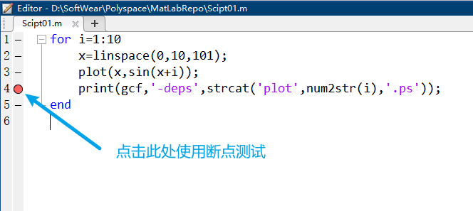
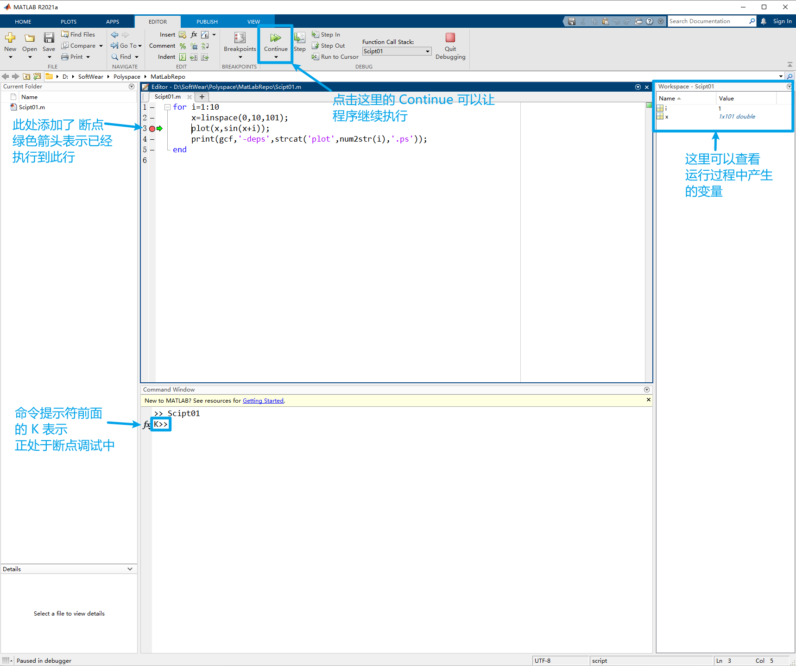
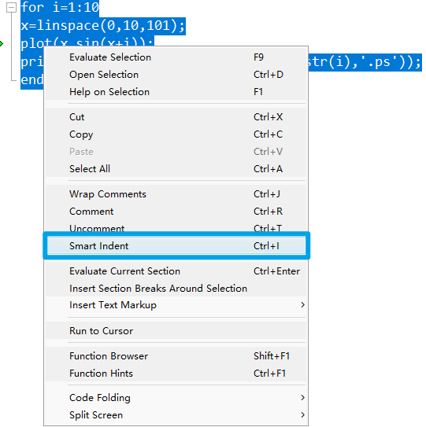
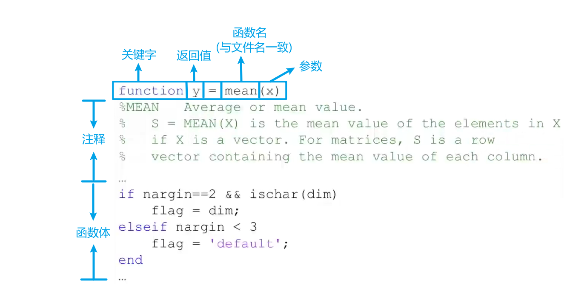

[TOC]

# 02 结构化程序与自定义函数

+   编写脚本
+   结构化编程
+   自定义函数

## 编写脚本

+   A file containing a series of MATLAB commands 
    MATLAB脚本是一个包含一系列MATLAB命令的文件
+   Pretty much like a C/C++ program 
    与 C/C++ 程序类似
+   Scripts need to be saved to a `<file>.m` file before they can be run
    脚本运行前 需要保存为`<file>.m`文件 

>   不需要编译 是解释型语言

### Start UP


---

#### 忘记函数名?


#### 需要调试程序?

+   MATLAB中的注释符号是 `%`
+   如果使用 `%%` 会将代码标记为 `section`(区块) 可以将代码分块运行
+   选中多行后 单击右键 选择 `Comment `可注释多行 快捷键为 `Ctrl + R`

    +   取消注释的快捷键为 `Ctrl + T`

##### 断点调试

单击行号 使用断点 `breakpoint`

+   


关于断点测试

MATLAB 在执行到断点处时, 会暂停执行, 可以对前面已执行部分的变量进行检查



#### 自动缩进

选中需要缩进的代码 点击右键 选择 `smart indent` 可以自动添加缩进



快捷键 : `ctrl + I`

### 结构化编程

使用循环结构, 条件结构 等 使程序更加简洁

+   `if,elseif,else`  条件为真时执行代码块
+   `for` 多次执行代码块
+   `switch,case,otherwise` 分支语句, `otherwise` 相当于 `default`
+   `try,catch` 异常处理
+   `while` 条件为真时重复执行代码块
+   `break` 终止当前(最近的)循环
+   `continue` 跳过当前循环
+   `end` 终止代码块 或 用于标明数组的最后一个下标
+   `pause` 暂停执行
+   `return` 返回到调用函数

#### `if elseif else`

```matlab
if condition1
	statement1
elseif condition2
	statement2
else
	statement3
end
```

>   `elseif` 和 `else` 是可选的

##### 示例程序

```matlab
% 判断奇偶数

a = 3;
if rem(a,2) == 0
	disp('a is even')
else
	disp('a is odd')
end
```

>   `rem(para1, para2)`函数,用于求余数    余数(remainder)
>   第一个参数是除数, 第二个参数是被除数 `rem(para1, para2)`相当于 `para1 % para2`  , 即 `para1` 对 `para2` 求模

#### `switch`

```matlab
switch expression

case value1
	statement1
case value2
	statement2
.
.
.
otherwise
	statement
end
```

>   将`expression` 与 `value` 进行逻辑比较, 如果结果为真, 则执行该分支下的语句
>
>   当 `otherwise` 分支存在时
>   会在所有 `value` 都与 `expression` 不匹配时, 执行`otherwise`分支下的语句
>
>   相当于编程语言中的`default` 
>
>   :heavy_exclamation_mark:注意 与编程语言不同的是
>   MATLAB中的`switch`语句不会出现`case`穿透现象, 不需要加 `break`

##### 示例程序

```matlab
input_num = 1;
switch input_num
case -1
	disp('negative 1');
case 0
	disp('zere');
case 1
	disp('positive 1');
```

#### `while`

```matlab
while expression
	statement
end
```

>   当 `expression` 成立的时候, 执行 `statement` , 直到 `expression` 不成立

##### 示例程序

```matlab
n = 1;
while prod(1:n) < 1e100
	n = n + 1;
end
```

>   `prod()` 表示乘积 (`product`) 
>   `1:n` 表示从1到n的向量
>
>   `prod(1:n)` 表示 `n!` 阶乘
>
>   `e100` 表示 $10^{100}$
>   `1e100`表示 $1\times 10^{100}$

#### `for`

```matlab
for variable=start:increment:ending
	commands
end
```

>   `start` 是起始值, `ending`是结束值
>   `increment`是步长
>
>   `1:10` = [1,2,3,4,...,10]
>   `1:2:10` = [1,3,5,7,9]
>
>   不指定步长时, 默认步长为 1

##### 示例程序

```matlab
for n=1:10
	a(n)=2^n;
end
disp(a)
```

>   上式的 `a` 是一个数组

##### 为变量预分配空间

Pre-allocating Space to Variables

看下面两个示例程序

```matlab
tic
for ii = 1:2000
	for jj = 1:2000
		A(ii,jj) = ii + jj;
	end
end
toc
```

```matlab
tic
A = zeros(2000,2000)
for ii = 1:size(A,1)
	for jj = 1:size(A,2)
		A(ii,jj) = ii + jj
    end
end
toc
```

第一个程序没有预分配空间, 在对A矩阵进行赋值时, 会不断对A进行扩容

第二个程序对A预分配空间, 不需要扩容, 效率更高

>   `tic`开始计时
>   `toc`结束计时
>
>   可以得到运行代码块的时间

### 逻辑运算符

| Operator |         Meaning          |
| :------: | :----------------------: |
|   `<`    |        Less than         |
|   `<=`   |  Less than or equal to   |
|   `>`    |       Greater than       |
|   `>=`   | Greater than or equal to |
|   `==`   |         Equal to         |
|   `~=`   |       Not equal to       |
|   `&&`   |           And            |
|   `|`    |            Or            |

>   以上运算符的运算结果均是 `boolean` 类型

## Tips for Script Writing

+   在脚本的开始处 

    +   使用 `clear all` 先前所有的变量
    +   使用 `close all` 关闭所有的图形

+   在语句的结尾添加分号 `;` 避免不需要的输出

+   使用换行号 `...` 增加程序的可读性

    +   ```matlab
        A = [1 2 3 4 5 6; ...
        	 6 5 4 3 2 1];
        ```

+   遇到错误时(如死循环), 使用`ctrl + c`终止程序的运行

## 函数

### 函数与脚本的区别

+   相同点
    +   脚本和函数都是包含 `MATLAB`命令的 `.m` 文件
    +   需要执行相同操作(routines) 时, 可以编写函数
+   不同点
    +   脚本
        +   没有输入参数与返回参数
        +   Operate on data in the global workspace
            操作全局工作区的数据
    +   函数
        +   (可以)有输入参数与返回参数
        +   Operate on data in the local workspace
            操作局部工作区的数据

### MATLAB的内置函数

```matlab
edit(which('mean.m'))
```

>   `mean` 是计算平均值的函数
>
>   使用:
>   `a[10 16 27 64];`
>   `mean(a)`可计算数组 `a` 的平均值



### 自定义函数

User Define Function

+   写一个可以计算给定初始位置 $x_0$, 初速度 $v_o$, 时间 $t$ 内自由落体的函数:
    $$
    x=x_0+v_0t+\frac{1}{2}gt^2
    $$
    

```matlab
function x = freebody(x0,vO,t)
% calculation of free falling
% 0: initial displacement in m
% vO: initial velocity in m/sec 
% t: the elapsed time in sec
% x: the depth of falling in m 
X = ×0 + v0.*t + 1/2*9.8*t.*t;
```

>   `*`是数字之间直接相乘
>   如果输入向量, 会将两个向量直接相乘
>
>   `.*`是元素之间相乘
>   如果输入向量, 是将向量的对应元素相乘

#### 多个参数与返回值的函数

质点的加速度和受力如下:
$$
\begin{aligned}
a&=\frac{v_2-v_1}{t_2-t_1}\\
F&=ma
\end{aligned}
$$

```matlab
function [a F] = acc(v2,v1,t2,t1,m)
a = (v2-v1)./(t2-t1);
F = m.*a;
```

---

调用以上函数:

```matlab
[Acc Force] = acc(20,10,5,4,1)
```

### Exercise

+   Write a function that asks for a temperature in degrees Fahrenheit 
+   Compute the equivalent temperature in degrees Celsius 
+   Show the converted temperature in degrees Celsius 
+   The function should keep running until no number is provided to convert 
+   You may want to use these functions: `input`,`isempty`,`break`,`disp`,`num2str`

### 函数的默认参数

在没有给出对应参数时, 函数应该使用默认参数进行运算

实现这样的功能, 会用到以下默认变量

+   `inputname ` Variable name of function input 参数名
+   `mfilename ` File name of currently running function 当前函数的文件名
+   `nargin ` Number of function input arguments 参数数量
+   `nargout ` Number of function output arguments 返回值数量
+   `varargin ` Variable length input argument list 参数长度(向量参数)
+   `varargout ` Variable length output argument list  返回值长度(向量返回值)

```matlab
function [volume] = pillar(Do, Di, height)
if nargin==2, % 如果输入的参数只有两个(没有输入 height)
	height=1; % 默认 height 设为 1
end 
volume=abs(Do.*2-Di.^2).*height*pi/4;
```

### Function Handle

创建匿名函数的方法

一个曲线的表达式没必要创建一个 `.m` 文件来储存

```matlab
f = @(x) exp(-2*x); %此行为 Function Handle
x = 0:0.1:2;
plot(x,f(x));
```

可以认为 `f` 是指向后面表达式 `exp(-2*x)` 的一个指针

