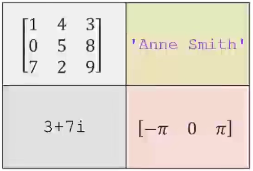
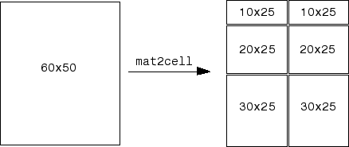
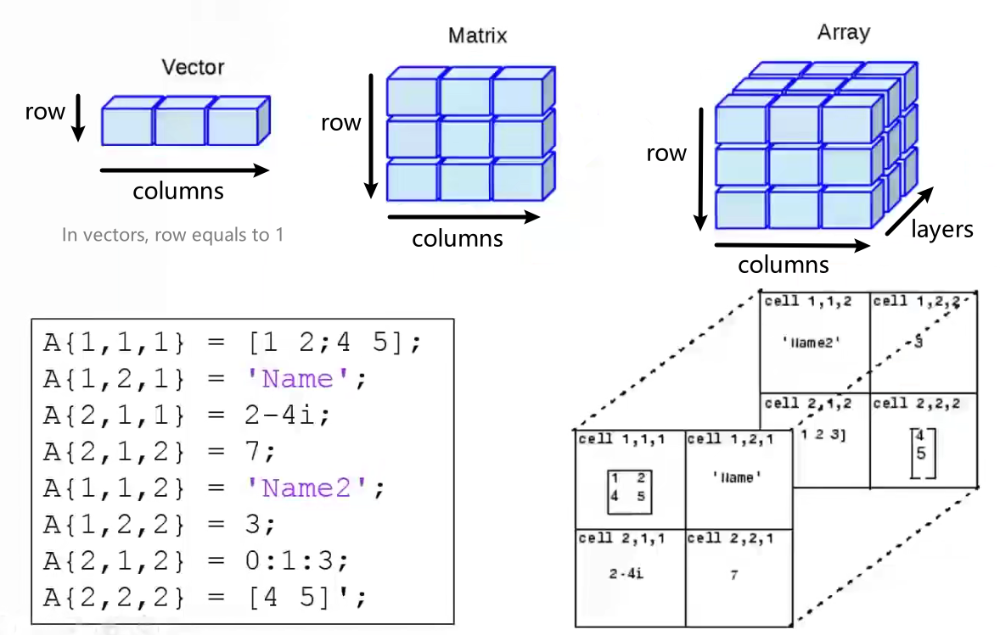
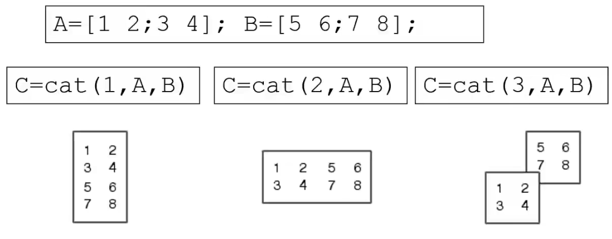
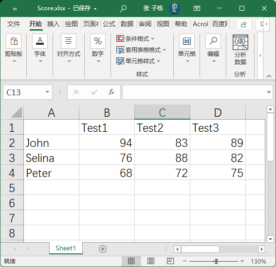
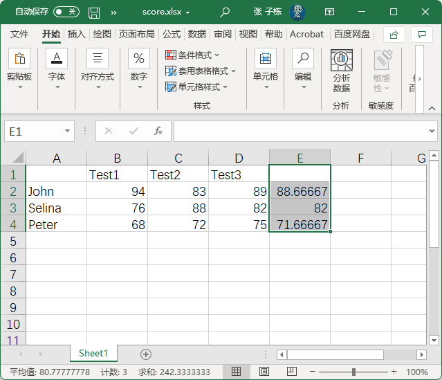
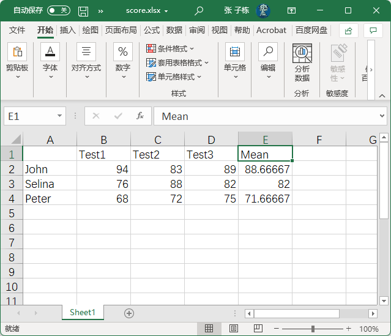

[toc]

# MATLAB 中的数据类型

+   Multidimensional Array
    +   `logical`
    +   `char`
    +   `numeric`
        +   `int8`, `int16`, `int32`, `int64`, `uint8`, `uint16`, `uint32`, `uint64`
    +   `single`
    +   `double`
    +   `cell`
    +   `struct`
+   Scalar
    +   function handle (@)

>   `numeric` 中, `int8` 后面的数字表示 `bit` , `uint8` 中的 `u` 表示 unsigned.

本文主要关注 `char`, `string`, `cell`, `struct`, 也会涉及部分 `function handle`

## 数据类型转换

|    函数     |                作用                |
| :---------: | :--------------------------------: |
| `double ()` |    Convert to double precision     |
| `single ()` |    Convert to single precision     |
|  `int8 ()`  |  Convert to 8-bit signed integer   |
| `int16 ()`  |  Convert to 16-bit signed integer  |
| `int32 ()`  |  Convert to 32-bit signed integer  |
| `int64 ()`  |  Convert to 64-bit signed integer  |
|  `uint8()`  | Convert to 8-bit unsigned integer  |
| `uint16()`  | Convert to 16-bit unsigned integer |
| `uint32()`  | Convert to 32-bit unsigned integer |
| `uint64()`  | Convert to 64-bit unsigned integer |

## `char`

+   `char` 数据类型使用 0 到 255 之间的 ASCII 码表示

+   将字符放入引号内(一般用单引号` '`) 即可对字符d型变量赋值

    +   ```matlab
        >> s1 = 'h'
        
        s1 =
        
            'h'
        
        >> uint8(s1)
        
        ans =
        
          uint8
        % 104 是 h 的 ASCII 码值
           104
        ```

        

## `String`

+   字符数组

    +   `str = 'myString';`

+   字符串连接

    +   ```matlab
        >> str1 = 'Example';
        >> str2 = 'String';
        >> s = [str1 str2]
        
        s =
        
            'ExampleString'
        
        >> s2 = [str1 ; str2]
        Error using vertcat
        Dimensions of arrays being concatenated are not consistent.
        ```

    +   两个字符串的维度不一样, 不能纵向拼接

### 字符逻辑运算

+   多数数字运算符和逻辑运算符都能用在字符串变量上

```matlab
>> str = 'aardvark'

str =

    'aardvark'

>> 'a' == str

ans =

  1×8 logical array

   1   1   0   0   0   1   0   0
```

+   字符替换

```matlab
>> str(str == 'a') = 'Z'

str =

    'ZZrdvZrk'
```

#### Exercise

+   Write a script that inverts any given string
    +   `s1 = 'I like the letter E'`
    +   `s2 = 'E rettel eht ekil I'`

```matlab
str = input('Enter a string: ','s');
invertStr = str(end:-1:1);
disp(invertStr)
```

## `Structure`

结构体 一种可以储存不同类型数据的数据结构

+   创建方式

    +   直接构建

        +   ```matlab
            node(1).name = 'John Doe';
            node(2).name = 'Tim the Cook';
            node(1).age = 31;
            node(2).age = 22;
            ```

    +   使用 `struct` 函数

        +   ```matlab
            node = struct('name', {'John Doe', 'Tim the Cook'}, 'age',{31, 22})
            node(1).name
            ```
        
        +   key - value 对形式, 每两个一对, 在 MATLAB 中, `key` 称为 `field` 

>   当一个变量含有 `.` 时, MATLAB 会自动将这个变量识别为 `struct`

### `struct` functions

|           函数名            |                             作用                             |
| :-------------------------: | :----------------------------------------------------------: |
|        `cell2struct`        | Convert cell array to structure array<br />将元胞数组转换为结构体数组 |
|        `fieldnames`         | Field names of structure, or public fields of object<br />获取结构体的字段名, 或者对象的 public 字段 |
|         `getfield`          |      Field of structure array<br />获取结构体数组的字段      |
|          `isfield`          | Determine whether input is structure array field<br />判断输入是否为结构体数组的一个字段名 |
|         `isstruct`          | Determine whether input is structure array<br />判断输入是否为一个结构体数组 |
|        `orderfields`        | Order fields of structure array<br />对结构体数组的字段名按字母顺序排序 |
| `rmfield(<strcut>,<field>)` |     Remove fields from structure<br />删除结构体中的字段     |
|         `setfield`          | Assign values to structure array field<br />为结构体字段分配值 |
|          `struct`           |          Create structure array<br />创建结构体数组          |
|        `struct2cell`        | Convert structure to cell array<br />将结构体转换为元胞数组  |
|        `struc tfun`         | Apply function to each field of scalar structure<br />对结构体所有字段进行 function 操作 |

### Nesting Structures

`struct` 可以嵌套

## `Cell Array`

元胞数组 一种可以储存不同类型数据的数据结构

与矩阵类似, 但是每个元素可以时不同类型的数据

通过 `{}` 声明

```matlab
>> A(1,1)={[1 4 3; 0 5 8; 7 2 9]};
>> A(1,2) ={'Anne Smith'};
>> A(2,1) ={3+7i};
>> A(2,2)={-pi:pi:pi};
>> A

A =

  2×2 cell array

    {3×3 double        }    {'Anne Smith'      }
    {[3.0000 + 7.0000i]}    {[-3.1416 0 3.1416]}

```



以上数据也可以这样声明:

```matlab
>> A{1,1} = [1 4 3; 0 5 8; 7 2 9];
>> A{1,2} = 'Anne Smith';
>> A{2,1} = 3 + 7i;
>> A{2,2} = -pi:pi:pi;
>> A

A =

  2×2 cell array

    {3×3 double        }    {'Anne Smith'      }
    {[3.0000 + 7.0000i]}    {[-3.1416 0 3.1416]}
```

>   注意花括号的位置

>   MATLAB 如何通过一个变量(结构体或元胞数组)存储不同的数据类型:
>
>   结构体/元胞数组不直接存储数据, 而是存储指向数据的指针. 类似 Java 中的引用数据类型.

### Accessing `Cell Array`

```matlab
>> A(1,1) % 通过圆括号括起来的坐标访问

ans =

  1×1 cell array

    {3×3 double}

>> A{1,1} % 通过花括号括起来的坐标访问

ans =

     1     4     3
     0     5     8
     7     2     9
```

通过花括号与坐标, 直接访问数据, 如果使用圆括号, 访问的是一个元胞数组.

### `num2cell()` & `mat2cell()`

`num2cell()` 将数字转换为元胞数组

`mat2cell()` 将矩阵转换为元胞数组

```matlab
>> a = magic(3)

a =

     8     1     6
     3     5     7
     4     9     2

>> b = num2cell(a)

b =

  3×3 cell array

    {[8]}    {[1]}    {[6]}
    {[3]}    {[5]}    {[7]}
    {[4]}    {[9]}    {[2]}

>> c = mat2cell(a, [1 1 1], 3)

c =

  3×1 cell array

    {[8 1 6]}
    {[3 5 7]}
    {[4 9 2]}
```

>   +   `magic()` 生成魔方矩阵, 其每行, 每列, 对角线上数字之和相等. 该和的值为 $\large\frac{(n^1)!}{n}$ , 其中 $n\geq 3$
>   +   `mat2cell(<matrix>, <row>, <column>)` 
>       +   在上面的示例程序中 [1 1 1], 3, 表示一个列向量与一个行向量相乘, 表示的是生成的元胞数组的形状
>           也就是 $\begin{bmatrix} [1\times3] \\ [1\times3] \\ [1\times3] \end{bmatrix}$
>       +   例如 :`C = mat2cell(A,[10 20 30],[25 25])` ,其中 A 为 $60 \times 50$ 矩阵
>           +   

### Multidimensional Array

多维数组



#### Array concatenation `cat()`

数组拼接函数



>   +   由上图可以看出, `cat()` 函数的第一个参数为拼接方向
>       +   `1` 表示按 row 拼接
>       +   `2` 表示按 column 拼接
>       +   `3` 表示按 layer 拼接
>
>   >   按 row/column 拼接操作也可以直接通过 `[]` 实现 例如 `[A B], [A; B]`

可以先操作 2 维矩阵, 然后使用 `cat()` 函数拼接为三维矩阵

### `reshape()`

可以将 $r_1\times c_1$ 矩阵转换为 $t_2\times c_2$ 矩阵( 要求 $r_1\times c_1 = t_2\times c_2$)

```matlab
>> A={'James Bond', [1 2;3  4; 5 6]; pi, magic(5)}

A =

  2×2 cell array

    {'James Bond'}    {3×2 double}
    {[    3.1416]}    {5×5 double}
 
>> C = reshape(A,1,4)

C =

  1×4 cell array

    {'James Bond'}    {[3.1416]}    {3×2 double}    {5×5 double}
```

>   通过测试此函数, 可以看出, 转换前后元素的下标没有改变

# 访问文件

|     File Content      | Extension |       Description       | Import Function | Export Function |
| :-------------------: | :-------: | :---------------------: | :-------------: | :-------------: |
| MATLAB formatted data |    MAT    | Saved MATLAB workspace  |     `load`      |     `save`      |
|         Text          |           | Space delimited numbers |     `load`      |     `save`      |
|      Spreadsheet      | XLS,XLSX  |          Excel          |    `xlsread`    |   `xlswrite`    |

## `save()`

```matlab
clear;
a = magic()
save myData1.mat
save myData2.mat -ascii
```

>   第二个 `save` 指定了 `encoding in ascii`
>   指定后可以以 plaintext 查看

+   保存单个变量到文件
    +   `save myMatrix.mat A` A 为需要保存的变量
+   保存至指定路径
    +   `save('D:\MATLABrepo\myMatrix.mat','A') `
    +   即 `save('<path>','variableName')`

## `load()`

```matlab
load('mydata1.mat')
load('mydata2.mat','-ascii')
```

>   第二个 `load` 指定了 `decoding in ascii`

## Excel File Reading: `xlsread()`



```matlab
Score = xlsread('score.xlsx')
Score = xlsread('score.xlsx', 'B2:D4') % 指定读取的范围
```

>   不指定范围, 直接读取, 会忽略掉字符串字段

## Excel File Writing: `xlswrite()`

计算成绩平均值并写入 `xlsx` 文件

```matlab
M = mean(Score')'; % mean() 是列操作, 先做转置, 计算平均值之后再转置
xlswrite('score.xlsx', M, 1, 'E2:E4');
```

>   `xlswrite('score.xlsx', M, 1, 'E2:E4');`
>   `xlswrite(<fileName>, <variable>, <sheetNo>, <writeRange>);`

写入结果:



写入字段:

```matlab
xlswrite('score.xlsx', {'Mean'}, 1, 'E1');
```



## Getting Text in Excel Spreadsheet

使用两个变量接受 `xlsx` 表格中的字符串字段

```matlab
>> [Score Header] = xlsread('score.xlsx')

Score =

   94.0000   83.0000   89.0000   88.6667
   76.0000   88.0000   82.0000   82.0000
   68.0000   72.0000   75.0000   71.6667


Header =

  4×5 cell array

    {0×0 char}    {'Test1' }    {'Test2' }    {'Test3' }    {'Mean'  }
    {'John'  }    {0×0 char}    {0×0 char}    {0×0 char}    {0×0 char}
    {'Selina'}    {0×0 char}    {0×0 char}    {0×0 char}    {0×0 char}
    {'Peter' }    {0×0 char}    {0×0 char}    {0×0 char}    {0×0 char}
```

## Low-level File I/O

+   在字节/字符层面读写文件
+   一个文件必须要有 ID `fid`
+   文件中的定位通过可移动的指针实现

### Low-level File I/O Functions

|   函数    |                       作用                        |
| :-------: | :-----------------------------------------------: |
|  `fopen`  | Open file, or obtain information about open files |
| `fclose`  |            Close one or all open files            |
| `fscanf`  |             Read data from text file              |
| `fprintf` |              Write data to text file              |
|  `feof`   |               Test for end-of-file                |

#### Open and close a file

```matlab
fid = fopen('<fileName>', '<permission>'); % 读取文件名, 和文件权限 rwa, 分别为可读可写可访问
status = fclose(fid);
```

#### Writing Sine Values into a File

```matlab
x = 0:pi/10:pi;
y = sin(x);
fid = fopen('sinx.txt', 'w');
for i=1:11
    fprintf(fid,'%5.3f %8.4f\n', x(i), y(i));
end
fclose(fid);
type sinx.txt
```

+   关于读取的格式 `A = fscanf(fid, format, size);`
    +   `A` 是用于存储读取数据的变量
    +   `size` 是读取的数据量
+   关于写入的格式 `fprintf(fid, format, x(i), y(i));`
    +   `x(i)`, `y(i)` 是需要写入的变量, 会写入对应占位符的位置
+   关于 Format Specifier `%5.3f %8.4f\n`  
    +   `%5.3f` 表示 5 位浮点数, 其中, 小数点后有 3 位
    +   `%8.4f` 表示 8 位浮点数, 其中, 小数点后有 4 位

---

+   读取至 `EOF`

```matlab
fid = fopen('asciiData.txt', 'r');
i = 1;
while ~feof(fid)
	name(i,:) = fscanf(fid,'%5c', 1);
	year(i)	  = fscanf(fid,'%d', 1);
    no1(i)	  = fscanf(fid,'%d', 1);
    no2(i)	  = fscanf(fid,'%d', 1);
    no3(i)	  = fscanf(fid,'%g', 1);
    no4(i)	  = fscanf(fid,'%g', 1);
	i = i + 1;
end
fclose(fid);
```

`feof(<fid>)` 返回值是布尔类型, 判断文件是否到达末尾 (EOF)


