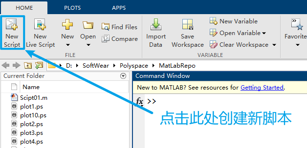
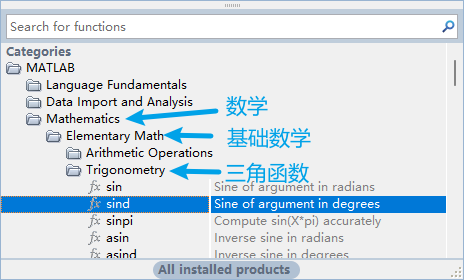

# 02 结构化程序与自定义函数

+   编写脚本
+   结构化编程
+   自定义函数

## 编写脚本

+   A file containing a series of MATLAB commands 
    Matlab脚本是一个包含一系列MATLAB命令的文件
+   Pretty much like a C/C++ program 
    与C/C++程序类似
+   Scripts need to be saved to a `<file>.m` file before they can be run
    脚本运行前 需要保存为`<file>.m`文件 

>   不需要编译 是解释型语言

### StartUP

---

+   忘记函数名?

