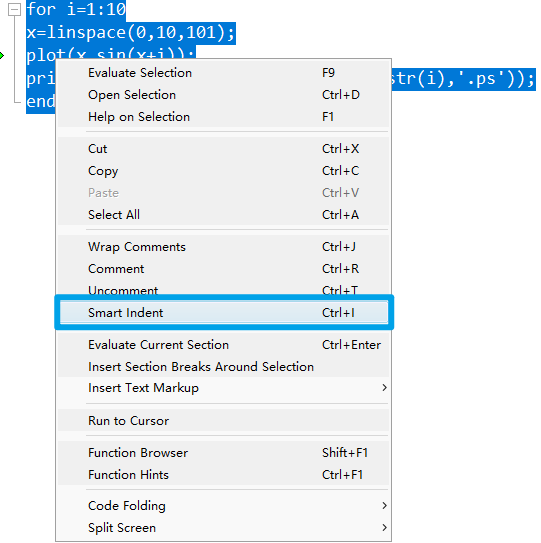

[TOC]

# 02 结构化程序与自定义函数

+   编写脚本
+   结构化编程
+   自定义函数

## 编写脚本

+   A file containing a series of MATLAB commands 
    MATLAB脚本是一个包含一系列MATLAB命令的文件
+   Pretty much like a C/C++ program 
    与 C/C++ 程序类似
+   Scripts need to be saved to a `<file>.m` file before they can be run
    脚本运行前 需要保存为`<file>.m`文件 

>   不需要编译 是解释型语言

### Start UP


---

#### 忘记函数名?


#### 需要调试程序?

+   MATLAB中的注释符号是 `%`
+   如果使用 `%%` 会将代码标记为 `section`(区块) 可以将代码分块运行
+   选中多行后 单击右键 选择 `Comment `可注释多行 快捷键为 `Ctrl + R`

    +   取消注释的快捷键为 `Ctrl + T`

##### 断点调试

单击行号 使用断点 `breakpoint`

+   


关于断点测试

MATLAB 在执行到断点处时, 会暂停执行, 可以对前面已执行部分的变量进行检查


#### 自动缩进

选中需要缩进的代码 点击右键 选择 `smart indent` 可以自动添加缩进



快捷键 : `ctrl + I`

### 结构化编程

使用循环结构, 条件结构 等 使程序更加简洁

+   `if,elseif,else`  条件为真时执行代码块
+   `for` 多次执行代码块
+   `switch,case,otherwise` 分支语句, `otherwise` 相当于 `default`
+   `try,catch` 异常处理
+   `while` 条件为真时重复执行代码块
+   `break` 终止当前(最近的)循环
+   `continue` 跳过当前循环
+   `end` 终止代码块 或 用于标明数组的最后一个下标
+   `pause` 暂停执行
+   `return` 返回到调用函数

#### `if elseif else`

```matlab
if condition1
	statement1
elseif condition2
	statement2
else
	statement3
end
```

>   `elseif` 和 `else` 是可选的

##### 示例程序

```matlab
% 判断奇偶数

a = 3;
if rem(a,2) == 0
	disp('a is even')
else
	disp('a is odd')
end
```

>   `rem(para1, para2)`函数,用于求余数    余数(remainder)
>   第一个参数是除数, 第二个参数是被除数 `rem(para1, para2)`相当于 `para1 % para2`  , 即 `para1` 对 `para2` 求模

#### `switch`

```matlab
switch expression

case value1
	statement1
case value2
	statement2
.
.
.
otherwise
	statement
end
```

>   将`expression` 与 `value` 进行逻辑比较, 如果结果为真, 则执行该分支下的语句
>
>   当 `otherwise` 分支存在时
>   会在所有 `value` 都与 `expression` 不匹配时, 执行`otherwise`分支下的语句
>
>   相当于编程语言中的`default` 

##### 示例程序

```matlab
input_num = 1;
switch input_num
case -1
	disp('negative 1');
case 0
	disp('zere');
case 1
	disp('positive 1');
```


### 逻辑运算符

| Operator |         Meaning          |
| :------: | :----------------------: |
|   `<`    |        Less than         |
|   `<=`   |  Less than or equal to   |
|   `>`    |       Greater than       |
|   `>=`   | Greater than or equal to |
|   `==`   |         Equal to         |
|   `~=`   |       Not equal to       |
|   `&&`   |           And            |
|   `|`    |            Or            |

>   以上运算符的运算结果均是 `boolean` 类型

