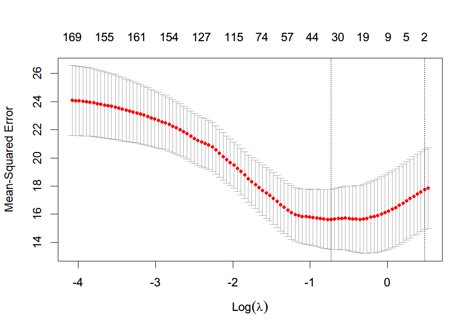

# 实验报告

>   生信 2001 张子栋 2020317210101

GitHub: [MarkdownNotes/R_Source.md at main · Bluuur/MarkdownNotes (github.com)](https://github.com/Bluuur/MarkdownNotes/blob/main/MathBasisForBioinformatics/Calculus/R_Source.md)

## 实验背景

使用 R, 预测水稻群体表型中的 `yd`

## 实验数据

水稻群体的基因型数据 `G.Rdata`

水稻表型 `RIL.Phe.Rdata`

## 实验流程

```R

R version 4.1.1 (2021-08-10) -- "Kick Things"
Copyright (C) 2021 The R Foundation for Statistical Computing
Platform: x86_64-w64-mingw32/x64 (64-bit)

R is free software and comes with ABSOLUTELY NO WARRANTY.
You are welcome to redistribute it under certain conditions.
Type 'license()' or 'licence()' for distribution details.

R is a collaborative project with many contributors.
Type 'contributors()' for more information and
'citation()' on how to cite R or R packages in publications.

Type 'demo()' for some demos, 'help()' for on-line help, or
'help.start()' for an HTML browser interface to help.
Type 'q()' to quit R.

[Workspace loaded from D:/program/R_Repo/.RData]

> load("G.Rdata")
> load("RIL.Phe.Rdata") # 载入 水稻基因型数据和表型数据
> str(G) # 查看结构
 int [1:210, 1:1619] 0 1 1 1 0 1 0 0 1 1 ...
 - attr(*, "dimnames")=List of 2
  ..$ : chr [1:210] "R001" "R002" "R003" "R004" ...
  ..$ : chr [1:1619] "Bin1" "Bin2" "Bin3" "Bin4" ...
> str(RIL.Phe)
 num [1:210, 1:8] 5 8 5 9 1 2 1 7 1 7 ...
 - attr(*, "dimnames")=List of 2
  ..$ : chr [1:210] "R001" "R002" "R003" "R004" ...
  ..$ : chr [1:8] "foldid10" "yd" "tp" "gn" ...
> x = G
> y = RIL.Phe[,2]
> library(ISLR)

载入程辑包：‘ISLR’
> set.seed(1) # 设置种子抽样, 保证可重复性
> train<-sample(1:nrow(x),nrow(x)/2) # 一半用于训练模型, 一半用于预测
> test <- (-train)
> x.train <- x[train,]
> x.test <- x[test,]
> dim(x.train)
[1]  105 1618
> dim(x.test)
[1]  105 1618
> y.train <- y[train]
> y.test <- y[test]
> length(y.train)
[1] 105
> length(y.test)
[1] 105
> library(glmnet)
载入需要的程辑包：Matrix
Loaded glmnet 4.1-2
> library(Matrix)
> grid <- 10^seq(10,-2,length = 100)
> str(grid)
 num [1:100] 1.00e+10 7.56e+09 5.72e+09 4.33e+09 3.27e+09 ...
> LASSO.model <- glmnet(x.train,y.train,lambda = grid)
> str(LASSO.model)
List of 12
 $ a0       : Named num [1:100] 25.8 25.8 25.8 25.8 25.8 ...
  ..- attr(*, "names")= chr [1:100] "s0" "s1" "s2" "s3" ...
 $ beta     :Formal class 'dgCMatrix' [package "Matrix"] with 6 slots
  .. ..@ i       : int [1:1826] 160 179 188 189 160 174 179 188 189 1138 ...
  .. ..@ p       : int [1:101] 0 0 0 0 0 0 0 0 0 0 ...
  .. ..@ Dim     : int [1:2] 1618 100
  .. ..@ Dimnames:List of 2
  .. .. ..$ : chr [1:1618] "Bin2" "Bin3" "Bin4" "Bin5" ...
  .. .. ..$ : chr [1:100] "s0" "s1" "s2" "s3" ...
  .. ..@ x       : num [1:1826] 0.23079 0.00341 0.04531 0.16726 0.58198 ...
  .. ..@ factors : list()
 $ df       : int [1:100] 0 0 0 0 0 0 0 0 0 0 ...
 $ dim      : int [1:2] 1618 100
 $ lambda   : num [1:100] 1.00e+10 7.56e+09 5.72e+09 4.33e+09 3.27e+09 ...
 $ dev.ratio: num [1:100] 0 0 0 0 0 0 0 0 0 0 ...
 $ nulldev  : num 1848
 $ npasses  : int 1587
 $ jerr     : int 0
 $ offset   : logi FALSE
 $ call     : language glmnet(x = x.train, y = y.train, lambda = grid)
 $ nobs     : int 105
 - attr(*, "class")= chr [1:2] "elnet" "glmnet"
> cv.LASSO.model <- cv.glmnet(x.train,y.train)
> str(cv.LASSO.model)
List of 12
 $ lambda    : num [1:100] 1.69 1.61 1.54 1.47 1.4 ...
 $ cvm       : num [1:100] 17.9 17.8 17.6 17.4 17.3 ...
 $ cvsd      : num [1:100] 2.87 2.87 2.85 2.83 2.81 ...
 $ cvup      : num [1:100] 20.7 20.6 20.4 20.3 20.1 ...
 $ cvlo      : num [1:100] 15 14.9 14.7 14.6 14.5 ...
 $ nzero     : Named int [1:100] 0 2 3 4 4 4 5 6 7 7 ...
  ..- attr(*, "names")= chr [1:100] "s0" "s1" "s2" "s3" ...
 $ call      : language cv.glmnet(x = x.train, y = y.train)
 $ name      : Named chr "Mean-Squared Error"
  ..- attr(*, "names")= chr "mse"
 $ glmnet.fit:List of 12
  ..$ a0       : Named num [1:100] 25.8 25.7 25.6 25.5 25.4 ...
  .. ..- attr(*, "names")= chr [1:100] "s0" "s1" "s2" "s3" ...
  ..$ beta     :Formal class 'dgCMatrix' [package "Matrix"] with 6 slots
  .. .. ..@ i       : int [1:8994] 160 189 160 188 189 160 179 188 189 160 ...
  .. .. ..@ p       : int [1:101] 0 0 2 5 9 13 17 22 28 35 ...
  .. .. ..@ Dim     : int [1:2] 1618 100
  .. .. ..@ Dimnames:List of 2
  .. .. .. ..$ : chr [1:1618] "Bin2" "Bin3" "Bin4" "Bin5" ...
  .. .. .. ..$ : chr [1:100] "s0" "s1" "s2" "s3" ...
  .. .. ..@ x       : num [1:8994] 0.1092 0.0879 0.2057 0.0339 0.1531 ...
  .. .. ..@ factors : list()
  ..$ df       : int [1:100] 0 2 3 4 4 4 5 6 7 7 ...
  ..$ dim      : int [1:2] 1618 100
  ..$ lambda   : num [1:100] 1.69 1.61 1.54 1.47 1.4 ...
  ..$ dev.ratio: num [1:100] 0 0.0185 0.036 0.0521 0.0668 ...
  ..$ nulldev  : num 1848
  ..$ npasses  : int 2182
  ..$ jerr     : int 0
  ..$ offset   : logi FALSE
  ..$ call     : language glmnet(x = x.train, y = y.train)
  ..$ nobs     : int 105
  ..- attr(*, "class")= chr [1:2] "elnet" "glmnet"
 $ lambda.min: num 0.481
 $ lambda.1se: num 1.61
 $ index     : int [1:2, 1] 28 2
  ..- attr(*, "dimnames")=List of 2
  .. ..$ : chr [1:2] "min" "1se"
  .. ..$ : chr "Lambda"
 - attr(*, "class")= chr "cv.glmnet"
> plot(cv.LASSO.model)
> cv.LASSO.model$lambda.min
[1] 0.4813705
> log(cv.LASSO.model$lambda.min)
[1] -0.7311179
```


