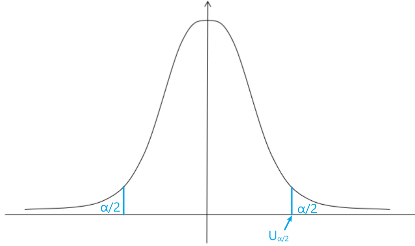
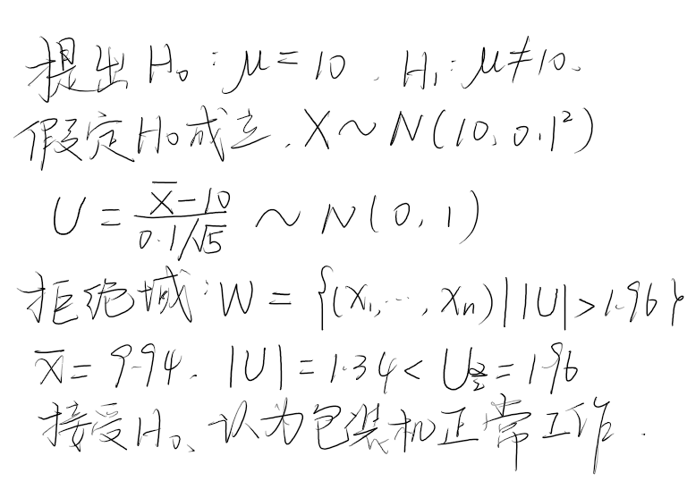
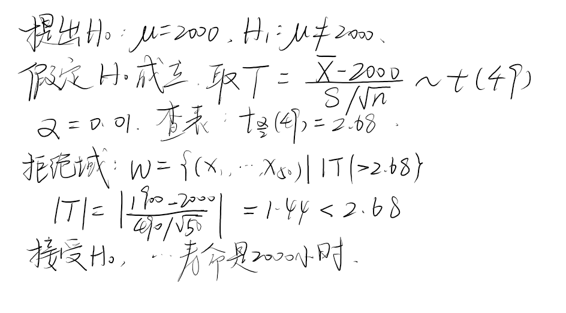
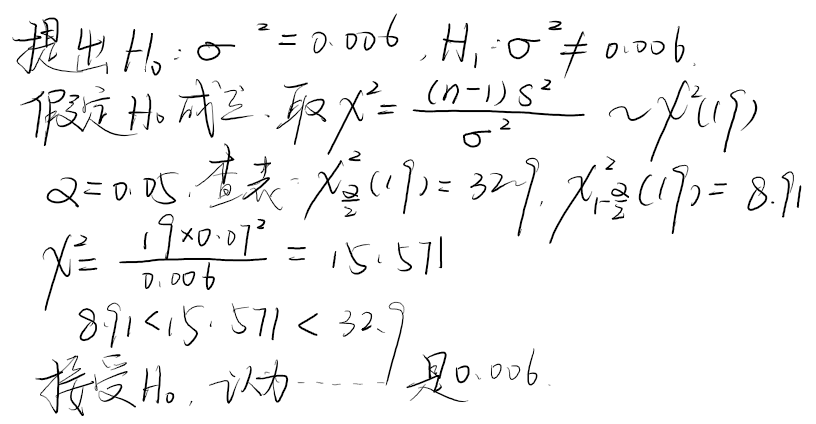
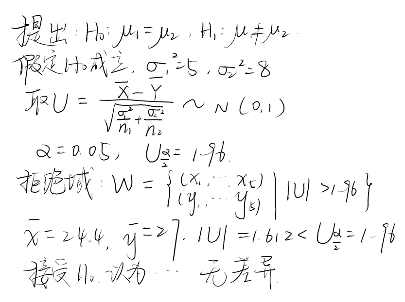
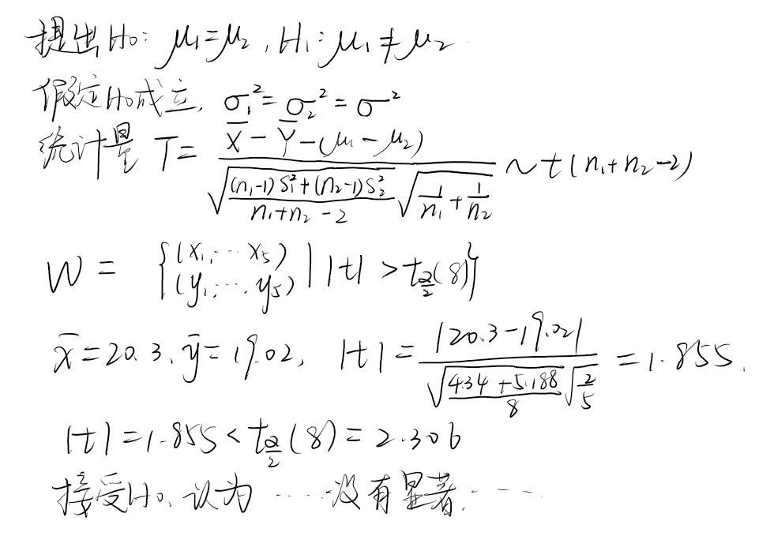
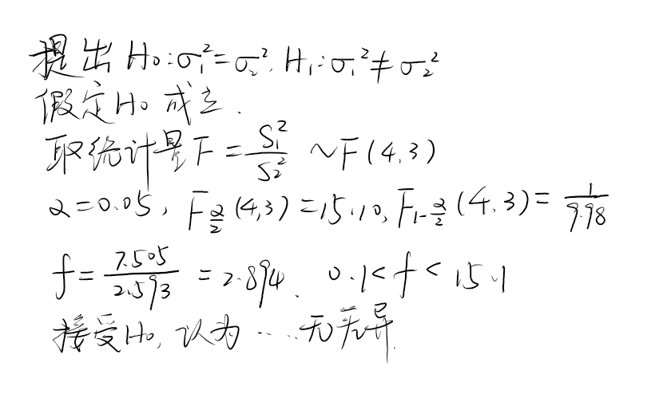

# 概率论与数理统计提高:bookmark:

# Table of Contents

[TOC]

# 知识点回顾

## 小概率原理

### 小概率事件

统计学上一般把 $P\leq0.05$ 或 $P\leq0.01$ 的事件称为小概率事件

### 小概率原理

小概率事件在一次试验中几乎不可能发生. 利用该原理可对科研资料进行假设检验. 

## 大数定律与中心极限定理

研究大量的随机现象，常常采用极限形式， 由此导致对极限定理进行研究.

极限定理最重要的有两种:

+ 大数定理
+ 中心极限定理

### 大数定理

大量重复试验的平均结果的稳定性

>   平均结果: 期望

+ 定理1:当样本无限地增大，事件发生的频率将与概率趋于一致。
+ 定理2:无穷多个独立地随机变量(样本值),如果具有相同的数学期望时,则这些变量(来自同一总体)的平均数将趋近于它们的数学期望.

>   作用：建立了频率与概率之间的统计关系，使得我们能够把概率论的原理应用于统计学的基础。

#### 切比雪夫不等式

对于 $\mathrm{r.v.}\ X, EX$ 和 $DX$ 存在, 则 $\forall\varepsilon>0$ 都有:
$$
P\left( \left| X-EX\right|\geq\varepsilon\right)\leq\frac{DX}{\varepsilon^2}
$$

>   $\varepsilon$是任意正数
>   $\left| X-EX\right|$ 是变量到期望的距离
> 
>   不等式左边是随机变量落在{期望附近区域(由 $\varepsilon$ 划分)}的概率
>   右边表示方差与这个区域相对大的比值
>   也就是说, 这个区域越大, 落在区域外的概率绝对会越小( 小于 $\frac{DX}{\varepsilon^2}$ )
> 
>   *不等式右边分子是 $\varepsilon^2$ 的原因是为了保证量纲和谐, 因为方差的量纲也有平方

#### 切比雪夫大数定律

---

关于收敛与依概率收敛:

**收敛**: $a_n\to a, \forall \varepsilon > 0 , \exist N>0, \text{when}\ n>N,|a_n-a|<\varepsilon$

>   存在某一项其后的**全部项**落在以 $\varepsilon$ 为半径的区域内

**依概率收敛**: $x_n \stackrel{P}{\to} a$
$$
\lim_{n\to \infty}P \left \{ |X_n - a| < \varepsilon \right \} = 1
$$

>   依概率收敛允许有不落在范围内的
>   收敛比依概率收敛更严格

$$

$$

---

设随机变量 $X_1,X_2,\cdots,X_n$ **相互独立, 服从同一分布**(独立同分布), 设 $X_i=\begin{cases}1\quad 发生\\0\quad 不发生\end{cases}$ , 则:
$$
\begin{aligned}
&期望:EX_i = P\\
&方差:DX_i=P(1-P)\\
&发生次数:m_n=\sum\limits_{i=1}^nX_i\\
&频率:\frac{m_n}{n}=\frac{1}{n}\sum\limits_{i=1}^nX_i\\
&概率:P=E\left(\frac{1}{n}\sum\limits_{i=1}^nX_i\right)\\
&\qquad\ \quad=\frac{1}{n}\sum\limits_{i=1}^nEX_i\\
\\
&有:\\
&\lim_{n\to \infty}P \left\{ \left| \frac{1}{n}\sum_{i=1}^{n}X_i-\frac{1}{n}\sum_{i=1}^{n}EX_i \right|<\varepsilon \right \}=1
\end{aligned}
$$

> **频率依概率收敛于概率**

---

##### 定义

对于 $X_1,X_2,\cdots,X_n$ 这 $n$ 个**不相关的变量**, $EX_i$ (每个变量的期望)和 $DX_i$ (每个变量的方差)都存在, 方差有界, $DX_i\leq M,\forall \varepsilon>0$
$$
\lim_{n\to \infty}P \left\{ \left| \frac{1}{n}\sum_{i=1}^{n}X_i-\frac{1}{n}\sum_{i=1}^{n}EX_i \right|<\varepsilon \right \}=1
$$

>   注意: 切比雪夫大数定律没有要求这些变量独立同分布
> 
>   均值: $\frac{1}{n}\sum\limits_{i=1}^{n}X_i$
> 
>   期望的均值: $\frac{1}{n}\sum\limits_{i=1}^{n}EX_i$
> 
>   **均值依概率收敛于期望的均值**

#### 切比雪夫($Chebyshev$)定理的特殊情况 (推论)

设随机变量 $X_1,X_2,\cdots,X_n$ 独立同分布, 且具有相同的数学期望和方差$E(X_k)=\mu,D(X_k)=\sigma^2,(k=1,2,\cdots),$ 做前 $n$ 个随机变量的算数平均 $Y_{n}=\frac{1}{n} \sum\limits_{k=1}^{n} X_{k}$, 则对于任意整数 $\varepsilon$, 有:
$$
\begin{aligned}
&\lim _{n \rightarrow \infty} P\left\{\left|Y_{n}-\mu\right|<\varepsilon\right\} \\
=&\lim _{n \rightarrow \infty} P\left\{\left|\frac{1}{n} \sum_{k=1}^{n} X_{k}-\mu\right|<\varepsilon\right\}\\=&1
\end{aligned}
$$

#### 伯努利大数定理

设 $\mu_n$ 是 $n$ 重伯努利试验中事件 $A$ 发生的次数, 每次试验中 $A$ 发生的概率为 $p(0<p<1)$, 则对任意 $\varepsilon>0,$ 有:

>   伯努利试验服从二项分布

$$
\lim _{n \rightarrow \infty} P\left\{\left|\frac{\mu_{n}}{n}-p\right|>\varepsilon\right\}=0
$$

即:
$$
\frac{\mu_{n}}{n} \stackrel{P}{\longrightarrow} p
$$

>   注:当$n$很大时,事件发生的频率会「靠近」其概率.
>   当 $n$ 趋于 无穷 时, 事件的频率 会 依概率收敛 于 事件的概率
> 
>   「靠近」指的是依概率收敛

#### 辛钦大数定理

>   独立同分布 $independently\ identically\ distribution\quad i.i.d.$

设随机变量 $X_1,X_2,\cdots,X_n$ **相互独立, 服从同一分布**(独立同分布), 且具有相同的数学期望 (对方差无要求) $E(X_k)=\mu(k=1,2,\cdots)$ ,则对于任意 $\varepsilon>0$ 有:
$$
\lim _{n \rightarrow \infty} P\left\{\left|\frac{1}{n} \sum_{k=1}^{n} X_{k}-\mu\right|<\varepsilon\right\}=1
$$

>   说明: 伯努利大数定理是辛钦定理的特殊情况. $n$ 个随机变量的算术平均值以概率收敛于算术平均值的数学期望.
> 
>   **均值依概率收敛于期望**
> 
>   多次测量取平均值可以减小误差(接近真实值(期望))

---

以上三个大数定律条件越来越弱, 证明越来越困难

## 中心极限定理

现象是受大量相互独立的因素影响的

大量独立同分布的变量和的极限分布是正态分布

### 独立同分布情形的中心极限定理

设随机变量序列 $\{X_n,n\geq1\}$ 满足:

+ 相互独立
+ 同分布
+ 期望 $EX_n=\mu$ 和方差 $DX_n=\sigma^2(0<\sigma^2<+\infty)$ 都存在

对于任意的$x\in R$,有
$$
\large \lim_{x\to \infty}P\left(\frac{\sum\limits_{i=1}^{n}-n\mu}{\sqrt{n}~\sigma}\leq x\right)=\frac{1}{\sqrt{2\pi}}\int_{-\infty}^{x}e^{-\frac{t^2}{2}}\mathrm{d}t=\Phi(x)
$$
设$\xi\sim N(0,1),$则上式可重新写成
$$
\large \lim _{n \rightarrow \infty} P\left(\frac{\sum\limits_{i=1}^{n} X_{i}-n \mu}{\sqrt{n} \sigma} \leq x\right)=P(\xi \leq x)
$$
也就是说,当 $n\to\infty$ 时$,\Large \mathrm{r.v.}\frac{\sum\limits_{i=1}^{n} X_{i}-n \mu}{\sqrt{n} \sigma}$与标准正态 $\mathrm{r.v.}\ \xi$ 所起的作用越来越相当, 于是我们称$\Large \frac{\sum\limits_{i=1}^{n} X_{i}-n \mu}{\sqrt{n} \sigma}$**渐进标准正态**

> ### 正态分布 
> 
> $$
> \varphi(x)=\frac{1}{\sqrt{2 \pi} \sigma} e^{\Large-\frac{(x-\mu)^{2}}{2 \sigma^{2}}}\qquad -\infty<x<+\infty
> $$
> 
> 消去 $\sigma,\mu$ 时就是标准正态分布, 也就是 $\sigma = 1, \mu= 0$ , $\sigma$ 是期望, $\mu$ 是标准差
> $$
> \varphi_{0}(x)=\frac{1}{\sqrt{2 \pi}} e^{-\frac{x^{2}}{2}}
> $$
> 
> ---
> 
> 正态分布标准化:
> 
> 概率密度函数:
> $$
> \varphi(x)=\frac{1}{\sigma} \varphi_{0}\left(\frac{x-\mu}{\sigma}\right)
> $$
> 概率分布:
> $$
> \Phi(x)=\Phi_{0}\left(\frac{x{-\mu}}{\sigma}\right)
> $$
> 
> ---
> 
> ### 均匀分布
> 
> $X\sim U(a,b)$
> $$
> f(x)=\left\{\begin{array}{cc}
> \frac{1}{b-a} & a \leqslant x \leqslant b \\
> 0 & \text { Other }
> \end{array}\right.
> $$
> 
> >   区间上的积分为1
> 
> $$
> EX=\frac{b+a}{2}\quad DX=\frac{(b-a)^2}{12}
> $$
> 
> ---
> 
> ### 指数分布
> 
> $$
> f(x)=\left\{\begin{array}{cc}
\lambda e^{-\lambda x} & x>0 \\
0  & x \leqslant 0
\end{array}\right.
> $$
> 
> >   $\lambda>0  \quad X \sim \operatorname{Exp}(\lambda)$
> 
> $$
> EX=\frac{1}{\lambda}\quad DX=\frac{1}{\lambda^2}
> $$
> 
> > 无记忆性 寿命
> > 自身的每一部分都与自身相似
> 
> ---
> 
> ### 泊松分布
> 
> $$
> P\{x=k\}=\frac{\lambda^{k}}{k !} e^{-\lambda} \quad k=0,1,2,3\cdots
> $$
> 
> 电话台呼叫次数,公共设施(等车,收银台...)使用次数
> $$
> EX=\lambda\quad DX=\lambda
> $$
> 
> >   二项分布可以使用泊松分布近似
> > 
> >   $\lambda = np$

#### 独立同分布中心极限定理的应用

**每日有顾客 $100$ 人, 消费金额 $[0,60]$, 每个人的购买金额之间相互独立, 求日销售额超过 $3500$ 元的概率**

解:
$$
\begin{aligned}
&设第~i~人购买金额为~X_i\\
EX_i&=30\quad DX_i=\frac{60^2}{12}=300\\
&即求\sum_{i=1}^{100}X_i>3500\\
&\frac{\sum X_i-3000}{100\sqrt{3}}\sim N(0,1)\\
P\left( \sum X_i>3500 \right)&=1-P\left( \sum X_i\leq3500 \right)\\
&=1-P\left(\frac{\sum X_i-3000}{100\sqrt{3}}\leq\frac{3500-3000}{100\sqrt{3}}\right )\\&=1-\Phi_0(2.887)\\
&=0.002
\end{aligned}
$$

> + 一般解题步骤
>   + 求期望与方差
>   + 标准化
>   + 求正态分布

### De Moivre - Laplace 中心极限定理

是独立同分布中心极限定理的特例

随机变量 $Y\sim B(n,p)$ (服从二项分布)
$$
\lim _{n \rightarrow \infty} P\left(\frac{Y_{n}-n p}{\sqrt{n p(1-p)}} \leqslant x\right)=\Phi_{0}(x)
$$

> $$
> Y_n=\sum_{i=1}^{n}X_i\quad X_i=\begin{cases}1,\quad 发生\\0,\quad未发生\end{cases}
> $$

> $EX_i=p\quad DX_i=p(1-p)$

用正态分布近似二项分布, 因为二项分布计算麻烦

---

应用:

**保险, 每人死亡概率为 $0.005$, 共 $10000$ 人投保, 求死亡人数不超过 $70$ 人的概率**
$$
\begin{aligned}
&解: 设死亡人数为X\\
P(X\leq70)&=\sum_{k=0}^{70}C_{10000}^k\cdot0.005^k\cdot0.995^{10000-k}\\
&使用正态分布近似:\\
P(X\leq70)&=P\left(\frac{X-np}{\sqrt{np(1-p)}}\leq\frac{70-np}{\sqrt{np(1-p)}}\right)\\
&=\Phi_0(2.84)\\
&=0.9977
\end{aligned}
$$
如果需要计算死亡 $k$ 人概率:
$$
\begin{aligned}
P(X=k)&=P(k-\frac{1}{2}<X<k+\frac{1}{2})\\
&=P\left( \frac{k-\frac{1}{2}-np}{\sqrt{np(1-p)} } < \frac{X-np}{\sqrt{np(1-p)}} < \frac{k+\frac{1}{2}-np}{\sqrt{np(1-p)} } \right)\\
&=\Phi_0\left( \frac{k+\frac{1}{2}-np}{\sqrt{np(1-p)} } \right) - \Phi_0\left(\frac{k-\frac{1}{2}-np}{\sqrt{np(1-p)} }\right)
\end{aligned}
$$

> 关于二项分布的近似
> 
> + $n$ 大, $np$ 大小适中(小于 $10$)      使用泊松分布近似
> + $n$ 大, $np$ 也很大      使用正态分布近似

# 样本及抽样分布

## 总体

研究对象的全体

> 总体是一个带有确定概率分布的随机变量

## 样本

抽自总体的若干个体

### 样本容量

样本中个体的个数

## 简单随机样本

样本 $X_1,\cdots,X_n$ 满足:

+ 它们相互独立
+ 它们与总体具有相同分布

则称 $X_1,\cdots,X_n$ 为简单随机样本. 它们的观测值记为 $x_1,\cdots,x_n$, 称为样本值

### 特点

独立, 同分布(具有代表性, 代表总体)

### 获取方式

有放回抽样

> 统计是从手中已有的资料(样本观察值), 去推断总体的情况(总体分布)

## 样本的联合分布

样本 $X_1,\cdots,X_n$ 是一个 $n$ 维随机变量

+ 离散总体 $X$ 的概率分布为 $P(X=x_i)=p(x_i)$ 则样本联合分布为: 
  
  $$
  P\left\{ X_1=x_1,X_2=x_2,\cdots,X_n=x_n \right\}=p(x_1)p(x_2)\cdots p(x_n)
  $$

+ 连续总体 $X$ 的概率分布为 $f(x)$, 则样本联合密度为: 
  
  $$
  f(x_1,x_2,\cdots,x_n)=f(x_1)f(x_2)\cdots f(x_n)
  $$

---

例题

**总体 $X \sim B(1, p)$, 求样本联合分布.**

**总体 $X \sim N\left(\mu, \sigma^{2}\right)$, 求样本联合密度.**

**总体 $X \sim U[a, b]$ 呢?**

## 统计量

不含**未知参数**的样本的函数

### 常用统计量

#### 样本均值

$$
\overline{X}=\frac{1}{n}\sum_{i=1}^{n}X_i
$$

#### 未修正的样本方差

$$
S_{0}^{2}=\dfrac{1}{n}\sum ^{n}_{i=1}\left( X_{i}-\overline{X}\right) ^{2}
$$

#### 样本方差

$$
S^{2}=\dfrac{1}{n-1}\sum ^{n}_{i=1}\left( X_{i}-\overline{X}\right) ^{2}
$$

#### 样本标准差

$$
S=\sqrt{S^{2}}=\sqrt{\frac{1}{n-1} \sum_{i=1}^{n}\left(X_{i}-\overline{X}\right)^{2}}
$$

#### 样本 $k$ 阶原点矩

$$
A_{k}=\frac{1}{n}\sum_{i=1}^n X_{i}^{k}
$$

> 1 阶原点矩就是均值

#### 样本 $k$ 阶中心距

$$
B_k=\frac{1}{n}\sum_{i=1}^{n}\left(X_i-\overline{X}\right)^k
$$

> 2 阶中心距就是未修正的样本方差
> $$
> S^2=\frac{n}{n-1}B_2
> $$

#### 协方差

$$
S_{12}=\frac{1}{n}\sum_{i=1}^n(X_i-\overline{X})(Y_i-\overline{Y})
$$

#### 相关系数
$$
R=\frac{S_{12}}{S_1S_2}
$$

---

设总体 $X$ 的均值为 $E X=\mu$, 方差为 $D X=\sigma^{2}$, 样本 $\left(X_{1}, X_{2}, \ldots, X_{n}\right)$ 来自总体 $X$, 则

+ $E \overline{X}=\mu$
+ $D \overline{X}=\frac{1}{n} \sigma^{2}$
+ $E S^{2}=\sigma^{2}$ 

## 抽样分布

统计量的分布

### $\chi^2$ 分布

**定义**：$n$ 个独立的标准正态变量平方和的分布称为自由度为 $n$ 的 $\chi^2$ 分布
**自由度**：独立变量的个数 $n$

#### 性质

+ 单峰曲线, $n-2$ 处取最大值, 不对称
+ $n$ 越大越对称, $n$ 很大的时候可以近似为正态分布

#### 定理 :star:

+ 卡方分布的定义    $X_1,\cdots,X_n$ 独立, 且服从 $N(0,1)$ , 则:

$$
\sum_{i=1}^nX_i^2\sim\chi^2(n)
$$

> **标准正态分布**取平方后的和是卡方分布
> 自由度 $n$ 取决于求和变量的个数

---

+ :star:若 $X\sim \chi^2(n)$, 则 $EX=n.DX=2n$

由中心极限定理, $X\sim\chi^2(n), n$ 充分大时:
$$
\frac{X-n}{\sqrt{2n}}\sim N(0,1)
$$

---

+ $\chi^2$ 具有可加性

$X\sim\chi^2(n),Y\sim\chi^2(m),X,Y$独立, $X+Y\sim\chi^2(m+n)$

>  具有可加性的分布: 二项分布, 泊松分布, 正态分布

### $t$ 分布

学生分布 $\longleftrightarrow$ **小样本**分布
**定义**：若 $X\sim N(0,1),Y\sim \chi ^ 2(n),$ 且 $X$ 与 $Y$ 相互独立，则 $\Large T=\frac{X}{\sqrt{\frac{Y}{n}}}\sim t(n)$

$n$ 是自由度

> 分布函数是偶函数
> 
> $n\geq30$ 时与正态分布区别很小

**性质**：

+ $\Large E(T)=0,D(T)=\frac{n-2}{n}$
+ $t$ 分布的极限分布是标准正态分布
+ $t$ 分布的分布密度具有对称性

### $F$ 分布

**定义**：若 $U\sim \chi ^2(n_1),V\sim \chi^2(n_2)$ 且 $U, V$ 独立, 则 $\large \frac{{X}/{n_1}}{{Y}/{n_2}}\sim F(n_1,n_2)$

> 由定义有:
> $$
> F\sim F(n_1,n_2)\quad \to\quad\frac{1}{F}\sim F(n_2,n_1)
> $$
> 即 $F$ 分布的倒数也服从 $F$ 分布

+ $F$ 分布的上 $\alpha$ 分位数

$$
F_{1-\alpha}(n_1,n_2)=\frac{1}{F_\alpha(n_2,n_1)}
$$

---

> 应试中无需关心以上几种分布的概率密度函数, 记住这些分布的基本定义和性质即可

## 常用分布的分位数

若随机变量 $X$ 的分布密度为 $f(x),P\{X>x_{\alpha}\}=\alpha,$ 则称 $x_{\alpha}$ 为该分布的上 $\alpha$ 分位数

>  大于这个数的概率为 $\alpha$ 

若随机变量 $X$ 的分布密度为 $f(x),P\{X\leq x_{\alpha}\}=\alpha,$ 则称 $x_{\alpha}$ 为该分布的下 $\alpha$ 分位数

若随机变量 $X$ 的分布密度为 $f(x),P\{X\leq \lambda_1\}=\frac{\alpha}2,P\{X> \lambda_1\}=\frac{\alpha}2,$ 则称 $x_{\alpha}$ 为该分布的下 $\alpha$ 分位数

## 正态总体下的抽样分布

以下出现的 $S$ 均为修正样本方差

### 一个正态总体的抽样分布

总体 $X\sim N (\mu,\sigma^2)$, 样本$\{X_1,\cdots,X_n\}$, $\overline{X}=\large\frac{1}{n}\sum\limits_{i=1}^{n}X_i$ , $S^2=\large\frac{1}{n-1}\sum\limits_{i=1}^{n}(X_i-\overline{X})^2$ 有:
$$
\begin{aligned}
(1)\quad \overline{X}&\sim N(\mu,\frac{\sigma^2}{n})\\
\frac{\overline{X}-\mu}{\frac{\sigma}{\sqrt{n}}}&=\frac{\overline{X}-\mu}{\sigma}\sqrt{n}\sim N(0,1)\\
\\
(2)\quad \frac{(n-1)S^2}{\sigma^2}&=\frac{1}{\sigma^2}\sum_{i=1}^n(X_i-\overline{X})^2\sim\chi^2(n-1)\\
\\
(3)\quad\overline{X}~与~&S^2~独立\\
\\
(4)\quad\frac{\overline{X}-\mu}{S / \sqrt{n}}  &\sim t(n-1)
\end{aligned}
$$

### 两个正态总体的抽样分布

总体 $X\sim N (\mu,\sigma^2),Y\sim N (\mu,\sigma^2)$, 样本$\{X_1,\cdots,X_n\},\{Y_1,\cdots,Y_n\}$
$$
\begin{aligned}
&(1)\quad \frac{(\overline{X}-\overline{Y})-(\mu_1-\mu_2)}{\sqrt{{\sigma_1}/{n_1}+{\sigma_2}/{n_2}}}\sim N(0,1)\\
\\
&(2)\quad\frac{S_1^2/\sigma_1^2}{S_2^2/\sigma_2^2}\sim F(n_1-1,n_2-1)\\
\\
&(3)\quad \text{when }\sigma_1^2=\sigma_2^2=\sigma^2\\
T&=\frac{(\overline{X}-\overline{Y})-(\mu_1-\mu_2)}{\sqrt{\frac{(n_1-1)S_1^2+(n_2-1)S_2^2}{n_1+n_2-2}}\sqrt{\frac{1}{n_1}+\frac{1}{n_1}}}\sim t(n_1+n_2-2)
\end{aligned}
$$

### 非正态总体的样本均值分布

由独立同分布的中心极限定理, 当 $n$ 充分大时, 非正态总体的样本均值 $\overline{X}\sim N(\mu,\frac{\sigma ^2}{n})$ (近似服从)

# 参数估计

| 分布                | 参数           |
|:-----------------:|:------------:|
| $N(\mu,\sigma^2)$ | $\mu,\sigma$ |
| $p(\lambda)$      | $\lambda$    |
| $U(a,b)$          | $a,b$        |

知道总体服从的分布, 取总体中的样本, 通过构造函数, 求总体服从的分布的参数

参数空间: 参数的取值范围. 

## 点估计

### 矩估计

(原点矩)

| 总体的矩       | $\leftarrow$ | 样本的矩                                   |
|:----------:|:------------:|:--------------------------------------:|
| 一阶: $EX$   | $\leftarrow$ | 一阶: $\overline{X}=\frac{1}{n}\sum X_i$ |
| 二阶: $EX^2$ | $\leftarrow$ | 二阶: $A_2=\frac{1}{n}\sum X_i^2$        |

**(1) 总体 $X\sim N(\mu,\sigma^2), (X_1,\cdots,X_n)$ 为样本, 求 $\mu, \sigma^2$ 的矩估计**

解: $EX=\mu,\quad \overline{X}=\frac{1}{n}\sum\limits_{i=1}^nX_i$

用样本的一阶矩代替总体的一阶矩

$\hat{\mu} =\overline{X}$ 

> 加 hat 表示不是真实的 $\mu$, 是估计的

$DX=EX^2-(EX)^2\quad EX^2=DX+(EX)^2=\mu^2+\sigma^2$

$A_2=\frac{1}{n}\sum\limits_{i=1}^nX_i^2$ 

$\hat{\sigma}^2=A_2-\hat{\mu}^2=\frac{1}{n}\sum\limits_{i=1}^nX_i^2-\overline X =\frac{1}{n}\sum\limits_{i=1}^n(X_i-\overline X)^2 = B_2$

>  $B_2:$ 二阶中心矩

**(2) 总体 $X\sim p(\lambda), (X_1,\cdots,X_n)$ 为样本, 求 $\lambda$ 的矩估计**

解: $EX=\lambda,\hat{\lambda}=\overline X\quad\hat{\lambda}=B_2$

> 只有一个变量, 用一阶原点矩估计

### 极大似然估计

[常见分布的分布函数](#常见分布)

+ 写出总体的 概率(离散)/密度(连续) 函数
+ 写出似然函数 $L(\lambda)$ 参数不一定是 $\lambda$
+ 两边取 $\ln$ 
  $\ln{L(\lambda)}$
+ 两边对 $\lambda$ 求导, 令导数等于 $0$

---

**总体 $X\sim p(\lambda), (X_1,\cdots,X_n)$ 为样本, 求 $\lambda$ 的极大似然估计**
$$
\begin{aligned}
总体的&概率函数为:\\ 
P(X=k)&=\frac{\lambda^k}{k!}e^{-\lambda}\\
则~\lambda~的&似然函数为:\\
L(\lambda)&=\prod_{i=1}^n\frac{\lambda^{x_i}}{x_i!}e^{-\lambda}\\
&=\frac{\lambda^{x_1+x_2+\cdots+x_n}}{\prod\limits_{i=1}^nx_i!}e^{-n\lambda}\\
两边取& ~\ln~\\
\ln{L(\lambda)}&=-\ln{\prod_{i=1}^n}x_i!+(x_1+\cdots+x_n)\ln{\lambda}-n\lambda\\
两边对&~\lambda~ 求导\\
\frac{\mathrm{d}\ln{L(\lambda)}}{\mathrm{d}\lambda}&=\frac{x_1+\cdots+x_n}{\lambda}-n=0\\
\lambda&=\frac{x_1+\cdots+x_n}{n}=\overline X
\end{aligned}
$$

> 如果是两个参数 就分别求偏导

---

**$X\sim U(\theta_1,\theta_2),(X_1,\cdots,X_n)$ 为样本, 求 $\theta_1,\theta_2$ 的极大似然估计**
$$
密度函数:f(x)\left\{\begin{array}{cc}\frac{1}{\theta_2-\theta_1}& x\in[\theta_1,\theta_2]\\0&\text{other}\end{array}\right .\\
似然函数:L(\theta_1,\theta_2)=\prod_{i=1}^n\frac{1}{\theta_2-\theta_1}=\frac{1}{(\theta_2-\theta_1)^n}\\
求似然函数的最大值, 就是求(\theta_2-\theta_1)^n的最小值\\
就是让区间[\theta_1,\theta_2]最小\\
\theta_1=min\{X_1,\cdots,X_n\}\\
\theta_2=max\{X_1,\cdots,X_n\}
$$

### 点估计的优良性准则

#### 无偏性

$E\hat{\theta}=\theta$

参数估计值的期望等于真实值

以下结论与总体服从的分布无关

1. 总体 $X,EX=\mu,DX=\sigma^2,(X_1,\cdots,X_2)$ 为样本
   
   + $\overline{X}$ 是 $\mu$ 的无偏估计 $E\overline{X}=\mu$
   + 样本方差 $S^2$ 是 $\sigma^2$ 的无偏估计 $ES^2=\sigma^2$
     + 这里的方差是修正样本方差 $S^2=\frac{1}{n-1}\sum_{i=1}^n(X_i-\overline{X})^2$
   + 未修正样本方差 $S_0^2$ 是 $\sigma^2$ 的有偏估计

2. $\hat{\theta}$ 是 $\theta$ 的无偏估计, $g(\hat{\theta})$ 不一定是 $g(\theta)$ 的无偏估计
   
   + $S^2$ 是 $\sigma^2$ 的无偏估计, $S$ 不是 $\sigma$ 无偏估计
   
   + $$
     \begin{aligned}
     DS&=ES^2-(ES)^2\\
     &=\sigma^2-(ES)^2\\
     ES&=\sqrt{\sigma^2-DS} \leq \sigma
     \end{aligned}
     $$

3. $$
   \begin{aligned}
   \mu&=EX\quad(X_1,\cdots,X_n)\\
   \hat{\mu}&=C_1X_1+\cdots+C_nX_n\\
   &如果~C_1+\cdots+C_n =1\\
   &则~\hat{\mu}~是~\mu ~的无偏估计
   \end{aligned}
   $$

#### 有效性

估计值的方差越小越有效
$$
D(\hat{\theta}_1)\leq D(\hat{\theta}_2)
$$

#### 相合性 (一致性)

$$
\lim_{n\to+\infty}P(|\hat{\theta}-\theta|<\varepsilon)=1
$$

> 相合性一般不考

## 区间估计

区间估计中, 区间越小越好

+ 区间的长度

+ 落在区间内的概率
  $[\hat{\theta}_1,\hat{\theta}_2]$ 能套住 $\theta$ 的概率
  
  > $\theta$ 是未知的, 但是确定的
  > 所以一般不说 $\theta$ 落在区间内, 而是说区间能套住 $\theta$

$$
P(\hat{\theta}_1\leq\theta\leq\hat{\theta}_2)=1-\alpha
$$

> $1-\alpha$ : 置信度
> 
> $[\hat{\theta}_1,\hat{\theta}_2]$ : 需要估计的区间

做题时, 会给出置信度, 求置信区间

### 枢轴变量

$$
I=I(T,\theta)
$$

> $I$ 服从已知分布 $F$, 且该分布与 $\theta$ 无关
> $T$ 是已知的, $\theta$ 是未知参数

给定 $1-\alpha$, 确定 $F$ 的上 $\frac{\alpha}{2}$ 分位数 $U_{\frac{\alpha}{2}}$, 上  $(1-\frac{\alpha}{2})$ 分位数 $U_{1-\frac{\alpha}{2}}$
$$
P(U_{1-\frac{\alpha}{2}}\leq I(T,\theta)\leq U_{\frac{\alpha}{2}})=1-\alpha
$$
给出置信度, 求上下界

### 一个正态总体均值和方差的区间估计

+ $\sigma^2$ 已知, 估计 $\mu$ 

构造枢轴变量:
$$
U=\frac{\sqrt{n}(\overline{X}-\mu)}{\sigma}\sim N (0,1)
$$

> $\mu$ 是未知参数
> $n$ 是样本数, 已知
> $\overline{X}$ 是样本均值, 已知
> $\sigma$ 总体方差, 已知

给定 $1-\alpha$, 令 $P(U>U_{\frac{\alpha}{2}})=\frac{\alpha}{2},\Phi_0(U_{\frac{\alpha}{2}})=1-\frac{\alpha}{2}$

查表 $U_{\frac{\alpha}{2}}$ , 得到:
$$
P\left(-U_{\frac{\alpha}{2}}\leq\frac{\sqrt{n}(\overline{X}-\mu)}{\sigma}\leq U_{\frac{\alpha}{2}}\right )=1-\alpha
$$
然后把 $\mu$ 拿出来:
$$
\overline{X}-\frac{\sigma U_{\frac{\alpha}{2}}}{\sqrt{n}}\leq \mu\leq \overline{X}+\frac{\sigma U_{\frac{\alpha}{2}}}{\sqrt{n}}
$$

---

**(1) $5$ 个样本: $1650, 1700, 1680, 1820, 1800, X\sim N(\mu,9)$**

> $n=5,\quad\overline{X}=1730,\quad \sigma^2=9,\quad\sigma=3,\quad\alpha=0.05$

$$
查表: U_{0.025}=1.96\\
-1.96\leq \frac{\sqrt{n}(\overline{X}-\mu)}{\sigma}\leq 1.96\\
-1.96\leq \frac{\sqrt{5}(1730-\mu)}{3}\leq 1.96\\
\mu\in[1727.37,1732.63]
$$

+ $\sigma^2$ 未知, 估计 $\mu$ 

> 未知 $\sigma^2$, 不可用

构造枢轴变量:
$$
T=\frac{\sqrt{n}(\overline{X}-\mu)}{S}\sim t(n-1)
$$

> $\mu$ 是未知参数
> $n$ 是样本数, 已知
> $\overline{X}$ 是样本均值, 已知
> $S$ 样本标准差, 已知
> $$
> S^2=\frac{1}{n-1}\sum_{i=1}^n(X_i-\overline{X})^2
> $$
> $S$ 是样本修正标准差

给定 $1-\alpha$ , 上 $\frac{\alpha}{2}$ 分位数, 查表: $t_{\frac{\alpha}{2}}(n-1)$
$$
P\left(-t_{\frac{\alpha}{2}}(n-1)\leq\frac{\sqrt{n}(\overline{X}-\mu)}{S}\leq t_{\frac{\alpha}{2}}(n-1)\right)=1-\alpha
$$
然后把 $\mu$ 拿出来:
$$
\overline{X}-\frac{S}{\sqrt{n}}t_{\frac{\alpha}{2}}(n-1)\leq\mu\leq\overline{X}+\frac{S}{\sqrt{n}}t_{\frac{\alpha}{2}}(n-1)
$$

---

+ $\mu$ 已知, 对 $\sigma^2$ 估计

构造枢轴变量:
$$
\chi^2=\frac{1}{\sigma^2}\sum_{i=1}^n(X_i-\mu)^2\sim\chi^2(n)
$$
给定 $1-\alpha$, 查表: $\chi^2_{1-\frac{\alpha}{2}}(n),\chi^2_{\frac{\alpha}{2}}(n)$
$$
\chi^2_{1-\frac{\alpha}{2}}(n)\leq\frac{1}{\sigma^2}\sum_{i=1}^n(X_i-\mu)^2\leq\chi^2_{\frac{\alpha}{2}}(n)
$$
把 $\sigma^2$ 拿出来:
$$
\frac{\sum\limits_{i=1}^n(X_i-\mu)^2}{\chi^2_{\frac{\alpha}{2}}(n)}\leq\sigma^2\leq\frac{\sum\limits_{i=1}^n(X_i-\mu)^2}{\chi^2_{1-\frac{\alpha}{2}}(n)}
$$

+ $\mu$ 未知, 估计 $\sigma^2$

构造枢轴变量:
$$
\chi^2=\frac{(n-1)S^2}{\sigma^2}\sim\chi^2(n-1)
$$
对给定的 $1-\alpha$ 查表: $\chi^2_{1-\frac{\alpha}{2}}(n-1),\chi^2_{\frac{\alpha}{2}}(n-1)$
$$
\chi^2_{1-\frac{\alpha}{2}}(n-1)\leq\frac{(n-1)S^2}{\sigma^2}\leq\chi^2_{\frac{\alpha}{2}}(n-1)
$$
把 $\sigma^2$ 拿出来
$$
\frac{(n-1)S^2}{\chi^2_{\frac{\alpha}{2}}(n-1)}\leq\sigma^2\leq\frac{(n-1)S^2}{\chi^2_{1-\frac{\alpha}{2}}(n-1)}
$$

---

| 估计参数       | 其他条件          | 枢轴变量                                                                   | 置信区间                                                                                                                                                     |
|:----------:|:-------------:|:----------------------------------------------------------------------:|:--------------------------------------------------------------------------------------------------------------------------------------------------------:|
| $\mu$      | $\sigma^2$ 已知 | $U=\frac{\sqrt{n}(\overline{X}-\mu)}{\sigma}\sim N (0,1)$              | $\left[\overline{X}-\frac{\sigma U_{\frac{\alpha}{2}}}{\sqrt{n}}, \overline{X}+\frac{\sigma U_{\frac{\alpha}{2}}}{\sqrt{n}}\right]$                      |
| $\mu$      | $\sigma^2$ 未知 | $T=\frac{\sqrt{n}(\overline{X}-\mu)}{S}\sim t(n-1)$                    | $\left[\overline{X}-\frac{S}{\sqrt{n}}t_{\frac{\alpha}{2}}(n-1),\overline{X}+\frac{S}{\sqrt{n}}t_{\frac{\alpha}{2}}(n-1)\right]$                         |
| $\sigma^2$ | $\mu$ 已知      | $\chi^2=\frac{1}{\sigma^2}\sum\limits_{i=1}^n(X_i-\mu)^2\sim\chi^2(n)$ | $\left[\frac{\sum\limits_{i=1}^n(X_i-\mu)^2}{\chi^2_{\frac{\alpha}{2}}(n)},\frac{\sum\limits_{i=1}^n(X_i-\mu)^2}{\chi^2_{1-\frac{\alpha}{2}}(n)}\right]$ |
| $\sigma^2$ | $\mu$ 未知      | $\chi^2=\frac{(n-1)S^2}{\sigma^2}\sim\chi^2(n-1)$                      | $\left[\frac{(n-1)S^2}{\chi^2_{\frac{\alpha}{2}}(n-1)}\leq\sigma^2\leq\frac{(n-1)S^2}{\chi^2_{1-\frac{\alpha}{2}}(n-1)}\right]$                          |

### 两个正态总体均值差和方差比的区间估计

估计两个正态总体均值差 $\mu_1-\mu_2$, 方差比 $\frac{\sigma_1^2}{\sigma_2^2}$ 的置信区间

某个性质的变化范围和波动幅度

+ $\mu_1-\mu_2$
  + 置信区间下限大于 $0\to \mu_1>\mu_2$
    + 认为 $\mu$ 发生显著变化
  + 置信区间包含 $0$
    + 认为 $\mu$ 无显著变化
+ $\frac{\sigma_1^2}{\sigma_2^2}$
  + 置信区间包含 $1$
    + $\sigma_1^2,\sigma_2^2$ 无显著差别

---

> 两个正态总体的抽样分布:
> 
> $$
> \begin{aligned}
&(1)\quad \frac{(\overline{X}-\overline{Y})-(\mu_1-\mu_2)}{\sqrt{{\sigma_1}/{n_1}+{\sigma_2}/{n_2}}}\sim N(0,1)\\
\\
&(2)\quad\frac{S_1^2/\sigma_1^2}{S_2^2/\sigma_2^2}\sim F(n_1-1,n_2-1)\\
\\
&(3)\quad \text{when }\sigma_1^2=\sigma_2^2=\sigma^2\\
T&=\frac{(\overline{X}-\overline{Y})-(\mu_1-\mu_2)}{\sqrt{\frac{(n_1-1)S_1^2+(n_2-1)S_2^2}{n_1+n_2-2}}\sqrt{\frac{1}{n_1}+\frac{1}{n_1}}}\sim t(n_1+n_2-2)
\end{aligned}
> $$

#### 两个总体均值差 $\mu_1-\mu_2$ 的置信区间

+ 已知 $\sigma_1^2,\sigma_2^2$ , 估计 $\mu_1-\mu_2$

枢轴变量: $E\overline{X}=\mu_1,E\overline{Y}=\mu_2\quad E(\overline{X}-\overline{Y})=\mu_1-\mu_2$

$\overline{X}-\overline{Y}$ 是 $\mu_1-\mu_2$ 的无偏估计, $\overline{X}\sim N(\mu_1,\frac{\sigma_1^2}{n_1}),\overline{Y}\sim N(\mu_2,\frac{\sigma_2^2}{n_2}),\overline{X}-\overline{Y}\sim N(\mu_1-\mu_2,\frac{\sigma_1^2}{n_1}+\frac{\sigma_2^2}{n_2})$
$$
\frac{(\overline{X}-\overline{Y})-(\mu_1-\mu_2)}{\sqrt{\frac{\sigma_1^2}{n_1}+\frac{\sigma_2^2}{n_2}}}\sim N(0,1)\\
P\left(-\Phi_0\left(\frac{\alpha}{2}\right)\leq\frac{(\overline{X}-\overline{Y})-(\mu_1-\mu_2)}{\sqrt{\frac{\sigma_1^2}{n_1}+\frac{\sigma_2^2}{n_2}}}\leq \Phi_0\left(\frac{\alpha}{2}\right)\right)=1-\alpha\\
\overline{X}-\overline{Y}-\Phi_0\left(\frac{\alpha}{2}\right)\cdot\sqrt{\frac{\sigma_1^2}{n_1}+\frac{\sigma_2^2}{n_2}}\leq\mu_1-\mu_2\leq\overline{X}-\overline{Y}+\Phi_0\left(\frac{\alpha}{2}\right)\cdot\sqrt{\frac{\sigma_1^2}{n_1}+\frac{\sigma_2^2}{n_2}}
$$

+ $\sigma_1^2=\sigma_2^2=\sigma^2$,  $\sigma^2$ 未知, 估计 $\mu_1-\mu_2$

$$
\quad \text{when }\sigma_1^2=\sigma_2^2=\sigma^2\\
T=\frac{(\overline{X}-\overline{Y})-(\mu_1-\mu_2)}{\sqrt{\frac{(n_1-1)S_1^2+(n_2-1)S_2^2}{n_1+n_2-2}}\sqrt{\frac{1}{n_1}+\frac{1}{n_1}}}\sim t(n_1+n_2-2)\\
P\left\{-t_{\frac{\alpha}{2}}\left(n_{1}+n_{2}-2\right)<\frac{\overline{X}-\overline{Y}-\left(\mu_{1}-\mu_{2}\right)}{\sqrt{\frac{(n_1-1)S_1^2+(n_2-1)S_2^2}{n_1+n_2-2}} \cdot \sqrt{\frac{1}{n_{1}}+\frac{1}{n_{2}}}}<t_{\frac{\alpha}{2}}\left(n_{1}+n_{2}-2\right)\right\}=1-\alpha\\
\\
\hline
\\
\overline{X}-\overline{Y}-t_{\frac{\alpha}{2}}(n_1+n_2-2)\cdot\sqrt{\frac{(n_1-1)S_1^2+(n_2-1)S_2^2}{n_1+n_2-2}} \cdot \sqrt{\frac{1}{n_{1}}+\frac{1}{n_{2}}}\leq\\
\mu_1-\mu_2\\
\leq \overline{X}-\overline{Y}+t_{\frac{\alpha}{2}}(n_1+n_2-2)\cdot\sqrt{\frac{(n_1-1)S_1^2+(n_2-1)S_2^2}{n_1+n_2-2}} \cdot \sqrt{\frac{1}{n_{1}}+\frac{1}{n_{2}}}
$$

---

**为比较 $I, II$ 两种型号步枪子弹的枪口速度, 随机地取 $I$ 型子弹 ${1 0}$ 发, 得到枪口速度的平均值为 $\overline{x}_{1}=500(m / s)$, 标准差 $s_{1}=1.10(m / s)$, 随机地取 $II$ 型子弹 $20$ 发, 得到枪口速度的平均值为 $\overline{x}_{2}=496(m / s)$, 标准差 $s_{2}=1.20(m / s)$. 假设两总体都可认为近似地服从正态分布. 且生产过程可认为方差相等. 求两总体均值差 $\mu_{1}-\mu_{2}$ 的置信水平为 $0.95$ 的置信区间.**

> $\sigma_1=\sigma_2$ 未知

$$
枢轴变量: \frac{(\overline{X}-\overline{Y})-\left(\mu_{1}-\mu_{2}\right)}{\sqrt{\frac{(n_1-1)S_1^2+(n_2-1)S_2^2}{n_1+n_2-2}} \cdot \sqrt{\frac{1}{n_{1}}+\frac{1}{n_{2}}}} \sim t\left(n_{1}+n_{2}-2\right)\\
带入置信区间:\\
\overline{X}-\overline{Y}-t_{\frac{\alpha}{2}}(n_1+n_2-2)\cdot\sqrt{\frac{(n_1-1)S_1^2+(n_2-1)S_2^2}{n_1+n_2-2}} \cdot \sqrt{\frac{1}{n_{1}}+\frac{1}{n_{2}}}\leq\\
\mu_1-\mu_2\\
\leq \overline{X}-\overline{Y}+t_{\frac{\alpha}{2}}(n_1+n_2-2)\cdot\sqrt{\frac{(n_1-1)S_1^2+(n_2-1)S_2^2}{n_1+n_2-2}} \cdot \sqrt{\frac{1}{n_{1}}+\frac{1}{n_{2}}}\\
1-\alpha=0.95\quad \alpha=0.05\quad \frac{\alpha}{2}=0.05\\
n_1=10\quad n_2=20\quad n_1+n_2-2=28\\
t_{0.025}(28)=2.0484\quad\\
带入计算得: [3.07,4.93]
$$

#### 两个总体方差比 $\frac{\sigma_1^2}{\sigma_2^2}$ 的置信区间

枢轴变量: 
$$
\quad\frac{S_1^2/\sigma_1^2}{S_2^2/\sigma_2^2}\sim F(n_1-1,n_2-1)
$$

$$
P\left\{F_{1-\frac{\alpha}{2}}\left(n_1-1, n_{2}-1\right)<\frac{S_{1}^{2} / S_{2}^{2}}{\sigma_{1}^{2} / \sigma_{2}^{2}}<F_{\frac{\alpha}{2}}\left(n_{1}-1, n_{2}-1\right)\right\}=1-\alpha\\
\\
\frac{s_{1}^{2}}{s_{2}^{2}} \cdot \frac{1}{F_{\frac{\alpha}{2}}\left(n_{1}-1, n_{2}-1\right)}<\frac{\sigma_{1}^{2}}{\sigma_{2}^{2}}<\frac{s_{1}^{2}}{s_{2}^{2}} \cdot \frac{1}{F_{1-\frac{\alpha}{2}}\left(n_1-1, n_{2}-1\right)}
$$

# 假设检验

## 基本概念

### 假设检验问题

+ 数理统计中, 总体分布通常是未知的
  + 类型未知
  + 类型已知, 但参数未知
+ 对总体分布的「某种描述」称为「假设」
  + 假设分为
    + 参数假设
    + 非参数假设
  + 假设检验分为
    + 参数假设检验
    + 非参数假设检验

#### 如何提出假设

+ **例1 : 某化工厂用包装机自动包装洗衣粉, 已知洗衣粉重量(克) $X\sim N(\mu,2^2)$, 机器正常工作时, $\mu=500~g$. 某日开工后, 随机取 $9$ 袋, 其重量: $505,499,502,506,498,498,497,510,503$, 假定 $\sigma=2$ 不变, 问包装机工作是否正常?**
  $$
  引起误差的原因\begin{cases}随机误差(电压不稳等原因, 正常)\\条件误差(机器出现故障,不正常)\end{cases}\\
  $$
  
  + 假设: 
    
    + 不能轻易推翻的 设为原假设 $H_0:\mu=500$
    
    + 对立面 设为备择假设: $H_1: \mu\neq500$
    
    + > 不能轻易说设备故障
  
+ **例2 : 某厂生产灯管, 寿命 $X\sim N(\mu,40000)$, 平均寿命 $\mu=1500$ 小时, 采用新工艺后对其进行抽样检测, 测得平均寿命 $\overline{x}=1675$ 小时, 问采用新工艺后, 寿命是否显著提高?** 
  
  + 如何提出假设?
    
    + 原假设(零假设):  $H_0$: $\mu=1500$ 采用新工艺后寿命没有变化
    + 备择假设(对立假设):  $H_1:\mu>1500$ 采用新工艺后寿命显著提高
  
  + 结论:
    
    + 接受 $H_0$, 拒绝 $H_1$ : 采用新工艺后寿命没有变化
    
    + 接受 $H_1$, 拒绝 $H_0$ : 采用新工艺后寿命显著提高
    
    + > 不能轻易说**「显著」提高**

+ **例3 : 某牌洗涤剂在其产品说明书上声称: 平均净含量不少于 $500$ 克. 从消费者利益出发, 有关质检人员抽检一批产品来验证其说明是否属实**
  
  + 原假设: $H_0:\mu\geq500$
  
  + 备择假设: $H_1: \mu<500$
  
  + > 「从消费者角度出发」不希望**虚标**

+ **例4 : 要考察温服对针织品断裂强力的影响, 为了比较 $70$ ℃ 与 $80$ ℃ 的影响有无差别, 分别做 $5$ 次试验: $70$ ℃ 强力: $20.5,18.8,19.8,20.9,21.5;\quad$ $80$ ℃ 强力: $17.7,20.3,20.0,18.1,19.0$ 假定强力分别服从正态分布 $N(\mu_1,\sigma^2),N(\mu_2,\sigma^2)$, 问两种温度下的强力是否有显著性差异**
  
  + 原假设: $H_0:\mu_1=\mu_2$
  
  + 备择假设: $H_1: \mu_1\neq\mu_2$
  
  + > 不能轻易说**有「显著」差异**

### 假设检验基本概念

+ 用样本信息对提出的假设进行检验并判断假设成立与否
+ **例5 掷一枚骰子 $100$次, $1$ 点, $\cdots$, $6$ 点出现次数依次为 $16,19,18,17,16,14$, 问骰子是否均匀?**
  + 原假设 $H_0:P(X=k)=\frac{1}{6},(k=1,2,\cdots,6)$
  + 备择假设 $H_1:P(X=k)\neq\frac{1}{6},(k=1,2,\cdots,6)$
  + 以上假设不属于参数假设, 因为假设的是总体服从的分布

#### 假设

+ 对总体未知分布的某种论断
+ 分为参数假设和非参数假设

#### 假设检验

+ 检验假设是否成立的过程
+ 分为参数假设检验和非参数假设检验

#### 假设检验问题

+ 前面的例 1 到例 5 都是假设检验问题
+ 显著性假设检验问题
  + 唯一假设 $H_0$
+ $H_0$ 对 $H_1$ 假设假设检验问题

### 假设检验的思想与步骤

+ 例1 : 某化工厂用包装机自动包装洗衣粉, 已知洗衣粉重量(克) $X\sim N(\mu,2^2)$, 机器正常工作时, $\mu=500~g$. 某日开工后, 随机取 $9$ 袋, 其重量: $505,499,502,506,498,498,497,510,503$, 假定 $\sigma=2$ 不变, 问包装机工作是否正常?

+ 解 : 提出 $H_0:\mu=500,H_1:\mu\neq500$, 假定 $H_0$ 成立, $X\sim N(500,4)$
  $$
  \overline{X}\sim N(500,\frac{4}{9})\\
  标准化: U=\frac{\overline{X}-500}{\frac{2}{3}}\sim N(0,1)\\
  计算 \overline{X}: \overline{X}=\frac{1}{9}\sum_{i=1}^9X_i=502\\
  小概率事件,\alpha=0.05,U_{\frac{\alpha}{2}}=1.96\\
  |U|=\frac{|502-500|}{\frac{2}{3}}=3>U_\frac{\alpha}{2}=1.96\\
  一次抽样是小概率事件,而理论上小概率事件不发生\\
  所以拒绝 H_0,接受 H_1,机器工作不正常
  $$
  

  + 关注小概率事件是否发生
  + 

+ 思想: 

  + 构造统计量 $T$, 假设 $H_0$ 成立, $T$ 的分布已知(在例 1 中, 检验统计量为 $U$)
  + 构造检验法则, 找到小概率事件 $P(T\in I)=\alpha$
  + $P((x_1,\cdots,x_n)\in W)=\alpha$, 样本落在 $W$ 中, 使小概率事件发生,  与小概率事件不发生原理矛盾, 称 $W$ 为 $H_0$ 的拒绝域
  + $P((x_1,\cdots,x_n)\in \overline W)=1-\alpha$, 样本落在 $W$ 中, 大概率事件发生, 称 $\overline W$ 为 $H_0$ 的接受域
  + 计算统计量 $T$ 的值, 看落在拒绝域内还是接受域内

+ 步骤:

  1. 提出原假设 $H_0$, 与备择假设 $H_1$
  2. 假定 $H_0$ 成立, 取统计量 $T$, $T$ 分布已知
  3. 对给定的 $\alpha$, 找到拒绝域和接受域
  4. 由样本 $(x_1,\cdots,x_n)$, 求出统计量 $T$, 看样本值落在拒绝域还是接受域内 

### 两类错误

做出的推断不一定正确

#### 弃真错误

$H_0$ 为真, 通过样本做出的推断是拒绝 $H_0$, 小概率事件发生了
$$
P\{拒绝 H_0|H_0 为真\}=\alpha
$$

#### 纳伪错误

$H_0$ 为假, 通过样本做出的推断是接受 $H_0$, 
$$
P\{接受H_0|H_0为假\}=\beta
$$

| 决策\总体情况 |      $H_0$ 为真       |      $H_0$为假       |
| :-----------: | :-------------------: | :------------------: |
|  接受 $H_0$   | 正确决策 ($1-\alpha$) |  纳伪错误 ($\beta$)  |
|  拒绝 $H_0$   |  弃真错误 ($\alpha$)  | 正确决策 ($1-\beta$) |

## 一个正态总体的参数假设检验

$X\sim N(\mu,\sigma^2),(X_1,X_2,\cdots,X_n)$ 是取自 $X$ 的样本, 检验水平为 $\alpha$

### $\mu$ 的假设检验

#### 提出假设

1. $H_0:\mu=\mu_0,H_1:\mu\neq\mu_0$ 双侧假设
2. $H_0:\mu\leq\mu_0,H_1:\mu>\mu_0$ 单侧假设检验 (右侧)
3. $H_0:\mu\geq\mu_0,H_1:\mu<\mu_0$ 单侧假设检验 (左侧)

> 2,3 情况在得到统计量的分布时, 假设 $\mu=\mu_0$, 然后再看是左侧还是右侧

#### $\sigma^2=\sigma_0^2$ 已知, 检验 $H_0:\mu=\mu_0$ ($U$ 检验) 

1. $H_0:\mu=\mu_0,H_1:\mu\neq\mu_0$

2. 假定 $H_0$ 成立, $X\sim N(\mu_0,\sigma_0^2)$
   取统计量 $U$
   $$
   U=\frac{\overline{X}-\mu_0}{\sigma_0/\sqrt{n}}\sim N(0,1)
   $$

3. 给定 $\alpha$ 由 $P\{|U|>U_{\frac{\alpha}{2}}\}=\alpha$, 查表 得到 $U_{\frac{\alpha}{2}}$ 

4. 利用样本数据, 计算 $U$ 的值, 比较 $|U|$ 和 $U_{\frac{\alpha}{2}}$ 

> 单侧检验 改变第三步即可

**例1 某面粉厂用包装机包装面粉, 每袋面粉的标准重量为 $10$ 千克, 现任取 $5$ 袋: $10.1,10,9.8,9.9,9.9$ 假设袋装面粉中 $X\sim N(\mu,0.1^2)$, 问包装机是否正常工作?**

**例2 规定灯泡的平均寿命不低于 $1200$ 小时, 现任取 $5$ 只灯泡, 测寿命: $1170,1210,1220,1180,1190$ 设灯泡寿命 $X\sim N(\mu,20^2)$, 问这批灯泡是否合格?**

> 单侧检验, 左侧拒绝域 

#### $\sigma^2$ 未知 检验 $H_0:\mu=\mu_0$ ($T$ 检验) :star:

$\sigma^2$ 总体方差未知, 使用样本方差代替, 构造的检验量服从 $t$ 分布

1. $H_0:\mu=\mu_0,H_1:\mu\neq\mu_0$

2. 假定 $H_0$ 成立, 
   取统计量 $T$
   $$
   T=\frac{\overline{X}-\mu_0}{S/\sqrt{n}}\sim t(n-1)
   $$

3. 给定 $\alpha$ 由 $P\{|T|>t_{\frac{\alpha}{2}}\}=\alpha$, 查表 得到 $t_{\frac{\alpha}{2}}$ 

4. 利用样本数据, 计算 $T$ 的值, 比较 $|T|$ 和 $t_{\frac{\alpha}{2}}$ 

> 单侧检验 改变第三步即可

---

**例1 从一批灯泡中取 $50$ 只测寿命,  $\overline{x}=1900$ 小时, $S=490$ 小时, 以 $\alpha =1$ % 的水平检验这批灯泡平均寿命是否是 $2000$ 小时(假设灯泡寿命 $X\sim N(\mu,\sigma^2)$**

###  $\sigma^2$ 的假设检验

#### 提出假设

1. $H_0:\sigma^2=\sigma_0^2,H_1:\sigma^2\neq\sigma_0^2$ 双侧假设
2. $H_0:\sigma^2\leq\sigma^2_0,H_1:\sigma^2>\sigma^2_0$ 单侧假设检验 (右侧)
3. $H_0:\sigma^2\geq\sigma^2_0,H_1:\sigma^2<\sigma^2_0$ 单侧假设检验 (左侧)

---

解题步骤

#### $\mu=\mu_0$ 已知, 检验 $\sigma^2=\sigma_0^2$

1. $H_0:\sigma^2=\sigma_0^2,H_1:\sigma^2\neq\sigma_0^2$

2. 假定 $H_0$ 成立, $X\sim N(\mu_0,\sigma^2_0)$
   取统计量 $\chi^2$
   $$
   \chi^2=\frac{\sum\limits_{i=1}^n(X_i-\mu_0)^2}{\sigma_0^2}\sim \chi^2(n)
   $$

3. 对于给定的 $\alpha$ 由 $P\left(\chi^2>\chi_{\frac{\alpha}{2}}^2(n)\right)=P\left(\chi^2<\chi_{1-\frac{\alpha}{2}}^2(n)\right)=\frac{\alpha}{2}$

4. 计算 $\chi^2$ 值, 比较 下结论

> 单侧思路类似

#### $\mu$ 未知, 检验 $\sigma^2=\sigma_0^2$ :star:

使用 $\overline{X}$ 代替 $\mu$
$$
\chi^2=\frac{(n-1)S^2}{\sigma^2}\sim \chi^2(n-1)
$$

1. $H_0:\sigma^2=\sigma_0^2,H_1:\sigma^2\neq\sigma_0^2$

2. 假定 $H_0$ 成立, $X\sim N(\mu_0,\sigma^2_0)$
   取统计量 $\chi^2$
   $$
   \chi^2=\frac{\sum\limits_{i=1}^n(X_i-\overline{X})^2}{\sigma_0^2}=\frac{(n-1)S^2}{\sigma^2}\sim \chi^2(n-1)
   $$

3. 对于给定的 $\alpha$ 由 $P\left(\chi^2>\chi_{\frac{\alpha}{2}}^2(n-1)\right)=P\left(\chi^2<\chi_{1-\frac{\alpha}{2}}^2(n-1)\right)=\frac{\alpha}{2}$

4. 计算 $\chi^2$ 值, 比较 下结论

---

**例1 设成年男子身高 $X\sim N(\mu,\sigma^2)$, 现从某团体随机抽 $20$ 名: $\overline{x}=1.702$ (米), $S=0.007$ 试检验总体方差是否是 $0.006$ (米) ?($\alpha=0.05$)**

## 两个正态总体的参数假设检验

$X\sim N(\mu_1,\sigma_1^2),(X_1,\cdots,X_{n_1})$ 为样本, $\overline{X},S_1^2$
$Y\sim N(\mu_2,\sigma_2^2),(Y_1,\cdots,Y_{n_2})$ 为样本, $\overline{Y},S_2^2$

### 两个正态总体均值 $\mu_1,\mu_2$ 差异性检验

#### 提出假设

1. $H_0:\mu_1=\mu_2,H_1:\mu_1\neq\mu_2$ 双侧假设
2. $H_0:\mu_1\leq\mu_2,H_1:\mu_1\geq\mu_2$ 单侧假设 (右侧)
3. $H_0:\mu_1\geq\mu_2,H_1:\mu_1\leq\mu_2$ 单侧假设 (左侧)

#### $\sigma^2_1,\sigma_2^2$ 已知, 检验 $H_0:\mu_1=\mu_2$ ($U$ 检验)
$$
\overline{X}-\overline{Y}\sim N(\mu_1-\mu_2,\frac{\sigma_1^2}{n_1}+\frac{\sigma_2^2}{n_2})\\
U=\frac{\overline{X}-\overline{Y}-(\mu_1-\mu_2)}{\sqrt{\frac{\sigma_1^2}{n_1}+\frac{\sigma^2_2}{n_2}}}\sim N(0,1)
$$

1. 提出: $H_0:\mu_1=\mu_2,H_1:\mu_1\neq\mu_2$ 

2. 假定 $H_0$ 成立
   取统计量 $U$
   $$
   U=\frac{\overline{X}-\overline{Y}-(\mu_1-\mu_2)}{\sqrt{\frac{\sigma_1^2}{n_1}+\frac{\sigma^2_2}{n_2}}}\sim N(0,1)
   $$

3. 给定 $\alpha$ 由 $P(|U|>U_{\frac{\alpha}{2}})=\alpha$

4. 计算 $|U|$ 与 $\frac{\alpha}{2}$ 比较 ,下结论

#### $\sigma^2_1=\sigma_2^2=\sigma^2$ 未知, 检验 $H_0:\mu_1=\mu_2$ ($T$ 检验)

1. 提出: $H_0:\mu_1=\mu_2,H_1:\mu_1\neq\mu_2$ 

2. 假定 $H_0$ 成立
   取统计量 $T$
   $$
   T=\frac{(\overline{X}-\overline{Y})-(\mu_1-\mu_2)}{\sqrt{\frac{(n_1-1)S_1^2+(n_2-1)S_2^2}{n_1+n_2-2}}\sqrt{\frac{1}{n_1}+\frac{1}{n_1}}}\sim t(n_1+n_2-2)
   $$

3. 给定 $\alpha$ 由 $P(|T|>T_{\frac{\alpha}{2}})=\alpha$

4. 计算 $|T|$ 与 $\frac{\alpha}{2}$ 比较 ,下结论

---

**例1 卷烟厂向化验室送去 $A, B$ 两种烟草化验尼古丁含量是否相同, 从 $A,B$ 中各取 $5$ 例化验: $A:24,27,26,21,24;B:27,28,23,31,26$ 设 $A$ 的尼古丁含量 $X\sim B(\mu_1,5)$, $B$ 的尼古丁含量 $Y\sim N(\mu_2,8)$ 问两种烟草尼古丁平均含量是否有差异 ($\alpha=0.05$)**

**例2 : 要考察温服对针织品断裂强力的影响, 为了比较 $70$ ℃ 与 $80$ ℃ 的影响有无差别, 分别做 $5$ 次试验: $70$ ℃ 强力: $20.5,18.8,19.8,20.9,21.5;\quad$ $80$ ℃ 强力: $17.7,20.3,20.0,18.1,19.0$ 假定强力分别服从正态分布 $N(\mu_1,\sigma^2),N(\mu_2,\sigma^2)$, 问两种温度下的强力是否有显著性差异 ($\alpha=0.05$)**

### 两个正态总体方差 $\sigma_1^2,\sigma^2_2$ 差异性检验

#### 提出假设

1. $H_0:\sigma_1^2=\sigma_2^2,H_1:\sigma_1^2\neq\sigma_2^2$ 双侧假设
2. $H_0:\sigma_1^2\leq\sigma^2_2,H_1:\sigma_1^2>\sigma^2_2$ 单侧假设检验 (右侧)
3. $H_0:\sigma_1^2\geq\sigma^2_2,H_1:\sigma_1^2<\sigma^2_2$ 单侧假设检验 (左侧)

#### $\mu_1,\mu_2$ 都未知, 检验 $H_0:\sigma_1^2=\sigma_2^2$

1. 提出 $H_0:\sigma_1^2=\sigma_2^2,H_1:\sigma_1^2\neq\sigma_2^2$

2. 假定 $H_0$ 成立, 取统计量 $F$
   $$
   \begin{aligned}
   F&=\frac{S_1^2/\sigma_1^2}{S_2^2/\sigma_2^2}\sim F(n_1-1,n_2-2)\\
   &=\frac{S_1^2}{S_2^2}\sim F(n_1-1,n_2-2)
   \end{aligned}
   $$

3. 给定 $\alpha$ 由 $P(F>F_{\frac{\alpha}{2}})=P(F<F_{\frac{\alpha}{2}})=\frac{\alpha}{2}$

4. 计算 $F$ 的值, 比较 下结论

---

**例1 从两处煤矿各抽样数次, 分析其含灰率(%). 设各煤矿含灰率都服从正态分布,  $n_1=5,n_2=4,$$S_1^2=7.505$,$S_2^2=2.593$, 问两处煤矿含灰率的方差有无显著差异? ($\alpha=0.05$)** 

