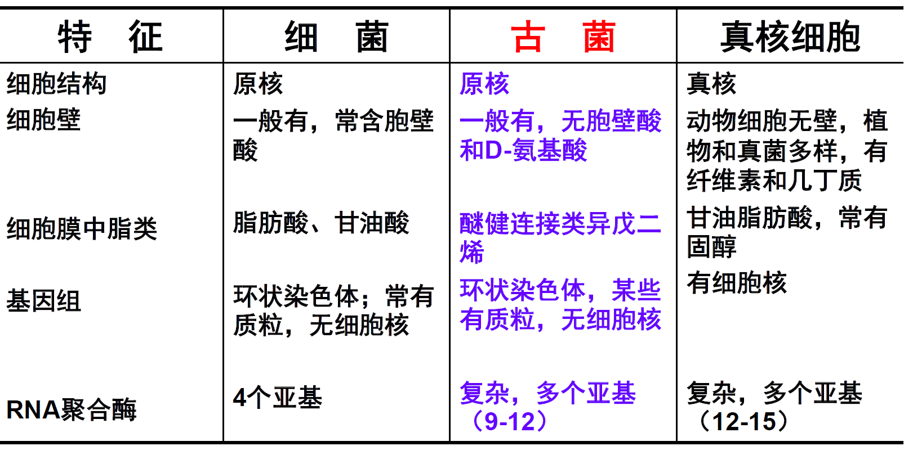
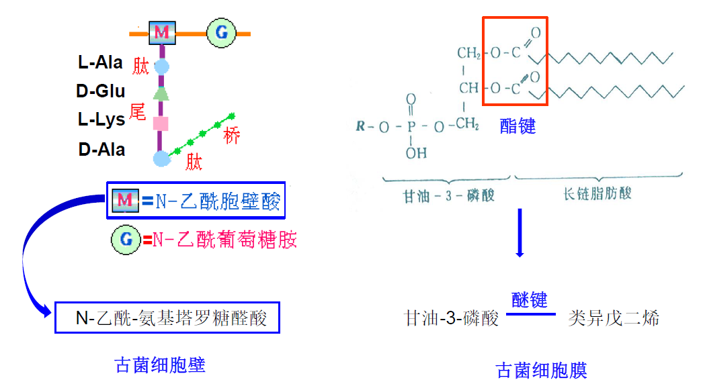
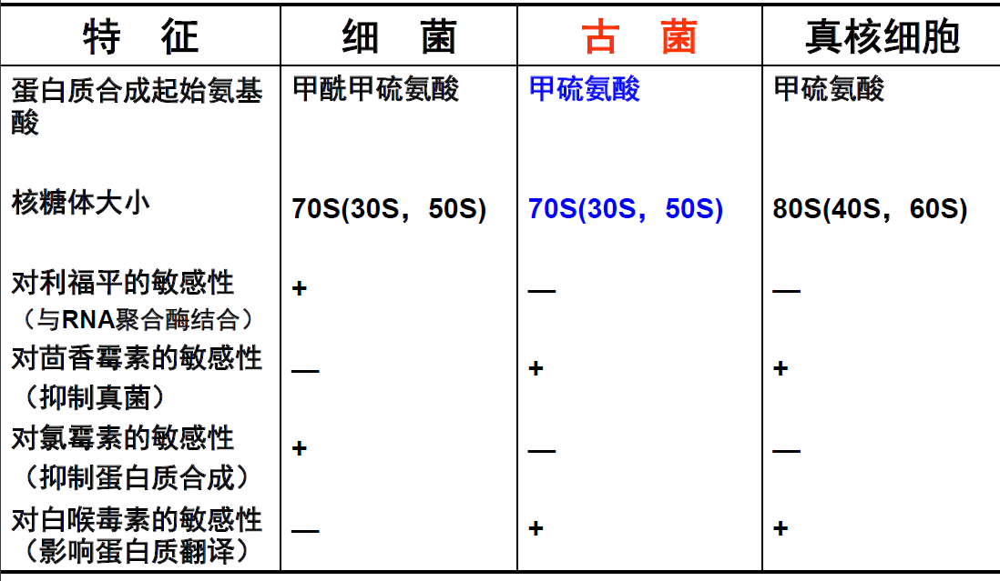
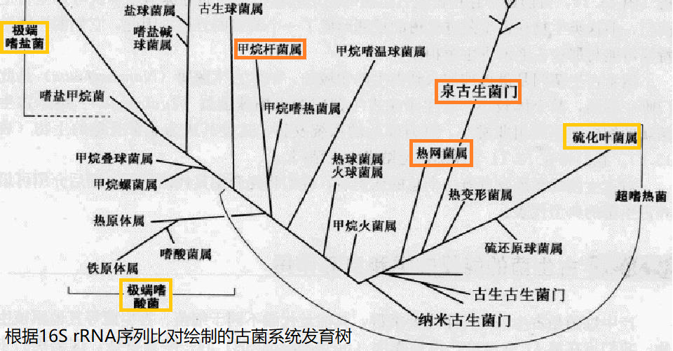
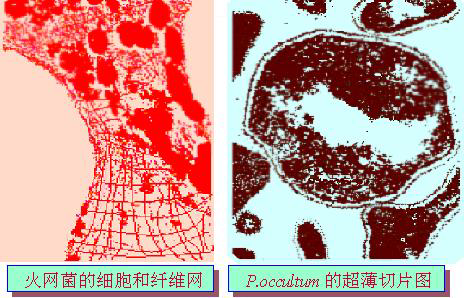
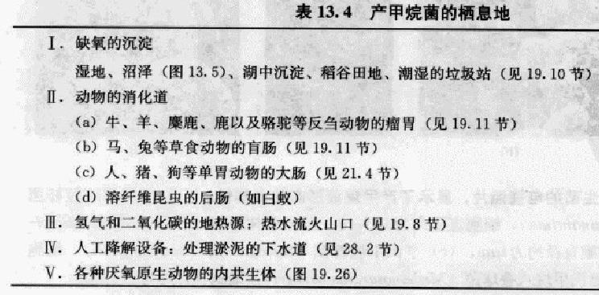

# 古菌

古菌(Archaea),也称古细菌,是一类在细胞结构和功能上与其他微生物有显著差异的原核生物类群,大多生长在极端环境中(如热泉、盐湖、厌氧沼泽地等).

# 古菌和细菌的主要区别

古菌与细菌由于生活环境的不同，造成其在细胞壁组成、结构、细胞膜类脂成分、16SrRNA序列等有很大区别。

## 古菌,细菌和真核生物的差异

## 古菌和细菌的突出区别

+   **形态**上,有的差别极大,有的古菌细胞呈扁平直角几何状
+   中间代谢上,**古菌有独特的辅酶**,如$F_{420}$
+   许多**古菌有内含子**,而细菌无内含子
+   膜结构和成分上,古菌细胞**含二醚而不是酯**
+   生境上,许多**古菌喜高温**,而大多数细菌不是好热型的
+   多数古菌**严格厌氧**
+   古菌比细菌**进化缓慢**,保留了较原始的特性.

---

+   古菌的特点介于细菌和真核生物之间,是原核生物

---

# 古菌系统发育树

# 古菌的类群

## 泉古菌门

是一群具有极端嗜热特性的古菌类群,也称为超嗜热菌

### 基本特点

+   最适生长温度在80℃以上,有的甚至在超过沸点温度的环境中生长
+   大多数在含有单质硫或硫化物的环境中分离到,多数种能代谢硫
+   形态差异很大,除了杆状和球状外,还有圆盘状和不规则球状.

### 硫化叶菌(Sulfolobus)

第一个被分离纯化鉴定的极端嗜热古菌，生长在富硫的的酸热泉中，生长pH为1-1.5，温度达90℃以上。

+   火网菌属(Pyrodictium)

栖息于海底火山的超嗜热菌,细胞圆到碟形,直径$0.3\sim2.5 \mu m$,厚$0.2 \mu m$.产生$0.04\sim0.08 \mu m$厚的纤维,这些纤维连接许多细胞形成网状,$G^-$,没有鞭毛,不运动.**严格厌氧,最适生长温度105℃**,温度生长范围为$8\sim210℃$,最适$pH5.5$,化能无机营养菌,是靠**$H_2S$**生长的自养生物.

## 广古菌门

### 极端嗜盐菌

指能在很高盐浓度甚至接近饱和盐浓度(32%)的溶液中生活的一类细菌

+   分布于盐湖和晒盐场,可引起腌制食品腐败和脱色
+   生长需要的**盐浓度大于**$1.5mol\cdot L^{-1}(约9\%)NaCl$,大多数种在$2.0\sim4.0mol\cdot L^{-1}NaCI$时生长最好
+   严格**好氧**,**化能有机营养**,利用氨基酸或碳水化合物作碳源
+   细胞内含有Cs0类胡萝卜素,**使菌体呈现红色**
+   细胞呈杆状或球状,**细胞膜上存在菌视紫红质,能利用光能驱动质子泵产生ATP**

#### 嗜盐杆菌属

#### 形态

细胞杆状,$G^-$,具端生鞭毛,菌落红色,小于$2mm$.

#### 主要生理特点

严格好氧,化能有机营养,耐高盐,在饱和盐浓度($20-30\%$以上 )中生长$,<9\%$的盐水不能生长.

### 产甲烷菌

产甲烷菌是一类**严格厌氧**,能利用H,作为还原剂将简单的$C_1$、$C_2$化合物($CO_2$、甲酸、甲醇、甲胺和乙酸)还原并产生甲烷的古细菌.产甲烷菌含有**特殊的辅酶$F_{420}$,**因此几乎所有的产甲烷菌在**荧光显微镜下镜检都有自发荧光**.

**甲烷杆菌属(Methanobacterium)**

是产甲烷菌的典型代表.细胞杆状,常连成丝,$G^-$,严格厌氧菌,**用$H_2$、$CO_2$、甲酸**产生甲烷是该属的主要特点.

甲烷在自然界分布很广,是天然气,沼气等的主要成分.作为第二温室气体,甲烷的排放量占全球温室气体排放总量的$16\%$,仅次于$CO_2$.

#### 甲烷-第二温室气体与可再生能源

甲烷古菌:唯一以产甲烷为能量代谢的生物

冷适应的甲烷古菌:

+   驱动低温湿地甲烷的排放
+   促进低温沼气发酵
+   对甲烷古菌的冷适应机制了解很少
+   已培养的嗜冷古菌均为甲烷古菌,是研究古菌冷适应的模式生物

#### 分离低温湿地的冷适应甲烷古菌

嗜冷甲烷叶菌R15(Methanolobus psychrophilus R15)

是分离自青藏高原若尔盖湿地的一株甲烷古菌新种

其生长温度范围为0℃-25℃,最适生长温度为18℃,只利用甲酸产甲烷.

