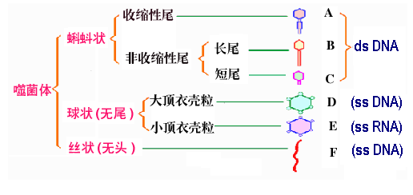
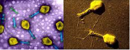
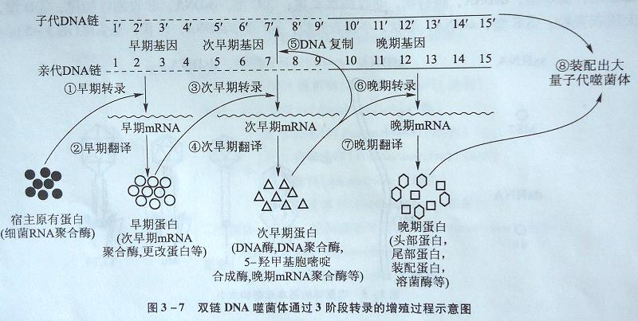
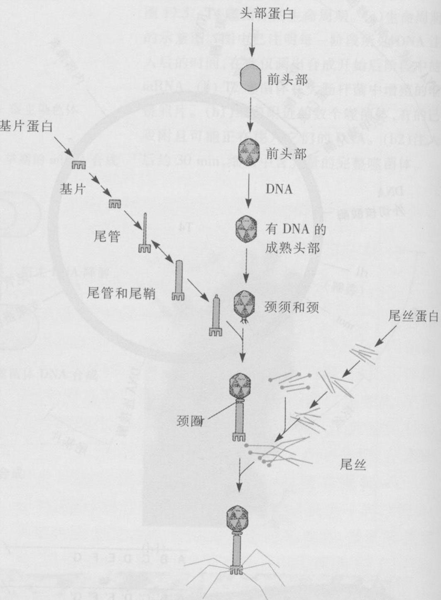
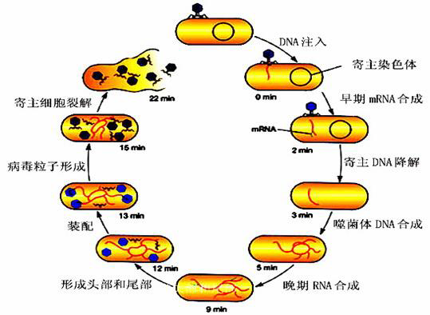
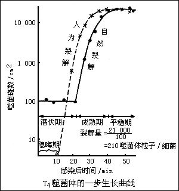

# 噬菌体

侵染细菌放线菌等细胞型微生物的病毒。广泛分布于自然界

# 噬菌体的形态

噬菌体的形态有蝌蚪状、球状、丝状等三种.

# 噬菌体的结构

# 噬菌体的生活周期

## 烈性噬菌体(T4)噬菌体的繁殖

烈性噬菌体:侵入寄主细胞后,引起寄主细胞的代谢改变,在寄主细胞内复制其核酸、蛋白质,装配成新的噬菌体,**最终使寄主细胞破裂而释放大量子代噬菌体**.

噬菌体的繁殖一般可分五个阶段,即
	吸附
	侵入
	复制
	装配
	释放

### 吸附

吸附是指病毒通过其表面结构与宿主细胞的病毒受体特异性结合,导致病毒附着于细胞表面的过程.

#### 第一阶段为可逆吸附

病毒与细胞可能因静电引力而结合,但受环境影响,一旦条件改变,病毒就会从细胞上脱落下来;

#### 第二阶段为不可逆吸附

病毒可逆吸附于细胞表面后,病毒表面的吸附蛋白与细胞表面的受体之间发生化学键结合,使得病毒不可逆地吸附于细胞表面.

### 侵入

#### 尾鞘收缩

尾鞘收缩,把尾管推出并插入到细胞壁和膜中

#### 尾管穿入

尾管端携带的溶菌酶水解细胞壁上的肽聚糖,使细胞壁产生小孔

#### DNA注入

核酸通过中空的尾管压入胞内,蛋白质外壳留在胞外.

### 复制

早期转录  次早期转录   DNA复制   后期转录

早期转录与次早期转录都是为后续的DNA复制与蛋白质合成、子代噬菌体装配做准备.

### 装配

把已合成的各种"部件"进行自装配过程

### 释放

$$
\large\left .
	\begin{array}
		脂肪酶\to水解寄主细胞的细胞膜\\
		溶菌酶\to水解寄主细胞的细胞壁
	\end{array}
\right \}\to寄主细胞破裂\to子代噬菌体释放
$$

## 噬菌体T4感染各时段的情况

## 一步生长曲线(one step growthcurve)

指能定量描述**烈性噬菌体**生长规律的实验曲线.

### 裂解量

表示平均每一宿主细胞裂解后产生的子代噬菌体数.

### 噬菌体效价的测定

**效价**在这里表示每毫升试样中所含有的具备侵染性的噬菌体粒子数,又称噬菌斑形成单位(pfu)

较常用且较精确的方法又称双层平板法
$$
\text { 双层平板法 }\left\{\begin{array}{l}
\text { 底层平板 }(2 \% \text { 琼脂培养基7-8mL }) \\
\text { 上层平板 }\left\{\begin{array}{l}
\text { 上层培养基 (1 % 琼脂培养基3mL) } \\
\text { 宿主菌悬液（对数期菌液 } 0.2 \mathrm{~mL} \text { ) } \\
\text { 噬菌体试样 (合适稀释液0.1mL })
\end{array}\right\} \text { 混匀 }
\end{array}\right\} \begin{aligned}
&37^{\circ} \mathrm{C} \\
&10 \text { 余小时 }\qquad 计数
\end{aligned}
$$

## 温和噬菌体和溶原性

### 温和噬菌体

噬菌体侵入细菌后,由于前者的基因组整合到后者的基因组上,并随后者的复制而进行同步复制,这种噬菌体的侵入并不引起宿主细胞裂解,因此称为温和噬菌体.

### 溶原细菌

含有温和噬菌体的寄主细胞.

### 原噬菌体

指已整合到宿主基因组上的噬菌体核酸.

