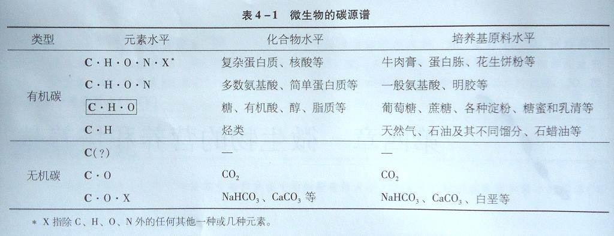
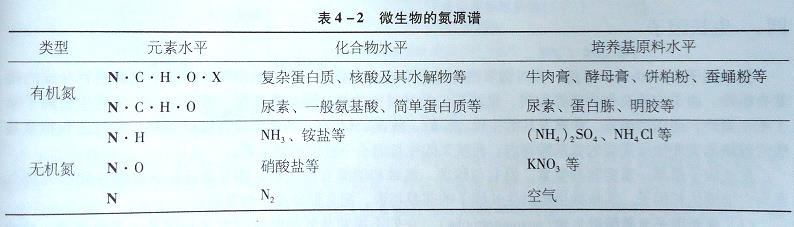
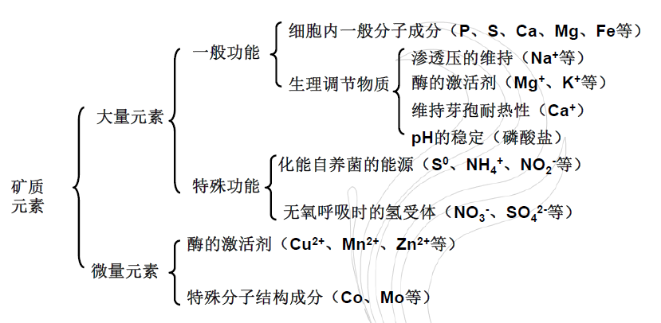

# 微生物的营养物质

营养:微生物从外部环境吸收生命活动所必需的物质和能量,以满足其生长和繁殖需要的一种生理过程.

营养物质:能够满足机体生长、繁殖和完成各种生理活动所需要的物质.

## 微生物的化学组成

### 主要元素

碳、氢、氧、氮

>   占细菌细胞千重的$90\%-97\%$

### 微量元素

磷、硫、钾、锌等矿物质元素

>   占细菌细胞干重的$3\%-10\%$

## 微生物的营养物质

按照它们在机体中的生理作用不同,区分成

+   水
+   碳源
+   氮源
+   矿物元素
+   生长因子
+   氧

### 水

#### 功能

+   是微生物细胞的重要组成成分,占微生物体湿重的$70\%\sim90\%$,还供给微生物氧和氢两种元素
+   维持细胞膨压,并使原生质保持正常的胶体状态
+   是微生物从外界吸收营养或从内部排泄废物的媒介
+   参与细胞内一系列化学反应,维持蛋白质、核酸等大分子的天然构象
+   比热容较高,具有较高的导热性,可维持细胞的正常温度

### 碳源

+   凡是能为微生物生长提供碳素来源的物质统称为碳源(carbon source)
+   凡<u>必须利用有机碳源的微生物</u>为**异养型微生物**,其碳源往往同时又是能源
+   凡<u>以无机碳源作唯一或主要碳源的微生物</u>则为种类较少的**自养型微生物**

#### 碳源谱

"$C\cdot H\cdot O$"型中的糖类是最广泛利用的碳源,其次是有机酸类、醇类和脂质.

#### 碳源种类

+   简单的无机含碳化合物$-CO_2$和碳酸盐等

+   复杂的天然有机化合物--糖与糖的衍生物、醇类、有机酸、脂类、烃类、芳香族化合物以及各种含氮的有机化合物;

微生物对糖类的利用,单糖优于双糖和多糖;

在多糖中,淀粉明显地优于纤维素或几丁质等多糖,纯多糖则优于琼脂等杂多糖和其他聚合物(如木质素)等.

>   木耳可以利用木质素

---

糖类是微生物重要的能源和碳源,通常()被异养微生物优先利用.

+   甘露糖和蔗糖
+   葡萄糖和果糖
+   乳糖
+   半乳糖

>   葡萄糖和果糖

---

### 氮源

凡是能为微生物生长提供氮素来源的营养物质称为氮源.
$$
氮源
\begin{cases}
	无机氮
	\begin{cases}
		NH_3\\
		铵盐\\
		硝酸盐\\
		N_2
	\end{cases}\\
	有机氮
    \begin{cases}
    	尿素\\
    	蛋白质\\
    	核酸\\
    	氨基酸
	\end{cases}
\end{cases}
$$
根据对氨基酸合成的能力分为:氨基酸自养型和氨基酸异养型.

#### 固氮微生物

当没有化合态氨利用时,能利用$N_2$作为唯一氨源,通过固氮酶将其还原为$NH_3$,再进一步合成所需的全部有机氮化合物.

#### 氮源谱

微生物可利用的氮源范围

异养微生物对氮源的利用顺序是:"$N\cdot C\cdot H\cdot O$"或"$N\cdot C\cdot H\cdot O\cdot X$"类优于"$N\cdot H$"类,更优于"$N\cdot O$",最不易利用的则是"N"类(只有少数固氮菌、根瘤菌和蓝细菌等可以利用)

### 矿物质元素

+   矿质元素是微生物生长必不可少的一类营养物质,根据微生物生长繁殖对无机盐($mineral\ salts$)需要量的大小,可分为大量元素和微量元素两大类.
+   大量元素主要包括$P,S,Mg,K,Na,Ca$等.
+   微量元素主要包括$Fe,Cu.Zn,Mn,Mo,Co,N,Sn(锡),Se(硒)$等.

#### 矿物质元素的营养功能

>    如Mo是硝酸还原酶和固氮酶的成分;Co是维生素B12的成分.

### 生长因子

是指某些微生物不能从普通碳源、氮源物质合成,必须从外界直接获取这种物质或其前体才能满足机体生长需要的小分子有机物.

主要包括**维生素**、**氨基酸**与**碱基**三大类

主要用来构成酶的辅基或辅酶,是某些酶活性所必须的成分.

+   按微生物对生长因子的需要与否,可将它们分为3种类型:
    +   生长因子自养型微生物:它们不需要从外界吸收任何生长因子,多数真菌、放线菌和不少细菌,如$E.coli$等都属这类;
    +   生长因子异养型微生物:它们需要从外界吸收多种生长因子才能维持正常生长,如各种乳酸菌、动物致病菌、支原体和原生动物等;
    +   生长因子过量合成微生物:少数微生物在其代谢活动中,能合成并大量分泌某些维生素等生长因子.

---

下列物质可作为生长因子的是

+   葡萄糖
+   $NaCI$
+   纤维素
+   叶酸

>   叶酸

---

### 酸

氧是**好氧微生物**不可缺少的营养物质之一,它参与某些物质代谢中的加氧反应,也是有氧呼吸作用的最终电子受体.

+   根据微生物对氧需求量不同,可分为:
    +   专性好氧菌
    +   微好氧菌
    +   耐氧菌
    +   兼性厌氧菌
    +   专性厌氧菌

一般通过**振荡或者通气**来保证好氧菌的生长,通过**深层静止**、**加入还原剂**等措施保证厌氧菌的生长.

