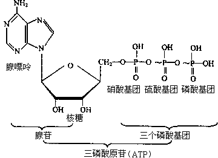
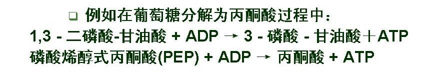
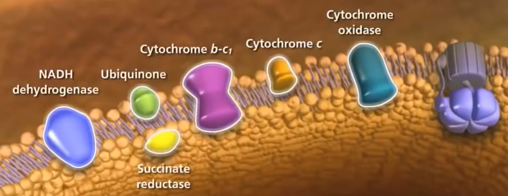
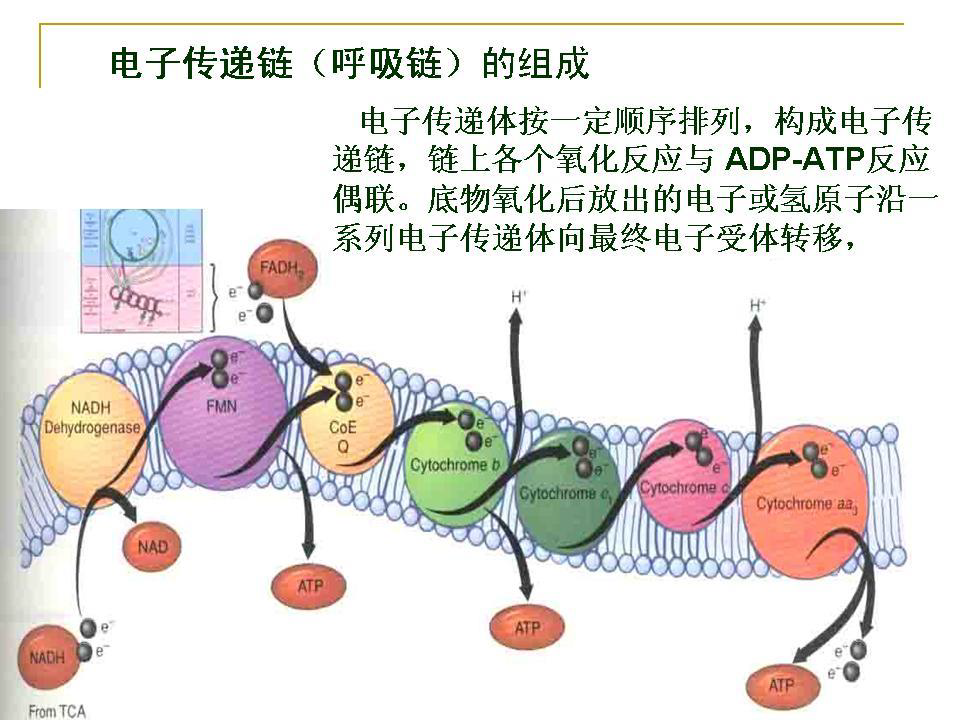
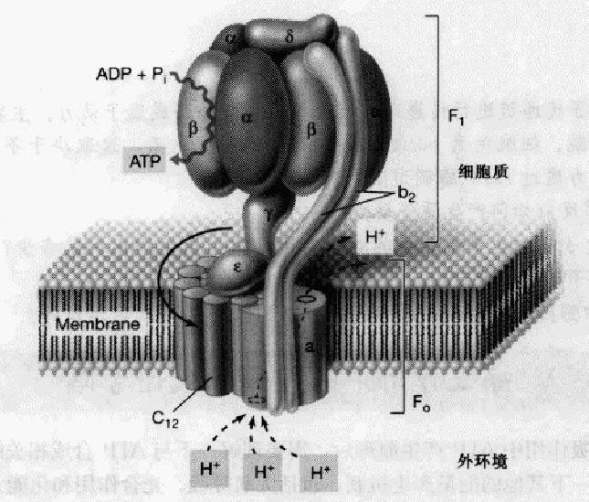
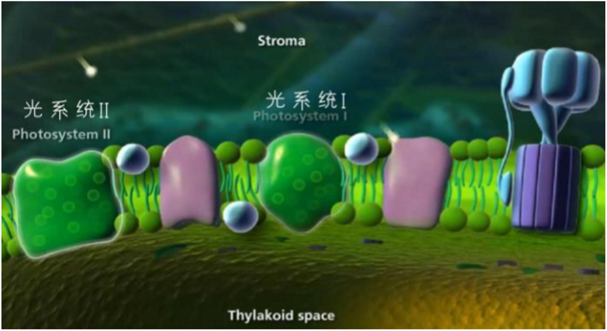
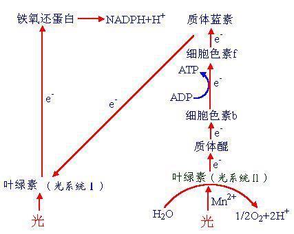
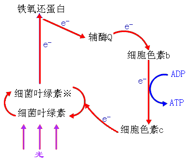
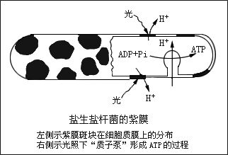
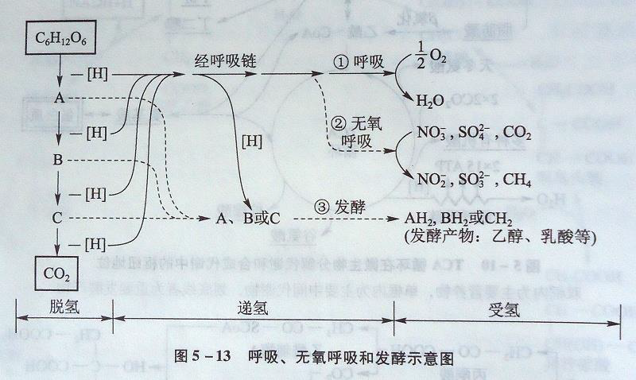

# 微生物的能量代谢

[TOC]

代谢(metabolism):活细胞内发生的各种化学反应的总和
$$
\large代谢
\begin{cases}
	物质代谢
	\begin{cases}
		分解代谢(catabolism)(异化作用)\\
		合成代谢(anabolism)(同化作用)
	\end{cases}\\
	能量代谢
    \begin{cases}
    	产能代谢\\
    	耗能代谢
	\end{cases}
\end{cases}
$$

$$
\Large复杂分子\frac{分解代谢酶系}{耗能代谢}\rightarrow简单小分子+ATP+[H]
$$

**能量代谢是一切生物代谢的核心问题**
$$
\Large最初能源
\left \{
	\begin{array}{}
		&有机物&\frac{化能异养微生物}{ }\rightarrow\\
		&还原态无机物&\frac{化能自养微生物}{}\to\\
		&日光&\frac{光能营养微生物}{}\to
	\end{array}
\right \}
高能化合物(ATP)\to通用能源
$$

## ATP的结构

$$
\Large ATP\to ADP+Pi\\
\Large ADP\to AMP+Pi
$$

## 能量转化通常涉及到氧化还原反应

### 氧化(oxidation)

指物质**失去电子**(化合价升高)的过程,伴随着脱氢或加氧的过程.
$$
C_6H_{12}O_6+O_2\longrightarrow6CO_2+6H_2O
$$

### 还原(reduction)

物质**获得电子**(化合价降低),可能伴随着加氢或脱氧
$$
NO_3^-+NADPH+H^+\longrightarrow NO_2^-+H_2O+NADP^+
$$

## ATP产生的主要方式

### 底物水平磷酸化

#### 定义

物质在生物氧化过程中,常生成一些含有高能键的化合物,而这些化合物可直接偶联ATP或GTP的合成,这种产生ATP等高能分子的方式称为底物水平磷酸化

有机物~P + ADP→ATP +有机物

#### 特点

不需要氧,不经过呼吸链,ATP在酶促反应中生成,是**微生物发酵过程中唯一的产能方式**.

---

6.9 ATP或GTP的生成与高能化合物的酶催化转换相偶联的产能方式是()

+   光合磷酸化
+   底物水平磷酸化
+   氧化磷酸化
+   化学渗透假说

>    底物水平磷酸化

---

### 氧化磷酸化

定义:又称电子传递链磷酸化,是指通过呼吸链产生ATP的过程.

#### 呼吸链的酶所处位置

+   真核生物
    +   线粒体内膜
+   原核生物
    +   细胞质膜

#### 氢或电子的传递顺序:

底物氧化脱下的[H]和电子$\to NAP(P)\to FP$(黄素蛋白)$\to Fe-S$(铁硫蛋白)$\to CoQ$(辅酶Q)$\to Cytb\to Cytc \to Cyta \to Cyta3\to O_2$

>   在氢或电子的传递过程中,通过与氧化磷酸化相偶联,造成一个跨膜质子动势,进而推动了ATP的合成.

氧化磷酸化生物效率
$$
2H^++\frac{1}{2}O_2\longrightarrow H_2O+3ATP
$$
用P/O表示,表示每耗一个O原子所形成的ATP数,一对电子从NADH传递到一个O原子,P/O为3.

#### 氧化磷酸化形成ATP的机制:化学渗透说

1.在氧化磷酸化过程中,通过呼吸链有关酶系的作用,将底物上的**质子从膜的内侧传递到外侧**,从而造成膜两侧质子分布不均匀,形成**质子动力**

2.**ATP合酶**可**把质子从膜外侧重新输回膜内侧**,在消除质子的同时**合成ATP**

### 光合磷酸化

由光照引起的电子传递作用与磷酸化作用相偶联而生成ATP的过程,即将光能转化为化学能的过程.
$$
光能营养微生物
	\begin{cases}
		非环式光合磷酸化(产氧)
			\begin{cases}
				真核生物:藻类及绿色植物\\
				原核生物:蓝细菌
			\end{cases}\\
        环式光合磷酸化(不产氧)
        	\to 真细菌:光合细菌,如红螺菌属和绿菌属\\
        紫膜光合磷酸化(不产氧)
        	\to嗜盐菌
	\end{cases}
$$

#### 非环式光合磷酸化

蓝细菌和高等植物一样,光合作用靠叶绿素进行.

##### 特点

+   ①有氧条件下进行

+   ②有`PhotoSystem I`和`PhotoSystem II`两个光合系统
+   ③同时产生还原力$NADPH$,$ATP$和$O_2$
+   ④还原力来自$H_2O$的光解

#### 环式光合磷酸化

光合细菌,如红螺菌属和绿菌属
可在光能驱动下通过电子的循环式传递而完成磷酸化产能反应.

##### 特点

+   电子传递途径属循环方式
+   产能与产还原力分别进行
+   还原力来自$H_2S$等无机物
+   不产生氧

#### 嗜盐菌紫膜的光合作用

一种只有嗜盐菌才有的,无叶绿素或细菌叶绿素参与的独特的光合作用.

当光照时,视黄醛放出H+到细胞膜外,然后又从细胞内获得H",光照后排出,如此反复,形成质子梯度,当膜外的H'通过H-ATP酶返回时,合成ATP

>    紫膜的光合磷酸化是迄今为止所发现的最简单的光合磷酸化反应

## 微生物细胞中能量的释放和利用

生物氧化:物质在生物体内经过一系列连续的氧化还原反应逐步分解并放出能量的过程.

$生物的氧化形式\begin{cases}某物质与氧结合\\脱氢\\失去电子\end{cases}$$\quad 生物氧化的过程\begin{cases}脱氢(电子)\\递氢(电子)\\受氢(电子)\end{cases}$

$氧化的功能\begin{cases}产能(ATP)\\产还原力[H]\\产小分子中间代谢物\end{cases}$$\qquad 生物氧化的类型\begin{cases}有氧呼吸\\无氧呼吸\\发酵\end{cases}$

### 有氧呼吸、无氧呼吸和发酵过程示意图

#### 发酵作用

**发酵**

在**无氧等外源氢受体**的条件下,底物脱氢后所产生的还原力**[H]未经呼吸链传递**而直接**交某一内源性中间代谢物接受**,以实现底物水平磷酸化产能的一类生物氧化反应

+   产能方式:底物水平磷酸化产生ATP
+   电子受体:底物形成的中间产物又作为受氢体接受氢形成新产物,不需氧气参加.
+   底物去向:底物氧化不彻底,只释放部分能量.

##### 乙醇发酵

+   不同的微生物进行乙醇发酵的途径和产物不同,主要有酵母菌的乙醇发酵和细菌的乙醇发酵.
+   酵母菌的乙醇发酵(EMP途径)
    +   $C_6H_{12}O_6\longrightarrow 2CH_3CH_2OH+2CO_2+2ATP$

+   假单胞菌的乙醇发酵(ED途径)
    +   $C_6H_{12}O_6\longrightarrow 2CH_3CH_2OH+2CO_2+ATP$

##### 乳酸发酵

+   同型乳酸发酵(发酵产物只有单一的乳酸)
    +   德氏乳杆菌:$C_6H_{12}O_6\longrightarrow2乳酸+2ATP$
+   异型乳酸发酵(发酵产物除乳酸外，还有其它的化合物)

    +   肠膜状明串珠菌:$葡萄糖$$P.K\over$$\to1乳酸+1乙醇+1CO_2+ATP$
    +   双歧杆菌:$2葡萄糖$$H.K\over$$\to2乳酸+3乙酸+5ATP$

    >   $P.K$为磷酸戊糖解酮酶,$H.K$为磷酸已糖解酮酸

##### 丁酸发酵与丙酮丁醇发酵

+   丁酸梭状芽孢杆菌(Clostridium butyricum)可以发酵葡萄糖得到丁酸
    +   $4 \mathrm{C}_{6} \mathrm{H}_{12} \mathrm{O}_{6} \longrightarrow2 \text { 乙酸+3丁酸 }+8 \mathrm{CO}_{2}+8 \mathrm{H}_{2}+10 \mathrm{ATP}$
    +   每$mol$葡萄糖在发酵中大约产$2.5$个$ATP$

+   丙酮丁醇梭菌(Clostridium acetobutylicum)
    +   $葡萄糖\longrightarrow丁醇+丙酮+乙酸+乙醇+H_2+CO_2+ATP$

#### 有氧呼吸

Aerobic respiration:微生物氧化底物时以**分子氧作为最终电子受体**的氧化作用.它是一种最普遍又最重要的生物氧化或产能方式.

+   特点:有氧存在,底物氧化得彻底,产能大.

#### 无氧呼吸

Anaerobic respiration无氧呼吸:以氧以外的**其他氧化型化合物**作为最终电子受体的氧化作用.

+   可作为无氧呼吸电子受体的物质
    +   $NO^{3-}$
    +   $NO^{2-}$
    +   $SO_4^{2-}$
    +   $S_2O_3^{2-}$
    +   $CO_2$
+   能量生成效率低于有氧呼吸

#### 巴斯德效应

巴斯德效应:由于葡萄糖在有氧呼吸中产生的能量要此在发酵中产生的多,所以在有氧条件下,兼性厌氧微生物终止厌氧发酵而转向有氧呼吸,这种呼吸抑制发酵的现象称为巴斯德效应.

---

厌氧呼吸的最终电子受体是()

+   还原型无机化合物
+   氧化型无机化合物
+   某些有机化合物

>   氧化型无机化合物

---

下列代谢方式中,能量获得最有效的方式是

+   发酵
+   好氧呼吸
+   厌氧呼吸
+   化能自养

>   好氧呼吸

## 能量的消耗

+   生物合成(能量利用的主要方面)
+   运动(鞭毛运动)
+   营养运输(主动运输)
+   生物发光(藻类)
+   生物热(青贮和堆肥)

