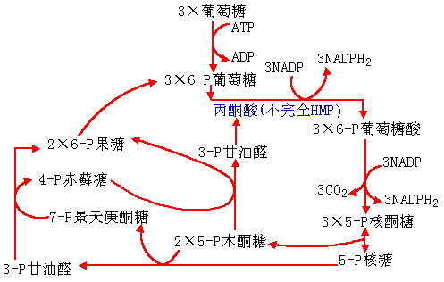
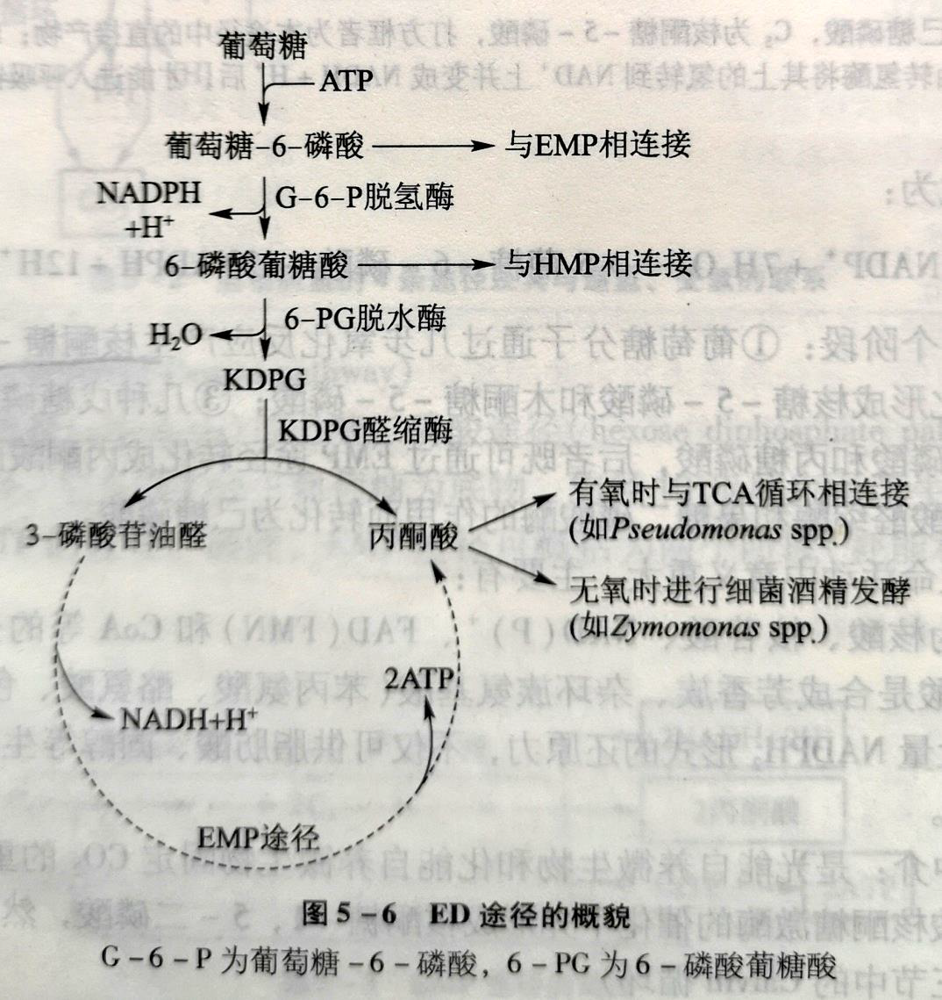

# 微生物的分解代谢

自然界中的微生物绝大多数是化能异养型的微生物,这些微生物从外界吸收营养物质以后,通过微生物细胞中的酶进行分解代谢产生能量ATP和小分子有机物.

+   ATP是合成代谢所必需的能量的主要源泉
+   微生物进行合成代谢的前体物

# 大分子有机物的分解

+   淀粉$\Large水解\over$糊精$\Large 水解\over$葡萄糖,麦芽糖
+   蛋白质$\Large水解\over$多肽$\Large水解\over$氨基酸
+   氨基酸$\Large脱氨作用\over$有机酸$+NH_3$
+   氨基酸$\Large脱羧作用\over$胺$(-NH_2)+CO_2$

+   脂肪$\Large水解\over$$\begin{cases}甘油\\脂肪酸 {\beta-氧化\over}乙酰辅酶A\end{cases}$

# :star:己糖的分解

## 糖酵解和三羧酸循环(TCA循环)

是葡萄糖在有氧条件下被彻底氧化成$CO_2$,产生能量的途径.

$糖酵解\left \{\begin{array} {}EMP途径(最常见)\\HMP途径\\ED途径\end{array}\right \}丙酮酸\begin{cases}{\large无氧\over}发酵\\{\large有氧\over TCA循环}CO_2+H_2O\end{cases}$

### EMP途径

又称糖酵解途径或磷酸已糖途径,  埃姆登**E**mbden-迈耶霍夫**M**eyerhof-帕纳斯**P**arnas

#### EMP途径特点

1、EMP途径为合成代谢提供了:

+   能量	
    +   2ATP(消耗2ATP,产生4ATP, net. 2ATP)
+   还原力
    +   2NADH
+   小分子c架
    +   6-P葡萄糖
    +   P-二羟丙酮
    +   3-P甘油酸
    +   P-烯醇式丙酮酸
    +   丙酮酸

2、需氧菌、兼性菌、厌氧菌中都有,有氧时与三羧酸循环连接,产生大量能量,无氧时产生种类繁多的发酵产物.

### HMP途径

磷酸已糖途径,也称磷酸戊糖途径(pentose phosphate pathway)或PP途径,是葡萄糖不经过EMP途径和TCA循环而得到彻底氧化,并能产生大量NADPH2形式的还原力和多种代谢产物的糖酵解途径.存在于大多生物细胞内.

5-P核糖+5-P木酮糖→ 3-P甘油醛+7-P景天庚酮糖
3-P甘油醛+7-P景天庚酮糖→ 4-P赤藓糖+6-P果糖
5-P木酮糖+4-P赤藓糖→ 6-P果糖+3-P甘油醛

#### HMP特点

+   完全HMP途径提供
    +   还原力
        +   $2NADPH_2$
    +   简单小分子
        +   核酮糖-5-磷酸
        +   赤苏糖-4-磷酸

+   不完全HMP途径提供
    +   能量
        +   $2APT$
    +   还原力
        +   $1NADPH_2$
    +   简单小分子
        +   甘油醛-3-磷酸
        +   磷酸烯醇式丙酮酸
        +   丙酮酸

## 丙酮酸的进一步分解
+ 进入TCA循环，进一步氧化分解，产生还原力$NADPH_2,ATP$和合成代谢所需要的小分子C架

+ 发酵作用Fermatitiom（无氧条件）

+   特点
    +   在许多细菌、真菌中,HMP与EMP途径共同存在,不同菌种中,二者所占比例不同
    +   HMP是由葡萄糖降解产生五碳糖的重要途径,与核酸合成密切相关.其它中间产物(如赤藓糖、景天糖、3-P甘油醛)等也能满足多种代谢的需要

### ED途径

细菌分解葡萄糖生成丙酮酸和3-P-甘油醛的另一途径,又称2-酮-3-脱氧-6-磷酸葡萄糖酸(KDPG)裂解途径

+   ED途径可不依赖于EMP和HMP途径而单独存在,是少数缺乏完整EMP途径的微生物的一种替代途径,为微生物所特有,在G菌中分布较广,特别是假单胞菌和固氮的某些菌株(中)较为常见.

>   KDPG:2-酮-3-脱氧-6-磷酸葡萄糖酸

#### ED途径特点

+   ED途径位合成代谢提供
    +   能量
        +   ATP
    +   还原力
        +   $NADH_2+NADPH_2$
    +   简单小分子
        +   葡萄糖-6-磷酸
        +   甘油醛-3-磷酸
        +   磷酸烯醇式丙酮酸
        +   丙酮酸

+   关键反应
    +   2-酮-3-脱氧-6-磷酸葡萄糖酸(KDPG)的裂解.
+   关键中间产物
    +   KDPG
+   催化的酶
    +   KDPG醛缩酶

>   相关的发酵生产
>   细菌酒精发酵
>   	优点	
>   		代谢速率高,产物转化率高,菌体生成少,代谢副产物少,发酵温度较高,不必定期供氧.
>   	缺点
>   		较易染菌;细菌对乙醇耐受力低

## 丙酮酸的进一步分解

①进入TCA(Tricarboxylic acid cycle)循环进一步氧化分解,产生还原力NADPH2,ATP和合成代谢所需要的小分子C架(有氧条件下)

②发酵作用Fermatatiom(无氧条件下).

### TCA循环

乙酰CoA与草酰乙酸缩合形成柠檬酸,柠檬酸经过两次氧化脱羧,结果就是乙酰辅酶A被氧化成C02,并生成NADH和FADH2,最后又生成草酰乙酸.

+   提供还原力
    +   $3NADH_2,1FADH_2$
+   提供能量
    +   形成$1GTP$
+   提供前体化合物
    +   $\alpha-$酮戊二酸
    +   琥珀酸
    +   草酰乙酸

---

6.12下列葡萄糖生成丙酮酸的糖酵解途径中,()是最普遍的、存在于大多数生物体内的一条主流代谢途径.

+   EMP途径
+   HMP途径
+   ED途径
+   WD途径

>   EMP途径

