# 微生物的合成代谢

合成代谢(同化作用)就是微生物将简单的无机物或者有机物用体内的各种酶促反应合成大分子即菌体物质的过程.

+   合成三要素
    +   ATP、还原力、小分子化合物
+   合成前体物
    +   氨基酸、单糖、氨基糖、脂肪酸、核苷酸
+   合成大分子
    +   蛋白质、核酸、脂肪、多糖
+   合成超分子体系
    +   膜,肽聚糖,酶复合物
+   合成细胞各组分

**合成原则**:生物有小分子逐步合成大分子乃至细胞

# 无机养分的同化

## $CO_2$的同化

**自养微生物**:以CO,为碳源的光能自养型、化能自养型

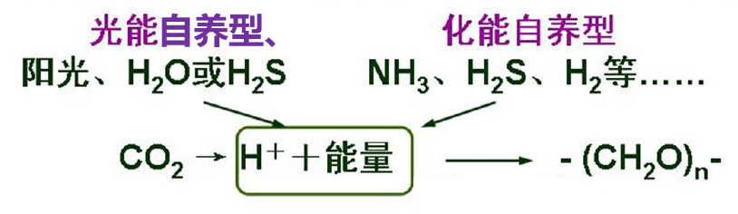

+   **卡尔文循环(Calvin cycle)**
    +   几乎所有自养微生物
+   还原性三羧酸循环途径
    +   一些古菌和厌氧光合细菌
+   厌氧乙酰辅酶A途径
    +   甲烷菌、硫酸盐还原菌和产乙酸菌

### 卡尔文循环(Calvin cycle)

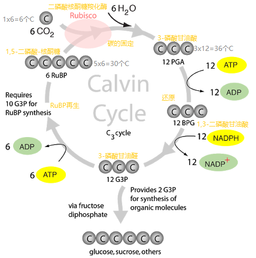

+   该循环是光能自养微生物和化能自养微生物固定$CO_2$的主要途径

### 还原性三羧酸循环途径

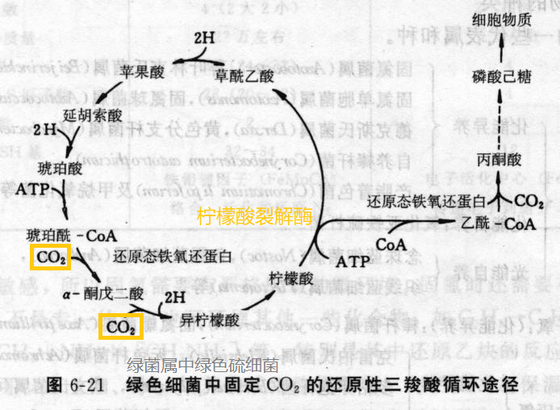

### 厌氧乙酰-CoA途径

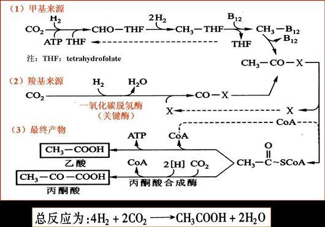

>   产乙酸菌、硫酸盐还原菌、产甲烷菌

---

卡尔文循环途径中CO2固定(羧化反应)的受体是()

+   5-磷酸-核酮糖
+   1,5-二磷酸-核酮糖
+   3-磷酸甘油醛
+   3-磷酸甘油酸

>   1,5-二磷酸-核酮糖

---

$CO_2$固定的逆向三羧酸循环途径中,多数酶与正向三羧酸循环途径相同,只有依赖于ATP的()是个例外.

+   柠檬酸合成酶
+   柠檬酸裂解酶
+   异柠檬酸脱氢酶
+   琥珀酸脱氢酶

>   柠檬酸裂解酶

## 氮的同化

### 分子态氮的同化

即生物固氮作用,由固氨微生物完成

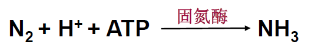

### 氨的同化

氨可以直接被同化合成氨基酸

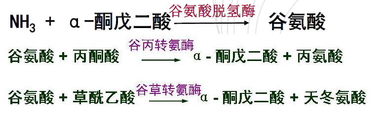

### 硝酸盐的同化还原

指微生物将吸收的硝酸盐逐步还原成氨用于细胞物质还原的过程

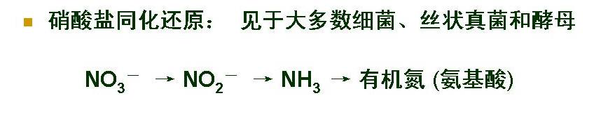

## 硫酸盐的同化

<u>含硫的氨基酸</u>(半胱氨酸和甲硫氨酸)和<u>B族的维生素</u>(生物素、硫辛酸、硫胺素)以及一些<u>辅酶</u>的合成需要硫.

**硫酸盐的同化还原**:指微生物吸收无机硫酸盐,在细胞内还原合成有机硫的过程,包括<u>硫酸盐被活化</u>和<u>进一步还原</u>这两步.

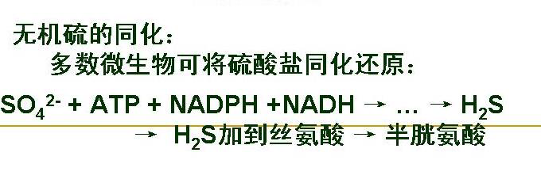

# 大分子前体物质的合成

## 肽聚糖的合成

**肽聚糖**是由组成肽聚糖的单体聚合而成的大分子网状化合物.

根据反应部位的不同可以分成三个合成阶段

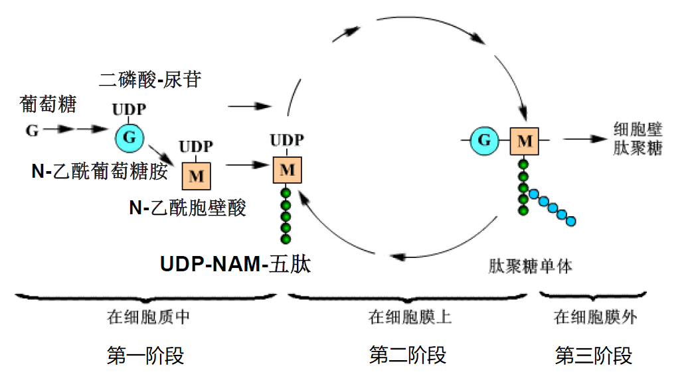

### 第一阶段

#### 由葡萄糖合成UDP-NAG和UDP-NAM

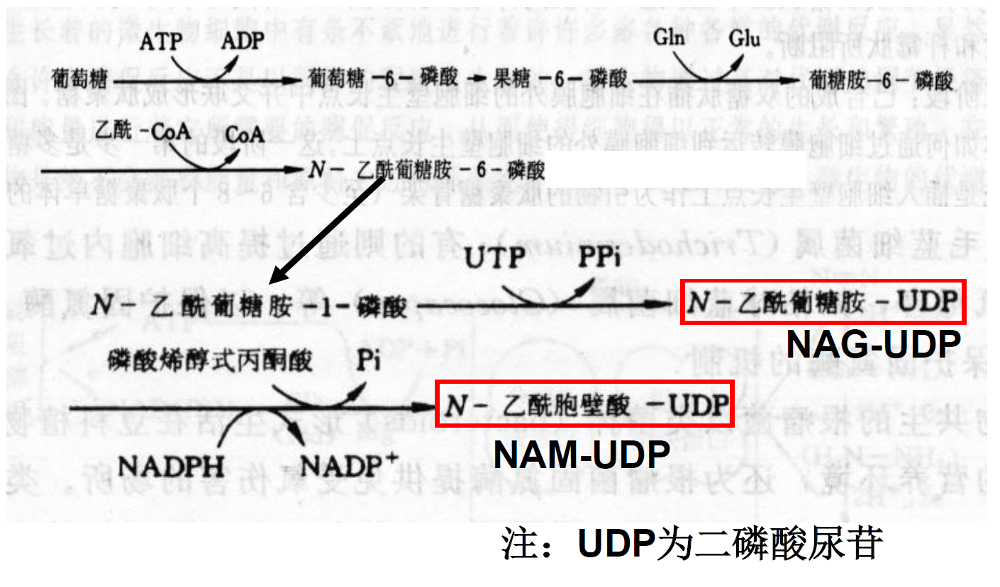

#### 由UDP-NAM合成UDP-NAM-五肽

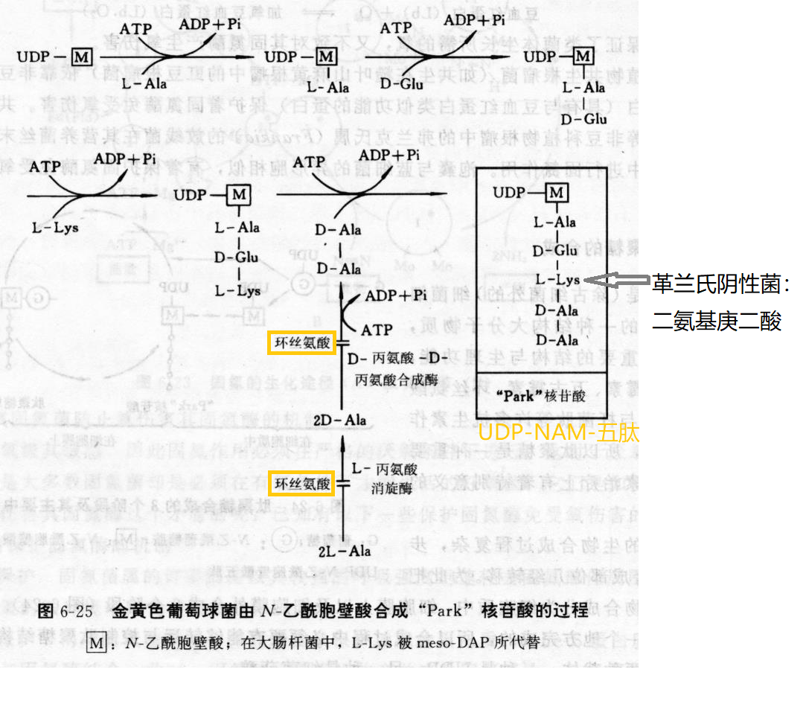

### 第二阶段

细胞膜上合成肽聚糖单体

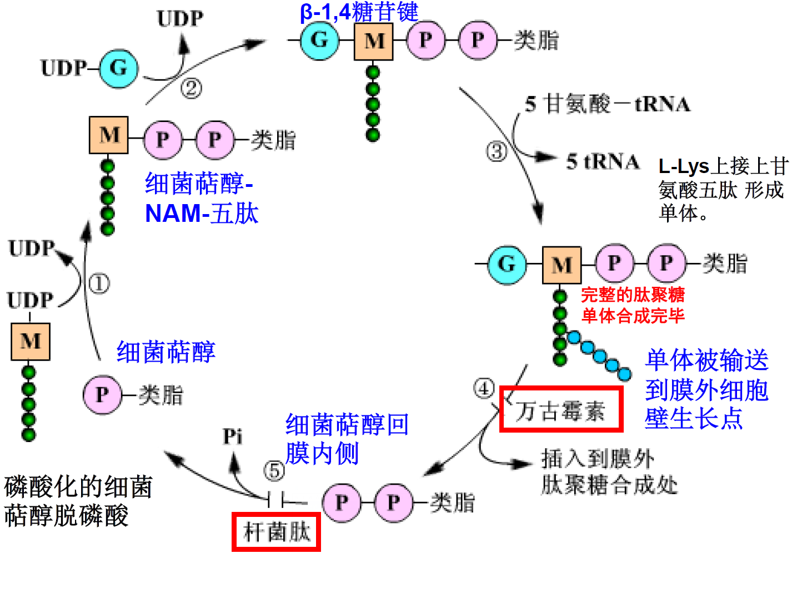

### 第三阶段

细胞膜外合成肽聚糖

将单体插在细胞膜外的细胞壁生长点处，并交联形成肽聚糖

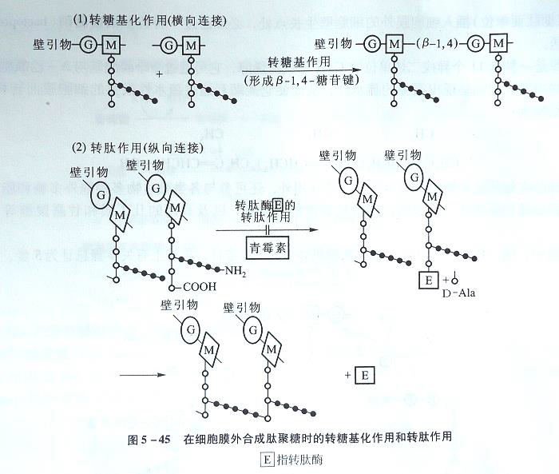

+   $G^+$:由5个氨基酸组成的肽桥相连
+   $G^-$:第一条肽链的第4个氨基酸与另一条的第3个氨基酸之间的肽键相连

#### 肽聚糖合成步骤

+   5步,需要有两个载体(UDP:二磷酸尿苷; ACL-P:细菌萜醇)

    +   UDP-NAG生成

    +   UDP-NAM生成

    +   $5aa+ UDP-NAM\to UDP-NAM-5$肽(丙、谷、赖、丙、丙)

    +   NAG和NAM组成肽聚糖亚单位

        +   $$
            UDP-NAM-5肽\Longrightarrow 
            \left .
            	\begin{array}{}
            		ACL-P-P-NAM-5肽\\
            		UDP-NAG
            	\end{array}
            \right \}
            \stackrel{\beta-1,4糖苷键}{\Longrightarrow}\\NAG-NAM-5肽-P-P-ACL\Longrightarrow P-P-ACL+NAG-NAM-5肽\Longrightarrow插入细胞壁生长点中
            $$

    +   肽聚糖链交联
        +   $G^+$壁:组成甘氨酸肽桥
        +   $G^-$壁:由一条肽链上第4个氨基酸羟基与另一肽链的第3个氨基酸自由氨基相连

    

---

青霉素抑制金黄色葡萄球菌肽聚糖合成的是

+   细胞膜外的转糖基酶
+   细胞膜外的转肽酶
+   细胞质中的UDP-NAM-五肽的合成
+   细胞膜中肽聚糖单体分子的合成

