# 2.1 染色体 Chromosome
DNA 位于染色体上，亲代能够将自己的遗传物质以染色体的形式传给子代，保持了物种的稳定性和连续性

## 2.1.1 染色体概述
+ 存在于细胞核中，在显微镜下呈丝状或棒状，在细胞发生有丝分裂时期容易被践行染料着色，因此而得名
+ 包括 DNA 和蛋白两大部分。同一物种内每条染色体所带 DNA 的量是一定的，但不同染色体或不同物种之间变化很大
## 2.1.2 真核细胞染色体的组成
+ 染色体特征
	+ 分子结构相对稳定
	+ 能够自我复制，使亲、子代之间保持连续性
	+ 指导蛋白质的合成，控制整个生命过程
	+ 产生可遗传的变异
+ 真核细胞 DNA 的转录和翻译在不同的空间和时间上进行，其基因表达的调控不仅与 DNA 序列有关，也与染色体的结构有关
+ 组成
	+ DNA
	+ 组蛋白
	+ 非组蛋白
	+ RNA
### (1)组蛋白和非组蛋白
+ 组蛋白
	+ 染色体的结构蛋白，因富含碱性氨基酸 Arg（精氨酸）和 Lys（赖氨酸）而呈碱性，可与酸性的 DNA 紧密结合
	+ 组蛋白包含五个部分，按照分子量由大到小分别升为 H1，H3，H2A，H2B 和 H4，它与 DNA 组成核小体
+ 组蛋白的特性
	+ 进化上的极端保守性，不同种生物组蛋白的氨基酸组成十分相似
	+ 无组织特异性，仅发现少数例外（鸟鱼两栖红细胞 H1-H5，精细胞鱼精蛋白）
	+ 肽链上氨基酸分布的不对称性，N 端碱性氨基酸，C 端疏水氨基酸
	+ 组蛋白的修饰作用，甲基化，乙酰化，磷酸化，多聚 ADP 糖基化等，修饰作用只发生在细胞周期的特定时间和组蛋白的特定位点上
	+ 符号赖氨酸的组蛋白 H5，只存在于鸟类， 两栖类含有细胞核的红细胞中，取代 H1，而与 H1 并无明显的亲缘关系
+ 组蛋白修饰与表观遗传
	+ 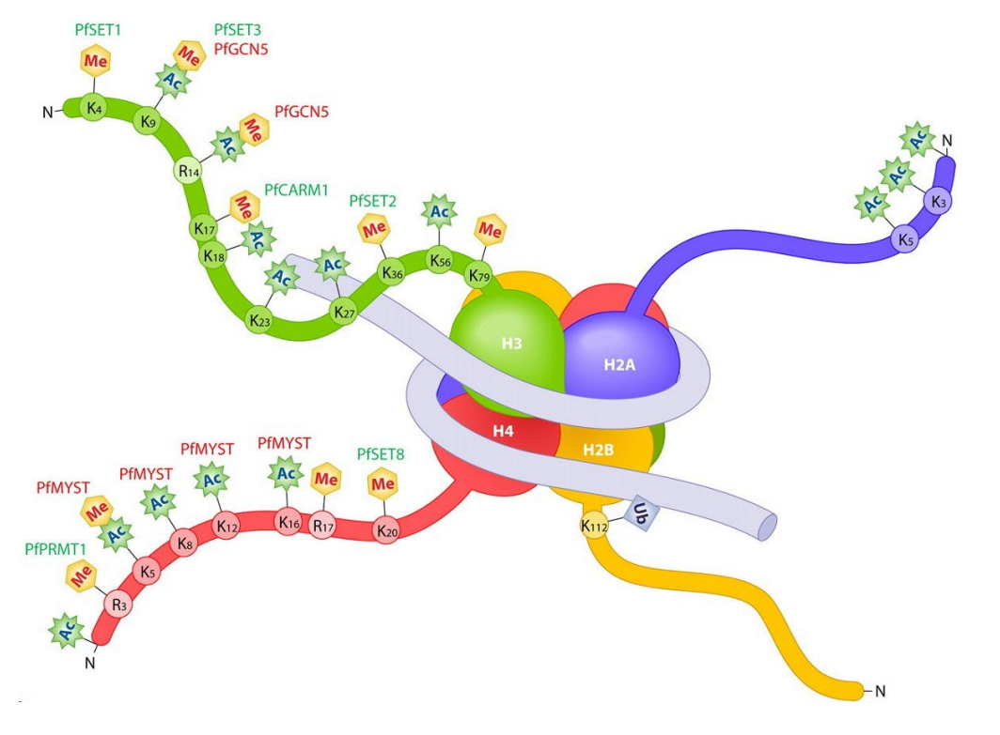
+ 非组蛋白
	+ 非组蛋白约为 组蛋白总量的 $60\%-70\%$ ，可能有 20-100 种，常见的有 15-20 种
	+ 以 DNA 为底物的酶以及作用于组蛋白的一些酶，DNA 结合蛋白，组蛋白结合蛋白和调控蛋白等
	+ 非组蛋白具有多样性和异质性，不同组织细胞中其种类和数目都不同
### (2)DNA
+ 含有大量的重复序列；功能 DNA 序列大多被非功能 DNA 隔开
+ C 值（C Value）：一种生物单倍体基因组 DNA 的总量
+ C 值反常现象（C-value Paradox）：C 值往往与种系进化的复杂程度不一致
---
+ 真核细胞的核苷酸序列大致可被分为 3 类
	+ 不重复序列
		+ 一个或几个拷贝，占 DNA 总量的 $20\%-80\%$，序列长约 750-2000 bp. 结构基因基本上属于不重复序列。
	+ 中度重复序列
		+ 重复次数 $10-10^4$ 占 DNA 总量的 $10\%-40\%$，编码  rRNA, tRNA 和某些结构蛋白。中度重复序列往往分在在不重复序列之间。
	+ 高度重复序列
		+ 卫星 DNA，只在真核生物中发现，占基因组的 $10\%-60\%$，由 6-100 个碱基组成。高度浓缩，异染色质的组成部分。大多位于染色体着丝粒。
+ 人类基因组概况
	+ 人的核基因组由 3.2 G 个碱基组成
	+ 共 22 对染色体 +1 对性染色体
	+ 最短的染色体 50 M，最长的染色体 260 M
### (3)核小体和染色质
+ 核小体（Nucleosome）
	+ 染色体 DNA 的一级包装
+ 染色质纤维（30 nm fiber）
	+ 二级包装
+ 染色质纤维环
	+ 三级包装

微球菌核酸酶（Micrococcal nuclease）处理染色质后电泳，被保留的 DNA 片段均为 200 bp 基本单位的倍数。

核小体单体被微球菌核酸酶处理后，随着时间延长，其降解产物（DNA 片段）会逐渐缩短，从 200 bp 降至 146 bp，至此很难再进一步降解。这种稳定结构为核心颗粒。

+ 核小体，直径 10 nm，染色体中 DNA 压缩的第一步，收缩至原尺寸的 1/7
+ 核小体由核心颗粒和连结线 DNA 两部分组成
	1. 每个核小体单位包括 200 bp 的 DNA、一个组蛋白核心和一个 H1
	2. 由 H2A、H2B、H3、H4 各两份子形成八聚体，构成核心颗粒
	3. DNA 分子以左手螺旋缠绕在核心颗粒表面，每圈 80 bp，共 1.75 圈，约 146 bp，两端被 H1 锁合
	4. 相邻核心颗粒之间为一段 20-60 bp 的连接线 DNA
+ 染色质纤维
	+ 染色质进一步折叠转成 30 nm 纤维，这就是染色体 DNA 的二级包装 - 螺线管纤维（solenodial fiber）
	+ 每个螺线管包含 6 个核小体
	+ 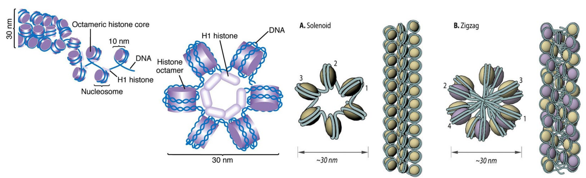
	

螺线管纤维相隔一距离的某些区段被「拉拢」固定在蛋白轴上，从而产生的许多从股价上伸出的纤维环（loops）。
+ 螺线管纤维缠绕在非组蛋白构成的中心轴（cenreal axis）骨架（支架蛋白）上形成染色质纤维环。
+ 染色质纤维环是在螺线管纤维基础上更高一级包装。
+ 从螺线管纤维到包装形成染色体是 DNA 压缩程度最高的阶段，估计在 200-400 倍。
+ 纤维环的形成是基表达较理想的结构，这些环状区是基因表达的活性单位所在。因为纤维环 DNA 比其他区域有更伸展的结构。

#### 染色体的组成

|过程|成分|名称|宽度增加|长度压缩|
|:---:|:---:|:---:|:---:|:---:|
|第一级|DNA+组蛋白|核小体|5 倍|7 倍
|第二级|核小体|螺线管|3倍|6倍|
|第三级|螺线管|超螺旋|13 倍|40倍|
|第四级|超螺旋|染色体|2.5-5 倍|5 倍|
|合计|||500-1000 倍|8400 倍 (8000-10000)|

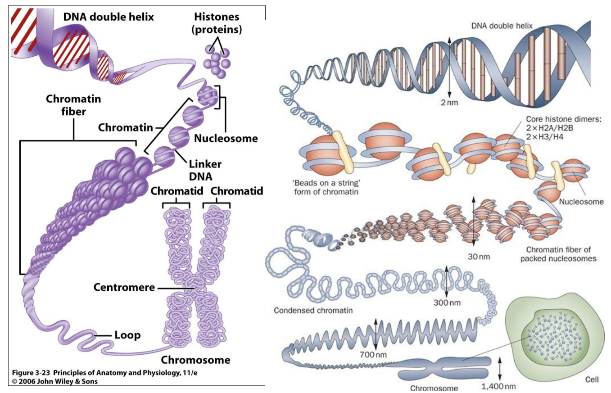

#### 真核生物基因组的结构特点

+ 基因组庞大
+ 存在大量重复序列
+ 大部分为非编码序列（$>90\%$）
+ 转录产物为单顺反子
+ 真核基因是断裂基因，有内含子
+ 存在大量顺式作用原件（启动子、增强子、沉默子）
+ 准在大量的 DNA 多态性
+ 有端粒结构

## 2.1.3 原核生物基因组

+ 基因组都比较小，DNA 与少量蛋白质（非组蛋白）结合构成染色体，染色质中无组蛋白。
+ 环状的染色体（现已发现了有些原核细胞含有多条染色体，或线性染色体，或而这皆有）；质粒（plasmid）DNA

#### 原核细胞基因组 DNA 的特点
1. 结构简练，绝大部分编码蛋白质。
	> E.coli 的基因组几乎全部由基因构成。
	> E.coli 的单条染色体上大多数 DNA 都编码蛋白质或 RNA，非编码序列也都参与调控基因转录。
2. 存在转录单元
	> 功能相关的基因往往集中在一起，他们可被一起转录成多顺反子 mRNA
3. 有重叠基因
	>同一段 DNA 能携带两种不同蛋白质的信息。
	>一个基因完全在另一个基因里。 B-A, E-D
	>部分重叠 K-C
	>两个基因只有一个碱基对重叠
	>
	>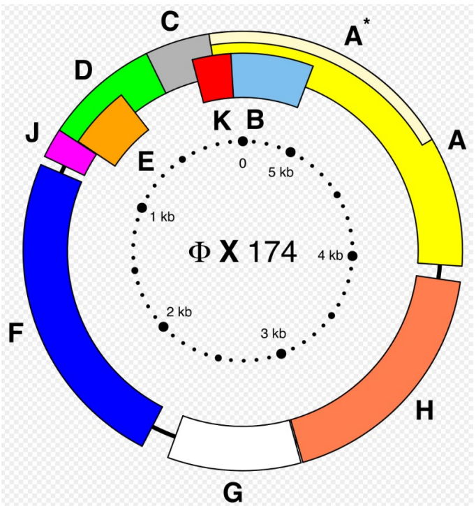

# 2.2 DNA 的结构

## 2.2.1 DNA 一级结构 Primary Structure

+ DNA分子的脱氧核苷酸的连接方式和排列顺序
+ DNA是由很多个脱氧核苷酸（dAMP、dGMP、dCMP和dTMP）通过 $3’,5’ - $磷酸二酯键连成的无分支双链线状或环状多核苷酸
+ 由于核苷酸之间的差异仅仅是碱基的不同，故可称为碱基顺序

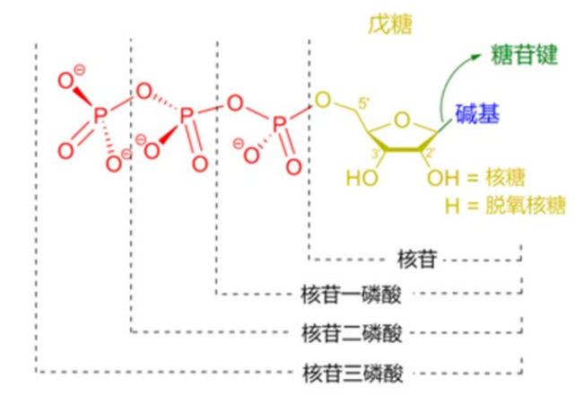

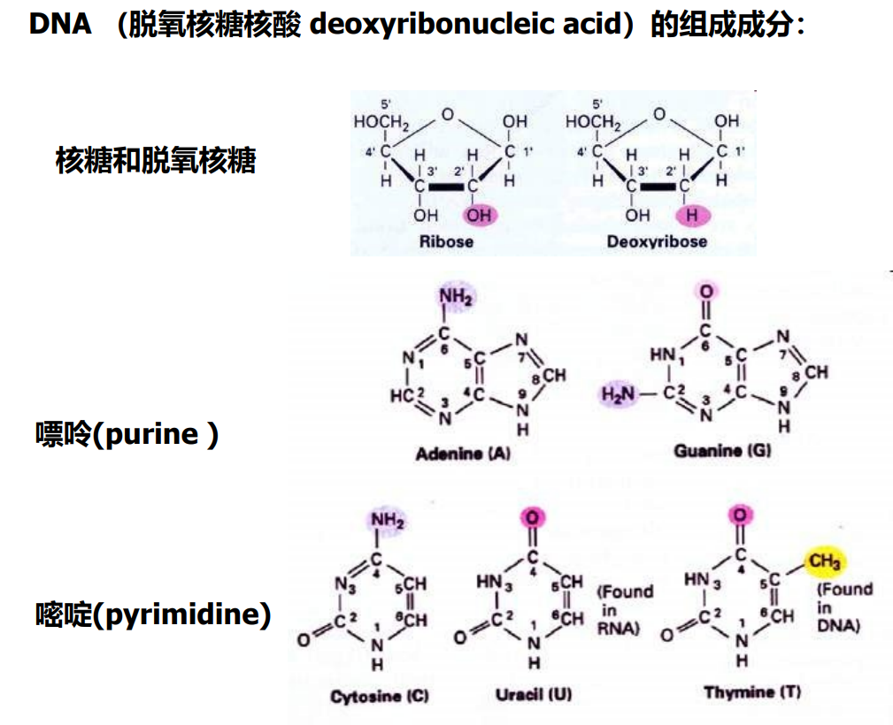

+ DNA 的一级结构表示了该 DNA 分子的化学构成。
+ 核苷酸序列对 DNA 高级结构的形成有很大影响。
+ DNA 是巨大的生物高分子，如人的DNA就包含了 $3\times 10^9$ 碱基对，如此数目的碱基可容纳巨大的信息量。
+ 生物界里的遗传信息都包含在组成 DNA 的 A、G、C、T 这四种核苷酸的排列顺序之中。
+ DNA 的方向是 $5’-3’$（蛋白质是 N-C）。
+ DNA通常以线性或环状形式存在。
+ DNA通常是双链的(dsDNA)，少数是单链的(ssDNA)。

核酸一级结构可用简写式表示；核酸分子简写式表示的中心含义即是核酸分子中的核苷酸（或碱基）排列顺序。

线条式: 在碱基符号书写基础上，以垂线（位于碱基之下）和斜线（位于垂线与 P 之间）分别表示糖基和磷酸酯键。

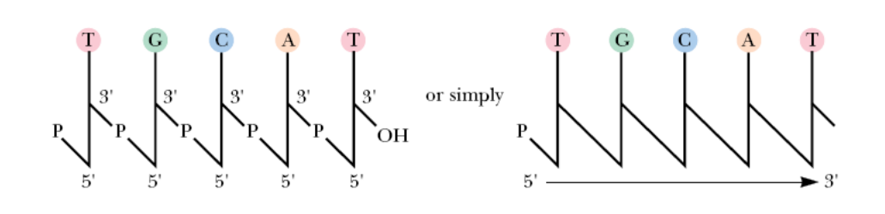

字符式：用 A、T、G、C、U 代表碱基，用 P 代表磷酸残基。核酸分子中的糖基、 糖苷键和酯键等均省略不写，将碱基和磷酸相间排列即可。不再注解「脱氧」与否，简写式中出现 T 的为 DNA 链，出现 U 则为 RNA 链。以 $5'$ 和 $3'$ 表示链的末端及方向，分别置于简写式的左右二端。

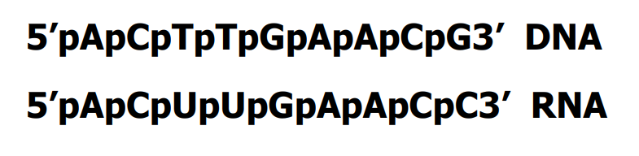

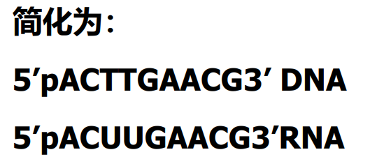

简写式的 $5'-$ 末端均含有一个磷酸残基（与糖基的 $C-5'$ 位上的羟基相连），$3'-$ 末端含有一个自由羟基（与糖基的 $C-3'$ 位相连）；若 $5'$ 端不写 P，则表示 $5’-$ 末端为自由羟基。

双链DNA分子的简写式多采用省略了磷酸残基的写法，在上述简式的基础上再增加一条互补链（complementary strand）即可。

## 2.2.2 DNA 的二级结构

DNA不仅具有严格的化学组成，还具有特殊的空间结构，主要以有规则的双螺旋形式存在。

+ DNA 双螺旋的基本特点
  + 由两条互相平行的脱氧核苷酸长链盘绕而成
  + 脱氧核糖和磷酸交替连接，排在外侧，构成基本骨架，碱基排列在内侧
  + 两条链上的碱基通过氢键结合，按一定规律形成碱基对 - 碱基互补配对原则

+ 结构参数
  + 螺旋直径 $2\ nm$
  + 螺旋周期包含 $10 \ bp$
  + 螺距 $3.4\ nm$
  + 相邻碱基对平面的间距 $0.34\ nm$

由于 A-T/C-G 配对时，两个核糖磷酸 连接的碱基的主轴并不成 180°，因此 DNA 在磷酸骨架距离较近的一侧形成小沟，而对侧形成大沟。

DNA 在磷酸骨架距离较近的一侧形成小沟，而对侧形成大沟。

在 B-DNA 中，大沟相对于小沟更宽，有利于蛋白质与碱基的接触。在 A-DNA 中，大沟相对于小沟窄而且深，所以不容易与蛋白质结合。

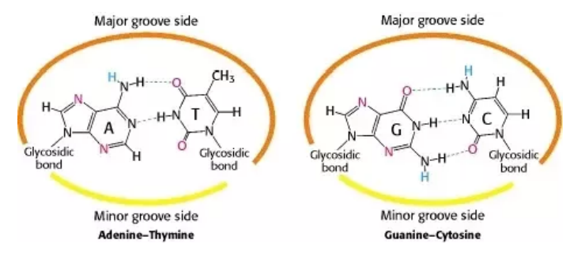

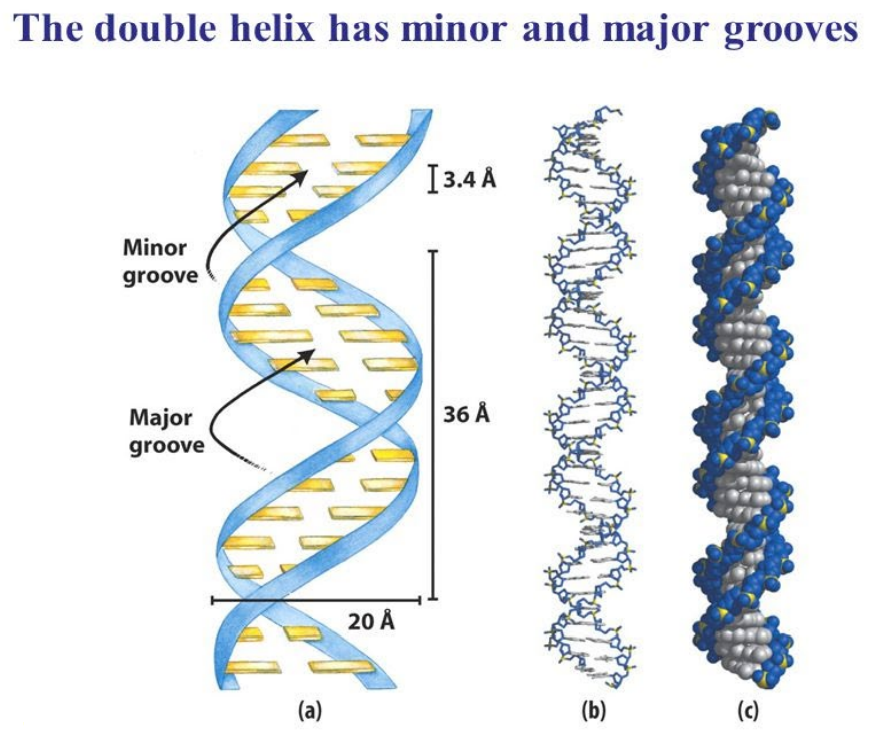

B 构象：生物体内天然存在的 DNA 几乎都以 B-DNA 存在。

A 构象：是在以钠、钾或铯作为反向离子时，将 DNA 纤维在 75% 相对湿度下进行 X 光衍射测定出来的。DNA-RNA 杂交分子、RNA-RNA 双链结构均为 A 构象。对基因表达有重要意义。

Z 构象：在 DNA 进行转录或其他一些生理过程中会产生 Z-DNA 结构，之后 DNA 会放出能量，形成 B-DNA.

|                  | 螺距 | 残基数 | 碱基倾斜 |
| :--------------: | :--: | :----: | :------: |
| A 型($75\%,Na$)  | 2.8  |   11   |   20°    |
| B 型 ($92\%,Na$) | 3.4  |   10   |    0°    |
|       Z 型       | 4.6  |   12   |    9°    |

### DNA 双链的变性和复性

+ 当 DNA 溶液温度接近沸点或者 pH 较高时，互补的两条链就可能分开，称为 DNA 的变性。
+ DNA 的复性指变性 DNA 在适当条件下，二条互补链全部或部分恢复到天然双螺旋结构的现象，它是变性的一种逆转过程。热变性 DNA 一般经缓慢冷却后即可复性，此过程称之为「退火」(annealing）。

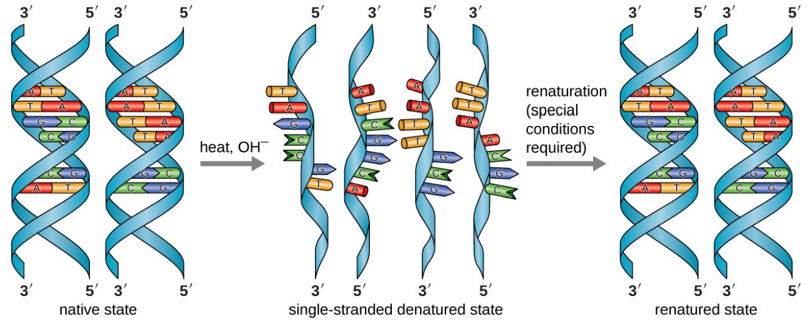

### 增色效应 减色效应

+ DNA 分子具有吸收 250~280 nm 波长的紫外光的特性，其吸收峰值在 260 nm. 变性后 DNA 双螺旋解开， 于是碱基外露，碱基中电子的相互作用更有利于紫外吸收，故而产生增色效应。
+ DNA 分子中碱基间电子的相互作用是紫外吸收的结构基础，但双螺旋结构有序堆积的碱基又「束缚」了这种作用， 因此变性 DNA 复性形成双螺旋结构后， 其 260 nm 紫外吸收会降低，这种现象叫减色效应。

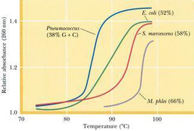

### $T_m$ 值

吸光度增加到最大值一半时的温度称为DNA 的解链温度或熔点（melting point）

+ DNA 中 G+C 的含量越高，$T_m$ 值越高。
  $$
  \begin{aligned}
  T_m&=69.3+0.41(G+C)\%;\ <25\ mer\\
  T_m&=4(G+C)+2(A+T)
  \end{aligned}
  $$

+ 溶液中的离子强度。DNA 一般在含盐缓冲液中比较稳定。

+ $T_m$ 值可以作为衡量 DNA 样品的均一性的标准。

## 2.2.3 DNA 的高级结构

超螺旋是双螺旋 DNA 进一步扭曲盘绕形成的三级结构。

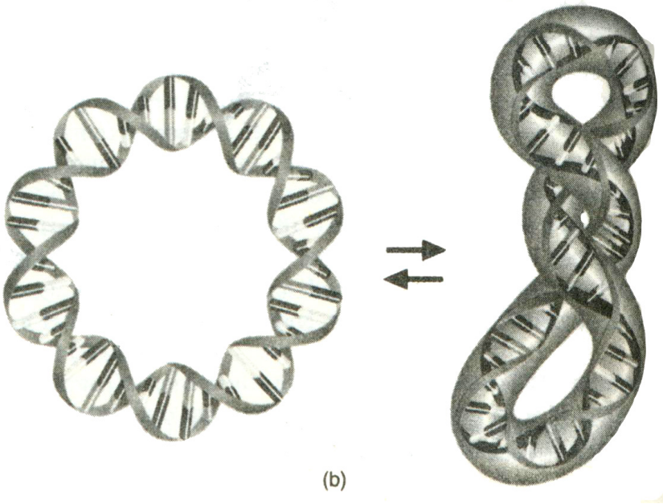

### (1)超螺旋(superhelix or supercoil)的发现

1965年电镜发现SV40和多瘤病毒的环形DNA的超螺旋

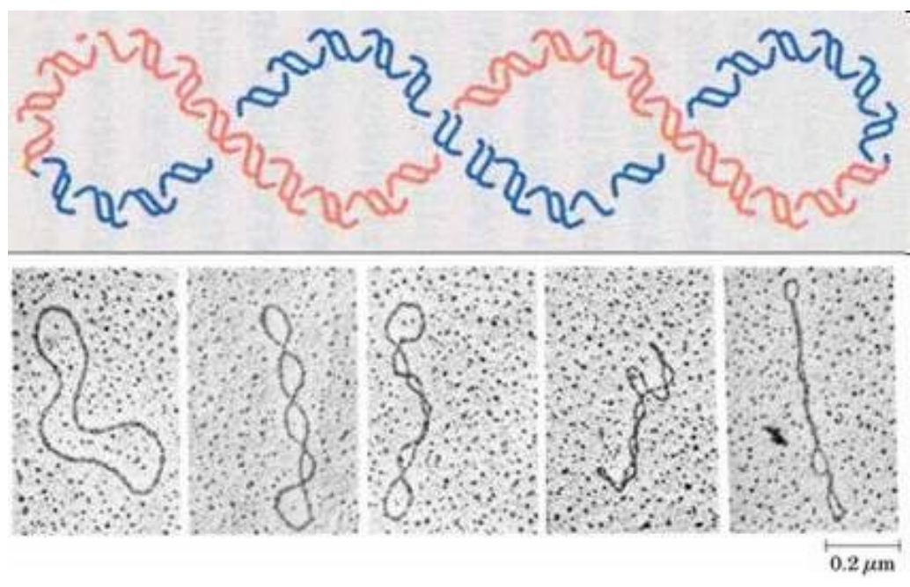

+ 绝大多数原核生物 DNA 都是共价封闭环(covalently closed circle DNA, ccc DNA)分子， 双螺旋环状分子螺旋化成为超螺旋结构。
+ 有些单链环形染色体(如 $φ\times174$)或双链线形染色体(如噬菌体)，在其生活周 期的某一阶段，染色体也变为超螺旋结构。
+ 真核生物的染色体多为线形分子，但 DNA 均与蛋白质相结合，同样具有超螺旋形式。

### (2)超螺旋的形成

+ DNA 双螺旋结构中，一般每转一圈有 10 个核苷酸对，平时，双螺旋总处于能量最低状态。
+ 若正常 DNA 双螺旋额外地多转或少转几圈，使每一圈的核苷酸数目大于或小于 10，就会出现双螺旋空间结构的改变，在 DNA 分子中产生额外张力。
+ 若此时双螺旋的末端是固定的或是环状分子，双链不能自由转动，额外的张力不能释放，导致 DNA 分子造成扭曲，形成超螺旋。

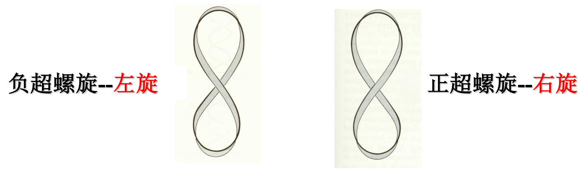

+ 负超螺旋：形成超螺旋时，旋转方向与 DNA 双螺旋方向相反，旋转结果使 DNA 分子内部张力减小，称为松旋效应。
+ 正超螺旋：与负超螺旋相反，形成超螺旋时的旋转方向与 DNA 双螺旋方向相同，结果加大了 DNA 分子内部张力，有紧旋效应。

---

+ 细菌和真核细胞中提取的环状 DNA 分子通常是负超螺旋， $\sigma$ 约为 $-0.06$.
+ 真核生物中，DNA 与组蛋白八聚体形成核小体结构时，存在着负超螺旋。
+ DNA 拓扑异构酶可导致产生 DNA 超螺旋或消除超螺旋。

### 超螺旋的意义

1. 超螺旋形式是 DNA 分子复制和转录的需要
   + 生物体内 DNA 结构是处于动态之中。超螺旋多余的能量可能使 DNA 双股链分开，或局部熔解。这种结构上的变化对 DNA 分子复制和转录等的启动很重要。
2. 超螺旋可使 DNA 分子形成高度致密的状态从而得以容纳于有限的空间。

# 2.3 DNA 的复制 DNA Replication

+ DNA 复制是一个以亲代 DNA 分子为模板合成子代 DNA 链的过程
+ 亲代 DNA 必须以自身分子为模板来合成新的分子，准确地复制成两个拷贝，并分配到两个子代细胞中去，才能真正完成其遗传信息载体的使命

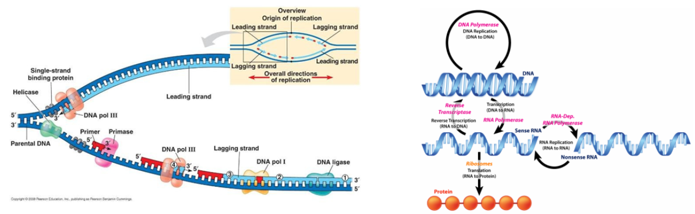

+ 基本名词
  + DNA polymerase: 以亲代 DNA 为模板，催化底物 dNTP 分子聚合形成子代 DNA 的一类酶
  + DNase: 切断 DNA 磷酸二酯键的酶
  + Endonuclease: 可水解分子链内部磷酸二酯键生成寡核苷酸的酶
  + Exonuclease: 从多核苷酸链的一段开始按序催化水解 $3,5-$ 磷酸二酯键，降解核苷酸的酶
    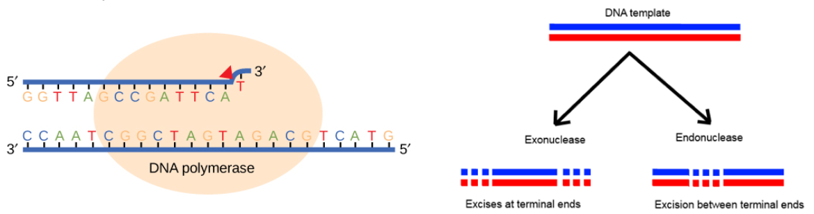
  + Replication fork: 是 DNA 复制时在 DNA 链上通过解旋、解链和 SSB 蛋白的结合等过程形成的 Y 字形结构
  + Semiconservative replication: 亲代 DNA 双链分离后的两条单链均可作为新链合成的模板，复制完成后的子代 DNA 分子的核苷酸序列均与亲代 DNA 分子相同，但子代 DNA 分子的双链一条来自亲代，另一条为新和成的链
    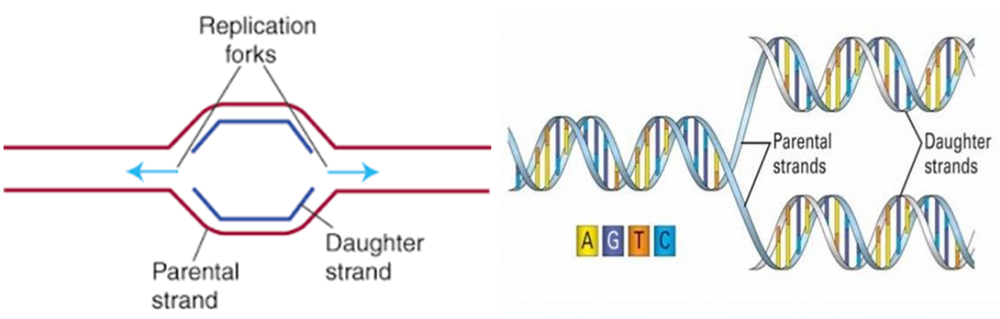

## 2.3.1 DNA 的半保留复制

### 米西尔逊-斯塔尔实验 Meselson-Stahl experiment

1. 大肠杆菌在含有 $^{15}NH_4Cl$ 为唯一氮源的培养基上生长多代，这时 DNA 中的嘌呤和嘧啶中的氮几乎全是 $^{15}N$.
2. 然后将大肠杆菌转移到含有 $^{14}NH_4Cl$ 的培养基中，在不同的间隔时间，收集细菌并裂解，提取 DNA，并用 $CsCl$ 梯度密度超速离心进行分析（这种方法可以分辨在密度上存在 $0.01\ g/mL$ 差异的生物大分子）。

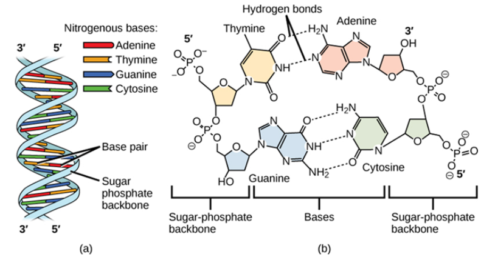

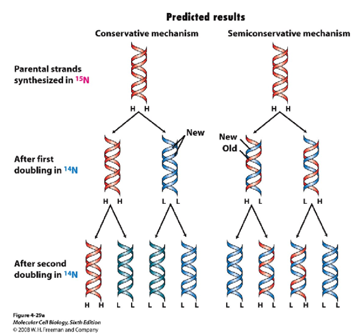

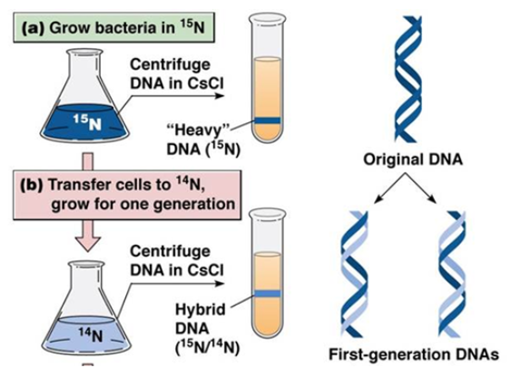

复制一代后，新合成的 DNA 同时含有 $^{15}N$ 和 $^{14}N$，因此 DNA 的复制不可能是全保留复制。

---

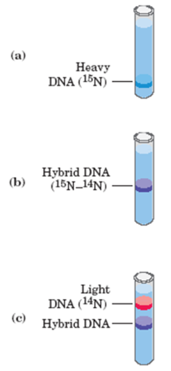

将 $^{15}N$ 标记的细菌在 $^{14}N$ 培养基上保持一代，然后提取 DNA，加热到 100 度，使 DNA 双链变性为单链，再对变性的单链进行 $CsCl$ 梯度密度超速离心，发现了两条分开的条带，表明一条链是 $^{15}N$ 标记的，另一条链是 $^{14}N$ 标记的因此 DNA 复制是半保留复制，而不是分散复制。

### DNA 的半保留复制 Semi Conservative Replication

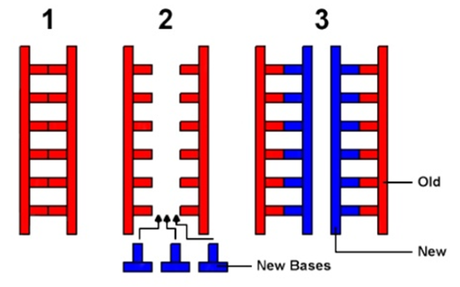

+ 复制区域双螺旋解旋并分开，以每条单链为模板，按碱基互补配对原则，由 DNA 聚合酶催化合成新的互补链，结果由一条链成为互补的两条链。
+ 由于每个子代 DNA 的一条链来自亲代 DNA，另一条链则是新合成的。这种复制方式称为半保留复制。

### DNA 的半不连续复制 Semi Discontinuous Replication

+ DNA 双螺旋的两条链是反向平行的因此在复制叉附近解开的 DNA 链一条是 $5'\to3'$ 方向，另一条是 $3'\to5'$ 方向两个模板极性不同。
+ 所有已知DNA聚合酶的合成方向都是 $5'\to3'$，两条链无法同时进行复制。为了解释 DNA 的等速复制现象，日本学者网崎（Okazaki）等提出了 DNA 的半不连续复制模型。

#### 冈崎片段 Okazaki Fragment

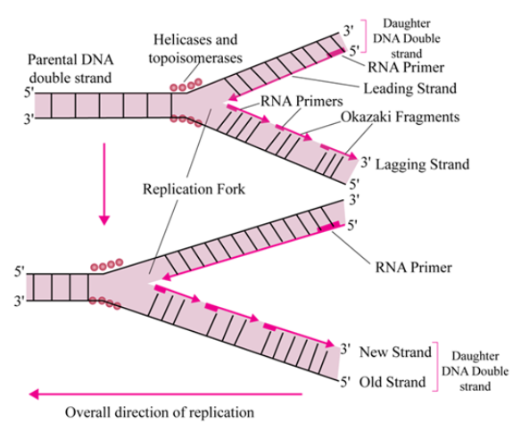

+ 用 $^3H$ 脱氧胸苷短时间标记后提取 DNA 得到不少平均长度为 $2-3\ kb$ DNA 片段。
+ 用 DNA 连接酶温度敏感突变株进行实验在连接酶不起作用的温度下有大量小片段累积，说明复制过程中至少有一条链首先合成较短的片段，然后再生成大分子 DNA 。
+ 前导链的连续复制和后随链的不连续复制在生物界是有普遍性的因而称之为 DNA 的半不连续复制。

#### 后随链合成

## 2.3.2 复制的起点、方向和速度

### 复制起点

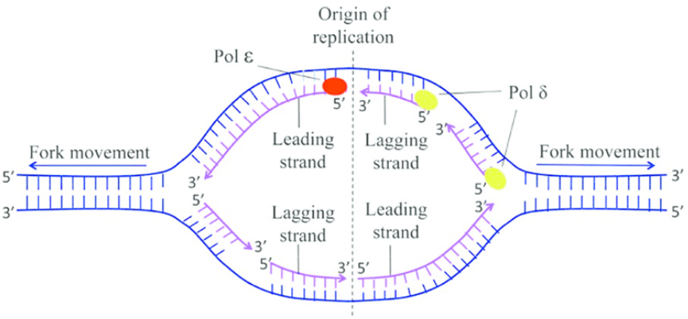

+ The origin of replication（复制起始点）：DNA 复制起始发生的位点
+ The replicon（复制子）：即具有一个复制起点，能独立完成复制单位

---

+ 细菌、病毒和线粒体的 DNA 分子都是作为单个复制子完成复制的。
+ 真核生物基因组可以同时在多个复制起点上进行双向复制，也就是说它们的基因组包含有多个复制子。

### 复制速率

+ 真核生物：复制叉移动速率 $1 - 3\ kb/min$，有多个复制起始点，可进行多复制子的同步复制。
+ 原核生物：复制叉移动速率 $50\ kb/min$，每个复制单位在 $30-60\ min$ 内完成复制，只有一个复制起始点，起始点可以连续发动复制。

### 复制方向

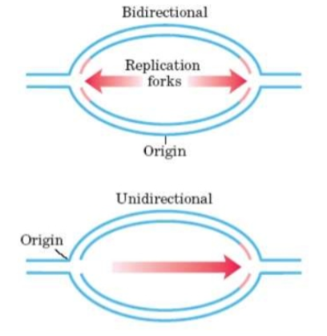

+ 真核生物

  + 双向等速

+ 原核生物

  + 双向等速
    + 大肠杆菌
  + 双向不等速
    + 枯草杆菌
  + 先单向后双向
    + R6K 质粒
  + 单向
    + ColE1 质粒

  > DNA  的单向复制只在噬菌体和某些质粒种观察到了。

## 2.3.3 复制的几种主要方式

### 线性 DNA 双链的复制

+ 复制叉以 DNA 分子上某一特定序列为起点，移动的方向和速度多种多样，但以双向等速方式为主。
+ 多个复制起点

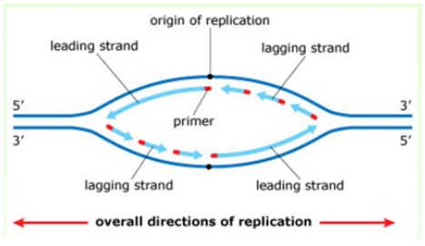

两个靠得很近的复制叉之间形成的空间称为「复制泡」（replication bubble）

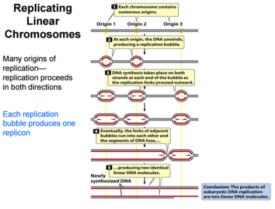

### 环状 DNA 双链的复制

#### $\theta$ 型 (如 $E.\ coli$)

#### 滚环型 (Rolling Circle) (如 $\Phi X174$)

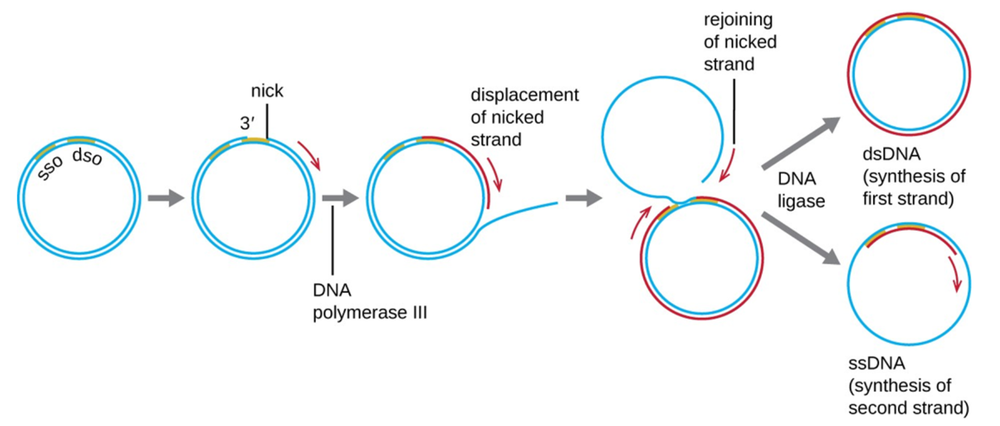

#### D-环形 (D-loop) (如哺乳动物线粒体 DNA)

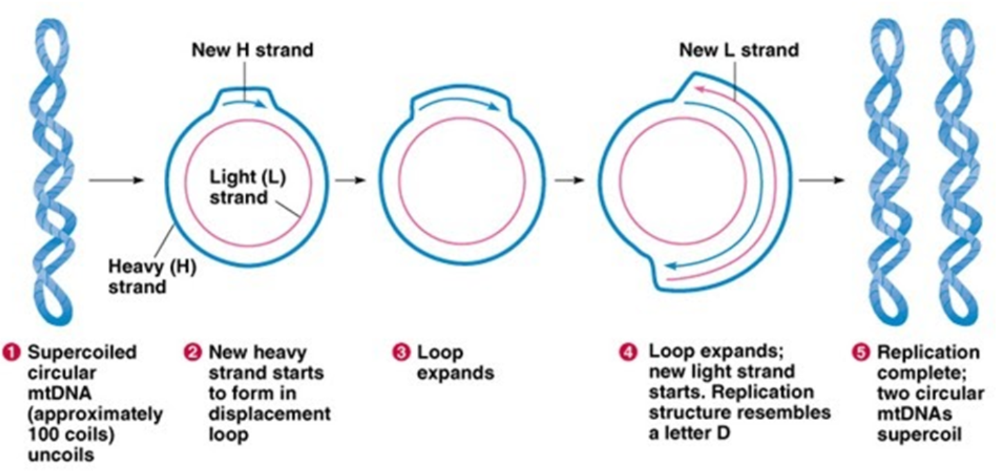

## 2.3.4 DNA 复制所需的条件

### 参与DNA复制的原料

+ 模板（template）：解开成单链的 DNA 母链
+ 底物（substrate）：dNTP（dATP，dGTP，dCTP，dTTP）
+ 聚合酶（polymerase）：依赖 DNA 的 DNA 聚合酶
+ 引物（primer）：提供 $3'-OH$ 末端使 dNTP 可以依次聚合
+ 引物酶（primase）：以 DNA 为模板催化合成 RNA 引物
+ 其他的酶和蛋白因子

### DNA 复制的基本化学反应

核苷酸之间形成 $3',5'-$ 磷酸二酯键
$$
\Large\ce{DNA_n + dNTP ->[DNA聚合酶等] DNA_{n+1} + PPi}
$$

> $n$：核苷酸的数量

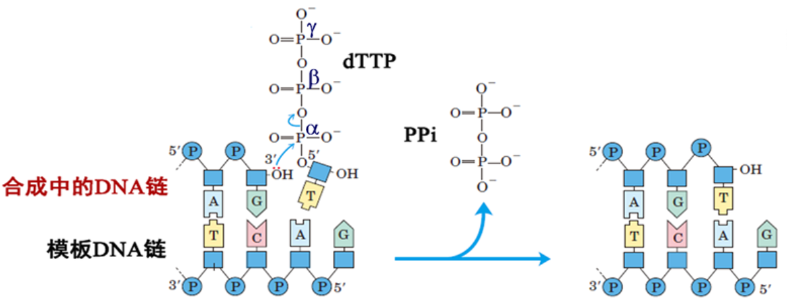

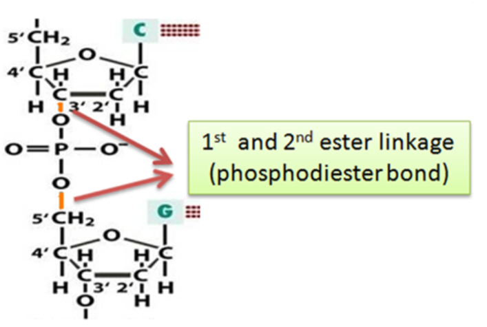

# 2.4 原核生物和真核生物 DNA 复制的特点

## 2.4.1 原核生物 DNA 复制的特点

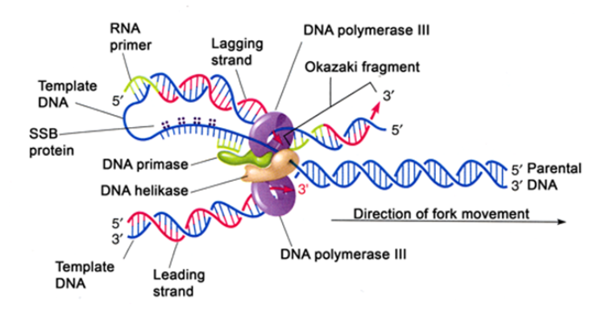

需要多种酶和蛋白质参与（包括拓扑异构酶、解旋酶、单链DNA结合蛋白、引物合成酶、DNA聚合酶及连接酶等）。

### DNA 双螺旋的解旋

#### 解旋酶 Helicase

DNA 复制时，解旋酶利用 ATP 的能量启动 DNA 解旋，使双链分开形成单链。

+ 在 $E.\ coll$ 中，解旋酶 DnaB 利用 ATP 水解的能量解开双螺旋，推动复制叉向前延伸。
+ 生物体内的解旋酶有多种，有些解旋酶还参与 DNA 修复，重组等非复制过程。

#### 拓扑异构酶 Topoisomerase

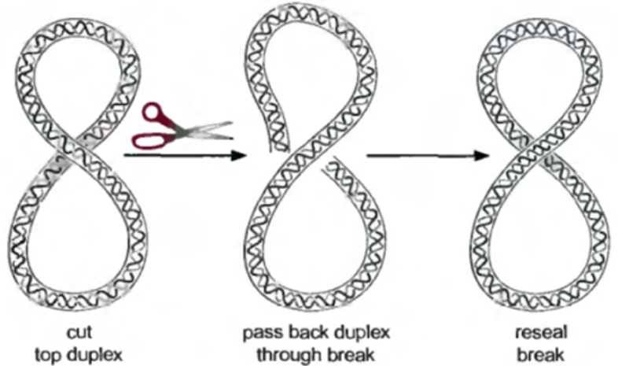

可以使 DNA 的两种拓扑异构体互变的酶。

DNA 拓扑异构酶催化同一 DNA 分子不同超螺旋状态之间转变。

参与复制、转录、重组

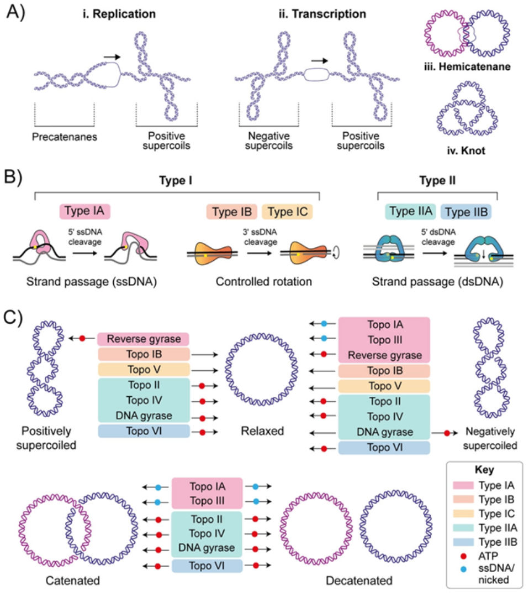

+ 拓扑异构酶可使 DNA 发生：
  + 连环化 (catenate)
  + 脱连环化 (decatenate)
  + 打结 (knot)
  + 解结 (unknot)

#### 单链结合蛋白 SSB

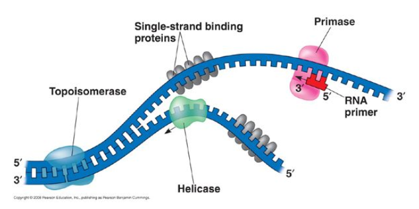

解旋酶沿着复制叉向前延伸产生了一段单链，细胞内大量的单链结合蛋白能和单链 DNA 结合，防止其重新配对形成双链。

+ SSB 的作用
  + 使 DNA 单链保持一种伸展构象它们与磷酸骨架结合，离开暴露的碱基，那些碱基能作为 DNA 合成的模板。
  + 使解开的单链不形成发卡结构。
  + 保护 DNA 单链不受 DNase 水解。

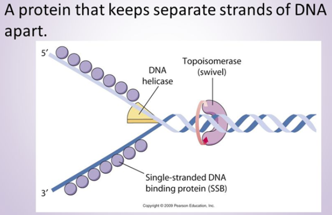

### DNA 复制的引发

#### 复制起始区

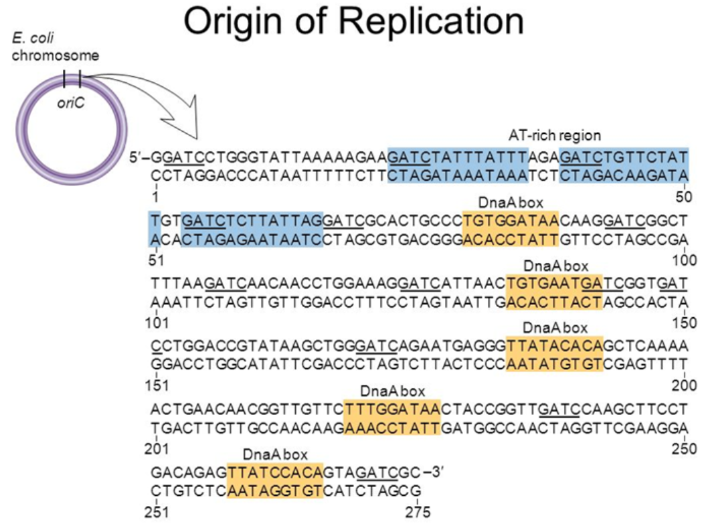

oriC 在不同原核生物中有同源性，很多细菌的 oriC 区在结构上相似的，在序列上有相当的保守型，而且在分类上越接近的细菌其同源性越高。

将 DNA 分子的复制起始点连接到任何一个 DNA 分子上，都能起始其复制
起始蛋白与 DNA 特异序列结合、促进解旋和引发体组装

#### 引发体(Primosome)由很多蛋白质因子参与形成

引发体(Primosome)是 DNA 复制过程中的一种负责专一性引发的多酶复合物，位于复制叉的前端。

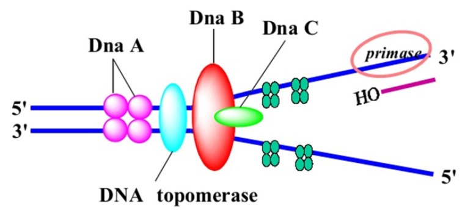

只有当引发前体把这 6 种蛋白质合在一起并于引发酶进一步组装后形成引发提，才能发挥其功效。

+ 引发酶(Primase 或引物酶)
  + DNA 合成是需要一段大约 6-10 个核苷酸长的 RNA 作为引物，由引物酶合成的。
  + RNA 聚合酶，仅用于合成 DNA 复制所需的一小段 RNA.
  + 引物酶以单链 DNA 作为模板，利用核糖核苷酸直接从头合成 RNA 引物(6-10 nt)

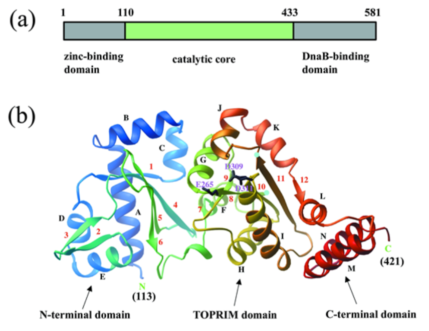

---

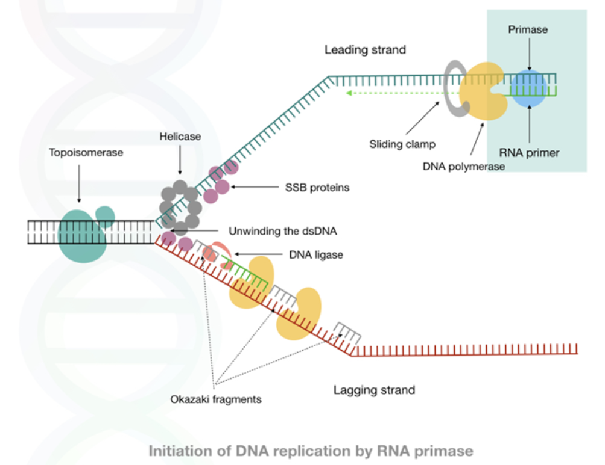

DNA 复制中引物的意义：减少致死突变。DNA 合成中最初几个核苷酸正确性远比其后的低。引物 RNA 随后被降解，从而减少了复制错误。

#### DNA 复制的过程

##### 复制的起始

1. 在 Hu 蛋白协助下，DnaA 蛋白识别并结合于复制起点 oriC 的 4 个 9 bp 重复序列处。受其影响，邻近 3 个 13 bp 富含 AT 的区域解开双链，形成解链区。

