# 2 DNA 与染色体

[toc]

# 2.1 染色体 Chromosome

DNA 位于染色体上，亲代能够将自己的遗传物质以染色体的形式传给子代，保持了物种的稳定性和连续性。

## 2.1.1 染色体概述

+ 存在于细胞核中，在显微镜下呈丝状或棒状，在细胞发生有丝分裂时期容易被碱性染料着色，因此而得名。
+ 包括 DNA 和蛋白两大部分。同一物种内每条染色体所带 DNA 的量是一定的，但不同染色体或不同物种之间变化很大。

## 2.1.2 真核细胞染色体的组成

+ 染色体特征
	+ 分子结构相对稳定
	+ 能够自我复制，使亲、子代之间保持连续性
	+ 指导蛋白质的合成，控制整个生命过程
	+ 产生可遗传的变异
+ 真核细胞 DNA 的转录和翻译在不同的空间和时间上进行，其基因表达的调控不仅与 DNA 序列有关，也与染色体的结构有关。
+ 组成
	+ DNA
	+ 组蛋白
	+ 非组蛋白
	+ RNA

### (1)组蛋白和非组蛋白

+ 组蛋白
	+ 染色体的结构蛋白，因富含碱性氨基酸 Arg（精氨酸）和 Lys（赖氨酸）而呈碱性，可与酸性的 DNA 紧密结合。
	+ 组蛋白包含五个部分，按照分子量由大到小分别称为 H1，H3，H2A，H2B 和 H4，它与 DNA 组成核小体。
	  
+ 组蛋白的特性
	+ 进化上的极端保守性，不同种生物组蛋白的氨基酸组成十分相似。
	+ 无组织特异性，仅发现少数例外（鸟鱼两栖红细胞 H1-H5，精细胞鱼精蛋白）。
	+ 肽链上氨基酸分布的不对称性，N 端碱性氨基酸，C 端疏水氨基酸。
	+ 组蛋白的修饰作用，甲基化，乙酰化，磷酸化，多聚 ADP 糖基化等，修饰作用只发生在细胞周期的特定时间和组蛋白的特定位点上。
	+ 富含赖氨酸的组蛋白 H5，只存在于鸟类， 两栖类含有细胞核的红细胞中，取代 H1，而与 H1 并无明显的亲缘关系。
+ 组蛋白修饰与表观遗传
	+ 
+ 非组蛋白
	+ 非组蛋白约为组蛋白总量的 $60\%-70\%$ ，可能有 20 - 100 种，常见的有 15 - 20 种
	+ 以 DNA 为底物的酶以及作用于组蛋白的一些酶，DNA 结合蛋白，组蛋白结合蛋白和调控蛋白等
	+ 非组蛋白具有多样性和异质性，不同组织细胞中其种类和数目都不同

### (2)DNA
+ 含有大量的重复序列；功能 DNA 序列大多被非功能 DNA 隔开
+ C 值（C Value）：一种生物单倍体基因组 DNA 的总量
+ C 值反常现象（C-value Paradox）：C 值往往与种系进化的复杂程度不一致
---
+ 真核细胞的核苷酸序列大致可被分为 3 类
	+ 不重复序列
		+ 一个或几个拷贝，占 DNA 总量的 $20\%-80\%$，序列长约 750-2000 bp. 结构基因基本上属于不重复序列。
	+ 中度重复序列
		+ 重复次数 $10-10^4$ 占 DNA 总量的 $10\%-40\%$，编码  rRNA, tRNA 和某些结构蛋白。中度重复序列往往分在在不重复序列之间。
	+ 高度重复序列
		+ 卫星 DNA，只在真核生物中发现，占基因组的 $10\%-60\%$，由 6-100 个碱基组成。高度浓缩，异染色质的组成部分。大多位于染色体着丝粒。
+ 人类基因组概况
	+ 人的核基因组由 3.2 G 个碱基组成
	+ 共 22 对染色体 + 1 对性染色体
	+ 最短的染色体 50 M，最长的染色体 260 M

### (3)核小体和染色质

+ 核小体（Nucleosome）
	+ 染色体 DNA 的一级包装
+ 染色质纤维（30 nm fiber）
	+ 二级包装
+ 染色质纤维环
	+ 三级包装


微球菌核酸酶（Micrococcal nuclease）处理染色质后电泳，被保留的 DNA 片段均为 200 bp 基本单位的倍数。

核小体单体被微球菌核酸酶处理后，随着时间延长，其降解产物（DNA 片段）会逐渐缩短，从 200 bp 降至 146 bp，至此很难再进一步降解。这种稳定结构为核心颗粒。

+ 核小体，直径 10 nm，染色体中 DNA 压缩的第一步，收缩至原尺寸的 1/7
+ 核小体由核心颗粒和连结线 DNA 两部分组成
	1. 每个核小体单位包括 200 bp 的 DNA、一个组蛋白核心和一个 H1
	2. 由 H2A、H2B、H3、H4 各两份子形成八聚体，构成核心颗粒
	3. DNA 分子以左手螺旋缠绕在核心颗粒表面，每圈 80 bp，共 1.75 圈，约 146 bp，两端被 H1 锁合
	4. 相邻核心颗粒之间为一段 20-60 bp 的连接线 DNA
+ 染色质纤维
	+ 染色质进一步折叠转成 30 nm 纤维，这就是染色体 DNA 的二级包装 - 螺线管纤维（solenodial fiber）
	+ 每个螺线管包含 6 个核小体
	+ 
	

螺线管纤维相隔一距离的某些区段被「拉拢」固定在蛋白轴上，从而产生的许多从股价上伸出的纤维环（loops）。
+ 螺线管纤维缠绕在非组蛋白构成的中心轴（cenreal axis）骨架（支架蛋白）上形成染色质纤维环。
+ 染色质纤维环是在螺线管纤维基础上更高一级包装。
+ 从螺线管纤维到包装形成染色体是 DNA 压缩程度最高的阶段，估计在 200-400 倍。
+ 纤维环的形成是基表达较理想的结构，这些环状区是基因表达的活性单位所在。因为纤维环 DNA 比其他区域有更伸展的结构。

#### 染色体的组成

|过程|成分|名称|宽度增加|长度压缩|
|:---:|:---:|:---:|:---:|:---:|
|第一级|DNA+组蛋白|核小体|5 倍|7 倍
|第二级|核小体|螺线管|3倍|6倍|
|第三级|螺线管|超螺旋|13 倍|40倍|
|第四级|超螺旋|染色体|2.5-5 倍|5 倍|
|合计|||500-1000 倍|8400 倍<br>(8000-10000)|

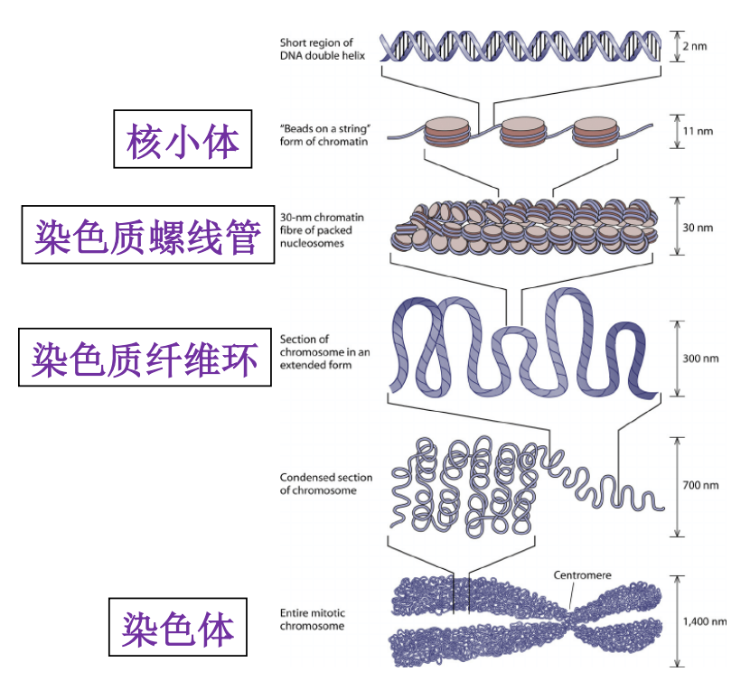


#### 真核生物基因组的结构特点

+ 基因组庞大
+ 存在大量重复序列
+ 大部分为非编码序列（$>90\%$）
+ 转录产物为单顺反子（一条 mRNA 只含有一个翻译起始点和一个终止点，编码一个基因片段。）
+ 真核基因是断裂基因，有内含子
+ 存在大量顺式作用原件（启动子、增强子、沉默子）
  + 顺式作用元件：存在于基因旁侧序列中，能影响基因表达的一段 DNA 序列。

+ 准在大量的 DNA 多态性
+ 有端粒结构

## 2.1.3 原核生物基因组

+ 基因组都比较小，DNA 与少量蛋白质（非组蛋白）结合构成染色体，染色质中无组蛋白。
+ 环状的染色体（现已发现了有些原核细胞含有多条染色体，或线性染色体，或而这皆有）；质粒（plasmid）DNA

#### 原核细胞基因组 DNA 的特点

1. 结构简练，绝大部分编码蛋白质。
	> E.coli 的基因组几乎全部由基因构成。
	> E.coli 的单条染色体上大多数 DNA 都编码蛋白质或 RNA，非编码序列也都参与调控基因转录。
2. 存在转录单元
	> 功能相关的基因往往集中在一起，他们可被一起转录成多顺反子 mRNA
3. 有重叠基因
	>同一段 DNA 能携带两种不同蛋白质的信息。
	>一个基因完全在另一个基因里。 B-A, E-D
	>部分重叠 K-C
	>两个基因只有一个碱基对重叠
	>
	>

# 2.2 DNA 的结构

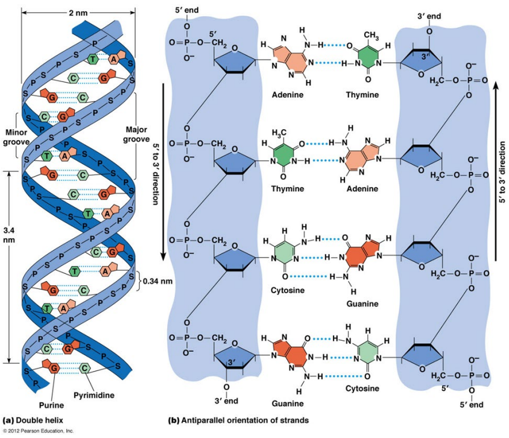

## 2.2.1 DNA 一级结构 Primary Structure

+ DNA分子的脱氧核苷酸的连接方式和排列顺序
+ DNA是由很多个脱氧核苷酸（dAMP、dGMP、dCMP和dTMP）通过 $3’,5’ - $磷酸二酯键连成的无分支双链线状或环状多核苷酸
+ 由于核苷酸之间的差异仅仅是碱基的不同，故可称为碱基顺序


+ DNA 的一级结构表示了该 DNA 分子的化学构成。
+ 核苷酸序列对 DNA 高级结构的形成有很大影响。
+ DNA 是巨大的生物高分子，如人的DNA就包含了 $3\times 10^9$ 碱基对，如此数目的碱基可容纳巨大的信息量。
+ 生物界里的遗传信息都包含在组成 DNA 的 A、G、C、T 这四种核苷酸的排列顺序之中。
+ DNA 的方向是 $5’-3’$（蛋白质是 N-C）。
+ DNA通常以线性或环状形式存在。
+ DNA通常是双链的(dsDNA)，少数是单链的(ssDNA)。

核酸一级结构可用简写式表示；核酸分子简写式表示的中心含义即是核酸分子中的核苷酸（或碱基）排列顺序。

线条式: 在碱基符号书写基础上，以垂线（位于碱基之下）和斜线（位于垂线与 P 之间）分别表示糖基和磷酸酯键。


字符式：用 A、T、G、C、U 代表碱基，用 P 代表磷酸残基。核酸分子中的糖基、 糖苷键和酯键等均省略不写，将碱基和磷酸相间排列即可。不再注解「脱氧」与否，简写式中出现 T 的为 DNA 链，出现 U 则为 RNA 链。以 $5'$ 和 $3'$ 表示链的末端及方向，分别置于简写式的左右二端。


简写式的 $5'-$ 末端均含有一个磷酸残基（与糖基的 $C-5'$ 位上的羟基相连），$3'-$ 末端含有一个自由羟基（与糖基的 $C-3'$ 位相连）；若 $5'$ 端不写 P，则表示 $5’-$ 末端为自由羟基。

双链DNA分子的简写式多采用省略了磷酸残基的写法，在上述简式的基础上再增加一条互补链（complementary strand）即可。

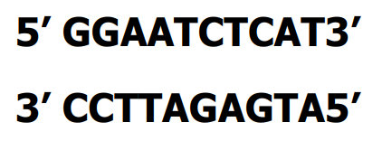

## 2.2.2 DNA 的二级结构

DNA不仅具有严格的化学组成，还具有特殊的空间结构，主要以有规则的双螺旋形式存在。

+ DNA 双螺旋的基本特点
  + 由两条互相平行的脱氧核苷酸长链盘绕而成
  + 脱氧核糖和磷酸交替连接，排在外侧，构成基本骨架，碱基排列在内侧
  + 两条链上的碱基通过氢键结合，按一定规律形成碱基对 - 碱基互补配对原则

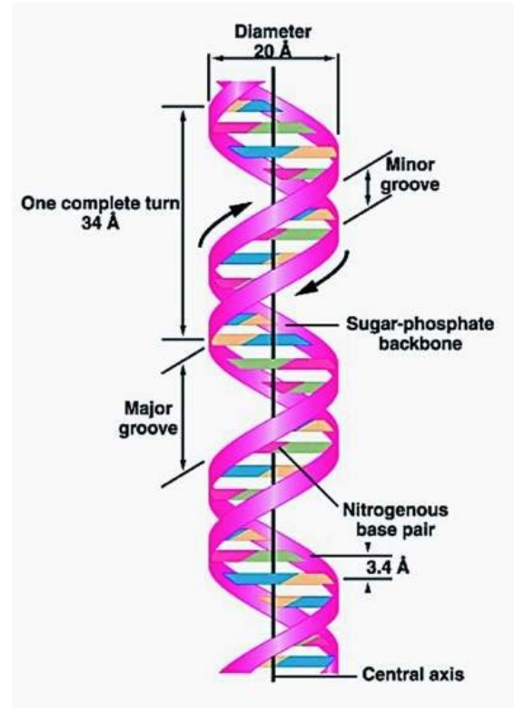

+ 结构参数
  + 螺旋直径 $2\ nm$
  + 螺旋周期包含 $10 \ bp$
  + 螺距 $3.4\ nm$
  + 相邻碱基对平面的间距 $0.34\ nm$

由于 A-T/C-G 配对时，两个核糖磷酸连接的碱基的主轴并不成 180°，因此 DNA 在磷酸骨架距离较近的一侧形成小沟，而对侧形成大沟。

DNA 在磷酸骨架距离较近的一侧形成小沟，而对侧形成大沟。

在 B-DNA 中，大沟相对于小沟更宽，有利于蛋白质与碱基的接触。在 A-DNA 中，大沟相对于小沟窄而且深，所以不容易与蛋白质结合。


B 构象：生物体内天然存在的 DNA 几乎都以 B-DNA 存在。

A 构象：是在以钠、钾或铯作为反向离子时，将 DNA 纤维在 75% 相对湿度下进行 X 光衍射测定出来的。DNA-RNA 杂交分子、RNA-RNA 双链结构均为 A 构象。对基因表达有重要意义。

Z 构象：在 DNA 进行转录或其他一些生理过程中会产生 Z-DNA 结构，之后 DNA 会放出能量，形成 B-DNA.

|                  | 螺距 | 残基数 | 碱基倾斜 |
| :--------------: | :--: | :----: | :------: |
| A 型($75\%,Na$)  | 2.8  |   11   |   20°    |
| B 型 ($92\%,Na$) | 3.4  |   10   |    0°    |
|       Z 型       | 4.6  |   12   |    9°    |

### DNA 双链的变性和复性

+ 当 DNA 溶液温度接近沸点或者 pH 较高时，互补的两条链就可能分开，称为 DNA 的变性。
+ DNA 的复性指变性 DNA 在适当条件下，二条互补链全部或部分恢复到天然双螺旋结构的现象，它是变性的一种逆转过程。热变性 DNA 一般经缓慢冷却后即可复性，此过程称之为「退火」(annealing）。


### 增色效应 减色效应

+ DNA 分子具有吸收 250~280 nm 波长的紫外光的特性，其吸收峰值在 260 nm. 变性后 DNA 双螺旋解开， 于是碱基外露，碱基中电子的相互作用更有利于紫外吸收，故而产生增色效应。
+ DNA 分子中碱基间电子的相互作用是紫外吸收的结构基础，但双螺旋结构有序堆积的碱基又「束缚」了这种作用， 因此变性 DNA 复性形成双螺旋结构后， 其 260 nm 紫外吸收会降低，这种现象叫减色效应。


### $T_m$ 值

吸光度增加到最大值一半时的温度称为DNA 的解链温度或熔点（melting point）

+ DNA 中 G+C 的含量越高，$T_m$ 值越高。
  $$
  \begin{aligned}
  T_m&=69.3+0.41(G+C)\%;\ <25\ mer\\
  T_m&=4(G+C)+2(A+T)
  \end{aligned}
  $$

+ 溶液中的离子强度。DNA 一般在含盐缓冲液中比较稳定。

+ $T_m$ 值可以作为衡量 DNA 样品的均一性的标准。

## 2.2.3 DNA 的高级结构

超螺旋是双螺旋 DNA 进一步扭曲盘绕形成的三级结构。


### (1)超螺旋(superhelix or supercoil)的发现

1965年电镜发现SV40和多瘤病毒的环形DNA的超螺旋


+ 绝大多数原核生物 DNA 都是共价封闭环(covalently closed circle DNA, ccc DNA)分子， 双螺旋环状分子螺旋化成为超螺旋结构。
+ 有些单链环形染色体(如 $φ\times174$)或双链线形染色体(如噬菌体)，在其生活周 期的某一阶段，染色体也变为超螺旋结构。
+ 真核生物的染色体多为线形分子，但 DNA 均与蛋白质相结合，同样具有超螺旋形式。

### (2)超螺旋的形成

+ DNA 双螺旋结构中，一般每转一圈有 10 个核苷酸对，平时，双螺旋总处于能量最低状态。
+ 若正常 DNA 双螺旋额外地多转或少转几圈，使每一圈的核苷酸数目大于或小于 10，就会出现双螺旋空间结构的改变，在 DNA 分子中产生额外张力。
+ 若此时双螺旋的末端是固定的或是环状分子，双链不能自由转动，额外的张力不能释放，导致 DNA 分子造成扭曲，形成超螺旋。


+ 负超螺旋：形成超螺旋时，旋转方向与 DNA 双螺旋方向相反，旋转结果使 DNA 分子内部张力减小，称为松旋效应。
+ 正超螺旋：与负超螺旋相反，形成超螺旋时的旋转方向与 DNA 双螺旋方向相同，结果加大了 DNA 分子内部张力，有紧旋效应。

---

+ 细菌和真核细胞中提取的环状 DNA 分子通常是负超螺旋， $\sigma$ 约为 $-0.06$.
+ 真核生物中，DNA 与组蛋白八聚体形成核小体结构时，存在着负超螺旋。
+ DNA 拓扑异构酶可导致产生 DNA 超螺旋或消除超螺旋。

### 超螺旋的意义

1. 超螺旋形式是 DNA 分子复制和转录的需要。
   + 生物体内 DNA 结构是处于动态之中。超螺旋多余的能量可能使 DNA 双股链分开，或局部熔解。这种结构上的变化对 DNA 分子复制和转录等的启动很重要。
2. 超螺旋可使 DNA 分子形成高度致密的状态从而得以容纳于有限的空间。

# 2.3 DNA 的复制 DNA Replication

+ DNA 复制是一个以亲代 DNA 分子为模板合成子代 DNA 链的过程。
+ 亲代 DNA 必须以自身分子为模板来合成新的分子，准确地复制成两个拷贝，并分配到两个子代细胞中去，才能真正完成其遗传信息载体的使命。


+ 基本名词
  + DNA polymerase: 以亲代 DNA 为模板，催化底物 dNTP 分子聚合形成子代 DNA 的一类酶
  + DNase: 切断 DNA 磷酸二酯键的酶
  + Endonuclease: 可水解分子链内部磷酸二酯键生成寡核苷酸的酶
  + Exonuclease: 从多核苷酸链的一段开始按序催化水解 $3,5-$ 磷酸二酯键，降解核苷酸的酶
    
  + Replication fork: 是 DNA 复制时在 DNA 链上通过解旋、解链和 SSB 蛋白的结合等过程形成的 Y 字形结构
  + Semiconservative replication: 亲代 DNA 双链分离后的两条单链均可作为新链合成的模板，复制完成后的子代 DNA 分子的核苷酸序列均与亲代 DNA 分子相同，但子代 DNA 分子的双链一条来自亲代，另一条为新和成的链
    

## 2.3.1 DNA 的半保留复制

### 米西尔逊-斯塔尔实验 Meselson-Stahl experiment

1. 大肠杆菌在含有 $^{15}NH_4Cl$ 为唯一氮源的培养基上生长多代，这时 DNA 中的嘌呤和嘧啶中的氮几乎全是 $^{15}N$.
2. 然后将大肠杆菌转移到含有 $^{14}NH_4Cl$ 的培养基中，在不同的间隔时间，收集细菌并裂解，提取 DNA，并用 $CsCl$ 梯度密度超速离心进行分析（这种方法可以分辨在密度上存在 $0.01\ g/mL$ 差异的生物大分子）。


复制一代后，新合成的 DNA 同时含有 $^{15}N$ 和 $^{14}N$，因此 DNA 的复制不可能是全保留复制。

---


将 $^{15}N$ 标记的细菌在 $^{14}N$ 培养基上保持一代，然后提取 DNA，加热到 100 度，使 DNA 双链变性为单链，再对变性的单链进行 $CsCl$ 梯度密度超速离心，发现了两条分开的条带，表明一条链是 $^{15}N$ 标记的，另一条链是 $^{14}N$ 标记的因此 DNA 复制是半保留复制，而不是分散复制。

### DNA 的半保留复制 Semi Conservative Replication


+ 复制区域双螺旋解旋并分开，以每条单链为模板，按碱基互补配对原则，由 DNA 聚合酶催化合成新的互补链，结果由一条链成为互补的两条链。
+ 由于每个子代 DNA 的一条链来自亲代 DNA，另一条链则是新合成的。这种复制方式称为半保留复制。

### DNA 的半不连续复制 Semi Discontinuous Replication

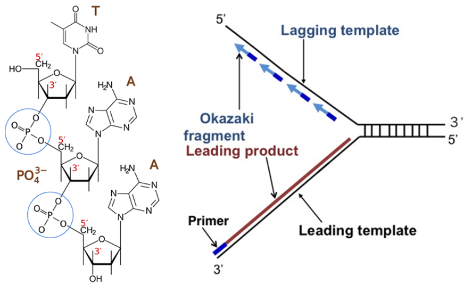

+ DNA 双螺旋的两条链是反向平行的因此在复制叉附近解开的 DNA 链一条是 $5'\to3'$ 方向，另一条是 $3'\to5'$ 方向两个模板极性不同。
+ 所有已知DNA聚合酶的合成方向都是 $5'\to3'$，两条链无法同时进行复制。为了解释 DNA 的等速复制现象，日本学者冈崎（Okazaki）等提出了 DNA 的半不连续复制模型。

#### 冈崎片段 Okazaki Fragment


+ 用 $^3H$ 脱氧胸苷短时间标记后提取 DNA 得到不少平均长度为 $2-3\ kb$ DNA 片段。
+ 用 DNA 连接酶温度敏感突变株进行实验在连接酶不起作用的温度下有大量小片段累积，说明复制过程中至少有一条链首先合成较短的片段，然后再生成大分子 DNA 。
+ 前导链的连续复制和后随链的不连续复制在生物界是有普遍性的因而称之为 DNA 的半不连续复制。

#### 后随链合成

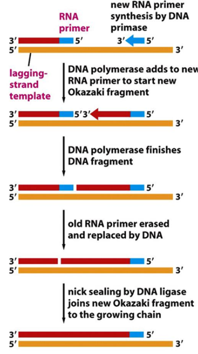

## 2.3.2 复制的起点、方向和速度

### 复制起点


+ The origin of replication（复制起始点）：DNA 复制起始发生的位点
+ The replicon（复制子）：即具有一个复制起点，能独立完成复制单位

---

+ 细菌、病毒和线粒体的 DNA 分子都是作为单个复制子完成复制的。
+ 真核生物基因组可以同时在多个复制起点上进行双向复制，也就是说它们的基因组包含有多个复制子。

### 复制速率

+ 真核生物：复制叉移动速率 $1 - 3\ kb/min$，有多个复制起始点，可进行多复制子的同步复制。
+ 原核生物：复制叉移动速率 $50\ kb/min$，每个复制单位在 $30-60\ min$ 内完成复制，只有一个复制起始点，起始点可以连续发动复制。

### 复制方向


+ 真核生物

  + 双向等速

+ 原核生物

  + 双向等速
    + 大肠杆菌
  + 双向不等速
    + 枯草杆菌
  + 先单向后双向
    + R6K 质粒
  + 单向
    + ColE1 质粒

  > DNA  的单向复制只在噬菌体和某些质粒中观察到了。

## 2.3.3 复制的几种主要方式

### 线性 DNA 双链的复制

+ 复制叉以 DNA 分子上某一特定序列为起点，移动的方向和速度多种多样，但以双向等速方式为主。
+ 多个复制起点


两个靠得很近的复制叉之间形成的空间称为「复制泡」（replication bubble）


### 环状 DNA 双链的复制

#### $\theta$ 型 (如 $E.\ coli$)

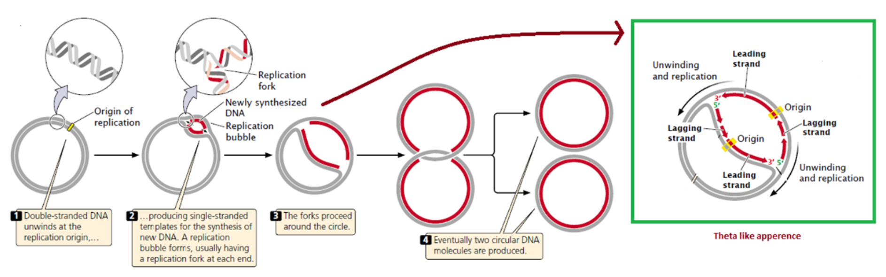

#### 滚环型 (Rolling Circle) (如 $\Phi X174$)


#### D-环形 (D-loop) (如哺乳动物线粒体 DNA)


## 2.3.4 DNA 复制所需的条件

### 参与DNA复制的原料

+ 模板（template）：解开成单链的 DNA 母链
+ 底物（substrate）：dNTP（dATP，dGTP，dCTP，dTTP）
+ 聚合酶（polymerase）：依赖 DNA 的 DNA 聚合酶
+ 引物（primer）：提供 $3'-OH$ 末端使 dNTP 可以依次聚合
+ 引物酶（primase）：以 DNA 为模板催化合成 RNA 引物
+ 其他的酶和蛋白因子

### DNA 复制的基本化学反应

核苷酸之间形成 $3',5'-$ 磷酸二酯键
$$
\Large\ce{DNA_n + dNTP ->[DNA聚合酶等] DNA_{n+1} + PPi}
$$

> $n$：核苷酸的数量


# 2.4 原核生物和真核生物 DNA 复制的特点

## 2.4.1 原核生物 DNA 复制的特点


需要多种酶和蛋白质参与（包括拓扑异构酶、解旋酶、单链DNA结合蛋白、引物合成酶、DNA聚合酶及连接酶等）。

### DNA 双螺旋的解旋

#### 解旋酶 Helicase

DNA 复制时，解旋酶利用 ATP 的能量启动 DNA 解旋，使双链分开形成单链。

+ 在 $E.\ coll$ 中，解旋酶 DnaB 利用 ATP 水解的能量解开双螺旋，推动复制叉向前延伸。
+ 生物体内的解旋酶有多种，有些解旋酶还参与 DNA 修复，重组等非复制过程。

#### 拓扑异构酶 Topoisomerase


可以使 DNA 的两种拓扑异构体互变的酶。

DNA 拓扑异构酶催化同一 DNA 分子不同超螺旋状态之间转变。

参与复制、转录、重组


+ 拓扑异构酶可使 DNA 发生：
  + 连环化 (catenate)
  + 脱连环化 (decatenate)
  + 打结 (knot)
  + 解结 (unknot)

#### 单链结合蛋白 SSB


解旋酶沿着复制叉向前延伸产生了一段单链，细胞内大量的单链结合蛋白能和单链 DNA 结合，防止其重新配对形成双链。

+ SSB 的作用
  + 使 DNA 单链保持一种伸展构象它们与磷酸骨架结合，离开暴露的碱基，那些碱基能作为 DNA 合成的模板。
  + 使解开的单链不形成发卡结构。
  + 保护 DNA 单链不受 DNase 水解。


### DNA 复制的引发

#### 复制起始区


oriC 在不同原核生物中有同源性，很多细菌的 oriC 区在结构上相似的，在序列上有相当的保守型，而且在分类上越接近的细菌其同源性越高。

将 DNA 分子的复制起始点连接到任何一个 DNA 分子上，都能起始其复制
起始蛋白与 DNA 特异序列结合、促进解旋和引发体组装

#### 引发体(Primosome)由很多蛋白质因子参与形成

引发体(Primosome)是 DNA 复制过程中的一种负责专一性引发的多酶复合物，位于复制叉的前端。


只有当引发前体把这 6 种蛋白质合在一起并与引发酶进一步组装后形成引发体，才能发挥其功效。

+ 引发酶(Primase 或引物酶)
  + DNA 合成是需要一段大约 6-10 个核苷酸长的 RNA 作为引物，由引物酶合成的。
  + RNA 聚合酶，仅用于合成 DNA 复制所需的一小段 RNA.
  + 引物酶以单链 DNA 作为模板，利用核糖核苷酸直接从头合成 RNA 引物(6-10 nt)


---


DNA 复制中引物的意义：减少致死突变。DNA 合成中最初几个核苷酸正确性远比其后的低。引物 RNA 随后被降解，从而减少了复制错误。

#### DNA 复制的过程

##### 复制的起始

1. 在 Hu 蛋白协助下，DnaA 蛋白识别并结合于复制起点 oriC 的 4 个 9 bp 重复序列处。受其影响，邻近 3 个 13 bp 富含 AT 的区域解开双链，形成解链区。

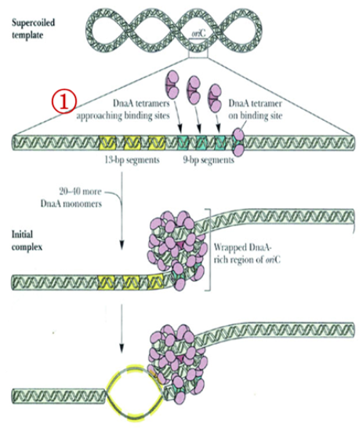


2. 在 DnaC 帮助下，DnaB（六聚体）结合于解链区。

3. DnaB 逐步解开 DNA 双链。这一步需要 DNA 旋转酶缓解拓扑张力，并由 SSB 蛋白使 DNA 单链保持分开状态。

   

4. 引物酶（DnaG）结合到引发前体上，装成了引发体（Primosome）

5. 在 SSB 和拓扑异构酶的参与下，引发体可在单链 DNA 上移动，在 DnaB 的帮助下，识别复制的起始起点位置。

   

   

6. 引发体在复制叉先合成先导链的 RNA 引物，再合成后随链的引物。

7. 在复制叉 DNA polymerase III 组装成非对称的二聚体，它催化第一个 dNTP 按碱基互补配对原则加在 RNA 引物的 $3'-OH$ 端，而进入 DNA 链的延伸阶段。

   

##### 复制的延伸

1. RNA 引物上 DNA 链的合成及延长：在 pol III 的作用下，以 $3'\to5'$ 亲本链为模板，合成先导链，以另一条 $5'\to3'$ 亲本链为模板，合成若干条冈崎片段。

2. 在 pol I 的作用下，RNA 引物自 $5'\to3'$ 方向逐一被切除，并代之以 DNA 片段。

3. DNA 连接酶连接各相邻 DNA 片段。

   

   


后随链中 RNA 引物被 DNA 聚合酶 I 的 $5'-3'$ 外切酶活性除去，并通过同样的酶催化合成 DNA 取而代之。留下的切口由 DNA 连接酶封闭。


##### 复制的终止

1. 两个复制叉在终止区相遇，Tus 蛋白与终止位点（ter）结合，组织了复制叉的迁移，复制停止。
2. 通过修复方式填补终止区 $50-100\ bp$ 未被复制的区域。
3. 拓扑异构酶 IV 分开连锁染色体，两条新的 DNA 双螺旋分子形成。


复制终止的协调：在 Forks meet 两侧由几个段序，例如：terE, terD, terA; terC, terB. 当一侧复制叉前进的快，而另一侧前进的慢时，快侧复制酶则会在 ter 位点停止，等待直到慢侧跟上。


$E. coli$ DNA 复制到最后，子代 DNA 链套在一起，由 DNA 拓扑异构酶 II 切开双链将两个 DNA 分子分开称为两个完整的与亲代 DNA 分子完全一样的子代 DNA 分子。

##### DNA 聚合酶

+ DNA 聚合酶的共同点
  + 都以 dNTP 为底物
  + 都需要 $Mg^{2+}$ 激活
  + 聚合时必须由模板链和具有 $3'-OH$ 末端的引物链
  + 链的延伸方向都为 $5'\to3'$


---

DNA 聚合酶 I（Pol I）：沿着 DNA 模板，顺着 RNA 成分的引物延长合成新的 DNA 链。


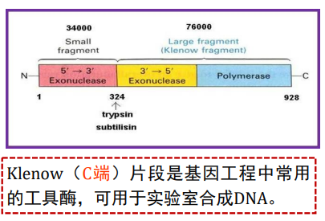

---

$3'-5'$ 外切酶活性与 DNA 聚合酶的校正功能有关


---

$5'-3'$ 的外切活性在 DNA 损伤的修复中可能起重要作用。对冈崎片段 $5'$ 端引物 RNA 引物的去除，依赖此种外切酶活性。


---

DNA 聚合酶 II (Pol II): 聚合短链，具 $3'\to5'$ 核酸外切酶活性，但无 $5'\to3'$ 外切酶活性，参与 DNA 修复。


---

+ DNA 聚合酶 III (Pol III)
  + 包含由 7 种不同的亚单位和 9 个亚基，其生物活性形式为二聚体。
  + 它的聚合活性较强，为 DNA 聚合酶 I 的 15 倍，聚合酶 II 的 300 倍。
  + 大肠杆菌 DNA 复制中链延长反应的主导聚合酶。


##### DNA 连接酶 ligase

+ 催化双链 DNA 切口处的 $5'-$ 磷酸和 $3'-$ 羟基生成磷酸二酯键。
+ DNA 滞后链上的复制是不连续的，各合成的片段需要连接酶连接

+ 连接酶的反应条件
  + 被连接的两链必须与另一链（模板链互补）
  + 每次只能连接一个缺口
  + 使一条链的 $5'-P$ 与另一条链的 $3'-OH$ 形成磷酸二酯键


## 2.4.2 真核生物 DNA 复制的特点

+ 真核生物的 DNA 复制有多个复制起始位点，而原核只有一个起始位点。 
+ 真核生物复制一旦启动，在完成本次复制前不能在再启动新的复制，而原核复制起始位点可以连续开始新的复制，特别是快速繁殖的细胞。
+ 真核生物和原核生物的复制调控不同。
+ 原核的 DNA 聚合酶 III 复制时形成二聚体复合物，而真核的聚合酶保持分离状态 。
+ 真核生物的聚合酶没有 $5'-3'$ 外切酶活性，需要一种叫 FEN1 的蛋白切除 $5'$ 端引物，原核的 DNA 聚合酶 I 具有 $5'-3'$ 外切酶活性

---

### 复制起始位点

自主复制序列（Autonomous Replicating Sequence, ARS）这个序列是染色体正常起始复制所必需的。所有的 ARS 的 DNA 均有一段保守序列。

```DNA
-A(T)TTTAT(C)A(G)TTTA(T)-
```

ARS 能结合起始点识别复合物（Origin Recognition Complex, ORC）

---

1. 真核生物 DNA 每个细胞周期只精确复制一次，只在 S 期进行。

   

2. 真核细胞复制的起始需要在前复制复合物 pre-RC 的指导下进行

   + 细胞周期蛋白依赖性激酶调控前复制复合体的形成和激活
     + 细胞进入 S 期后 Cdk 和 Ddk 对复制蛋白磷酸核以引发复制起始，Mcm 复合体的活化（解旋后）募集辅助因子和 DNA 聚合酶 $\delta$ 和 $\varepsilon$，之后 DNA 聚合酶 $\alpha$ 引物酶被招募，其在起始位点出点后合成一段 RNA 引物，并进行有限的延伸。产生的引物-模板接头被滑动夹装载器识别并组装滑动夹 PCNA. 聚合酶 $\delta$ 和 $\varepsilon$ 都能识别此引物并开始前导链的合成。解旋一段时间后，引物酶合成额外的引物，使聚合酶 $\delta$ 和 $\varepsilon$ 可以进行后随链 DNA 合成的起始。

---

+ 已发现 15 种真核 DNA 聚合酶，在哺乳动物细胞中有 5 种
  + Pol $\alpha$
    + 作为引发酶（引物酶）合成 RNA 引物，然后作为 DNA 聚合酶延伸此段 RNA 引物；合成数百个碱基后，将后续的延伸过程交给 Pol $\delta$ 与 Pol $\varepsilon$
  + Pol $\beta$
    + 在 DNA 修复中起作用
  + Pol $\gamma$
    + 复制线粒体 DNA
  + Pol $\delta$
    + Pol $\delta$ 与 Pol $\varepsilon$ 是真核细胞的主要 DNA 聚合酶
  + Pol $\varepsilon$
    + 填补引物空隙，切除修复，重组

---

真核生物 DNA 复制


---

### 末端复制难题 End Replication Problem

在 DNA 复制过程中随着引物的一走， 后随链末端在顶部相当于引物长度的一小段不能完整复制下来，这势必会导致 DNA 分子越来越短。


#### 端粒 Telomere

端粒是真核细胞染色体末端的特殊结构；由末端 DNA 和蛋白质组成复合体；端粒 DNA 由多次串联重复的短序列构成。 

端粒功能：稳定染色体末端结构，防止染色体间末端连接，并补偿新生链 $5’$ 末端在消除引物后造成的空缺。


#### 端粒酶 Telomerase

在细胞中负责端粒的延长的一种酶，是基本的核蛋白逆转录酶，可将端粒 DNA 加至真核细胞染色体末端，把 DNA 复制损失的端粒填补起来，使端粒修复延长，可以让端粒不会因细胞分裂而有所损耗。 

端粒酶将自身 RNA 模板合成的 DNA 重复序列加在后随链亲链的 $3’$ 端，然后再以延长了的亲链为模板，由 DNA 聚合酶合成子链。

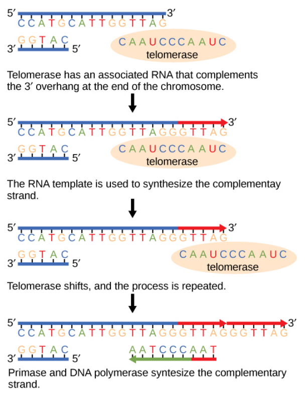

#### 端粒的形成过程

「爬行模型」


## 2.4.3 DNA 复制的调控

#### 大肠杆菌染色体 DNA 的复制调控


复制起始不依赖于细胞分裂，复制终止则能引发细胞分裂。

复制调控主要发生在起始阶段。 

dnaA-ADP 复合物

非甲基化 GATC-SeqA 复合物

> 对 dam- $E. Coli$ 的研究表明，半甲基化的 Ori C 不能发动一轮新的复制。
>
> 在复制过程中，Ori C 的半甲基化状态约保留 13 min。而在基因组其它区域的 GATC 位点，在复制后 1.5  min 内即被甲基化。

#### ColE1 质粒 DNA 的复制调控


+ **Rop 蛋白和反义 RNA 控制了起始 DNA 复制所必需的引物合成。**
+ RNA1 通过氢键配对与引物 RNA 前体相互作用，阻止了 RNaseH 加工引物前体，使其不能转化为有活性的引物而对复制起负调控作用。
+ Rop 蛋白能提高 RNA1 与引物前体的相互作用，从而加强了 RNA1 的负调控作用。

#### 真核细胞 DNA 的复制调控

1. 细胞生活周期水平调控：DNA 复制只发生在 S 期，决定细胞停留在 G1 还是进入 S 期。
2. 染色体水平调控：决定不同染色体或同一染色体不同部位的复制子按一定顺序在 S 期进行复制。
3. 复制子水平调控：决定复制的起始与否，这种调控从单细胞生物到高等生物是高度保守的。


# 2.5 DNA 的突变和修复

+ 修复 DNA 突变的能力是生物能保持遗传稳定性的关键
+ 细胞中能进行修复的生物大分子只有 DNA
+ 在生物进化中，变异与遗传是普遍存在的既对立又统一的矛盾

### DNA 的损伤

+ 各种因素所导致的 DNA 组成或结构的异常改变称为 DNA 损伤。
+ 如果这一损伤能导致生物的基因型发生稳定的、可遗传的变化，就称为突变（mutation）。

### DNA 的突变 Mutation

+ 小规模突变 Small-scale mutations
  + 替换 Substitution
  + 缺失 Deletion
  + 插入 Insertion
  + 外显子跳读 Exon Skipping
+  染色体异常 The chromosome abnormality
  + 染色体数量异常 Numerical abnormality
    + 单倍体 Monosomy
    + 三倍体 Trisomy
  + 染色体结构异常 Structural abnormality
    + 一条染色体上的两处断裂可导致染色体部分反转，缺失或产生环状结构。
      Two breaks in a single chromosome can cause inversion, deletion or ring structure.

#### 碱基替换 The substitution mutation

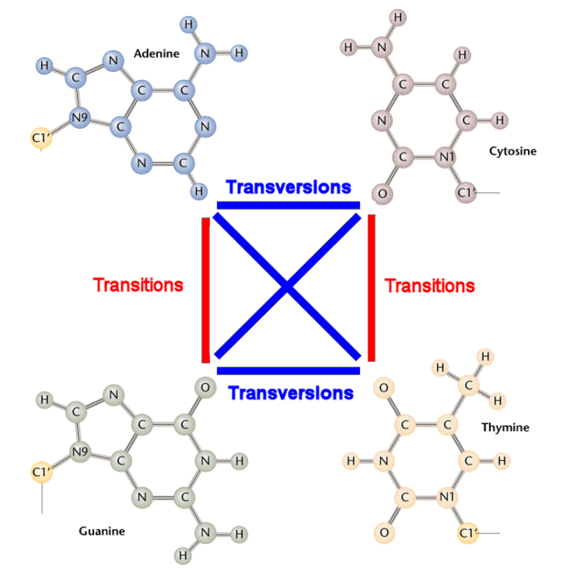

+ 转换：嘌呤和嘌呤之间的替换，或嘧啶和嘧啶之间的替换。
+ 颠换：嘌呤和嘧啶之间的替换。

---

+ 沉默突变（Slilent mutation）
  + 也称同义突变（Same-sense mutation）DNA 的突变虽引起 mRNA 中密码子改变为另一种密码，但由于密码子的简并作用，并未使编码的氨基酸改变。
+ 无义突变（Nonsense mutation）
  + DNA 的突变引起 mRNA 中的密码子改变为一种终止密码子。
+ 错义突变（missense mutation）
  + 是指 DNA 的突变引起 mRNA 中密码子改变，编码另一种氨基酸。

#### 单核苷酸多态性 SNP

基因组重测序


#### 碱基插入/删除 Insertion & Deletion Mutation


一个或多个碱基被插入到一条序列中。如果插入的剪辑数量不是 3 的整数倍，会导致移码突变，造成严重后果。
One or more nucleotides are inserted into a sequence. If the number of inserted bases is not a multiple of 3, it will cause frameshift, resulting in serious consequences.


碱基缺失指一条 DNA 序列中一个或多个碱基的缺失，可能会导致移码突变，产生非功能蛋白。
The deletion mutation involves elimination of one or more nucleotides from a DNA sequence. It may cause frameshift, producing a non-functional protein.

#### 外显子跳读 Exon Skipping


内含子的拼接需要一个重要的信号：`GT...AG`。如果剪接受体位点 `AG` 发生突变(如图中 A 到 C)，则剪接机器将寻找下一个受体位点。结果，两个内含子之间的外显子也被移除。
Splicing of an intron requires an essential signal: "GT........AG". If the splice acceptor site AG is mutated (e.g., A to C in this figure), the splicing machinery will look for the next acceptor site. As a result, the exon between two introns is also removed.

#### 染色体异常

染色体数目变异


染色体结构变异


## 2.5.1 DNA 损伤的来源

### DNA 复制不准确性

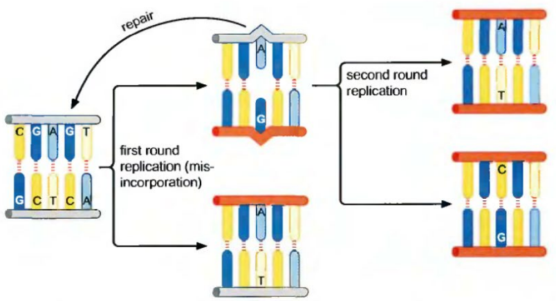

DNA 复制是严格而精确的事件，但也可能发生错误。虽然有碱基互补配对和 pol 的校正作用，但错配率仍有 $10^{-10}$ 左右。

### 外界环境或内部因素对 DNA 的损伤

+ 内源性因素：如代谢产生的自由基
+ 外源性因素：物理、化学、生物因素

#### 1. 电离辐射

受到紫外线照射时，DNA 链上相邻的嘧啶以共价键连接形成二聚体。


#### 2. 化学因素

##### 烷化剂

硫酸二甲酯，甲烷磺酸甲酯等使碱基烷化，导致复制时碱基错配。


##### 亚硝酸盐

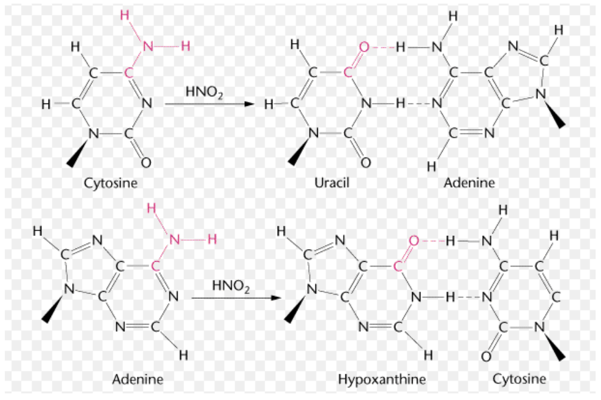

##### 碱基类似物


如 $5-$溴尿嘧啶（5-BU）， $5-$氟尿嘧啶(5-FU)等，它们的结构与碱基相似，进入细胞能代替正常的碱基参入到 DNA 链中而干扰 DNA 的复制。 5-BU 与 T 结构相似，在酮式时，与 A 配对；它呈烯醇式结构，与 G 配对。在复制时导致 `A-T` 转换为 `G-C`

---

嵌入试剂可以导致一个甚至几个碱基对的插入或缺失


---

##### 碱基自发改变造成的损伤

+ 碱基的互构异变，会使碱基间发生错配，使 `A-C`，`G-T`。 
+ DNA 的水解或脱 $-NH_2$：碱基环外的 $-NH_2$ 有时会发生自行脱落，使 $C\to U$，$A\to I$（次黄嘌呤），$G\to X$ （黄嘌呤）；复制时 `U-A`，`I- C`，`I -X` 配对， 导致子代 DNA 序列错误。

---

最常见和最重要的水解损伤是胞嘧啶脱氨基转变为尿嘧啶


---

DNA 也会自发水解 $C-N$ 糖苷键而发生脱嘌呤作用 （depurination），在 DNA 分子中产生无碱基位点。


---

+ DNA 复制错误和 DNA 损伤会导致两种结果
  + 影响复制与转录
  + 导致 DNA 序列发生变异，从而改变遗传物质

## 2.5.2 DNA 复制错误及损伤修复

细胞有一套用来检验错配并对之进行修复的机制

> 存在于 $E.\ coli$ 中的 DNA 修复系统

|       DNA 修复系统        |                  功能                  |
| :-----------------------: | :------------------------------------: |
|         错配修复          |                恢复错配                |
| 切除修复<br>(碱基/核苷酸) |     切除突变的碱基<br>和核苷酸片段     |
|         重组修复          | 复制后的修复，<br>重新启动停止的复制叉 |
|       DNA 直接修复        |        修复嘧啶二体或甲基化 DNA        |
|         SOS 系统          |          DNA 的修复，导致变异          |

### 1. 错配修复 Mismatch repair

+ 保证 DNA 复制高保真的最后责任由错配修复系统承担
+ 错配修复系统识别新合成链中的错配并加以校正，DNA 子链中的错配几乎完全能被修正

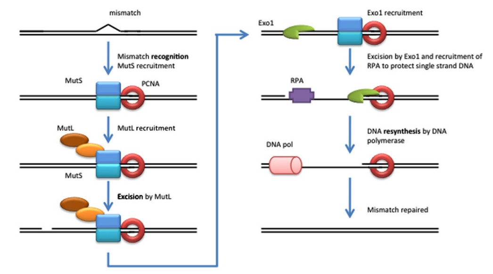

+ 根据母链甲基化原则找出错配碱基
  + 发现碱基错配
  + 在水解 ATP 的作用下，MutS，MutL 与碱基错配位点的 DNA 双链相结合。
  + MutS - MutL 在 DNA 双链上移动，发现甲基化 DNA 后由 MutH 切开非甲基化的子链。


识别母链的依据来自 Dam 甲基化酶，它能使位于 $5’$ `GATC` 序列中腺苷酸的 N6 位甲基化。一旦复制叉通过复制起始位点， 母链就会在开始 DNA 合成前的几秒种至几分钟内被甲基化。


---

当错配碱基位于切口 $3’$ 下游端时，在 MutL - MutS，解链酶 II，DNA 外切酶 VII 或 RecJ 核酸酶的作下从错配碱基 $3’$ 下游端开始切除单链 DNA 直到错配位点，并在 Pol III 和 SSB 的作用下合成新的子链片段。


---

若错配碱基位于切口的 $5’$ 上游端，则在 DNA 外切酶 I 或 X 的作用下切除单链 DNA 直到错配位点，再合成新的子链片段。


### 2. 切除修复

#### 碱基切除修复 Base-excision repair

所有细胞中都带有能识别受损核酸位点的不同的糖苷水解酶，能特异性切除受损核苷酸上的 $N-\beta$ 糖苷键，形成去嘌呤或去嘧啶位点，统称为 AP 位点。


DNA 分子中一旦产生了 AP 位点，内切酶就会把受损核苷酸的糖苷-磷酸键切开，移去 AP 位点附近小片段 DNA，并由 DNA 聚合酶 I 和 DNA 连接酶共同完成修复。


#### 核苷酸切除修复 nucleotide-excision repair

当 DNA 链上相应位置的核苷酸发生损伤，导致双链之间无法形成氢键，则由核苷酸切除修复系统负责修复。


损伤发生后，首先由 DNA 切割酶(excinuclease)在已损伤的核苷酸 $5’$ 和 $3’$ 位分别切开磷酸糖苷键，产生并移去 DNA 小片段，然后由 DNA 聚合酶合成新片段，并由DNA连接酶完成修复中的最后步骤。


Nucleotide-excision repair in $E.\ coli$ and human

+ 在原核生物中受损核苷酸 $3'$ 端的第 5 位，$5'$ 端的第 8 位磷酸糖苷分别被 DNA 切割酶切开。
+ 在人类细胞中，受损伤核苷酸 $3’$ 端第 6 位，5’端的第 23 位磷酸糖苷键分别被 DNA 切割酶切开。


### 3. 重组修复 recombinant repair

当 DNA 发生双链断裂时，可通过同源重组修复（homologousrecombinationrepair，HR）和非同源末端连接（non-hologousendjoining，NHEJ）来进行修复。


#### 同源重组修复

Double-strand breaks (DSBs) can be repaired by several homologous recombination (HR)-mediated pathways, including double-strand break repair (DSBR, 双链断裂修复) and synthesis-dependent strand annealing (SDSA, 合成依赖链复性).


#### 非同源末端连接

真核生物细胞在不依赖 DNA 同源性的情况下，而为了避免 DNA 或染色体断裂（Breaks）的滞留，避免因此造成的 DNA 降解或对生命力的影响，强行将两个 DNA 断端彼此连接在一起的一种特殊的 DNA 双链断裂修复机制。


### 4. DNA 的直接修复 directrepair

生物体内还存在 DNA 损伤直接修复而并不需要切除碱基或核苷酸的机制。DNA 光解酶（photolyase）能把在光下或经紫外光照射形成的环丁烷胸腺嘧啶二体及 6-4 光化物（6-4-photoproduct）还原成为单体。


### 5. 跨损伤合成 Translesionsynthesis, TLS

指当细胞处于较强烈而持久的 SOS 应答（SOSResponse）生理条件下，一些受 SOS 机制控制的可诱导性 DNA 聚合酶得到表达。

这些 DNA 聚合酶对 DNAB 型构象模板没有严格要求，有些甚至需要利用结合有 RecA 蛋白质分子的单链 DNA 作为模板，如大肠杆菌 DNA 聚合酶 V。

这些 DNA 聚合酶大多数都不具有「校对」功能，也不严格依赖模板-引物-掺入核苷-DNA 聚合酶规律，因此，有能力把插入到含有「损伤」（Lesion，泛指所有的损伤，区别于 Damage）的核苷「掺入」到新生 DNA 链中。

合成的 DNA 子链中的碱基可能是完全不符合沃森-克里克碱基配对要求，而 DNA 聚合酶自身又缺乏「校对活性」，于是所合成出的 DNA 通常含有「错误」，表现出「合成错误风险」（Error-Prone）。与此同时，由于类似的 DNA 复制的忠实性依然受「碱基选择」（Baseselection）的制约，故也有可能最终不会出现复制错误，体现 "Error-free" 的特点。

---

proliferating cell nuclear antigen (PCNA): 增殖细胞核抗原


### 6. SOS 修复

SOS 修复是指 DNA 受到严重损伤、细胞处于危急状态时所诱导的一种 DNA 修复方式，修复结果只是能维持基因组的完整性，提高细胞的生成率，但留下的错误较多，故又称为错误倾向修复（error-pronerepair），使细胞有较高的突变率。


# 2.6 DNA 的转座

由可移动元件(transposable element)介导的遗传物质重排现象。

一种异常的重组类型，是一段 DNA 序列插入到另一段 DNA 序列中，而不依赖于序列同源性。

这种使某些元件从一个位置向其他位置的移动方式是转座(transposition)。转座中涉及的机制依赖于 DNA 链的切割和重接，因此与重组过程联系起来。

转座重组会破坏染色体上基因的排列顺序。


## 2.6.1 转座子 Transposon

+ 一种可以由染色体的一个位置转移到另一位置的遗传因子，也就是一段可以发生转座的 DNA，又称为转座子(transposon)。
+ 可反复插入到基因组中的许多位点
+ 可以从基因组的一个位点转移到另一个位点
+ 可以从一个复制子转移到另一个复制子

## 2.6.2 转座子的发现

+ 20 世纪 40 年代，美国遗传学家 McClintockB 在研玉米的遗传因子时发现，某些基因活性受到一些在不同染色体间转移的控制因子（controllingelement）所决定。这一发现与当时传统的遗传学观点相抵触因而不被学术界所普遍接受。
+ 60 年代后期，美国青年细菌学家 ShapiroJ 在大肠杆菌中发现一种由插入序列所引起的多效突变，之后又在不同实验室发现一系列可转移的抗药性转座子，才重新引起人们重视。
+ 1983 年 McClintock 被授予诺贝尔生理学与医学奖，距离她公布玉米控制因子的时间已有 32 年之久。

## 2.6.3 转座子的特点

+ 转座子是不必借助同源序列就可以移动的片断，即转座作用与供体和受体的序列无关。
+ 原核生物和真核生物都有转座子。
+ 转座序列可沿染色体移动，甚至在不同染色体间跳跃（跳跃基因）。
+ 转座的位置通常或多或少是随机的。
+ 当转座子插入一个基因内时，该基因失活，如果是重要的基因就可能导致细胞死亡。
+ 转座子对基因组而言是一个不稳定因素，它可导致宿主序列删除、倒位或易位，并且其在基因组中成为「可移动的同源区」。
+ 位于不同位点的两个拷贝转座子之间可以发生交互重组，从而造成基因组不同形式的重排。
+ 有些转座子与基因组的关系犹如寄生，它们的功能只是为了自身的扩增与繁衍，因此被称为是自私的 DNA。

## 2.6.4 转座子的分类和结构特征

### 1. 插入序列 insertional sequence, IS

+ 简单的转座子，除转座所需基因外不携带任何标记基因，它的存在只能借助插入位点有关基因的失活来判断，或者通过分子杂交和测序来检测。
+ 插入序列是最小的转座因子。所有插入序列的两端都有反向重复（invertedrepeats）。反向重复为转座酶识别所需，通常重复序列长度为 15-25 bp。
+ 重复序列有时只是相似，并非相同。


+ 插入序列的结构特征
  + 含短的末端反向重复序列
  + 含编码转座酶的基因
  + 靶位点存在 5-9 bp 的短正向重复序列


### 2. 复合型转座子 composite transposon

+ 转座子除编码转座功能有关的基因外，还携带抗性或其他标记基因。
+ 分为两类：一类是组合因子（compositeelement），由个别模件组合而成，通常包括两个插入序列作为两臂，中间为标记基因。另一类为复合因子（complexelement），含有转座酶基因、解离酶（resolvase）基因以及标记基因，两端为反向重复，无插入序列。

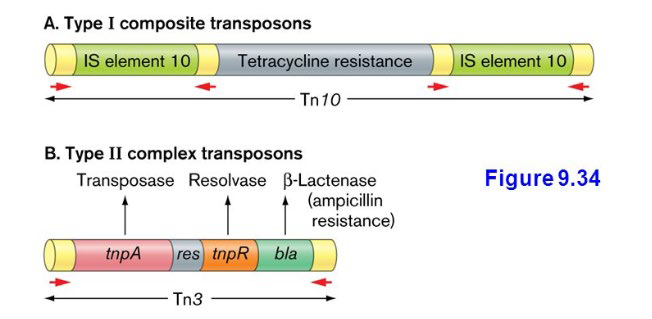

## 2.6.6 转座作用的机制

+ 转座发生时，受体分子中有一段很短的（3～12 bp）、被称为靶序列的 DNA 会被复制，使插入的转座子位于两个重复的靶序列之间。
+ 不同转座子的靶序列长度不同，但特定转座子所复制的靶序列长度是一样的。IS1 两翼总有 9 个碱基对的靶序列，而 Tn3 两端总有 5bp 的靶序列。
+ 在复制性转座中，整个转座子被复制，所移动的仅仅是原转座子的拷贝。转座酶（transposase）和解离酶（resolvase）分别作用于原始及复制转座子。TnA 类主要是这种形式。
+ 在非复制性转座中，原始转座子作为一个可移动的实体直接被移位，IS 序列、Mu 及 Tn5 等都以这种方式进行转座。


## 2.6.7 转座的遗传效应和意义

### 1. 转座的遗传效应

+ 转座引起插入突变
  + 转座插入基因后，使基因突变失活
  + 当转座因子自发插入细菌的操纵子时，可阻止它所在基因的转录和翻译。
+ 转座产生新的基因
  + 转座子带有抗性基因，如抗药性基因 ampC，可产生两方面的效应：插入突变，出现抗药基因。
+ 转座引起染色体畸变
  + 在一个染色体或者不同的染色体上如果有同一个转座子的 2 个拷贝，通过某种方式的重组后造成染色体断裂、缺失、倒位及易位等，使基因突变和重排的重要原因。
  + 
+ 转座引起生物进化
  + 使原来相距甚远的基因组合在一起，构建成一个操纵子或表达单元，可能产生新的生物学功能的基因和新的蛋白。

### 2. 转座的遗传效应的意义

1. 可使原来距离较远的基因组合在一起形成一个操纵子
2. 启动子部位的插入使基因打开或关闭
3. 转座基因插入时，大多数受体基因被失活；但也有被活化的基因，转座子有自身的启动子在转录转座酶基因时，其它相邻基因可被转录。


