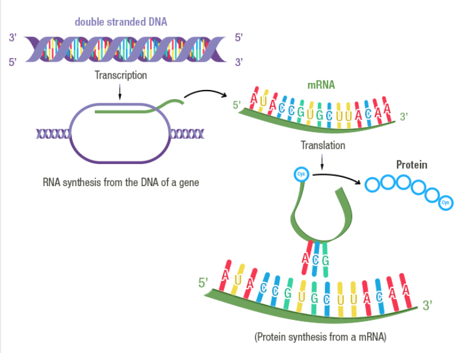
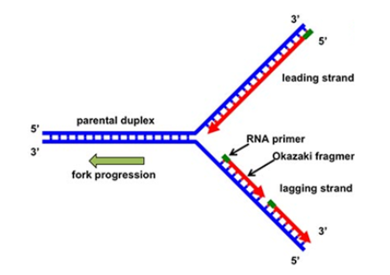
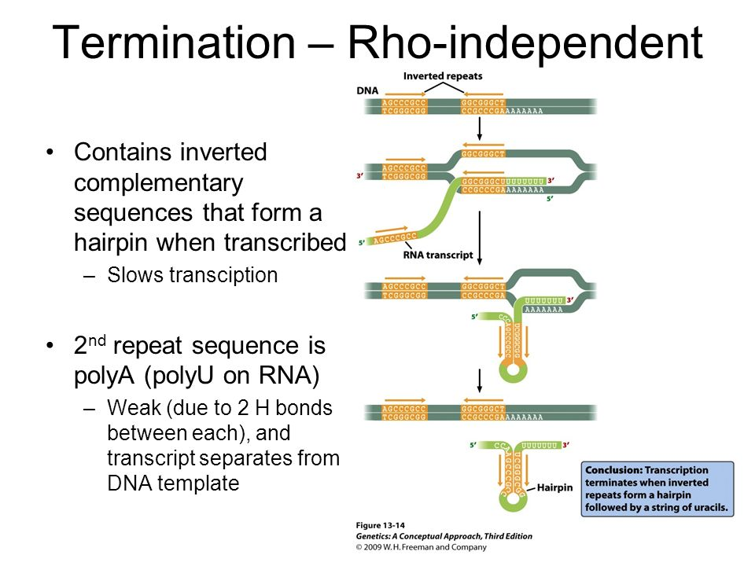
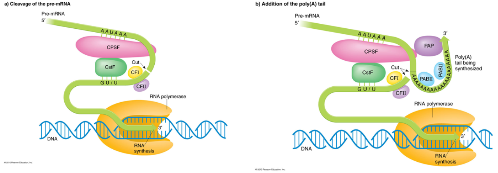
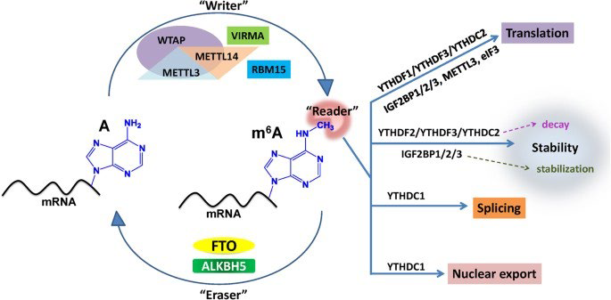

# 3.0 概论

## 基因表达 Gene Expression

基因通过一系列的步骤表现出其生物学功能的整个过程

DNA 携带着决定蛋白质的氨基酸顺序的信息，但本身不可能是蛋白质合成的模板

实验也表明在无  DNA 存在的场所，可以进行蛋白质的合成

应该还有第二种承载信息的分子，它负责从 DNA 上获得特定遗传信息，然后用于指导蛋白质的合成。

- 转录 Transcription
  - 以 DNA 的一条链为模板合成互补 RNA 的过程

- 翻译 Translation
  - 依照 mRNA 的信息合成蛋白质的过程

## 复制和转录的异同点

- 相同点
  - 都以 DNA 为模板
  - 原料为核苷酸
  - 合成方向均为 5' to 3' 方向
  - 都需要依赖 DNA 的聚合酶
  - 遵守碱基互补配对规律
  - 产物为多聚核苷酸链

- 不同点

|      |           复制            |          转录           |
| :--: | :-----------------------: | :---------------------: |
| 原料 |           dNTP            |           NTP           |
| 引物 |           需要            |         不需要          |
| 方向 |      $5'\to3'$ 方向       |     $5'\to3'$ 方向      |
| 模板 | 单链 DNA / 两条链都作模板 | 单链 DNA / 一条作为模板 |
| 起点 |         复制起点          |         启动子          |
| 长度 |         DNA 全长          |          局部           |
| 终点 |          不一定           |         终止子          |

## 基因的编码链和模板链

- 编码链（Coding Strand）或称有意义链（Sense Strand）：与 **mRNA 序列相同**的那条 DNA 链
- 模板链（Template Strand）或称反义链（Antisense Strand）：根据碱基互补配对原则**指导 mRNA 合成**的 DNA 链

# 3.1 RNA 的结构与功能

## 3.1.1 RNA 的结构特点

- 2 号碳上羟基不脱氧
- 比 DNA 分子小的多，几十到几千核苷酸
  
- 多数单链
- 自身折叠，局部双螺旋
  
- 可折叠形成复杂三级结构
  
- cricRNA 分子环状封闭 不受外切酶影响 表达更稳定 不易降解
  

## 3.1.2 RNA 在细胞中的分布

## 3.1.3 RNA 的功能

- 信息分子
  - 贮藏及转移遗传信息

- 功能分子
  - 蛋白质生物合成的主要参与者
  - 核酶
  - 基因表达的调控
  - 遗传物质

# 3.2 RNA 转录的基本过程

+ 特点
  + RNA 是按 $5'-3'$ 方向合成的
  + 以 DNA 双链中的反义链为模板
  + 由 RNA 聚合酶催化
  + 底物为四种三磷酸核苷（AUGC）
  + 不需要引物

模板识别 $\to$ 转录起始 $\to$ 转录延伸 $\to$ 转录终止

## 3.2.1 模板识别：RNA 聚合酶结合到 DNA 双链上，DNA 链的启动子区解链

- 转录是从 DNA 分子的特定部位开始的，这个部位是 RNA 聚合酶全酶识别和结合的部位，称为启动子
- 模板识别是指 RNA 聚合酶与启动子(Promoter) DNA 双链相互作用并与之结合的过程

启动子是 RNA 聚合酶识别、结合和开始转录的一段 DNA 序列，它好友 RNA 聚合酶特异性结合和转录起始所需的保守序列，启动子本身不被转录

---

- 原核细胞：RNA 聚合酶全酶能识别启动子区
- 真核细胞：RNA 聚合酶不能识别启动子区，需要转录调控银子按顺序结合到启动子上，RNA 聚合酶才能与之结合形成转录起始前复合物 PIC(Preinitiation Transcription Complex)
- TFII-D：首先与 TATA 区结合
- TFII-A：稳定 TFII-D 与 TATA 结合
- TFII-B：帮助 RNA 酶与启动子区结合
- TFII-F：与 RNA 酶结合
- TFII-E 与 TFII-H：促进转录开始

转录因子是一群能与基因 5' 端上游特定序列专一性结合，从而保证目的基因以特定的强度在特定的时间与空间标的的蛋白质分子

## 3.2.2 转录起始：短核苷酸链合成并释放

- 转录时不需要引物，由 RNA 聚合酶催化以 NTP 为底物连续合成 RNA
- 在 DNA 上开始转录的第一个碱基规定为 +1，与转录相反方向称上游，转录方向为下游；在上游方向与转录其实位点相邻的位置定为 -1

---

- 转录起始就是 RNA 链上**第一个核苷酸键**的产生
- 转录起始后直到形成 **9 个核苷酸短链**的过程是通过**启动子阶段**。一旦成功合成 9 个以上核苷酸并离开启动子区，就进入正常的延伸阶段
- **通过启动子的时间**代表一个启动子的强弱

## 3.2.3 转录延伸：聚合酶合成 RNA

- RNA 聚合酶沿着模板链移动，解开聚合反应位点前方的 DNA 螺旋，新生 RNA 链不断伸长，并允许后面的 DNA 双链重新闭合

## 3.2.4 转录终止：RNA 聚合酶和 RNA 释放

- 终止子是转录终止的信号序列， 它引发延伸聚合酶从 DNA 上脱落，并且释放出已合成的 RNA 链
- 转录的终止依赖于 RNA 产物，而不是由特定的 DNA 序列决定

- 不依赖 $\rho$ 因子的终止子（Intrinsic Terminators, Rho-Independent Terminator）可以在不依赖辅助因子的情况下，终止细菌 RNA 聚合酶的转录

  

- $\rho$ 因子是一种分子量为 46 kDa 的蛋白质，以六聚体为活性形式。依赖 $\rho$ 因子的终止位点，未发现有特殊的 DNA 序列，但 $\rho$ 因子能与转录中的 RNA 结合
- $\rho$ 因子六聚体被约 70-80 nt 的 RNA 包绕，激活 $\rho$ 因子的 ATP 酶活性，并向 RNA 的 3' 端滑动，滑至 RNA 聚合酶附近时，RNA 聚合酶暂停聚合活性，使 RNA:DNA 杂化链解链，转录的 RNA 释放出来而终止转录

# 3.3 转录机器的主要成分

## 3.3.1 RNA 聚合酶

- 特点
	- 依赖 DNA 的 RNA 聚合酶 DDRP
	- 以 DNA 为模板
	- 5'-3' 连续合成
	- 需要 $Mg^{2+}$ 或 $Mn^{2+}$ 
	- **缺乏外切酶活性，没有矫正功能**
	- **不需要引物**
	
- 原核生物 RNA 聚合酶
	- RNA 聚合酶的结构
	
	  - 
	
	- RNA 聚合酶各亚基的功能
	  
	  - 
	  
	  - $\beta$ 亚基：由 $rpo\ B$ 编码（NTP 及新生 RNA 链），进行聚合作用。
	  
	  - $\beta'$ 亚基：由 $rpo \ C$ 编码，可能参与模板结合
	  
	  - $\alpha$ 亚基：由 $rpo\ A$ 编am，参与全酶的组装及识别启动子，参与 RNA 聚合酶与调控因子间的作用。
	  
	  - $\omega$ 亚基：具体功能不清。
	  
	  - $\sigma$ 亚基：使全酶识别启动子并与之结合，也看作一种辅助因子。
	  
	    - 不是 RNA 链延伸必需的
	    - 通过降低核心酶与非特异序列的亲和力，和增加其与启动子的亲和力来帮助核心酶识别启动子。
	    - 新生 RNA 链达到 6-9 个核苷酸，形成稳定的酶-DNA-RNA 复合物时，$\sigma$ 因子释放。
	    - 无 $\sigma$ 因子的核心酶也能再 DNA 模板上合成 RNA，但不能正确地起始转录。
	    - 可重复使用
	    - $\sigma$ 因子更替的现象
	      - 在细菌受到外界环境的急剧影响时，会改变所表达的基因，产生 $\sigma$ 因子更替的现象。
	      - 芽孢菌生活周期过程中生活方式的改变也是通过 $\sigma$ 因子的更替完成的。
	
	    
	
	  - 核心酶覆盖大约 40 bp 的 DNA 区域，其中解链部分只有 $\approx 12-14\ bp$ 
	
	  - 当 DNA 解旋成为模板是，每条链进入酶的不同部位。
	
	  - RNA-DNA 杂合链的程度约 9 bp，比解旋的 DNA 稍短一些。
	  
	  - 当酶分子离开这一区域向前移动时，DNA 又重新形成双链。
	  
	  - 转录泡（Transcription bubble）是由 RNA 聚合酶核心酶、DNA 模板链以及转录形成的 RNA 新链三者结合形成的转录复合物。
	  
	  - 转录泡能够沿模板链 $3'\to5'$ 方向移动，位于 RNA 聚合酶前端的 DNA 双链不断解旋，而后端转录过的 DNA 单链又恢复双螺旋结构。
	  
	
- 真核生物 RNA 聚合酶
	- 真核生物的三种 RNA 聚合酶的特点
		- | RNA Pol | 位置 | 产物  | 相对活性  | 对 $\alpha-$鹅膏蕈的敏感性 |
		  | :-----: | :--: | :---: | :-------: | :------------------------: |
		  | Pol II  | 核仁 | rRNA  | $50-70\%$ |           不敏感           |
		  | Pol II  | 核质 | hnRNA | $20-40\%$ |          高度敏感          |
		  | Pol III | 核质 | tRNA  |  $-10\%$  |     片段特异，中等敏感     |
	- 真核生物中已发现有 4 种 RNA 聚合酶
		- 细胞核 RNA 聚合酶 $\mathrm{I,\ II,\ III\ (RNA\ pol\ I,\ II,\ III)}$ 
		- 线粒体 RNA 聚合酶（类似原核生物的 RNA pol）
		- 它们专一地转录不同的基因
	- 真核生物 RNA 聚合酶 II 的结构及组成
		
		- 
		- RPB1/2 与 $\beta\beta'$ 同源，RBP3/11 与 $\alpha$，RBP6 与 $\omega$ 同源
		- 不同生物 3 类聚合酶有相似性
		- 线粒体内的聚合酶是最小的聚合酶之一
		- 
	- 转录因子
	
	  - 
	  - 反式作用因子（trans-acting factors） 能直接、间接辨认和结合转录上游区段 DNA（**顺式作用元件**）的蛋白质
	  - 转录因子（transcription factors）：**直接或间接结合 RNA 聚合酶的反式作用因子**。
	  - 转录因子是真核基因转录所必需的
	  - **原核生物 RNA pol 不需要其他蛋白质因子参与就能起始转录反应**，而真核生物 RNA pol 需要一定的蛋白质才能起动转录反应。
	  - TF 的类型
	    1. 通用的转录因子（普遍性转录因子）
	    
	         + 结合与**启动子核心序列**
	         + TFIIA，TFIIB，TFIID，TFIIR，TFIIIA，TFIIIB，TFIIIC
	    2. 基因特异性转录因子
	    
	         + 结合于**上游调控区 UPE 和增强子区**
	         + SP1，CTF，Ap-1，Oct-2，CREB
	    3. RNA 聚合酶 II 的通用转录因子
	    
	         + 
	         + 作用与核心启动子上的辅助因子称为**通用转录因子或基本转录因子**。
	    
	         + 以 TF II X 来表示，其中 X 按A线先后用英文大写字母定名。
	    
	         + 基因的转录还需要其它的转录因子的帮助，如结合在 UPE 和远端调控序列上的转录因子。
	         + 参与 RNA-pol II 转录的 TF II
	           
	    
	       + **TFIID 结合于 TATA box**
	       	+ 其中一种亚基 TBP（**TATA 结合蛋白**，TATA binding protein），是参与各种 RNA pol **起始复合物装配的必要组分。**
	       	+ 其余亚基称为 TBP 相关因子（TBP-associated factor, TAF）
	       	+ **定位因子 TBP（相当于 $\sigma$ 因子）**
	       	+ SL1(pol I); TFIID(pol II); TFIIIB(pol III)
	    + 通用转录因子与细菌中的 **$\sigma$ 因子**没有显著的同源性，但它们共同执行 $\sigma$ 因子在细菌转录中所执行的功能。**通用转录因子帮助聚合酶结合到启动子上，并解开 DNA。**
	    + 帮助聚合酶从启动子上离开和开始延申。
	    + 在启动子上结合的整套完整的通用转录因子和聚合酶称为**前起始复合体**。
	      

# 3.4 启动子与转录起始

## 3.4.0 启动子区的基本结构

启动子（Promoter）是一段位于结构基因 $5'$ 端上游区的 DNA 序列，**能活化 RNA 聚合酶，使之与模板 DNA 准确结合**。

转录起始位点：与新生 RNA 链第一个核苷酸相对应的 DNA 链上的碱基。

一段从启动子开始到终止子结束的 DNA 序列。细菌中，一个转录单元可以是一个基因，也可以是几个基因。

## 3.4.1 原核生物启动子

由 4 个区域组成：-35 序列，-10 序列，转录起点，-10 序列和 -35 序列间的距离
+ -35 序列：为 RNA 聚合酶 **$\sigma$ 因子的识别位点**。RNA 聚合酶与该位置接触在启动子区域形成**封闭复合物**。
+ -10 序列：为 RNA 聚合酶**牢固结合**位置并**在此解链**。形成**开放起始复合物**。
+ 
 + -10 序列（Pribnow Box）
	 + `TATAAT` 或稍微有变化的形式，大致出现在 $-4\sim13\ bp$ 之间，保守性 $T_{80}A_{95}T_{45}A_{60}A_{50}T_95$
	 + **决定着转录的方向**，RNA 聚合酶在此部位与 DNA 结合形成稳定的复合物。
	   Pribnow 框中 **DNA 序列在转录方向上解开双螺旋结构**，形成开放型起始结构。
	 + 它的功能是 **RNA 聚合酶牢固结合的位点**，是启动子的关键部位。
 + -35 序列（Sextama Box）
	 + 保守性 $T_{82}T_{84}G_{78}A_{65}C_{54}A_{45}$ 
	 + -35 序列的功能是 $\sigma$ **因子初始识别并结合的位点**，与 RNA 聚合酶全酶有很高的亲和性。
	 + -35 序列在很大程度上决定了**启动子的强度**。
+ $\sigma$ 因子识别 **-35 序列**，使 RNA 聚合酶**结合在启动子上**，-35 区域的核苷酸结构极大的决定了**启动子的强度**。
+ **DNA 在 -10 序列处解链，由闭合起始复合物转变为开放起始复合物，其解链速度也决定了启动子的强度。**
+ -10 和 -35 序列是启动子的**关键部位**
+ RNA 聚合酶结合在此两区域的 DNA 碱基上
+ 较弱启动子的 -35 和 -10 序列更倾向于与保守序列有较大差别，而**较强启动子的 -35 和 -10 序列更倾向于接近或类似保守序列**。
+ 破坏启动子功能的突变有 75% 位于这两段序列中，另有 25% 突变发生在这两段序列附近。

+ -10 区与 -35 区的最佳距离
  + **原核生物中**，-10 区与 -35 区之间的距离大约是 $\underline{16-19\ bp}$，小于 15 或大于 20 都会降低启动子活性。
  + 间隔的序列不严格，但是**距离的大小是决定启动子强度的因素之一**。保持适当距离对 RNA 聚合酶的功能是必要的。
  + **间隔序列对启动子功能相对并不十分重要**；但在 $90\%$ 的启动子中，两序列之间的距离约 $17\ bp$，或者说**相隔 2 个螺旋左右**，因而这两个位点大致在 DNA 双螺旋的同一侧。
  + 不同启动子起动效率不同，分为强启动子（$1-2\ s$ 启动 1 次转录）和弱启动子（至少 $10\ min$ 才启动 1 此转录）。

## 3.4.2 启动子区的识别

启动子的功能既受 **DNA 序列**的影响，又受其**构象**的影响，推测 RNA 聚合酶并不直接识别碱基本身，而是通过氢键互补的方式加以识别。（类似酶与底物的结合）

## 3.4.3 真核生物启动子

## 3.4.4 真核生物启动子对转录的影响

+ RNA 聚合酶 II 的**启动子**
+ **TATA box**
+ **上游启动子元件**（Upstream Promoter Element）：CAAT box, GC box, octamer box（八聚体框）
+ **远端调控区**（Distal Regulation Region）：Enhancer 增强子，UASs 上游激活序列，Silencer 沉默子，Dehancer 减弱子，Insulator 绝缘子

+ TATA 区和上游启动子元件（CAAT 区或 GC区）的作用不同
  + TATA 区负责转录精确起始，定位
  + CAAT 区和 GC 区控制转录起始频率，CAAT 区对转录起始频率的影响最大。
  + TATA 区和相邻的 UPE 区之间插入核苷酸会使转录减弱
  并不是每个基因的启动子都包含这 3 种序列

真核细胞中存在着大量特异性或组成型表达的、能够与不同基因启动子区 UPE 相结合的**转录调控因子**。
基因转录实际上是 **RNA 聚合酶、转录调控因子和启动子区各种调控元件**相互作用的结果。

## 3.4.5 增强子、沉默子和绝缘子

### 1. 增强子

+ 1981 年 Benerji 在 SV40DNA 中发现一个 140 bp 的序列，它能大大提高 SV40DNA/兔 $\beta-$血红蛋白融合基因的表达水平。**它位于 SV40 早期基因的上游，由两个正向重复序列组成，每个长 72 bp。**
+ 目前发现的增强子多半是**重复序列，一般长 50 bp**，通常有一个 **8~12 bp 组成的「核心」序列**，如 SV40 增强子的核心序列是 `5'—GGTGTGGAAAG—3'`。
+ **增强子：能强化转录起始的序列。不是启动子的一部分，但能增强或促进转录的起始，除去这两段序列会大大降低基因的转录水平，保留其中一段或取出插至 DNA 的任何部位，就能保持基因的正常转录。**
+ 增强子很可能通过**影响染色质 DNA- 蛋白质结构**或**改变超螺旋的密度**而改变模板的整体结构，从而使得 RNA 酶更容易与模板 DNA 相结合，起始基因的转录。

#### 增强子的特点

+ 具有远距离效应
+ 无方向性
+ 顺式调节
+ 无物种和基因的特异性
+ 具有组织的特异性
+ 有相位性
	+ 其作用和 DNA 的构象有关
+ 有的增强子可以对外部信号产生反应

---

### 2. 沉默子

+ **沉默子位于基因两端的抑制基因表达所必需的序列**。它可使距离启动子  $2.5\ kb$ 以上的区域形成异染色质区，表达抑制增强子的作用。
  + 它被有关的反式作用因子作用。
  + 

### 3. 绝缘子

+ **绝缘子（insulater）是一段具有特化染色质结构的区域，它能阻断增强子或沉默子对靶基因/启动子的增强或失活作用效应。**
  + 位于**增强子和启动子之间**时，可以阻断增强子与下游基本转录复合体的结合，从而**消除增强子对启动子增强表达效应**

  + 位于沉默子和启动子之间时，组织沉默子的异染色质化区域的延伸，从而**阻断沉默子对下游靶基因的失活效应**。
  + 

## 3.4.6 转录的抑制

+ DNA 模板功能抑制剂，通过 DNA 结合而改变模板的功能
+ RNA 聚合酶抑制剂，与 RNA 聚合酶结合而抑制其活力
+ 嘌呤和嘧啶类似物，抑制核酸前体的合成，或形成异常的核酸分子，影响其功能并导致突变
+ 转录的抑制剂
|抑制剂|靶酶|抑制作用|
|:---:|:---:|:---:|
|利福霉素|细菌全酶|和 $\beta$ 亚基结合，抑制起始|
|链霉溶菌素|细菌核心酶|和 $\beta$ 亚基结合，抑制起始|
|放线菌素 D|真核 Pol I|和 DNA 结合，组织延申|
|$\alpha-$鹅膏蕈碱|真核 Pol II|和 RNA Pol II 结合|

# 3.5 终止与抗终止

## 3.5.1 不依赖于 $\rho$ 因子的终止

### 1. 内在终止子

+ 终止效率与反向重复双序列和寡聚 U 的长短有关。长度增加，终止效率提高。
+ 

#### 内在终止子的特点

1. 终止位点上游一般存在**一段富含 GC 碱基的二重对称区**，其转录生成的 mRNA 容易互补形成的**发卡式结构**。
2. **终止位点上游一般有 4～8 个 A 组成的序列**，转录生成的 mRNA 的 3′末端中相应的有一连串 U 序列。

+ 发夹结构会导致 **RNA 聚合酶的暂停**，破坏 RNA-DNA 杂合链 $5'$ 端正常结构
+ **寡聚 U 使杂合链的 $3'$ 端出现不稳定的 U-A 区，两者共同作用使 RNA 从三元复合物中解离出来。**

## 3.5.2 依赖于 $\rho$ 因子的终止

+ 有些终止点的 DNA 序列缺乏共性，不能形成强的发夹结构，因而不能诱导转录的自发终止，需要 $\rho$ 的因子的参与。
  + $\rho$ 因子是一个同源六聚体蛋白，具有 ATP 酶和解链酶的活性能够催化 RNA/DNA 和 RNA/RNA 双螺旋的水解。

## 3.5.3 抗终止

+ 由于不同生理要求，转录过程中有时即使遇到终止信号，仍需要继续转录的信号。
+ 抗转录终止现象
  

1. 破坏终止位点 RNA 的茎-环结构

   + 当介质中某一**氨基酸的浓度较低**时，**缺乏相应氨酰-tRNA**，将致使**核糖体滞留在串联密码子上，mRNA 不能形成特定的二级结构，末端茎-环结构被破坏**，因此转录仍将继续进行，出现抗终止现象。
   + 色氨酸操纵子
     

2. 依赖于蛋白质因子的转录抗终止

   

# 3.6 原核与真核生物 mRNA 的特征

+ 原核生物
  + **不需要转录后加工**
  + 转录和翻译发生在同一个细胞空间，几乎同步
  + 多顺反子
  + 起始密码子通常是 AUG（有时 GUG、UUG）
+ 真核生物
  + **需要转录后加工**
  + 转录和翻译在不同的空间和时间
  + 单顺反子
  + 起始密码子永远是 AUG
+ 线粒体和叶绿体以 AUG、AUU、AUA 为起始密码子。

## 3.6.1 原核生物 mRNA 的特征

+ 原核生物 mRNA 的**半衰期短**，转录开始 1 分钟后降解就开始
  
+ 许多原核生物 mRNA 可能以多顺反子的形式存在
  + 多顺反子 mRAN 是一组**相邻或相互重叠基因**的转录产物，一组基因可被称为操纵子
    
+ 原核生物 mRNA 的 **$5'$ 端无帽子结构，$3'$ 端没有或只有较短的 poly A 结构**
  + **SD 序列**（Shine-Dalgarno sequence）
    + mRNA 中用**于结合原核生物核糖体的序列**
    + 在 mRNA 起始密码子上游 7-12 个碱基处，能与细菌 16S rRNA 3' 端识别，帮助从起始 AUG 处开始翻译。
      

## 3.6.2 真核生物 mRNA 的特征

+ 一个完整的蛋白编码基因，不但**包括编码区**，还**包括 $5'$ 和 $3'$ 端长度不等的特异序列**。它们虽然不编码氨基酸，却在基因表达的过程中起着重要作用。
+ 真核生物 mRNA 结构上的最大特征是 **$5'$ 端的帽子和 $3'$ 端的 polyA 结构**。

---

### 1. 真核生物 mRNA 的 $5'$ 端存在「帽子」结构

+ 真核生物 mRNA 5' 末端以 5',5' 磷酸三酯键相连

  + 

+ 加帽过程

  1. 把一个 G 加到 mRNA 5' 末端

  2. **端部 G 的 7 位**甲基化，仅有此单一单一的称为**帽子 0**（cap 0），所有真核生物都有。

  3. 第二位碱基糖链的 $2'-0$ 甲基化，带有上述两个甲基的称为**帽子 1**（cap 1）。

  4. 第二位碱基再次发生甲基化，**仅当这个碱基为 A 时这种甲基化才发生**。被甲基化的 N6 位，仅当 A 的糖链的 2' 已经甲基化后才行，稀有。

  5. 当已经带有帽子 1（cap 1）时，第三位碱基糖链的 2' 也被甲基化，这是**帽子 2**（cap 2），仅占 $10\%-15\%$

     
     

+ 5' 帽子结构的功能
  
  1. 帽子结构可使 mRNA 免遭核酸酶的破坏，保护 mRNA
  2. 能被核糖体小亚基识别，促使 mRNA 和核糖体的结合，是 mRNA 翻译所必需的。
     

### 2. 绝大多数真核生物 mRNA 都具有多聚 A 尾巴

+ **真核生物 mRNA 的 3' 端都有 poly A 序列**， 其长度 **40-200** 左右，此序列是转录之后加上的。

+ 几乎所有真核基因的 3' 端转录终止位点上游 15-30 bp 处的 `AAUAAA` 对于初级转录产物的准确切割及加 poly A 是必须的。

+ **RNA 聚合酶 II** 往往不在 poly A 位点终止，而继续转录至 poly A 下游 0.5-2 kb 的核酸序列。

+ 

  > [Left] The hnRNA runs 5’ to3' from the top left to lower right, where transcription terminates. 
  > [Right] Upon recognition of the AAUAAA signal, the 3' end is removed by an enzyme complex [CFI, II] at the cut site. Another enzyme complex [PA] synthesizes a poly(A) tail and ligates it to the free 3' of the pre-message.
  >
  > + 识别加尾信号，特定部位切开 mRNA
  > + poly A 合成酶加尾

+ 多聚腺苷酸尾巴的作用
  + 多聚腺苷酸化对 mRNA 的成熟时必要的。**poly A 是 mRNA 由细胞核进入细胞质所必需的形式。**
  + 对 mRNA 翻译起作用
  + 多聚腺苷酸尾巴至少可以起某种缓冲作用，**防止核酸外切酶对 mRNA 信息序列的降解作用**。
  + mRNA 刚进入细胞质时，poly A 尾巴较长，**随时间推移将变短直至消失，随后 mRNA 将降解。**

---

原核生物与真核生物转录的区别

|-|原核生物|真核生物|
|:-:|:-:|:-:|
|RNA pol|一种|高度分工|
|起始转录因子|没有|需要（各不同）|
|延长核小体影响|没有|有|
|启动子以外序列|没有|有且复杂|
|转录产物|多顺反子|单顺反子|
|场所|转录与翻译偶联|不偶联|
|转录终止|两种终止子|不明确|

# 3.7 RNA 的转录后加工

RNA 的类型和功能

|               RNA 类型               |                             功能                             | 定位 |
| :----------------------------------: | :----------------------------------------------------------: | :--: |
| hnRNA (heterogeneous nuclear RNA) |        核内不均一 RNA，**成熟 mRNA 的前体 pre-mRNA**         | 核内 |
|     snRNA (small nuclear RNA)     |              核小 RNA，参与 hnRNA 的剪切、转运               | 核内 |
|   scRNA (small cytoplasmic RNA)   | 小胞质 RNA，「蛋白质内质网定位合成」 的信号识别体的组成成分 | 胞内 |
|                 rRNA                 |                      核蛋白体的组成成分                      |      |
|                 tRNA                 |                          转运氨基酸                          |      |
|                 mRNA                 |                        蛋白质合成模板                        |      |

+ RNA 的加工
  + rRNA 和 tRNA：不论原核或真核生物的 rRNA 和 tRNA 都是以初级转录本形式被合成的，然后再加工成为成熟的 RNA 分子
  + mRNA
    + 原核生物的 mRNA 不需加工，仍为初级转录本的形式
    + 真核生物 pre-mRNA 要经过复杂的加工历程，包括**加帽、加尾和内含子的剪切**等。

## 3.7.1 tRNA 前体的加工

+ 原核生物

  + 加工 tRNA 前体 3' 端的内切酶是 RNase F，外切酶主要是 RNase D，加工 5' 端的内切酶是 RNase P
  + 细菌的 tRNA 前体存在两类不同的 3' 端序列。**一类其自身具有 `CCA` 三核苷酸**，位于成熟 tRNA 序列与 3' 端附加序列之间，当附加序列被切除后即显露出该末端结构。
  + **另一类其自身并无 CCA 序列**，当前体切除 3' 端附加序列后，必须外加 CCA. 添加 CCA 是在 tRNA **核苷酰转移酶**（nucleotidyl transferase）催化下进行，由 CTP 和 ATP 提供胞苷酸和腺苷酸。

+ $E.\ coli$ 的 $\mathrm{tRAN_1^{Tyr}}$ （连续两个组成一个多顺反子 RNA）

  1.  3' 切断：能是被发夹结构的内切酶（RNase F）在箭头所指处切断
  2.  3' 修剪：RNase D 能够是被 CCA 末端序列，一个一个地切除 7 个核苷酸
  3.  5' 切断：内切酶 RNase P 在箭头所指处切断
  4. 暴露或添加 CCA：RNase D 除去 3' 末端两个氨基酸
  5. 核苷酸修饰和异化：有 6 个碱基通过专一性的酶过程变为异常碱基

  

+ RNase P：一种核酶（Ribozyme），由一个 RNA 分子（M1 RNA）和一个蛋白质分子组成，其中的 RNA 分子可以独立行使核酸内切酶功能，因此是一种催化性 RNA 分子（核酶），负责原核生物所有 tRNA 5' 端加工

+ 真核生物 tRNA 前体的加工
  + 真核生物 tRNA 前体的 **3' 端不含 `CCA` 序列**，**成熟 tRNA 3' 端的 CCA 是后加上去的**，由核苷酸转移酶催化此反应。
  + **tRNA 的修饰成分由特异的修饰酶所催化**。真核生物的 tRNA 除含有修饰碱基所催化。真核生物的 tRNA 除含有修饰碱基外，还有 $2'-O-$ 甲基核糖，其含量约为核苷酸的百分之一。
  + 有些 tRNA 还具有巨岩序列，需要进一步拼接

## 3.7.2 原核生物 rRNA 前体的加工

+ $E.coli$ 共有 7 个不同的 **rRNA 操纵子**（rrnA-rrnG）分散分布在整个基因组上

+ 每个操纵子的**原初转录物为 30 S（约 6500 bp）前体分子**，5' 端为 pppA

+ **每个操纵子**的原初转录物含有一个拷贝的 5S, 16S 和 23S rRNA，以及一些 tRNA 序列

+ tRNA 在 rrn 上的数量、种类和位置都不固定

+ 转录和加工同时进行

  

---

真核生物 rRNA 前体的加工

## 3.7.3 真核生物 RNA 前体的加工

+ RNA 的拼接共有 4 种方式
  1. 核 mRNA 的拼接体的拼接（nuclear mRNA spliceosomal splicing）
  2. 类型 I 自我拼接（group I self-splicing）
  3. 类型 II 自我拼接（group II self-splicing）
  4. 核 tRNA 的酶促拼接（nuclear tRNA enzymatic splicing）

### 1. I 型内含子的自我剪接

嗜热四膜虫中 **35S 的前体 rRNA**，含有一个长 413 bp 的内含子。此 35S rRNA 要加入**一价或二价阳离子及 GTP** 就可以在**体外释放出 413 b 的线性的内含子**；若继续保温，那么**线形内含子又可形成环状的 RNA**。这就意味着 35SRNA 在 GTP 的作用下可以自我剪接。

​                                                                            

+ 两次转酯反应 (transesterification) 酯键从一个位置转移到另一个位置。
  + 第一个转酯反应：由一个游离的鸟苷或鸟苷酸介导，鸟苷或鸟苷酸 $3′-OH$ 作为亲核基团攻击内含子 $5′$ 的磷酸二酯键，从上游切开 RNA 链。
  + 第二个转酯反应：上游外显子 $3′-OH$ 攻击内含子 $3′$ 位核苷酸上的磷酸二酯键，使外显子 1 和外显子 2 联结。
  + 释放内含子
    

### 2. II 型内含子的自我剪接

#### 结构特点

1. 边界序列为 `5'↓GUGCG...YnAG↓`
2. 有 6 个茎环结构，有分支点顺序 branch-point sequence

---

+ 无需鸟苷的辅助，但需镁离子的存在。
+ **分支点 A 的 $2'-OH$ 对 $5'$ 端交界处的磷酸二酯键发动亲核进攻**，产生了套索（lariat）结构.
+ **切下的外显子 1 其 $3'-OH$ 继续对内含子 $3'$ 端的交界序列进行亲核进攻**，同时释放出套索状的内含子

---

#### 核酶(Ribozyme)

本质为 RNA 或以 RNA 为主含有蛋白质辅基的一类具有催化功能的物质。

+ 和传统酶的区别
  + 一般的酶是纯的蛋白质，而核酶是 RNA 或带有蛋白的 RNA
  + 核酶既是**催化剂又是底物**；而酶仅催化反应。

+ 核酶发现的意义
  + 生命的最初形式可能是 RNA，其兼有 DNA 和蛋白质的功能。
  + 在进化过程中作为遗传模板的功能让位于 DNA（RNA 不稳定）, 作为催化剂的功能让位于蛋白质。 
  + 利用其机制，设计合成特异性切割病毒 RNA 或其它 RNA 的核酶，以便于治疗包括爱滋病、癌症在内的疾病。

### 3. 核 mRNA 的拼接体的拼接

#### mRNA 内含子

+ 结构特点
  + 边界顺序：符合 GU-AG 法则
  + 分枝点顺序：为 $Py_{80}NPy_{80}Py_{87}Pu_{75}APy_{95}$ 其中 **A 为百分之百的保守，且具有 $2'-OH$**，位于内含子 $3'$ 剪接位点上游 18-40 核苷酸处

#### 两次连续转酯反应 Transesterification

1. 分支位点保守的 **A 的 $2'\ OH$ 攻击 $5'$ 剪切位点保守 G 的磷酰基**，5‘端外显子得到释放，内含子的 5’末端形成三叉交汇点（three-way junction structure）
   
2. $5'$ 端外显子攻击 $3'$ 剪切位点的磷酰基。结果 $5'$ 和 $3'$ 外显子连接在一起，内含子以套索（lariat）形式释放。
   

#### 剪切体

+ 剪接体 **spliceosome**：包含大约 150 个蛋白质和 5 个 RNA 分子。
+ 5 种 **snRNAs**（small nuclear RNAs）：U1，U2，U4，U5，U6，100-300 nt，富含 U，因此称为 U
+ 剪接体的许多功能由它的 RNA 成分行使

+ snRNA 和许多蛋白质结合在一起成为小核核糖核蛋白（snRNP 即 small nuclear ribonucleoproteins），参与信使 RNA 前体（pre-mRNA）的剪接，使后者成为成熟 mRNA。
+ 剪接过程中 snRNPs 的 3 个功能
  1. **识别 5’剪接位点和分支位点。**
  2. **将剪接位点连接起来。**
  3. **催化（或帮助催化）RNA 剪接。**

RNA-RNA，RNA-protein 及 protein-protein 之间的相互作用在剪接过程中都是非常重要的。

---

不同的 snRNPs 之间，snRNPs 和 pre-mRNA 之间的 RNA-RNA 相互作用

### 剪接过程

#### 剪接体的装配

##### 装配步骤 1

1. U1 识别 $5' $剪接位点（碱基互补配对）。
2. U2AF（U2 辅助因子，U2 auxiliary factor）的一个亚单位（65 kDa）结合到嘧啶富集区（Pytract），另一个亚单位（35 kDa）结合到 $3'$ 剪接位点。U2AF 的 65 kDa 亚单位与 BBP（分支点结合蛋白 branchpointbindingprotein 或称为剪接因子 1，splicing factor 1）相互作用，帮助 BBP 结合到分支点。
3. 早期复合体（Early（E）complex）形成。

##### 装配步骤 2

1. 在 U2AF 的帮助下，U2 取代 BBP 结合到分枝点，A 复合体（Acomplex）形成。
2. U2 和分支点之间的碱基配对（A 周围），使分支点 A 核苷酸残基突出。这个参与与 $5'$ 剪接位点的反应。

##### 装配步骤 3

1. U4，U5 和 U6 形成三联 snRNP 颗粒（tri-snRNP）。
2. tri-snRNP 进入复合体，A 复合体转变为 B 复合体。

##### 装配步骤 4

1. U1 离开复合体，由 U6 代替结合在 5' 剪接位点。
2. U4 释放，使 U6 与 U2 相互作用，重排后的复合体称为 C 复合体。

#### 剪切体的催化

##### 催化步骤 1

C 复合物的形成，U2 和 U6 RNA 的配对，产生催化活性位点，活性位点的形成并置（juxtaposes）5' 剪接位点和分之点，使分支的 A 残基攻击 5' 剪接位点，完成第一次转酯反应。

##### 催化步骤 2

U5 snRNP 帮助两个外显子靠近和第二次转酯反应（of the $5'$ 外显子的 $3'-OH$ 攻击 $3'$ 剪接位点。

最后的步骤是释放出 mRNA 产物及 snRNP。起初 snRNP 仍然与内含子形成的套索结合在一起，随着后者的快速降解，snRNP 又进入下一轮循环

### mRNA 的选择性剪接（可变剪接 Alternative Splicing）

+ 可变剪接是指从一个 mRNA 前体中通过不同的剪接方式（选择不同的剪接位点组合）产生不同的 mRNA 剪接异构体的过程。
+ 可变剪接是调节基因表达和产生蛋白质组多样性的重要机制。

The human genome is estimated to contain ∼20,000–25,000 genes, and recent studies suggest that ∼50%–75% of multiexon genes undergo alternative splicing (AS), generating multiple mRNA isoforms and greatly increasing human proteomic diversity. 

Up to **95% of human multi-exon genes** undergo alternative splicing to encode proteins with different functions. Moreover, around 15% of human hereditary diseases and cancers are associated with alternative splicing.

#### 选择性剪切的意义

+ 可在同一细胞中产生多种蛋白质。
+ 在不同细胞中有不同的剪接方式，表现出组织特异性。
+ 在不同发育时期或不同条件下采取不同剪接方式，表达不同蛋白。

### 反式剪接 Trans-splicing

+ 顺式剪接（Cis-splicing）：剪接过程发生在一个 RNA 分子的内部，即通过剪接将一个 RNA 分子的内含子去除，使外显子连接在一起。
+ 反式剪接（Trans-splicing）：**以两种不同来源的 RNA 前体分子为底物**，经过剪接在成熟的 mRNA 非翻译部分接上一小段 RNA 片段（剪接前导序列或小外显子）
  如：锥虫表面糖蛋白基因 VSG（variablesurfaceglycoprotein），线虫的肌动蛋白基因（actingenes），衣藻（chlamydomonas）叶绿体 DNA 中含有的 psa 基因

# 3.8 RNA 的编辑及化学修饰

## 3.8.1 RNA 的编辑

+ RNA 的编辑是某些 RNA，特别是 mRNA 前体的一种加工方式，如插入、删除或取代一些核苷酸残基，导致 DNA 编码的**遗传信息的改变**。
+ 介导 RNA 编辑的机制有两种
  + **位点特异性脱氨基作用**
  + **引导 RNA 指导的尿嘧啶插入或删除**

---

+ 位点特异性脱氨基作用
  + 载脂蛋白 C $\to$ U 导致提前终止
  + 由脱氨基酶催化

								    

---

尿苷酸的缺失和添加

### RNA 编辑的生物学意义

1. 校正作用：有些基因在突变过程中丢失的遗传信息可能通过 RNA 编辑修复。
2. 调控翻译：通过编辑可以构建和去除起始或终止密码子，是基因表达调控的一种方式。
3. 扩充遗传信息：能是基因产物获得新的结构和功能，有利于生物进化。

## 3.8.2  RNA 的化学修饰

## 3.8.3 RNA 在生物进化中的地位

酶组成的进化：

生物体组成的进化：

RNA World Hypothesis

生命进化的早期，没有蛋白质（酶），某些 RNA 可以催化 RNA 的复制——也就是说 RNA 是唯一的遗传物质，是生命的源头。

