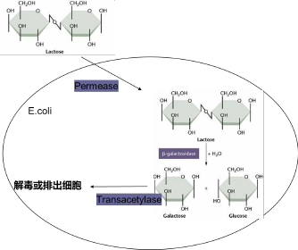
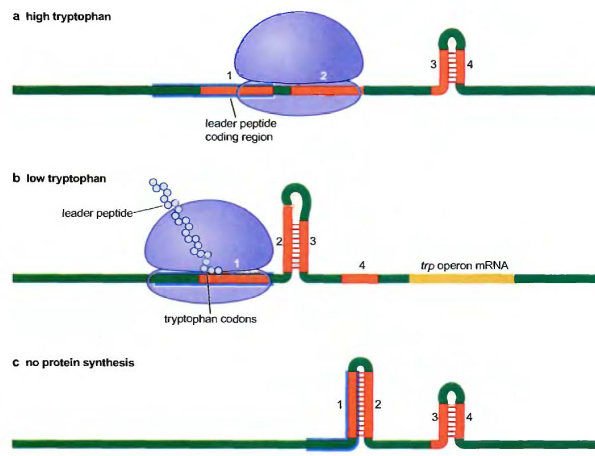
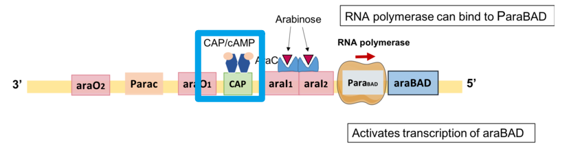
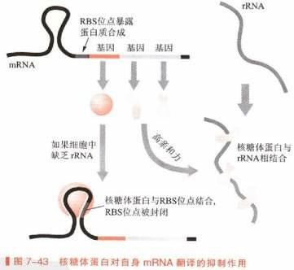
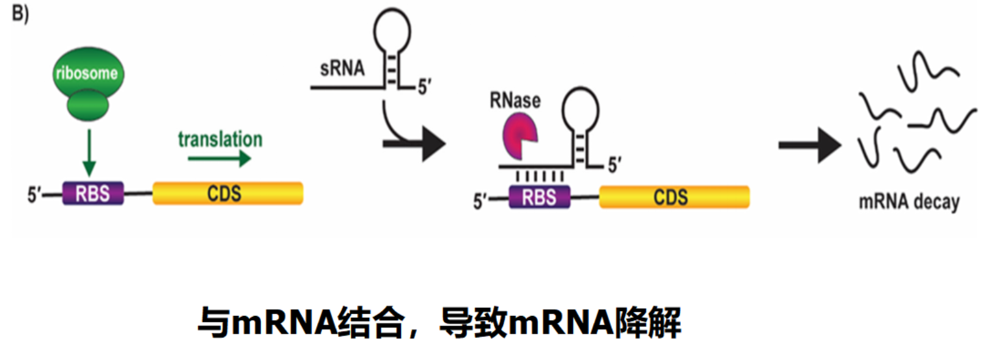

# 第五章 原核生物基因表达调控

[toc]

# 5.1 原核生物基因表达调控的总体概述

## 5.1.1 基因表达调控

+ 基因表达：基因经过一系列步骤表现出其生物功能的整个过程。
+ 基因表达的产物：蛋白质、RNA。

+ 基因表达调控：储存遗传信息的**基因**经过一系列步骤**表现出其生物功能**的整个过程。
  + 基因经过**转录**、**翻译**，产生有生物活性的蛋白质的过程。
  + **rRNA 或 tRNA** 的基因经转录和转录后加工产生成熟的 rRNA 或 tRNA。
  + **调控 RNA** 经过转录和加工形成成熟的 RNA 的过程。

+ 细胞内的基因表达受到严格的调控
  + 细菌中，一个体系在**需要时被打开**，**不需要时被关闭**。这种「开-关」（on-off）活性是通过**调节转录来建立**的，也就是说 **mRNA 的合成是可以被调节的**。
+ 基因表达调控就是对基因产物的合成进行控制的机制
  + 在一些情况下，单细胞有机体调控基因表达是为了应答环境条件（例如，温度，渗透压或者是否存在某种营养物质）的改变或者细胞内部的生理状况（例如为细胞分裂做准备）的变化。**与细胞适应过程**有关的酶或者蛋白质**通常是不存在**的，只有在需要的时候才被合成。

+ 生物体内的基因根据表达的情况可分为两类
  + 管家基因（House-keeping gene）
    + 表达的量相对恒定，因此又称为组成基因。
  + 奢侈基因（Luxury gene）
    + 只是在特定的时段或者在需要的时候才表达，也称为组织特异型基因。
+ 不管是管家基因还是奢侈基因，表达都受到调控，只是调控的方式不一样。
+ 细胞中有些蛋白质的数量几乎不受环境变化的影响，称为组成性蛋白。如组蛋白、糖酵解中的酶蛋白、线粒体蛋白等。
+ 有些蛋白质的数量随环境变化而变化，这些蛋白称为适应性蛋白，这是由基因表达调控的。

### 基因表达的方式

1. 组成型表达（constitutivegeneexpression）
   + 指在**个体发育的任一阶段都能在大多数细胞中持续进行的基因表达**。其基因表达产物通常是对生命过程**必需的或必不可少的**，且较少受环境因素的影响。组成型基因表达也不是一成不变的，其表达强弱也是受一定机制调控的。
2. 适应性表达（adaptiveexpression）
   + 指环境的变化容易使其表达水平改变的一类基因表达。
     + 诱导（induction）：是指在特定环境因素刺激下，基因被激活，从而使基因的表达产物增加。这类基因称为可诱导基因。
     + 阻遏（repression）：是指在特定环境因素刺激下，基因被抑制，从而使基因的表达产物减少。这类基因称为可阻遏基因。

在原核和单细胞真核生物中，通过改变基因表达适应环境，对于细胞的生存非常重要。

如有充足的葡萄糖，细菌就可利用葡萄糖作能源和碳源；当没有葡萄糖时，细菌就要适应环境中存在的其它糖类（如乳糖、半乳糖、阿拉伯糖等），开放能利用这些糖类的酶的基因，以满足生长的需要。即使室内环境保持稳定的高等哺乳类，也经常要变动基因的表达来适应环境。例如与适宜温度下生活相比较，在冷或热环境下适应生活的动物，其肝脏合成的蛋白质图谱就有明显的不同。

长期摄取不同的食物，体内合成代谢酶类的情况也会有所不同。

基因表达调控是生物适应环境生存所必需的。

+ 基因表达调控主要表现在以下几个方面
  1. **转录水平上的调控**
  2. **mRNA 加工成熟水平上的调控**
  3. **翻译水平上的调控**

原核生物中，营养状况(nutritional status)和环境因素(environmental factor)对基因表达起着举足轻重的影响。

在真核生物尤其是高等真核生物中，激素水平(hormone level)和发育阶段(developmental stage)是基因表达调控的最主要手段，营养和环境因素的影响力大为下降。

### 基因表达调控的环节 - 多级调控

基因表达调控可见于从基因激活到蛋白质生物合成的各个阶段，因此基因表达的调控可分为**转录水平**（基因激活及转录起始），**转录后水平**（加工及转运），**翻译水平**及**翻译后水平**，但**以转录水平的基因表达调控最重要**。

+ 转录水平的调控是调控 DNA 模板上转录特定 mRNA 的速度，通常**主要是对转录起始的调控**；有时**也可对转录终止过程进行调控**，一般对延伸过程不容易进行调控。
+ 在**真核细胞**中，也可以对 **mRNA 的加工过程**，包括修饰、剪接和运输等进行调控。而在原核细胞中 mRNA 一旦合成，就可用于指导蛋白质的合成，无需加工，因此，无法在这一步骤进行调控。
+ **翻译水平**的调控，也象转录水平的调控一样，**通常是通过对起始阶段和终止阶段**的调控实现的。

### 微生物基因表达的形式

+ 组成型表达（Constitutive Gene Expression）：指在个体发育的任一阶段都能在大多数细胞中持续进行的基因表达。
+ 产物通常出对生命过程必需的或必不可少的。
  
+ 适应性表达（Adaptive Expression）：指环境的变化容易使其表达水平改变的一类基因表达。
  

## 

5.1.3 基因表达调控的环节 - 多级调控

+ 原核生物基因表达调控的层级
	1. 转录水平上
	2. mRNA 加工成熟水平上
	3. 翻译水平上

# 5.2 转录水平的调控

## 5.2.1 转录调控的原理

+ **基因表达由调控蛋白控制**，基因常常由外部信号控制；这些信号由调控蛋白传递给基因。
+ **调节蛋白通常都是 DNA 结合蛋白**，它们识别受其控制的基因上或基因附近的特异位点。

#### 结构基因与调控基因

+ 结构基因（structuralgene）
  + 编码各类具有不同结构和功能的蛋白质和 RNA 的基因。
+ 调控基因（regulatorygene）
  + 编码蛋白质或 RNA 来调节其他基因表达的基因。

#### 阻遏蛋白 激活蛋白 操纵基因与操纵子

+ 阻遏蛋白（repressor）
  + 阻止基因表达的蛋白质，可与操纵基因结合来阻止转录或结合 RNA 来阻止蛋白质的翻译。
+ 激活蛋白（activator）
  + 激活基因表达的蛋白质。
+ 操纵基因（operator）
  + DNA 上的一个位点，阻遏物能与之结合抑制相邻启动子起始转录。

+ 操纵子（operon）
  + 细菌基因表达和调控的单位，包括结构基因和能被调控基因产物识别的 DNA 控制元件。

#### 诱导与阻遏

+ 诱导（induction）
  + 通过小分子诱导物参与，使阻遏物失活或活化激活剂来实现对基因或操纵子表达的调控。
+ 阻遏（repression）
  + 通过小分子辅阻遏物参与，使激活剂失活或活化阻遏物来实现基因或操纵子不表达的调控。

### 1. 基因表达调控的两种方式

+ 负调控
  + **在没有调节蛋白或者调节蛋白失活的情况下，基因正常表达**。一旦存在调节蛋白或者调节蛋白被激活，基因则不能表达。负调控中的调节蛋白被称为阻遏蛋白。
+ 正调控
  + 在没有调节蛋白或者调节蛋白失活的情况下，基因不表达或者表达量不足。一旦有调节蛋白或者调节蛋白被激活，基因才能表达或者大量表达。正调控中的调节蛋白被称为**激活蛋白**。

### 2. 原核基因调控机制的类型与特点

原核生物的基因调控主要发生在转录水平上，根据调控机制的不同可分为负转录调控和正转录调控。

+ 在负转录调控系统中，调节基因的产物是阻遏蛋白（repressor）。根据其作用特征又可分为负控诱导系统和负控阻遏系统二大类。
+ 在正转录调控系统中，调节基因的产物是激活蛋白（activator）。也可根据激活蛋白的作用性质分为正控诱导系统和正控阻遏系统。

|    -     | 阻遏蛋白 | 激活蛋白 |
| :------: | :------: | :------: |
| 转录激活 | 负控诱导 | 正控诱导 |
| 转录抑制 | 负控阻遏 | 正控阻遏 |

+ 正调控系统
  + 调节基因的产物是激活蛋白。
  + 根据激活蛋白的作用性质，又可分为可诱导的正调控和可阻遏的正调控。
    
+ 负调控系统
  + 调节基因的产物是阻遏蛋白。
  + 根据其作用特征又可分为可诱导的负调控和可阻遏的负调控。
    

## 5.2.2 原核细胞转录调控的操纵子学说

+ 在原核生物中，若干结构基因可串联在一起，其表达受到同一调控系统的调控，这种基因的组织形式称为操纵子。
+ 操纵子是原核生物基因表达调控的功能单位。
+ 它的组成元件包括有调节基因、操作子和一系列结构基因。
+ 操作子可以被调节基因的产物（即调节蛋白）识别。
+ 原核生物中在同一代谢途径中功能相关的蛋白的编码基因排列在一起组成一个操纵子，转录成多顺反子 mRNA。

### 1. 操纵子的组成元件

#### 1 结构基因群

一个操纵子中一般含有 2 个以上的结构基因（structuralgene），每个结构基因是一个连续的开放读框（openreadingframe），$5'-$端有翻译起始密码子，$3'-$端有翻译终止密码子。各结构基因头尾衔接、串连排列，组成结构基因群。

#### 2 启动子

+ 操作子（operator，O）是一段能被调控蛋白特异性结合的 DNA 序列。
+ 操作子常与启动子邻近或重叠，当调控蛋白结合在操纵基因上，会影响其下游基因的转录。

#### 3 操纵子

+ 操纵子（Operator）是一段能被调控蛋白特异性结合的 DNA 序列。
+ 操纵子常与启动子邻近或重叠，当调控蛋白结合在操纵基因上，会影响其下游基因的转录。

乳糖操纵子中的操作子（O）序列位于启动子（P）与被调控的基因之间，部分序列与启动子序列重叠。

操作子序列具有回文（palindrome）结构。许多操作子都具有类似的对称性序列，可能与特定蛋白质的结合相关。

#### 4 终止子

+ 终止子（Terminator）是给予 RNA 聚合酶转录终止信号的 DNA 序列。
+ 操纵子中结构基因群最后个基因的末端存在一个终止子。
+ 终止子按其作用可分为不依赖 $\rho$ 因子的强终止子和依赖 $\rho$ 因子的弱终止子。

#### 5 调控基因

+ 调控基因（Regulatory Gene）是编码能与操纵子结合的调控蛋白的基因。
+ 某些特定的物质能与调控蛋白结合，使调控蛋白的空间构象发生变化，从而改变其对基因转录的影响，这些物质称为效应物。
+ 能引起诱导发生的效应物称为诱导物（inducer）；能导致阻遏发生的效应物称为阻遏物或辅助阻遏物（corepressor）。

调控基因可以在结构基因群附近，也可以远离结构基因，它是通过其基因产物调控蛋白来发挥作用的。

---

5 种元件是每一个操纵元必定含有的。

其中启动子、操作子位于紧邻结构基因群的上游，终止子在结构基因群之后，它们都在结构基因的附近。

调控基因可以在结构基因群附近、也可以远离结构基因，它是通过其基因产物调控蛋白来发挥作用的，因而调控基因不仅能对同一条 DNA 链上的结构基因起表达调控作用，而且能对不在一条 DNA 链上的结构基因起作用，称为反式作用，其编码产生的调控蛋白称为反式调控因子。

#### 操纵子的两种类型

+ 调节分解代谢的操纵子，它们都是属于诱导型，并接受 cAMP-CAP 的调节。分解代谢的底物常为小分子诱导物。
+ 调节合成代谢的操纵子，它们都属于阻遏型，不受 cAMP-CAP 影响。其中一些操纵子等具有弱化子（例如 Trp, His, Phe, Leu, Thr, Ilv 的操纵子），最终产物为辅阻遏物。
  

## 5.2.3 乳糖操纵子 Lactose Operon

乳糖的代谢过程

### 1. 乳糖操纵子的结构

$E. coli$ 乳糖操纵子包括：启动子、操纵子和 3 个结构基因等。

+ 转录时 RNA pol 与启动子结合，通过操纵子，按 $Z\to Y\to A$ 方向进行转录。
+ 每转录出一条 mRNA 上都有 Z, Y 和 A 基因。

  Z 编码 $\beta-$半乳糖苷酶，Y 编码半乳糖透过酶，A 编码转乙酰基酶。
  

  

+ 大肠杆菌能利用乳糖作为碳源。
+ 只有当乳糖成为唯一的碳源时，相关利用的酶才会被合成。

|葡萄糖|乳糖|乳糖操纵子表达|
|:---:|:---:|:---:|
|+|+|off|
|+|-|off|
|-|-|off|
|-|+|**on**|

### 2. 活化蛋白和阻遏蛋白共同调控 $lac$ 基因

+ 乳糖操纵子通常是关闭的。
+ $lac\ I$ 编码的阻遏蛋白以四聚体的形式与操纵基因结合，关闭三个结构基因的表达。
  
+ 乳糖操纵子中的lacZ 、lacY、lacA基因只有在乳糖存在，而葡萄糖缺乏时才会高水平的表达。
  
+ 2 种调节蛋白参与这些基因转录调控。一种是活化蛋白称为 CAP，catabolite activator protein；另一种是阻遏蛋白称为 Lac repressor。活化蛋白 CAP（Catabolite Activator Protein）结合到 CAP 位点，激活结构基因的表达。
  

### 3. 乳糖操纵子调控的机制

#### 1 阻遏蛋白的负调节

+ 无乳糖
	
	
	+ $lac$ 操纵子处于阻遏状态。
	
	+ $lac\ I$ 基因在其自身的启动子 $P_i$ 控制下低水平，组成型表达，产生阻遏蛋白。
	
	+ 每个细胞中仅维持约 10 个分子的阻遏蛋白。
	
	+ 阻遏蛋白以四聚体形式结合在操纵子上阻止结构基因转录。
	  
	
	+ 阻遏蛋白总是与 DNA 结合在一起，它与操纵子的结合可组织 $lac$ 基因的转录。 
	  
	
	  
	
+ 有乳糖
	+ 操纵子有本底水平的表达，细胞内会有几个分子的 $\beta-$ 半乳糖苷酶转运至细胞内。
	+ 细胞内，乳糖受 $\beta-$ 半乳糖苷酶的催化为别乳糖。
	  
	+ 别乳糖与阻遏蛋白结合，阻遏蛋白构象变化，从操作基因 $O$ 解离。
	  
	+ 基因转录开放，$\beta-$ 半乳糖苷酶在细胞内的含量可增加 1000 倍。
	  
	+ 乳糖（别乳糖）作为诱导剂，与 R 结合起去阻遏作用（derepression），诱导了利用乳糖的酶类基因转录开放。
	+ 调控蛋白的活性由信号变构控制。
	  在有到无的作用下e，阻遏蛋白构象改变而失去与操纵基因（$O_1$）的结合能力。
	
	  + 没有诱导物存在下，两个二聚体之间形成铰链，因此N端结构域能与操作子序列结合。
	  + 诱导物-Lac 抑制子的二聚体。与诱导物的结合导致结构的改变，从而降低了抑制子对操作子的亲和性。
	    
	+ 许多调控蛋白都是变构蛋白（Allosteric Protein），通过与效应物结合改变构象而改变活性，起到调节基因转录表达的作用。
	  
	+ 由于阻遏蛋白偶尔会脱离操作子，所以操纵子的转录并非完全关闭，仍会有本底水平的表达，细胞内会有几个分子的 $\beta-$半乳糖苷酶和透性酶。
	
	  

##### 葡萄糖对 $lac$ 操纵子表达的影响

乳糖操纵子只有在乳糖存在，同时葡萄糖缺乏时才会高水平表达

+ 葡萄糖是细菌优先利用的糖类。
+ 当葡萄糖和其他糖类（如乳糖）同时存在时，细菌只利用葡萄糖而不代谢别的糖类，这种现象称为分解代谢物阻遏（Catabolite Repression）。因此，乳糖操纵子只有在乳糖存在，同时葡萄糖缺乏时才会高水平表达。原因是乳糖操纵子除了受阻遏蛋白的调节，还要受到代谢物激活蛋白（cataboliteactivatorprotein，CAP）的调节。
+ 当葡萄糖和乳糖同时存在于培养基中时，$lac$ 操纵子表达受阻。

#### 2. CAP 的正性调控

大肠杆菌优先利用葡萄糖作为碳源，葡萄糖的存在可防止从培养基中吸收其它碳源。当葡萄糖和乳糖同时存在于培养基中时，lac 启动子表达受阻，没有β-半乳糖苷酶活性。

+ CAP（Catabolite Activator Protein）代谢激活蛋白
  + 同二聚体
  + DNA 结合区
  + cAMP（cyclic AMP）结合位点
    

##### CAP 蛋白的活化

+ cAMP 可与细菌中的 CAP（cAMP Receptor Protein，也称为CRP）特异结合，使 CAP 构象改变，形成二聚体而活化。所以 CAP 又称为 cAMP 受体蛋白（cAMP receptor protein，CRP）。cAMP-CRP 二聚体能够结合到启动子的上游识别位点上，通过募集 RNA 聚合酶激活乳糖操纵子的转录。
  
+ 激活蛋白通常结合在启动子的上游协助 RNA 聚合酶与启动子结合。相反，阻遏蛋白结合在启动子的下游，阻止 RNA 聚合酶与启动子结合，或者阻止 RNA 聚合酶向前移动转录基因。

##### CAP 蛋白的正调控

+ 被活化的 cAMP-CRP 二聚体能够结合到 $lac$ 操纵子的启动子上游识别位点上，有利于形成转录起始复合物，并增强了 RNA 聚合酶的活性。并与 RNA 聚合酶 CTD 识别，从而募集 RNA 聚合酶。

  CAP 与 RNA 聚合酶的 $\alpha$ 亚基的 CTD（Carboxyl-Terminal Domain）识别。当与 CAP 相互作用时，$\alpha$ 亚基 CTD 也在 CAP 位点附近与 DNA 分子发生接触。
  
  
  

##### 细胞内 cAMP 的合成

##### 腺苷酸环化酶的激活

+ 单糖磷酸转移酶系统是一种细菌质膜内的蛋白复合物，它将糖类磷酸化并转移到细胞内。
  
+ 环境中有葡萄糖时，复合物中的 $\mathrm{IIA^{Glc}}$ 蛋白（$crr$ 编码）由于葡萄糖转运而失去磷酸化，它可结合乳糖透过酶而阻止乳糖进入细胞。
  
+ 复合物中 $\mathrm{II\ A^{Glc}}$ 蛋白（$crr$ 编码）的磷酸化形式可激活腺苷酸环化酶
  
+ 葡萄糖进入细胞， $\mathrm{II\ A^{Glc}}$ 蛋白发生脱磷酸化，胞内腺苷酸环化酶不被激活，cAMP 浓度低，CAP 蛋白不被激活，无法发挥正调控作用。乳糖转运受阻，胞内浓度低。
	+ 当环境中有葡萄糖时，细胞内的 cAMP 含量降低。
	+ 当环境中无葡萄糖时，细胞内的 cAMP 含量升高。
	  

### 3. 协调调节 - 负调节与正调节协调合作

+ 阻遏蛋白封闭转录时， CAP 不发挥作用
+ 如果没有 CAP 加强转录，即使阻遏蛋白从 O 上解聚仍无转录活性
+ 葡萄糖可降低 cAMP 浓度，CAP 不能被活化，从而抑制转录
+ 乳糖作为效应物使阻遏蛋白从 O 上解聚，利于转录发生

|Sugar in Growth Medium|Relative Amount of $\beta-$galactosidase|
|:-----:|:-----:|
|glucose|1|
|glucose + lactose|50|
|lactose|2500|

+ $lac$ 操纵子的强诱导既要有乳糖，又要无葡萄糖
+ 通过这种机制，细菌优先利用葡萄糖，只有无葡萄糖而有乳糖时，细菌才利用乳糖。
+ 根据环境变化，即使作出正确的调整，以迅速适应

+ 由于 $P_{lac}$ 是弱启动子，由乳糖的存在而使 $lac$ 操纵子开放表达水平很低。有 CRP 加转录活性，细菌才能合成足够的酶来利用乳糖。
  
  
  

## 5.2.4 色氨酸操纵子 trp operon

+ $trp$ 体系参与生物合成，**不受葡萄糖或 $cAMP-CRP$ 的调控**。
+ 色氨酸合成主要分 5 步完成，有 7 个基因参与整个合成过程。
+ 操纵子中各基因功能
  + $trpE$ 和 $trpG$ 编码邻氨基苯甲酸合酶。
  + $trpD$ 编码邻氨基苯甲酸磷酸核糖转移酶。
  + $trpF$ 编码异构酶。
  + $trpC$ 编码吲哚甘油磷酸合酶。
  + $trpA$ 和 $trpB$ 则分别编码色氨酸合酶的 $\alpha$ 和 $\beta$ 亚基。
  + 在许多细菌中，$trpE$ 和 $trpG$，$trpA$ 和 $trpB$ 分别融合成一个基因，产生具有双重功能的蛋白质。

分支酸先在邻氨基苯甲酸合成酶作用下生成邻氨基苯甲酸，此后先与磷酸核糖焦磷酸中的磷酸核糖形成磷酸核糖邻氨基苯甲酸，经重排、脱羧和关环形成吲哚甘油磷酸，然后在色氨酸合成酶催化下先脱去 3-磷酸甘油醛生成吲哚，最后吲哚与一个丝氨酸缩合形成色氨酸。

### 色氨酸操纵子的结构

+ 5 个基因 E，D，C，B，A 构成一个操纵子。
+ 受其上游的启动子 P 和操纵子 O 的调控。
+ 这些基因只有在缺乏 Trp 时，才被有效表达。
  
+ 基因产物是五个酶
  + 邻氨基苯甲酸合成酶（E）
  + 邻氨基苯甲酸磷酸核糖转移酶（D）
  + 磷酸核糖邻氨基苯甲酸异构酶（C）
  + 色氨酸合成酶 $\beta$（B）
  + 色氨酸合成酶 $\alpha$（A）

### 色氨酸操纵子的调控机制

$trp$ 操纵子属阻遏型操纵子，主要调控一系列用于色氨酸合成代谢的酶蛋白的转录合成。

#### 1 辅阻遏蛋白的负调控

色氨酸操纵子通常处于开放状态，其辅阻遏蛋白不能与操纵基因结合而阻遏转录。而当色氨酸合成过多时，色氨酸作为辅阻遏物与辅阻遏蛋白结合而形成阻遏蛋白，后者于操纵基因结合而使基因转录关闭。

> + 负调控
>   + 在没有调节蛋白或者调节蛋白失活的情况下，基因正常表达。
>   + 存在调节蛋白或者调节蛋白被激活，基因则不能表达。
>   + 负调控中的调节蛋白被称为阻遏蛋白。
> + 负转录调控系统
>   + 根据其作用特征又可分为诱导的负调控和阻遏的负调控。

---

+ 调控基因$trpR$ 的位置远离 $P-O-$结构基因群，在其自身的启动子作用下，以组成型方式低水平表达无活性的调控蛋白 $R'$。
+ 当 $Trp$ 浓度足够时，$Trp$ 与 $R'$ 结合使其构象改变而成为活性形式 $R$。$R$ 可与操纵基因 $O$ 特异性结合，阻遏结构基因的转录，$R$ 的阻遏能力仅为 $lac\ I$ 产物的 $\frac{1}{1000}$。
  
+ 缺乏 $Trp$ 时，$trp$ 操纵子被打开，5 个结构基因表达，产生 3 个酶催化分支酸合成为 $Trp$。
+ 当有足够的 Trp 时，操纵子自动关闭。细菌直接利用外界的 $Trp$。
  
+ 与 $lac$ 操纵子的调控不同的是，控制 $trp$ 操纵子的阻遏蛋白的效应物（Trp）不是一个诱导物（inducer），而是一个辅阻遏物（corepressor）。
+ $trp$ 操纵子的调节基因的产物（阻遏物蛋白）无活性，不能与操纵基因结合。
+ 当 Trp 存在时，它与阻遏物蛋白结合，诱导该蛋白构象变化，能够结合在操纵基因上并阻止转录。

> R 的阻遏能力仅为 $lac\ I$ 产物的 $\frac{1}{1000}$

一种负性调控，操纵子通常使开放转录的。当有效应物（Trp）作用时，诱导使阻遏蛋白 $R'$ 构象发生变化，能够结合于操纵基因，则阻遏转录。

#### 2 色氨酸操纵子的衰减调控

##### a. 弱化子与前导肽

如果 $trp$ 操纵子只受 $trpR$ 编码的阻遏物调控，那么在缺乏或存在色氨酸时，$trpR$ 突变使 $trp$ 操纵子表达的酶量应该是相同的。、

但是在 $trpR$ 缺失突变体中，培养基中缺乏色氨酸比有色氨酸存在时的操纵子的表达水平更高，说明色氨酸操纵子除受阻遏物调控外，还受另一种机制的调控。

+ 弱化作用（Attenuation）：当阻遏物对 $trp$ 操纵子的阻遏作用被解除，但细胞内仍有一定浓度的色氨酸时，第二种调控机制使 $trp$ 操纵子的转录在抵达 $trpE$ 之前被提前终止。
+ DNA 中导致 mRNA 合成提前终止的一段序列别成为弱化子（Attenuator）。
+ 弱化作用产生的关键在于 $trp\ \mathrm{mRNA}$ 的前导区段。
  

###### 弱化子

+ 在 $trp$ 操纵子 $pTrp-O$ 与 $trpE$ 间有一段 162 bp 的先导序列（leading sequence，L）。
  在 L 内有一段 123~150 bp 的序列，它在转录起始后可调控转录过程的进行。
+ **这段碱基序列如果缺失，$trp$ 基因表达可提高 6-10 倍。**
+ mRNA 合成起始以后，除非培养基中完全没有色氨酸，**转录总是在这个区域终止**，产生一个仅有 140 个核苷酸的 RNA 分子，终止 $trp$ 基因转录。
+ 这个区域被称为**弱化子**，该区 mRNA 可通过自我配对形成茎-环结构，即终止子结构，为结构基因的转录设了一道关卡。 
  
  

+ 弱化子的共同特点是某些外部因素控制着弱化子的发夹形成，即形成终止子结构。弱化子为结构基因的转录设了一道关卡。
  

###### 前导肽

+ 前导序列中，包含起始密码子 `AUG` 和终止密码子 `UGA`，能产生一个含有 14 个氨基酸的潜在多肽，这个假设的多肽称为前导肽。
+ 前导序列的第 10 和第 11 位上有相邻的两个色氨酸密码子。组氨酸操纵子含有 7 个相邻的组氨酸密码子，苯丙氨酸操纵子也有 7 个苯丙氨酸密码子，这些密码子参与了操纵子中的转录弱化机制。
  
+ 先导序列含有 3 对反向重复序列（A=1+2; B=2+3; C=3+4）。
  
+ C(3+4) 后是 poly(U)，即 C 实际是一个终止子，如果转录 mRNA 时它形成发夹结构，就能使 mRNA 聚合酶停止转录而从 mRNA 上脱离下来。
  
+ 如果 B(2+3) 形成发夹结构，A 和 C 都住能再形成发夹结构，则无法形成终止子。
  
+ 当 A(1+2) 形成发夹结构时，B 就能能形成发夹结构，却有利于 C(3+4) 生成发夹结构，则形成终止子。
  

##### b. 弱化子的负调控

原核生物转录和翻译几乎同时进行，在 $Trp$ 未打到能起阻遏作用的浓度时，从 $Ptrp$ 起始转录，RNA 聚合酶沿 DNA 转录合成 mRNA，同时核糖体结合在 mRNA 上开始翻译。

###### 1. $Trp$ 浓度低

+ $\mathrm{Trp-rRNA^{trp}}$ 量少，核糖体停止在 mRNA 上的 $Trp$ 密码子 `UGG` 处。
+ 1+2 不能形成发夹结构，因而 2+3 可以形成，阻止了 3+4 生成终止子。
+ RNA pol 可沿 DNA 继续转录， $trp$ 操纵子就处于开状态。
  
  

###### 2. $Trp$ 浓度高

+ $\mathrm{Trp-tRNA^{trp}}$ 浓度随之升高，核糖体通过两个 $UGG$，在 4 区被转录之前就到达 2 区。
+ 2+3 不能配对，之后 3+4 区形成终止子结构，转录停止，结构基因被关闭而不在合成色氨酸。
  
  
+ Trp 的存在对终止转录是有效的，弱化子仅允许约 10% 的 RNA 聚合酶通过。
+ 缺乏 Trp 时，弱化子允许所有的聚合酶通过。
  

##### c. 所有氨基酸都不足

+ 核糖体翻译移动的速度就更慢，甚至不能占据 1 区的序列。
+ 结果有利于 1+2 和 3+4 发夹结构的形成，于是 RNA pol 停止转录。
  

> + 在 $trp$ 操纵子上，弱化子的转录终止作用取决于色氨酸的浓度。
>   + 高色氨酸条件下，序列 3 和 4 配对，形成转录终止发夹。
>   + 低色氨酸条件下，核糖体停在色氨酸密码子附近，序列 1 被核糖体覆盖，序列 2 和 3 配对，因此阻止了 3、4 之间形成转录终止发夹。
>   + 没有蛋白合成时，如果没有核糖体起始先导肽的翻译，序列 1、2 形成发夹，阻止了 2、3 发夹的形成，允许序列 3、4 形成转录终止发夹，酶不表达。
>     

#### 3 阻遏与弱化作用的协调

有实验证明，在不加色氨酸的培养基中，$trp$ mRNA 的合成仍然受到部分阻遏，现在一般认为，野生型细胞中同时存在着有活性和无活性的阻遏物，培养基中色氨酸浓度的变化，能够使这两种阻遏物间的平衡发生倾斜，最终做出关闭或启动 $trp$ 操纵子的决定，从而维持一定的色氨酸含量。

+ 细菌中为什么需要弱化子系统

  + **阻遏物**从有活性向无活性的转变**速度较慢**，需要一个能更快地做出反应的系统，以保持培养基中适当的色氨酸水平。

  + **弱化子**系统主要是**对外源色氨酸浓度作出反应**。**外源色氨酸浓度很低的信号**虽然足以引起 trp 操纵子的去阻遏作用，但是这个信号还不足以很快引发内源色氨酸的合成。在这种环境下，弱化子就通过抗终止的方法来增加 trp 基因表达，从而提高内源色氨酸浓度。

+ **阻遏物**的作用是当有大量外源色氨酸存在时，**阻止非必需的先导 mRNA 的合成**，它使这个合成系统更加经济。

+ > 自然界存在着不同类型的合成体系，例如**组氨酸操纵子**拥有在功能上与 $trp$ 操纵子完全相同的弱化子结构，但没有阻遏物，它的表达**完全受弱化子调节**。

+ 在 $trp$ 操纵子中，**阻遏蛋白的负调控起到粗调的作用**，而衰减子起到细调的作用。

+ 细菌通过弱化作用弥补阻遏作用的不足，因为阻遏作用只能使转录不起始，而对于已经起始的转录，只能通过弱化作用使之中途停顿下来。

+ 阻遏作用的信号是细胞内色氨酸的多少，弱化作用的信号则是细胞内载有色氨酸的 tRNA 的多少，通过前导肽的翻译来控制转录的进行。

$G^+$ 细菌中氨基酸合成中的 T-box 调节

## 5.2.5 其他操纵子

L-arabinose metabolism

### $ara$ 操纵子

+ $ara$ 操纵子受调控蛋白 $AraC$ 和 $CAP-cAMP$ 复合物共同调控
+ $AraC$ 可以通过构象改变对 $ara$ 操纵子的转录进行正或负调控
+ $AraC$ 可以自调控

#### $AraC$ 的负调控

+ 没有 Arabinose 时，二聚体 $AraC$ 作为阻遏蛋白抑制 $araBAD$ 转录：一个单体结合于操作区 $araO2$，另一个结合于 $araI1$，形成一个 DNA loop. 从而组织 RNA polymerase 集合到 $araBAD$ 的启动子 $ParaBAD$

#### $AraC$ 的正调控

+ 有 arabinose 时，结合 arabinose 后 $AraC$ 二聚体构型发生改变。$AraC-arabinose$ 复合物从 $araO2$ 脱落，DNA loop 被破坏
+ 2 个 $AraC-arabinose$ 复合物分别与 $araI1$ 和 $araI2$ 结合。与 $araI2$ 结合的 **$AraC$** 蛋白可招募 RNA polymerase. 从而，激活 $araBAD$ 的转录。

#### CAP/cAMP 的正调控

+ CAP 仅在没有葡萄糖时才会充当转录激活剂。
+ 不存在葡萄糖时，高水平的 $CAP-cAMP$ 复合物会结合 $CAP$ 结合位点，即 $araI1$ 和 $araO1$ 之间的位点。
+ $CAP-cAMP$ 的结合负责打开 $araI1$ 和 $araO2$ 之间的 DNA 环，增加 $AraC$ 蛋白对 $araI2$ 的结合亲和力，从而促进 RNA 聚合酶与 $araBAD$ 启动子结合，从而开启代谢 $L-arabinose$ 所需的 $araBAD$ 的表达阿拉伯糖。

### $AraC$ 的自调控

+ $araC$ 的表达受到其自身蛋白产物 $AraC$ 的负调控。过两的 $AraC$ 与 $araC$ 基因的操纵子 $araO1$ 结合，这在物理上阻止了 RNA 聚合酶到达 $araC$ 启动子。因此，$AraC$ 蛋白在高浓度下会抑制其自身的表达。

阿拉伯糖-木糖二辅助作用机理

大肠杆菌中葡萄糖、木糖和阿拉伯糖之间共利用机制

## 5.2.6 多启动子调控的操纵子

+ rRNA 操纵子（2 个启动子）
+ 核糖体蛋白 $SI$ 操纵子（4 个启动子）
+ DnaQ 蛋白操纵子（2 个启动子）

操纵子中有不同的启动子，他们有不同的强度，启动作用又受不同因子的调控。许多因素相互作用，才使基因表达更有效，更协调。在不同的生活环境中，不同的启动子精密地调节基因的表达量，对维持细菌的生存起着非常重要的作用。

## 5.2.7 转录水平的其他调控方式

转录过程涉及转录机器附着于 DNA，识别启动子序列，起始 RNA 的合成，延伸和终止。转录的任何一步都受到调控。

+ 转录水平上以下其它调控方式
  + $\sigma$ 因子的调节作用
  + 组蛋白类似蛋白的调节作用
  + 转录调控因子的作用
  + 抗终止因子的调节作用

### 1. $\sigma$ 因子的调节作用

+ 不同的σ因子可以独立地起作用，为了相应不用环境信号的变化，$\sigma$ 因子之间常常交互作用构成网络贴空模式，是的原话基因的表达稳定而平衡。
+ $\sigma$ 因子本身的活性受蛋白水解酶的调控，也能被同源的抗 $\sigma$ 因子失活。
+ 抗 $\sigma$ 因子能够与特定的 $\sigma$ 因子结合，阻止它们与 RNA 聚合酶组装。

---

+ $\sigma$ 因子帮助核心酶识别启动子，不是 RNA 链延伸必需的。
+ $\sigma$ 因子能提高 RNA 聚合酶与特异启动在的亲和力，也能降低与非特异启动子的亲和力。
+ $\sigma$ 因子通过降低核心酶与非特异序列的亲和力，和增加其与启动子的亲和力来帮助核心酶识别启动子。
+ 新生 RNA 链达到 $6-9$ 个核苷酸，形成稳定的酶-DNA-RNA 复合物时，$\sigma$ 因子释放。
+ 无 $\sigma$ 因子的核心酶也能在 DNA 模板上合成 RNA，但不能正确地起始转录。

---

#### 枯草芽胞杆菌的芽胞形成过程中的级联调控

$\sigma$ 级联保证了芽胞形成过程中各个步骤按正确的顺序发生。在 $\sigma$ 级联中每一 $\sigma$ 因子控制着芽孢形成的一个阶段，并且控制着在下一阶段发挥左右的 $\sigma$ 因子合成。并且在母细胞和芽胞之间存在着信息交换，使前芽胞和母细胞中的基因表达从相互协调。

#### 热激蛋白的表达

大肠杆菌的最适生长温度是$ 37\degree C$. 当温度上升至 $46\degree C$ 时，大肠杆菌几乎停止生长。在 $46\degree C$ 下细胞合成的蛋白质大约 $30\%$ 为一组相当保守的热激蛋白（heat shock protein，HSP）。很多热激蛋白是分子伴侣（molecular chaperones）和蛋白酶。分子伴侣的作用是介导蛋白质正确折叠；蛋白酶的作用则是降解受到热损伤而又不能修复的蛋白质。

热激蛋白的表达调控主要发生在转录水平上。热激蛋白基因的启动子被 $\sigma^{32}$ 而不是通常的 $\sigma^{70}$ 识别。$\sigma^{32}$ 也不能识别 $\sigma^{70}$ 启动子，因为这两种 $\sigma$ 因子识别的启动子序列不一样。

HSP 的诱导合成是由于细胞内的 $\sigma^{32}$ 水平瞬间升高引起的。

在热激条件下 $\sigma^{32}$ 的合成会增加，热激诱导 $\sigma^{32}$ 合成发生在翻译水平。

另一方面，在热激条件下 $\sigma^{32}$ 的稳定性也增加了。

### 2. 组蛋白类似蛋白的调节作用

细菌中存在一些组蛋白类似蛋白，能非特异地结合 DNA，维持其高级结构（例如 H-NS). H-NS 先结合到 DNA 上，然后通过蛋白-蛋白相互作用形成多聚体以帮助维持 DNA 的高级结构；H-NS 与大肠杆菌基因组上分散的大量基因的调控区有较高的亲和性，这些基因大都与环境条件的变化有关，H-NS 的结合能调控这些基因的转录。

### 3. 转录因子的调控作用

+ 大肠杆菌中大约有 300 多个基因编码与启动子区结合的蛋白，它们能激活或抑制转录，称为转录调控因子。
+ 它们大多是序列特异性的 DNA 结合蛋白，能与特定的启动子结合。
+ 有些转录调控因子能调控很多基因的表达（如 CRP，FNR，IHF，Fis...），有些只能调节一两个启动子。
+ 许多基因的启动子区有多个转录调控因子的结合位点，共同作用才能使RNA聚合酶顺利起始基因转录。

### 4. 抗终止作用

+ 抗终止蛋白阻止转录的终止作用因此 RNA 聚合酶能够越过终止子继续转录 DNA。
+ 抗终止因子在 RNAP 到达终止子之前与之结合。
+ 主要见于噬菌体和少数细菌。

# 5.3 转录后调控

基因表达的转录调控是生物最经济的调控方式。但转录生成 mRNA 以后，再在翻译或翻译后水平进行「微调」，是对转录调控的补充，它使基因表达的调控更加适应生物本身的需求和外界条件的变化。调控方式有：

+ mRNA自身结构元件对翻译起始的调控
+ mRNA稳定性对转录水平的影响
+ 调节蛋白的调控作用
+ 反义RNA的调节作用
+ 稀有密码子对翻译的影响
+ 重叠基因对翻译的影响
+ 翻译的阻遏
+ 魔斑核苷酸水平对翻译的影响

原核生物翻译起始

## 5.3.1 mRNA 自身结构元件对翻译起始的调控

原核生物翻译起始

### 1.  起始密码子

大肠杆菌有 $14\%$ 的基因起始密码子是 `GUG`, $3\%$ 为 `UUG`，另有两个是 `AUU`，这些密码子与 fMet-tRNA 的配对能力比 `AUG` 弱，从而导致翻译效率下降。

### 2. $5'$ 非翻译区

+ RBS 的结合强度取决于 SD 序列的结构及与 `AUG` 的距离。SD 与 `AUG` 相距一般以 4-10 核苷酸为佳，9 核苷酸最佳。
+ mRNA 的二级结构也是翻译起始调控的重要因素。30S 亚基必须与 mRNA 结合，要求 mRNA $5'$ 端有一定的空间结构。SD 序列的微小变化会改变 mRNA $5'$ 端二级结构，影响 30S 亚基与 mRNA 的结合，从而造成蛋白质合成效率上的差异。

### 3. 核体开关 Riboswitch

mRNA 一些非编码区的序列折叠成一定的构象，这些构象的改变应答于体内的一些代谢分子、离子浓度或温度等，从而通过这些构象的改变达到调节 mRNA 转录的目的。

1. 转录水平的调控：主要是控制终止子和抗终止子的形成，达到调控的目的
2. 翻译水平的调控：控制剪切功能

## 5.3.2 mRNA 稳定性对转录水平的影响

+ 所有细胞都有一系列核酸酶，用来清除无用的 mRNA。
+ 一个典型的 mRNA 半衰期为 2-3 min.
+ mRNA 分子被降解的可能性取决于其二级结构。
  

## 5.3.3调节蛋白的调控作用

细菌中有些 mRNA 结合蛋白可激活靶基因的翻译。相反 mRNA 特异性抑制蛋白则通过与核糖体竞争性结合 mRNA 分子来抑制翻译的起始。大肠杆菌中的核糖体蛋白就存在翻译抑制现象。

## 5.3.4 小 RNA(sRNA) 的调节作用

+ RNA 调节是原核基因表达转录后调节的另一种重要机制。
+ 细菌响应环境压力的改变，会产生一些非编码小 RNA 分子，能与 mRNA 中的特定序列配对并改变其构象，导致翻译过程的开启或关闭等作用。
+ 反义 RNA（antisense RNA）是与 mRNA 互补的 RNA 分子。
  

### 顺式编码-/反式编码-sRNA

sRNA 能与 mRNA 分子特异性地互补结合，从而抑制该 mRNA 的加工与翻译。

### sRNA 的作用机制

1. sRNA 直接作用于其靶 mRNA 的 SD 序列和（或）编码区，引起翻译的直接抑制或与靶 mRNA 结合后引起该双链 RNA 分子对 RNase III 的敏感性增加，使其降解。
2. sRNA 与 mRNA 的 SD 序列的上游非编码区结合，从而抑制靶 mRNA 的翻译功能。其作用机制可能是 sRNA 与靶 mRNA的上游序列结合后阻止了核糖体的结合。
3. sRNA 可直接抑制靶 mRNA 的转录。sRNA 和 mRNA 有不完全的互补序列，可以形成双链的 RNA 杂交体。而在 mRNA 上紧随杂交区之后的是一段 U 丰富区。其结构类似于终止子结构，从而使转录开始不久后即终止。

作用于 RBS 位点的调控

sRNA 的作用机制-转录后水平

Hfq in Gram-negative bacteria

Bacterial stress responses

Identification of Bacterial Small RNAs by RNA Sequencing

## 5.3.5 稀有密码子对翻译的影响

+ 细菌可通过翻译调控不同蛋白含量的高低。
+ $dnaG$, $rpoD$ 及 $rpsU$ 属于大肠杆菌基因组上的同一个操纵子，而每个细胞内 50 个拷贝的 DnaG 蛋白，2800 个拷贝的 RpoD 蛋白；40000 个拷贝的 RpsU 蛋白。
+ 基因转录出来的三个蛋白相应的 mRNA 拷贝数大体相同，由于翻译的调控使得蛋白的拷贝数发生了很大的变化。
  
+ 许多调控蛋白在细胞内含量很低，编码这些蛋白的基因中高频率地使用了很多稀有密码子，稀有密码子对应低丰度的 tRNA。因此，翻译速度受 tRNA 供应的限制，影响了蛋白质合成的总量。
+ 而其它基因中利用这些稀有密码子频率很低。

## 5.3.6 重叠基因对翻译的影响

正常情况下，$trp$ 操纵子中 5 个基因产物是等量的，但 $trpE$ 突变后，其邻近的 $trpD$ 产量比下游 $trpBA$ 产量要低得多。研究 $trpE$ 和 $trpD$ 以及 $trpB$ 和 $trpA$ 两对基因中核苷酸序列与翻译的关系，发现 $trpE$ 基因的终止密码子和 $trpD$ 基因的起始密码子共用核苷酸。

偶联翻译是保证两个基因产物在数量上相等的重要手段。

$galT$ 的终止密码子与 K 的起始密码子相隔 3 个核苷酸，但 K 基因的 SD 序列却位于 T 基因的终止密码子之前。当 T 翻译终止时，核糖体覆盖了 SD 序列和 K 基因的起始密码子，还没有脱落就开始了 K 的翻译。

## 5.3.7 细菌营养缺乏调控

+ 细菌在葡萄糖缺乏时可产生报警物质 cAMP；可保证其利用其它糖类，如 lac（乳糖）操纵子、gal（半乳糖）操纵子和 ara（阿拉伯糖）操纵子等。
+ 细菌在饥饿条件下，缺乏各种氨基酸使得蛋白质合成受阻，将采取关闭大量的代谢过程来抵御不良条件，保存自己的一种机制。
+ 当氨基酸缺乏时，tRNA 成为空载体，就触发 ATP 和 GTP 合成一种新化合物，称为四磷酸鸟苷 ppGpp 和 pppGpp。在层析谱上检出这两种化合物的斑点，称为魔斑。

$$
\large\ce{GTP + ATP -> pppGpp + AMP + ppGpp}
$$

+ 空转反应：AA 饥饿时，无负载的 tRNA 进入核糖体的 A 位后，新肽键不能形成，但 GTP 不断消耗。
+ 空转反应导致信号分子的产生 ppGpp pppGpp
+ ppGpp 的主要作用可能是影响 RNA pol 与启动子结合的专一性，从而成为细胞内严紧控制的关键。
+ ppGpp 也可抑制核糖体和其它大分子的合成，活化某些氨基酸操纵子的转录表达，抑制与氨基酸运转无关的转运系统，活化蛋白水解酶等。
  

ppGpp Function

Levels of regulation in bacterial gene expression
