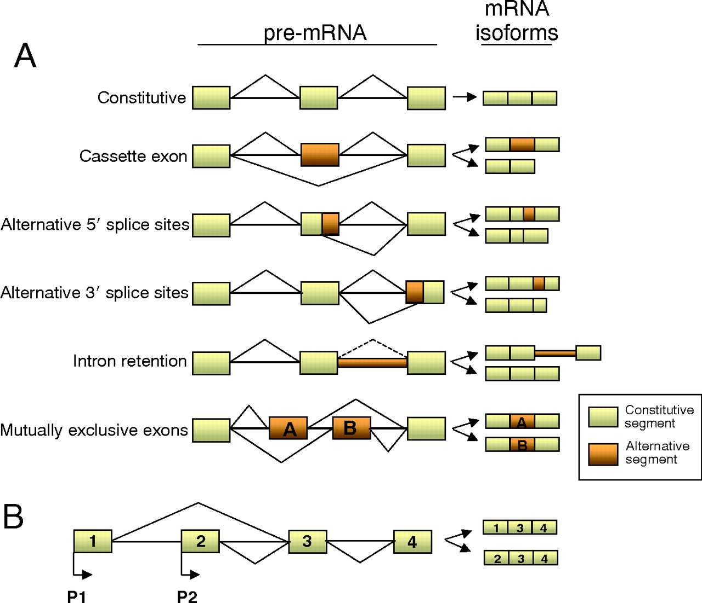
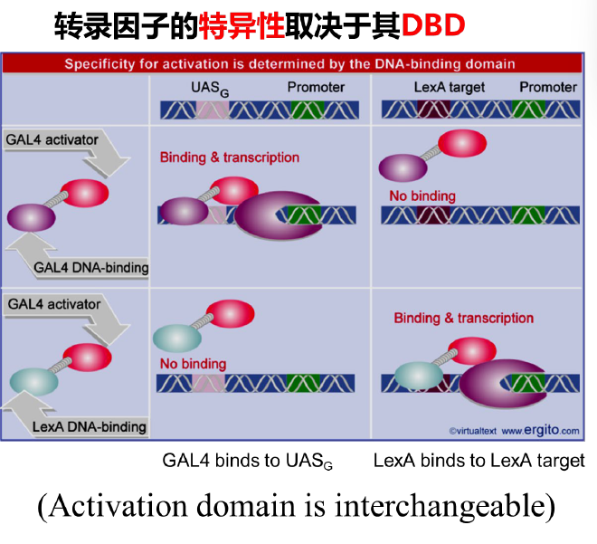
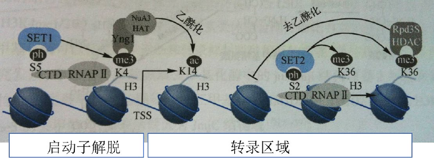
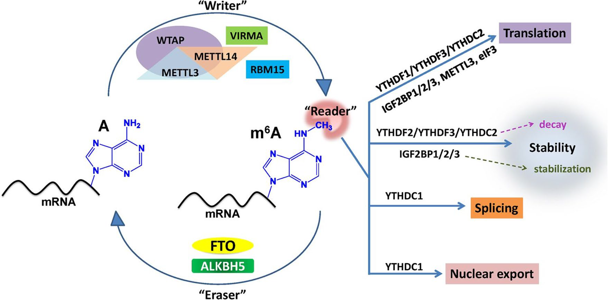
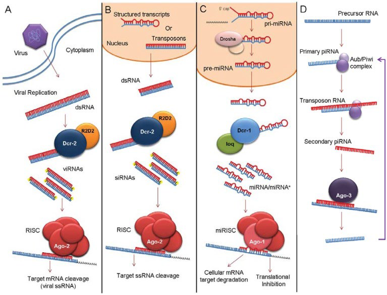

# 6 真核生物基因表达的调控

[toc]

#  真核基因表达调控相关概念和一般规律

##  基因表达的基本概念

+ 基因表达(gene expression)
  + 基因经过转录、翻译，产生具有特异生物学功能的蛋白质分子或 RNA 分子的过程。
+ 基因表达调控(gene regulation, or regulation of gene expression)
  + 基因表达是受内源及外源信号调控的。

##  真核基因的断裂结构

###  外显子与内含子

+ 内含子是指存在于原始转录物或基因组 DNA 中，但不存在于成熟 mRNA、rRNA 或 tRNA 中的那部分核苷酸序列。
+ 基因中的内含子数量和大小都不同。胶原蛋白基因长约 40 kb，至少有 40 个内含子，其中短的只有 50 bp，长的可达到 2000 bp。
+ 少数基因，如组蛋白及 $\alpha$ 型、$\beta$ 型干扰素基因，根本不带内含子。

###  外显子与内含子的连接区

+ 断裂结构的外显子-内含子连接区的高度保守性和特异性碱基序列。
+ 几乎每个内含子 $5'$ 端起始的两个碱基都是 `GU`，而 $3'$ 端最后两个碱基总是 `AG`，为 `GU-AG` 法则。
+ 连接区的保守序列几乎存在于所有高等真核生物基因中，表明存在着共同的剪接加工机制。

###  外显子与内含子的可变调控

+ 组成型剪接
  + 一个基因的转录产物只能产生一种成熟的 mRNA，编码一个多肽。如肌红蛋白重链基因有 41 个外显子，却能精确地剪接成一个成熟的 mRNA。
+ 择性剪接
  + 同一基因的转录产物由于不同的剪接方式形成不同 mRNA 的过程称为选。不少真核基因的原始转录产物可通过不同的剪接方式产生不同的 mRNA，并翻译成不同的蛋白质。有些核基因转录时选择了不同的启动子，或者选择了不同的 polyA 位点而使原始转录物具有不同的二级结构，产生不同的 mRNA 分子。

##  基因家族

+ 真核细胞中许多相关的基因常按功能成套组合，被称为基因家族。
  + 同一家族的成员有时紧密排列在一起，成为一个基因簇。
  + 更多时候，分散在同一染色体不同部位，甚至位于不同染色体上，具有各自不同的表达调控模式。
+ 简单多基因家族，简单多基因家族中的基因一般以串联方式前后相连。
  
  + 在真核生物中，前 rRNA 转录产物的沉降系数为 45S，（约有 14000 个核苷酸)，包括 18S，28S 和 5.8S 三个主要 rRNA 分子。
+ 复杂多基因家族，一般由几个相关基因家族构成，基因家族之间由间隔序列隔开，并作为独立的转录单位。
  
  + 编码不同组蛋白的基因处于一个约为 6000bp 的片段中，分别被间隔序列所隔开。这 5 个基因组成的串联单位在整个海胆基因组中可能重复多达 1000 次。
    

##  基因表达的方式和特点

+ 基因表达的方式
  + 组成性表达
  + 选择性表达
+ 基因表达的时空特异性
  + 发育过程不同阶段，细胞或组织特异性。

##  真核基因表达调控一般规律

+ 真核基因的表达调控的特点
  + 原核细胞
    + 环境因素对调控起决定性的作用。群体中每一个细胞对环境变化的反应是直接的和一致的。
  + 真核细胞
    + 基因表达调控最明显的特征是在特定时间，特定的细胞中特定的基因被激活，实现「预定」的、有序的、不可逆转的分化、发育，并使生物的组织和器官保持正常功能。这是生命活动规律决定的，环境因素在其中作用不大。
+ 真核生物基因调控可分为两大类
  + 瞬时调控或称可逆性调控，它相当于原核细胞对环境条件变化所做出的反应，包括某种底物或激素水平升降，或细胞周期不同阶段酶活性的调节。
  + 发育调控或称不可逆调控，是真核基因调控的精髓部分，决定了真核细胞生长、分化、发育的进程。
+ 据基因调控发生的先后次序，又可分为
  + 转录水平调控
  + 转录后水平调控（RNA 加工成熟过程的调控，翻译水平的调控，蛋白质加工水平的调控）。
+ 研究基因调控的三个主要内容
  1. 诱发基因转录的信号
  2. 基因调控在哪一步（模板 DNA 的转录、mRNA 的成熟或蛋白质合成）实现的
  3. 不同水平基因调控的分子机制是什么

#  真核基因表达的转录水平调控

+ 真核细胞与原核细胞在基因转录、翻译及 DNA 的空间结构方面存在的差异
  1. 真核中成熟 mRNA 多为单顺反子 mRNA。
  2. 真核 DNA 与组蛋白和非组蛋白相结合，只有一小部分 DNA 是裸露的。
  3. 真核 DNA 中很大部分是不转录的，大部分基因中存在内含子。
  4. 真核生物能够根据生长发育阶段的需要进行 DNA 片段重排，在需要时增加细胞内某些基因的拷贝数。
  5. 真核生物中基因转录的调节区可能远离核心启动子达几百个甚至上千个碱基对。
  6. 真核生物的 RNA 在细胞核中合成，只有经转运穿过核膜，到达细胞质后，才能被翻译成蛋白质。
  7. 许多真核生物的基因只有经过复杂的成熟和剪接过程，才能被顺利地翻译成蛋白质。
+ 基因转录调节的基本要素包括顺式作用元件（cis-acting element）、反式作用因子（trans-acting factor）和 RNA 聚合酶
  + 真核生物基因组中含有可以调控自身基因表达活性的特异 DNA 序列，称为顺式作用元件（cis-acting element）。
  + 顺式作用元件能够被转录调节蛋白特异识别和结合，从而影响基因表达活性。
    + 顺式作用元件
      + 启动子 Promoter
      + 增强子 Enhancer
      + 沉默子 Silencer
  + 启动子
    + 真核生物的启动子由核心启动子和上游启动子两个部分组成，是在基因转录起始位点（+1）及其 $5'$上游 100~200 bp 以内的一组具有独立功能的 DNA 序列，每个元件长度为 7~20 bp，是决定 RNA 聚合酶 II 转录起始点和转录频率的关键元件。
      + 核心启动子（core promoter）：保证 RNA 聚合酶 II 转录正常起始所必需的、最少的 DNA 序列，包括转录起始位点和 TATAbox；保证基础转录。
      + 上游启动子元件（upstream promoter element，UPE）：-70 bp 附近的 `CAAT` box 和 `GC` box，能通过 TFIID 复合物调节转录起始的频率，提高转录效率。
        
  + NA 聚合酶 II 与通用转录因子
    

##  增强子对转录的影响

+ 增强子是指能使与它连锁的基因转录频率明显增加的 DNA 序列，最早发现于 SV40 早期基因的上游，有两个长 72 bp 的正向重复序列。
  
+ 增强子的特性
  1. 增强效应十分明显。
  2. 增强效应与其位置和取向无关。
  3. 大多为重复序列（50 bp），适合与某些蛋白因子结合。
  4. 其增强效应有严密的组织和细胞特异性。
  5. 无基因专一性，可在不同的基因组合上表现增强效应。
  6. 许多增强子还受外部信号的调控。
     
+ 增强子的功能受 DNA 双螺旋空间构象的影响。
+ 增强子可能有如下 3 种作用机制：
  + 影响模板附近 DNA 双螺旋结构，导致 DNA 双螺旋弯折或在反式因子的参与下，以蛋白质之间的相互作用为媒介形成增强子与启动子之间「成环」连接，活化基因转录。
  + 将模板固定在细胞核内特定位置，如连接在核基质上，有利于 DNA 拓扑异构酶改变 DNA 双螺旋结构的张力，促进 RNA 聚合酶 II 在 DNA 链上的结合和滑动。
  + 增强子区可以作为反式作用因子或 RNA 聚合酶 II 进入染色质结构的「入口」。

##  反式作用因子

+ 反式作用因子（trans-actingfactor）
  + 能直接或间接与顺式作用元件相互作用，进而调控基因转录的一类调节蛋白，统称为反式作用因子。
+ 根据不同功能，常将反式作用因子分为以下 3 类
  + 识别启动子元件的基本转录因子（通用转录因子）。
  + 识别增强子或沉默子的转录调节因子。
  + 不需要通过 DNA-蛋白互作就参与转录调控的共调节因子（主要通过蛋白-蛋白相互作用影响转录因子的分子构象以调节转录活性）。

###  基本转录因子

+ 转录复合物中，根据各个蛋白质成分在转录中的作用，能将整个复合物分为 3 部分
  1. 参与所有或某些转录阶段的 RNA 聚合酶亚基，不具有基因特异性。
  2. 与转录的起始或终止有关的辅助因子，不具基因特异性。
  3. 与特异调控序列结合的转录因子。
+ 被广泛研究的转录因子主要有
  + TFIID：识别 TATA 区
  + CTF：识别 CAAT 区
  + SP1：识别 GGGCGG
  + HSF：识别热激蛋白启动区

###  转录调节因子

+ 这类调节蛋白能识别并结合转录起始点的上游序列和远端的增强子元件，通过 DNA－蛋白质相互作用而调节转录活性。决定不同基因的时间、空间特异性表达。
+ 首先它们特异地与 DNA 结合位点相结合，然后激活转录。这些活性可以独立分配给特定的蛋白结构域，分别称作 DNA 结合结构域和激活结构域。
+ 转录激活功能是与其 DNA 结合活性相分离的，它们在蛋白质的不同区域。

#### 1 DNA 识别或结合域

1. 螺旋-转折-螺旋结构（helix-turn-helix）。这类蛋白质分子中有至少两个 $\alpha$ 螺旋，中间由短侧连氨基酸残基形成「转折」，近羧基端的 $\alpha$ 螺旋中氨基酸残基的替换会影响该蛋白质在 DNA 双螺旋大沟中的结合。
   
2. 锌指结构（zincfinger）。锌指结构家族蛋白包括锌指、锌钮和锌簇结构，有锌参与时才具备转录调控活性。与 DNA 的结合较为牢固，特异性也很高。
   + 类固醇激素受体家族含有连续的两个锌指结构，以同源或异源性二聚体的方式将两个 $\alpha$ 螺旋结合在 DNA 相邻的两个大沟中。
   + 一个 $\alpha$ 螺旋与一个反向平行的 $\beta$ 片层的基部以锌原子为中心，通过与一对半胱氨酸和一对组氨酸之间形成配位键相连接，锌指上突出的赖氨酸和精氨酸参与 DNA 的结合。
     
   + 已知的锌指结构主要发现于促进 RNA 聚合酶 II 和 RNA 聚合酶 III 转录的转录因子中。
3. 碱性-亮氨酸拉链（basic-leucine zipper），即 bZIP 结构。蛋白中每隔 6 个氨基酸就有一个亮氨酸残基，导致第 7 个亮氨酸残基都在螺旋的同一方向出现。以二聚体形式与 DNA 结合，亮氨酸拉链区并不直接结合 DNA，肽链氨基端 20～30 个富碱性氨基酸结构域与 DNA 结合，但以碱性区和亮氨酸拉链结构域整体作为基础。
   
   
4. 碱性-螺旋-环-螺旋（basic-helix-loop-helix，bHLH）。在免疫球蛋白 $\kappa$ 轻链基因的增强子结合蛋白 E12 与 E47 中，羧基端 100～200 个氨基酸残基可形成两个两性 $\alpha$ 螺旋，被非螺旋的环状结构所隔开，蛋白质的氨基端则是碱性区，其 DNA 结合特性与亮氨酸拉链类蛋白相似。
   + bHLH 类蛋白只有形成同源或异源二聚体时，才具有足够的 DNA 结合能力。当这类异源二聚体中的一方不含有碱性区（如 Id 或 E12 蛋白）时，该二聚体明显缺乏对靶 DNA 的亲和力。
     

#### 2 转录活化结构域（transcriptional activation domain）

+ 真核生物中，反式作用因子的功能由于受蛋白质-蛋白质之间相互作用的调节变得精密、复杂，完整的转录调控功能通常以复合物的方式来完成，因此，是否具有转录活化域就成为反式作用因子中唯一的结构基础。
+ 反式作用因子功能具有多样性，其转录活化域也有多种，通常依赖于 DNA 结合结构域以外的 30-100 个氨基酸残基。
+ 在不同的转录活化域有下列特征性结构
  + 带负电荷的螺旋结构。哺乳动物细胞中糖皮质激素受体的两个转录活化域，AP1 家族的 Jun 及 GAL4 都有酸性的螺旋结构，它们可能与 TFIID 复合物中某个通用因子或 RNA 聚合酶 II 本身结合，具有稳定转录起始复合物的作用。
  + 富含谷氨酰胺的结构。SP1 是启动子 GC 盒的结合蛋白，共有 4 个参与转录活化的区域，其中最强的转录活化域含 25%左右的谷氨酰胺。
  + 富含脯氨酸的结构。CTF-NF1 因子羧基端富含脯氨酸（达 20%～30%），很难形成 $\alpha$ 螺旋。在 Oct2、Jun、AP2、SRF 等哺乳动物因子中也有富含脯氨酸的结构域。
    
    
    
    

#  真核基因表达的染色质修饰和表观遗传调控

#### 表观遗传 Epigenetics

+ 指 DNA 序列不发生变化，但基因表达却发生了可遗传的改变。
+ 细胞内除了遗传信息以外的其他可遗传物质发生的改变，且这种改变在发育和细胞增殖过程中能稳定传递。

##  真核 DNA 水平上的基因表达调控

### 「开放」型活性染色质结构对转录的影响

+ 活跃状态的基因更容易被 DNA 酶 I 所降解。
+ 基因活跃表达时启动区部分序列可能解开成单链，从而不能继续缠绕在核小体上，使启动区 DNA「裸露」于组蛋白表面，形成对 DNA 酶 I 的超敏感现象。
  

###  基因扩增

+ 基因扩增是指某些基因的拷贝数专一性大量增加的现象，它使细胞在短期内产生大量的基因产物以满足生长发育的需要，是基因活性调控的一种方式。
+ 非洲爪蟾的卵母细胞中原有 rRNA 基因（rDNA）约 500 个拷贝，在减数分裂粗线期，基因开始迅速复制，到双线期拷贝数约为 200 万个，扩增近 4000 倍，可用于合成 1012 个核糖体，以满足卵裂期和胚胎期合成大量蛋白质的需要。

###  基因重排与变换

+ 将一个基因从远离启动子的地方移到较近的位点从而启动转录，被称为基因重排。
+ 免疫球蛋白的肽链主要由可变区（V 区）、恒定区（C 区）以及两者之间的连接区（J 区）组成，V、C 和 J 基因片段在胚胎细胞中相隔较远。编码产生免疫球蛋白的细胞发育分化时，通过染色体内 DNA 重组把 4 个相隔较远的基因片段连接在一起，产生具有表达活性的免疫球蛋白基因。16

##  DNA 甲基化与基因调控

###  DNA 的甲基化

+ DNA 甲基化能引起染色质结构、DNA 构象、DNA 稳定性及 DNA 与蛋白质相互作用方式的改变，从而控制基因表达。
+ 研究证实，CpG 二核苷酸中胞嘧啶的甲基化导致了人体 1/3 以上由于碱基转换而引起的遗传病。
+ DNA 甲基化主要形成 5-甲基胞嘧啶（5mC）和少量的 N6-甲基腺嘌呤（6mA）及 7-甲基鸟嘌呤（7mG）。19

###  DNA 甲基化抑制基因转录机制

+ 甲基化引起 DNA 构型发生变化，B-DNA $\to$ Z-DNA，不利于转录起始。
+ 甲基的引入不利于模板与 RNA 聚合酶的结合，从而降低转录活性。

> 对于弱启动子来说，稀少的甲基化就能使其完全失去转录活性。当这一类启动子被增强时（带有增强子），即使不去甲基化也可以恢复其转录活性。若进一步提高甲基化密度，即使增强后的启动子仍无转录活性。

DNA 的甲基化还会提高突变频率。真核生物中 5mC 脱氨后生成的胸腺嘧啶（T），不易被识别和校正，将在 DNA 分子中引入可遗传的转化（C $\to$ T）。

###  DNA 甲基化与 X 染色体失活

+ 雌性哺乳动物体细胞的两条 X 染色体中会有一条发生随机失活这是一种基因剂量补偿的机制。
+ X 染色体的 Xq13。3 区段有一个 X 失活中心（X-inactivationcenter，Xic），X-失活从 Xic 区段开始启动，然后扩展到整条染色体。
+ 基因 Xist（xi-specifictranscript）只在失活的 X 染色体上表达，而不在活性的 X 染色体上表达。Xist 只转录 RNA，它能与 Xic 位点作用。

###  甲基化测序 MethylC-seq

##  组蛋白的乙酰化及去乙酰化

核心组蛋白朝向外部的 N 端部分被称为「尾巴」，可被组蛋白乙酰转移酶和去乙酰化酶修饰，加上或去掉乙酰基团。

###  组蛋白的基本组成

###  核心组蛋白的乙酰化与去乙酰化

+ 乙酰化：组蛋白乙酰基转移酶 Histoneacetyletransferase（HAT）
+ 去乙酰化：组蛋白去乙酰化酶 Histonedeacetylase（HDAC）

###  组蛋白乙酰基转移酶 HAT

+ 目前已发现的 HAT 有两类
  + 一类与转录有关
  + 另一类与核小体组装以及染色质的结构有关

> HAT 并不是染色质结合蛋白，但可以通过与其他蛋白相互作用来影响染色质的结构。

+ 组蛋白的乙酰化能中和赖氨酸的正电荷，能够增加与 DNA 的斥力，使得 DNA 结构变得疏松，从而导致基因的转录活化。
  

###  组蛋白去乙酰化酶

组蛋白去乙酰化酶负责去除组蛋白上的乙酰基团。

###  组蛋白的乙酰化及去乙酰化对基因表达的影响

+ 组蛋白 N 端「尾巴」上赖氨酸残基的乙酰化中和了组蛋白尾巴的正电荷，降低了它与 DNA 的亲和性，导致核小体构象发生有利于转录调节蛋白与染色质相结合的变化，从而提高了基因转录的活性。
+ 相反，组蛋白去乙酰化与基因活性的阻遏有关。
+ 组蛋白乙酰基转移酶和去乙酰化酶只能有选择地影响一部分基因的转录。

> 与染色体 DNA 结合的组蛋白乙酰化收评提高后，可及性提高。

##  组蛋白甲基化对于真核基因表达的调控

###  组蛋白甲基化的功能

各种组蛋白甲基化修饰在染色体上的分布以及功能不尽相同。

1. 非组成型异染色质化：多发生在不同生长发育时期一些需要被沉默的基因区域。
2. 组成型异染色质化：通常发生在染色质中心粒、端粒区域。保持中心粒、端粒的异染色质化。
   
3. 表观修饰的遗传：通过已经存在的标记招募相应甲基转移酶到染色质附近。
   
4. 常表达染色质：比异染色质区有更宽松的修饰环境。不同甲基转移酶蛋白和不同磷酸化状态的 RNA 聚合酶 II 相互作用，导致不同的组蛋白甲基化在基因区的不同分布方式。
   
   

###  组蛋白加急转移酶

> 赖氨酸可以分别被一、二、三甲基化，精氨酸只能被一、二甲基化。

不同的 HMT 催化不同的底物，酶催化中心的一些关键氨基酸所构成的不同的空间位阻决定该酶能够添加多少个甲基。

###  组蛋白去甲基化酶

+ 可以脱去组蛋白甲基化的一类酶，主要有 LSD1 和 JmjC 家族去甲基化酶两类。
+ 同一个去甲基化酶可以行使转录激活和转录抑制两种相反的功能，视与其合作的因子而定。

组蛋白去甲基化酶LSD1 和JmjC 结构域家族及其去甲基化机制

##  RNA 水平修饰对基因表达的影响

###  m6A 甲基化酶

真核生物的 RNA 上存在 100 多种化学修饰，然而只有少数的修饰方式广泛存在于 mRNA 上，m6A 是较为常见的一类。

###  m6A 去甲基化酶

m6A 甲基化修饰是一个动态的过程。

###  m6A 修饰调控基因表达

+ m6A 修饰通过改变 RNA 的二级结构，使得某些 RNA 结合蛋白能够接近 RNA 序列，从而干扰 m6A 修饰的进行，进一步调控基因表达。
+ RNA 的二级结构改变也可调控基因的表达。

###  m6A 修饰对 RNA 代谢的影响

+ m6A 可以通过影响 mRNA 的剪切、稳定性、核输出以及翻译等过程，最终影响基因的表达，调控多个生物学过程。

#  非编码 RNA 真核基因表达调控 siRNA

#### 原核生物 sRNA 的调节作用

细菌响应环境压力的改变，会产生一些非编码小 RNA 分子，能与 mRNA 中的特定序列配对并改变其构象，导致翻译过程的开启或关闭等作用。

sRNA 的作用机制 转录后水平

##  干扰小 RNA siRNA

###  共抑制现象 Cosuppression

+ 1990 年，研究者在矮牵牛花中过表达花青素色素基因以加深花的颜色。然而，在诸多转基因株系中，有些花的颜色不断没有更深，反而变白了。
+ 1995 年，科学家试图阻断秀丽隐杆线虫中的 par-1 基因的表达。 
  + 设计
    + 反义 RNA 特异性地阻断 par-1 基因的表达
    + 正义 RNA 以期观察到基因表达的增强
  + 结果
    +  二者都同样地切断了 par-1 基因的表达途径。这是与传统上对反义 RNA 技术的解释不相符合。
+ 1998 年 2 月，研究人员首次揭开这个悬疑之谜，发现 RNAi
  
  + 表达与 unc-22 基因同源的 dsRNA 的细菌喂食线虫，则线虫表现出类似 unc-22 缺失的表型.
  + 他们证实，正义 RNA 抑制基因表达的现象，以及过去的反义 RNA 技术对基因表达的阻断，都是由于体外转录所得 RNA 中污染了微量双链 RNA 而引起。 
  + 该小组将这一现象称为 RNA 干扰（RNA interference，简称 RNAi），介导这种沉默现象的小片段 RNA 成为干扰小 RNA（short interfering RNA, siRNA）。

####  RNAi 的含义

+ 由双链 RNA 诱发的基因沉默现象。
+ 当细胞中导入与内源性 mRNA 编码区同源的双链 RNA 时，该 mRNA 发生降解而导致基因表达沉默。
+ 具有传递性，可在细胞之间传播，并可递给子一代。
+ 甚至于可用喂食细菌给线虫的方式让线虫得以产生 RNA 干扰现象。
+ 广泛存在于真核生物中，如真菌、拟南芥、水螅、涡虫、锥虫、斑马鱼等大多数。

###  siRNA (小分子干扰 dsRNA) 的生物合成

+ dsRNA 被 Dicer 酶切割而产生的小分子干扰 dsRNA.
+ 通常为 21 nt 的 dsRNA，其中 19 nt 形成配对的双链，$3'$ 端个由 2 个不配对的核苷酸，而 $5'$ 端为磷酸基团。
+ 一条链为引导连，介导 mRNA 的降解；另一条链为乘客链，在 siRNA 形成有功能的复合物前被降解掉。
+ 前体 dsRNA：外源 RNA、基因组重复片段、转座子等转录出的 RNA.

1. Dicer 蛋白的切割
   + 包括双链 RNA 结合结构域、一对 RNaseIII 结构域、PAZ 结构域和解旋酶结构域。
   + PAZ 可以结合 dsRNA 中 2 个 $3'$ 不对称的核苷酸。
   + 2 个 RNase III 结构域各催化剪切一条 RNA 链，使双链断裂。
     
2. R2D2 的装配
   1. Dicer 和 R2D2 形成异源二聚体，Dicer/R2D2/siRNA 三者形成 RISC 装载复合物。
      
   2. R2D2 招募 Argonaute 蛋白（AGO），开始组装 RISC（RNA 诱导沉默复合体，RNA-inducedsilencingcomplex）。
      
3. RISC 的装配和成熟
   1. AGO 和 Dicer 发生蛋白-蛋白相互作用，AGO 与 Dicer 交换，结合到 siRNA 双链的一端，然后与 R2D2 交换，将整个 siRNA 都装载到 AGO 中。
   2. AGO 降解乘客链，形成有功能的沉默复合物。

###  siRNA 介导的基因沉默机制

+ RISC 中，siRNA 引导链的 $5'$ 端与 AGO 蛋白的 MID 结合，延伸 MID/PIWI 界面至 $3'$ 端与 PAZ 特异性结合。
+ siRNA 的 2-8 nt 为种子序列，用于与靶标特异性配对。
+ mRNA-siRNA 配对物位于 PIWI 功能域，由 PIWI 催化将靶标 mRNA 切断，并使切断的 mRNA 离开 RISC.

+ PIWI 结构域：具有 RNaseH 样的折叠情况，是赋予其切割活性的功能域。
+ PAZ 结构域：具有 RNA 结合作用，能够识别单链 RNA 的 $3'$ 端，起到了铆定向导链的 $3'$ 端的作用，$5'$ 端则插入 MID 和 PIWI 结构域之间，从而便于 PIWI 结构与实现切割功能。
+ MID 结构域：有一个深穴，特异结合磷酸化的 $5'$ 末端来固定 RNA.

RNAi Pathway

#### siRNA 的放大效应

+ RNA 依赖的 RNA 聚合酶（RDRP）使 siRNA 继续扩增，产生刺激 siRNA 放大效应。
+ siRNA 为引物，以 mRNA 为模板，合成双链 RNA，产生新的 siRNA 并形成性的 RISC。
+ 新扩增产生次级 siRNA 可以与靶标 mRNA 的不同区域配对，更大范围地降解 mRNA。
+ 次级 siRNA 还可以传递到其它细胞和组织，更大范围地干扰基因表达。
+ 植物、线虫和酵母中有发现；而哺乳动物和果蝇中没有报道。

###  siRNA 的生物学意义

1. 在转录水平和转录后水平参与基因的表达调控。
2. 维持基因组的稳定。
3. 保护基因组免受外源核酸的入侵。

##  miRNA

###  miRNA 的发现

+ 1993 年，LeeRC 等在线虫（C。elegans）中意外地发现了一种定时调控胚胎后期发育的 miRNA-lin4，它是一种非编码 RNA，长度为 22 nt。
+ 2000 年，miRNA-let7 的发现掀起了寻找 miRNA 的热潮。
+ 在线虫（C。elegans）当中，通过功能缺失突变体的筛选，找到了 let-7/lin-41 基因 19
  

###  miRNA 的生物合成

1. miRNA 基因的转录与转录初产物的剪接 RNA 聚合酶Ⅱ和Ⅲ均可以参与 miRNA 的转录；Pri-miRNA 的第一步剪切是由 RNAase III Drosha 完成，其产物是～70 nt 的发夹结构前体（pre-miRNA）。这一切割反应不仅切出了成熟的 miRNA 的 $3'$ 末端，而且使 $3'$ 末端有 2 nt 的突出，这正是由核糖核酸酶 III 进行切割的特征。
   

2. miRNA 前体的转运出核
   动物的 pre-miRNA 需要胞质中的 Dicer 酶进行进一步加工，转运出核就成为 miRNA 成熟过程中必需的一步。
   

3. Pre-miRNA 的剪切与 miRNA 的成熟

   + Dicer 识别 pre-miRNA 的双链部分。
   + 茎环基部的两圈螺旋解开，Dicer 对两条链都进行切割，生成 5’端磷酸化、3‘端有 2nt 突出的类似于 siRNA 的不完全配对的双链。
   + 这条 RNA 双链是由成熟 miRNA 与 miRNA*组成的。miRNA*是 pre-miRNA 上的一段 RNA，其位置恰好与成熟的 miRNA 相对。
   + 如果大量的前体均可产生并只产生一种 miRNA，则其双链中的星号链也可以成为成熟的 miRNA。
     

4. 植物 miRNA 的成熟过程

   + 植物中没有 Drosha 的同源类似物。

   + DCL1 是植物中类似于 Dicer 的蛋白质，位于核内。很有可能是 DCL1 行使了 Drosha 的功能，对 miRNA 的转录初产物进行第一次切割，并且决定了成熟的 miRNA 的序列。

   + 在 miRNA 离开细胞核之前，DCL1（或其他酶）又进行了第二次切割，相当于动物细胞中 Dicer 对 pre-miRNA 的切割。

   + 然后由 HASTY（Exportin-5 在植物中的同源类似物）负责将 miRNA：miRNA*双链转运出细胞核。由于经核内连续两次切割，在植物中才难以检测到 pre-miRNA 样的 RNA。
     

     

     

###  miRNA 的功能

1. 和 siRNA 一样装载成 RISC 后使互补配对的 mRNA 降解。
2. 可抑制 mRNA 的翻译，降低靶基因的蛋白水平但不影响其 mRNA 的水平。

+ 与小分子 siRNA 相比，miRNA 在分子特性等方面是相似的，但也存在不少的差异。

+ siRNA 是双链 RNA，3‘端有 2 个非配对碱基，通常为 `UU`。

+ miRNA 是单链 RNA。siRNAs 是由 dsRNA 在 Dicer 酶切割下产生，而成熟 miRNAs 的产生要复杂一些。
  

+ miRNA 是一种内源基因的调控机制，代表了生物自身的一套正常程序。miRNA 对靶基因的调控并不依赖于其与靶基因序列的高度互补性。

+ miRNA 与靶基因 mRNA 完全或者近乎完全互补配对，则通过靶基因 mRNA 的断裂方式调控基因表达。

+ miRNA 与靶基因 mRNA 不完全互补配对，则是通过翻译抑制调控靶基因的表达，miRNA 的这种调控方式主要依赖于 miRNA 的 5 端 2-8 寡核苷酸序列「seedregion」与靶基因 mRNA 的 $3'$ UTR 互补得以实现。

  
  
  

  

##  piRNA

+ piRNA（Piwi-interactingRNA）是从动物生殖细胞中分离得到的小 RNA。
+ 与 PIWI 蛋白家族成员相结合才能发挥它的调控作用。
+ piRNA 在生殖细胞的生长发育中的调控是由于 Piwi-piRNA 复合物引起的基因沉默导致的。

###  piRNA 的结构特征

+ 长度为 24～31 nt 单链，大部分集中在 29～30 nt，5′端具有强烈的尿嘧啶倾向性（约 86%）。
+ piRNA 的表达具有组织特异性，调控着生殖细胞和干细胞的生长发育，目前只在老鼠、果蝇、斑马鱼等哺乳动物的生殖细胞中发现。
+ piRNA 在染色体上的分布极不均匀，在小鼠中它们主要分布于 17、5、4、2 号染色体上，而很少分布于 1、3、16、19 和 X 染色体上，基本不分布于 Y 染色体上。piRNA 主要存在于基因间隔区，而很少存在于基因区或重复序列区。它们主要成簇分布在 1～100kb 相对较短的基因组位点，且包含有 10～4500 个小分子 RNA。

###  piRNA 的生物合成

+ RNA biogenesis.
  + Two pathways, primary piRNA biogenesis and the Ping-Pong cycle, have been implicated in generation of piRNAs in Drosophila germ cells, whereas only primary piRNA biogenesis operates in follicular cells.

###  piRNA 的生物学功能

1. 介导基因表达沉默。
2. 维持生殖系和干细胞功能。
3. 调节翻译和 mRNA 的稳定性。

Schematic representation of the exogenous siRNA (A), endogenous siRNA (B), microRNA (miRNA) (C), and PIWI-interacting RNA (piRNA) (D) pathways present in insects; presented for Drosophila melanogaster.

Products of transcription
v