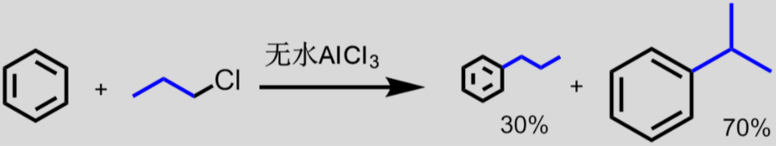

[TOC]

# 芳香烃

# 单环芳烃的结构与命名

### 苯环上的位置异构

### 取代苯的命名

**常见基团**

芳环化合物中主要官能团:

$\mathrm{-COOH\quad-SO_3H\quad-CN\quad-CHO\quad C=O\quad-OH\quad-NH_2\quad-R\quad-X\quad-NO_2}$

>  命名时前面的官能团优于后面的

# 单环芳烃的化学反应

## 苯的物理性质

+  无色易挥发液体
+  熔点5.5℃ , 沸点80.1℃
+  特殊气味
+  难溶于水 , 易溶于醇醚酮烷
+  易燃易爆致癌

## 苯的化学性质

特征 : 一般较稳定,易发生亲电反应

>  大$\pi$键使苯环能量降低
>
>  易发生亲电反应: 离域$\pi$键富电子
>  降低电子密度会降低亲电活性(见杂环化合物)

### 亲电取代

>  反应条件:**催化剂(铁粉)/加热**

#### 卤代反应

**活性 : $\mathrm{F>Cl>Br>I}$**

#### 硝化反应

#### 磺化反应

>  **可逆反应**

#### 傅克反应

##### 傅氏烷基化的重排

**重排机理 : 生成稳定碳正离子**

##### 傅克反应

+  路易斯酸催化(无水$\mathrm{AlCl_3}$)
+  卤代烷或酰卤/酸酐为反应物
+  苯环上推电子基团促进反应;**苯环上如果有吸电子基团,反应不发生**:star:
+  烷基化可能会重排,酰基化不会重排
+  位阻效应
   +  叔丁基是**邻**对位定位基, 邻位受阻,只在对位取代
   +  

### 苯环的加成

#### 加氢

#### 加氯

### 苯环的氧化

#### 侧链的氧化

>  苯环连接的$\alpha$碳上有氢时将侧链氧化成羧基

#### 苯环自身的氧化

### 侧链卤代

>  $\alpha$碳自由基与苯环形成$p-\pi$共轭, 优先取代$\alpha$碳上的氢

# 苯环亲电取代规则

## 定位基和定位能力排序

### 邻对位定位基(活化,除卤素外)

强$\longleftrightarrow$弱

>  推电子基团
>
>  与苯环相连的原子通过单键与其他原子/基团相连

### 间位定位基(钝化)

强$\longleftrightarrow$弱

>  吸电子基团
>
>  与苯环相连的原子通过双键/叁键与其他原子/基团相连或苯环相连的原子带正电(三甲铵基)

### 苯环亲电取代规则

+  邻对位定位基中的节点碳均为饱和,且有未共用电子对
+  邻对位定位基除卤素为弱钝化外,均活化苯环
+  间位定位基的节点碳一般含多重键或带正电荷
+  间位定位基一般钝化苯环

## 二元取代苯的定位规则

### 作用一致,加强

### 矛盾, 同类定位基

### 矛盾, 不同类定位基

>  以活化为主

## 二元取代中的空间效应

>  位阻

### 化合物

>  非甾体类抗炎药

>  TNT和苦味酸

## 思考题

>  (1)①甲基②溴③酸性高锰酸钾氧化④硝基
>
>  (2)①甲基②对位磺化③硝基/溴④[磺基水解](#磺化反应)

# 稠环芳烃

## 萘的结构

平面; 芳香性弱于苯; 各个碳原子不等同

有两个及以上取代基,使用数字命名

-----------

>$2$-萘甲酸/$\beta$-萘甲酸

## 萘的化学性质

### 取代反应

亲电取代通常发生在$\alpha$位(更富电子)

### 加成反应

+  和金属钠 : 得到`1,4-二氢萘`

+  催化加氢 :`四氢化萘`或`十氢萘`

## 蒽/菲

都是平面结构分子

# 非苯芳烃-休克尔规则

## $4n+2$规则

以$sp^2$杂化原子形成的含有$4n+2$个$\pi$电子的**平面单环共轭多烯**具备芳香性

>  环戊二烯阴离子 : 两个双键(4个$\pi$电子) + 一个阴离子(2个$\pi$电子)
>
>  $一个双键\to两个\pi电子$
>  二茂铁 $Fe  :+2$价

