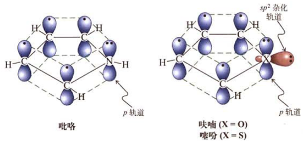

[TOC]

# 杂环化合物

**杂环**
由碳和非碳原子组成的环.

狭义的杂环通常是指有一定芳香性的含杂原子的环状化合物.
可按照杂原子种类、环大小等分类

>   :star:下图必考

## 命名

杂环上的取代基,以杂原子开始,依次以1,2,3,4,5等标记.如果有几个不同的杂原子以O、S、N先后次序编,并尽量使杂原子序号之和最小.

>   $\beta-$吲哚乙酸,吲哚$\beta$位被乙酸取代

## 杂环化合物的结构

噻吩、吡咯、呋喃具备芳香性,且芳香性依次递减.由于有$6$个$\pi$电子,而只有$5$个原子,因此五元芳杂环一般是**富电子结构**,<u>易发生亲电取代,且一般在$\alpha$位</u>.

>   五元杂环化合物碳原子电子云密度高于苯
>   :star::star:五元杂环化合物比苯发生**亲电取代**的活性高

>   吡咯具有芳香性, 氮原子与碳原子形成离域$\pi$键共$6$个电子,符合$2n+2$
>
>   :star:吡咯氮原子上没有能体现碱性的电子, 而表现出微弱酸性

>   呋喃,噻吩由于$X$原子上有孤对电子,所以显微弱碱性
>   但是也是五元杂环,所以也是富电子结构

---

吡啶(氮杂苯)是六元杂环,具备芳香性.氨原子电负性较大,因此会使环上碳原子电荷密度降低,难以发生亲电取代,且取代一般在$\beta$位.

>   :star:吡啶$5$个碳原子已经提供了$5$个$\pi$电子,所以氮原子只需要提供一个,氮原子剩余的$2$个电子是孤对电子,孤对电子使吡啶显微弱碱性
>
>   氮原子电负性大, 离域$\pi$键电子云偏向氮原子,另外$5$个碳原子电子密度比$1$小(小于苯环),相当于苯换上有吸电子取代基,吡啶比苯环更难发生亲电取代

---

五元芳杂环容易在$\alpha$位发生亲电取代
六元芳杂环不容易发生亲电取代,如果发生,一般在$\beta$位

## 杂环化学性质

### 酸碱性

试根据吡咯、吡啶的结构来推测其酸碱性.

### 亲电取代

五元杂环易亲电取代,且优先$\alpha$位;如卤化、硝化、磺化、傅克反应等(注意,呋喃、吡咯对酸敏感).

缺电子芳杂环则难以亲电取代,且优先$\beta$位.吡啶的亲电取代一般在较剧烈条件下进行而且难以发生傅克反应.

>   出去苯中少量噻吩
>
>   加入发烟硫酸,生成的噻吩硫酸会溶于硫酸中

### 氧化还原

富电子芳杂环易被氧化剂开环氧化
贫电子芳杂环相对稳定,侧链可被氧化

>   贫电子芳杂环耐氧化

杂环的催化氢化比苯容易,同等条件下优先发生氢化反应.

### :star:D-A反应

呋喃、吡咯由于芳香性较差,具备较明显的共轭二烯性质,可以发生D-A反应(双烯反应).

# 生物碱

生物碱是一类具备强烈生理活性的天然产物通常源于植物

如何提取生物碱?

**生物碱试剂**
	可以和生物碱反应变色或得到沉淀的试剂,如苦味酸、碘化汞钾等.

