# 重排反应

1.  **正离子重排**
2.  负离子重排
3.  协同重排
4.  自由基重排

重排反应多年来都是有机化学考察的重难点，因为其往往使得碳链改变，从而反应物与生成物之间的联系并不明显。个人以为，解决这个问题的最好方法是经验，当你见过足够多的重排，并对已知重排足够熟悉的时候，直觉的洞悉常是解题的关键。但因为直觉毕竟难以把握，所以我希望通过这一部分，将散乱的各种重排反应汇总，找到共通点，就不同点展开讨论。我先做重排反应而不是更基础的缩合反应的原因在于缩合反应对于有机化学中增强/削弱的思想要求很高，而重排反应相对直接，其侧重点在于辨析。

根据重排反应的历程，本部分将分为离子型，协同型，自由基型。离子型我本不想区分正负离子的原因在于正负离子的形成是体系酸/碱性环境的体现，类似的反应可能需要不同的条件，自然有可能选择不同的酸碱性体系，强行区分正负离子重排会导致不同重排反应的割裂。但由于重排反应实在过于繁多，因此也不得不按照正负离子进行分节，但我希望各位能时刻记住酸碱性并不是区分重排反应的决定性因素。

本部分将重点放在具体的反应，从反应中总结规律。虽然本文从相对简单的重排开始，但本部分会不可避免地出现一些缩合反应知识，因此阅读本部分时强烈建议先至少阅读一遍人名反应。

------

正离子重排指反应底物形成正离子或局部正离子，并使得一个基团迁移到另一个原子上的过程，大部分的正离子重排都是[1,2]-迁移，考虑到其可以多次迁移的性质，总反应上来看的[1,n]-迁移往往是多次[1,2]-迁移的结果。

既然已说明如何迁移，接下来要讨论的是哪个基团迁移，即迁移顺序。在正离子迁移过程中，—Ar >> —H > —R

首先看第一个比较，由于芳香基团可以经历一个三元环中间体，无需一步到位的迁移，因此活化能显著低于氢迁移，速率差3000倍以上，视作芳香基团优先迁移。同样也能够看出，给电子基取代的芳香环 > 无取代芳香环 > 吸电子基取代的芳香环

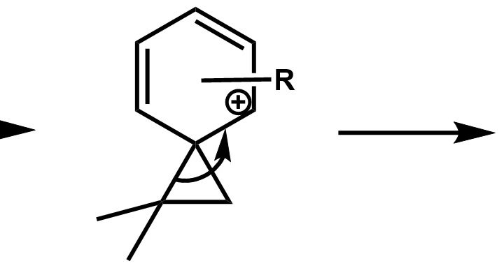

在对比氢迁移和烷基迁移的优先级时，我们应从另一个角度思考，烷基迁移是烷基带着一对电子迁移至旁边的碳上，而酸性条件下，氢迁移可以采取“人球分过”的迁移方式，氢可以先以质子形式离开，再结合在消除生成的双键上，整个过程相当于完成一步迁移。

讨论完迁移顺序后回到重排反应本身，我们认识重排反应就是从正离子重排开始的，这也就不得不提到两个人：G·Wagner和H·Meerwein。他们分别进行了如下的两个反应（后将碳正离子重排称为Wagner-Meerwein重排）：

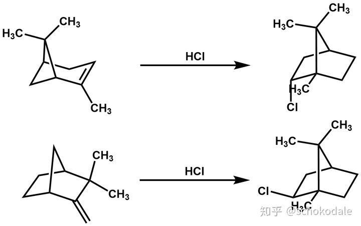

Wagner在1899年进行了第一个反应，这个结果与当时广泛认为的碳链不变是相悖的。直到1922年Meerwein完成了第二个反应后，重排反应才被广泛接受。现以第一个反应进行一些关于重排反应的讨论：

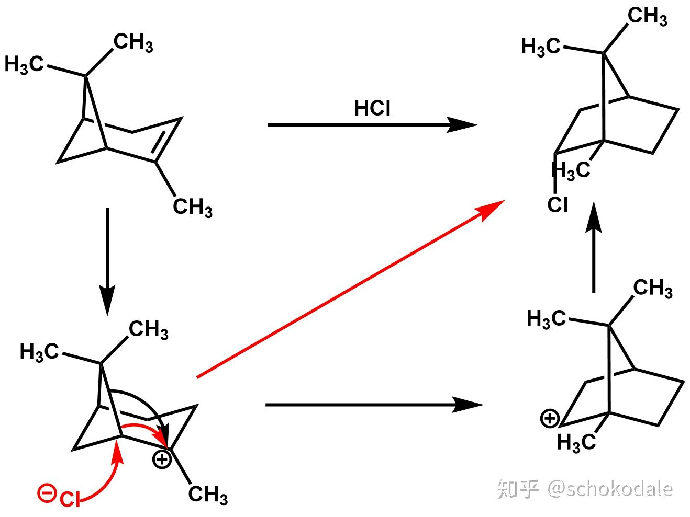

首先我们应当明确，对于一个开链烃体系，纯碳正离子的转化，是无法作为有效的驱动力的，它往往需要结合强亲核基团或消除成烯拉动反应进行。作为环结构，扩环可以作为碳正离子相互转化的驱动力。在此反应中，可以看到其驱动力为四元环扩环。接下来的问题在于书写机理的时候哪一种写法更合适。由于观察产物发现其氯原子有着明确的构型，而黑色画出的机理无疑无法使氯离子单个方向进攻，因此在我看写红色箭头画出的机理更合适，也可视作一定程度上的协同反应。

碳正离子重排是一切正离子型重排的基础，可以说一切正离子重排都是通过更换底物/反应条件更好地完成W-M重排。

既然冠以正离子重排，产生正离子必是其反应发生的基础。不妨在这里总结一下产生正离子的方式。常见的正离子产生方式有三种：多重键+亲电试剂；离去基或杂原子+亲电试剂带一对电子离去；小环开环。部分示例如下：

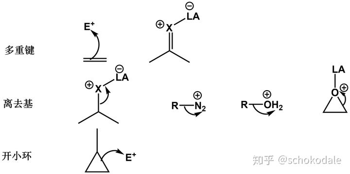

已经讨论过烃的正离子重排，我们不妨加入杂原子。含杂原子往往意味着更稳定的碳正离子（杂原子孤对电子共振至碳正离子上），从而能够使得反应产物更稳定。以pinacol重排为例，相信学过一遍有机的人都相当熟悉这个机理：

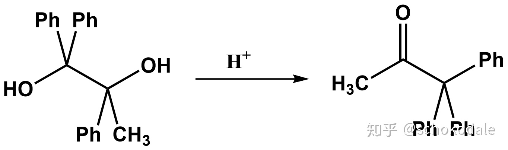

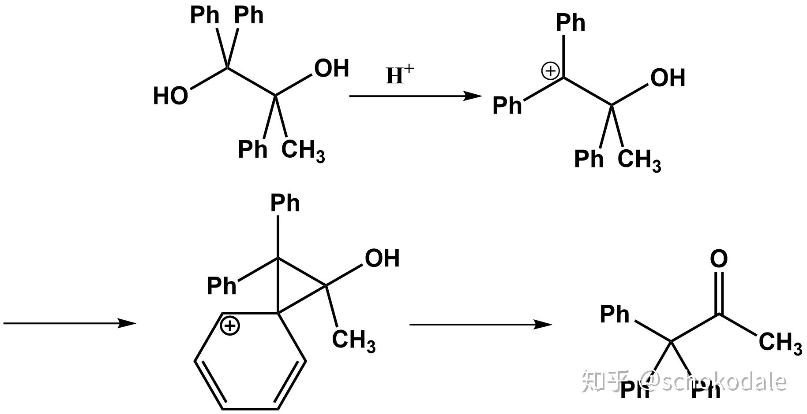

将迁移步机理与W-M重排对照后发现，由于氧原子的存在，迁移后形成的正离子是十分稳定的（其本质相当于质子化的酮）。因此pinacol重排是一种选择性与产率都相当高的优质重排反应，现阶段也有很多科研工作者利用衍生化的pinacol重排设计路线，集大成者为Phil · S · Baran在合成巨大戟醇中的一步Pinacol重排

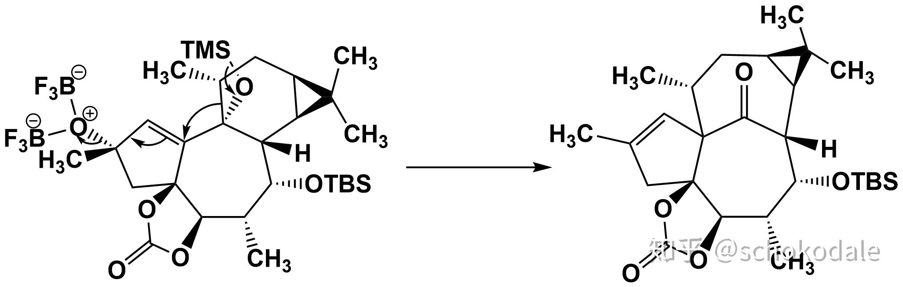

我们不妨再看另一对反应：Demjanov反应与其衍生化Tiffeneau-Demjanov反应，如下图所示：

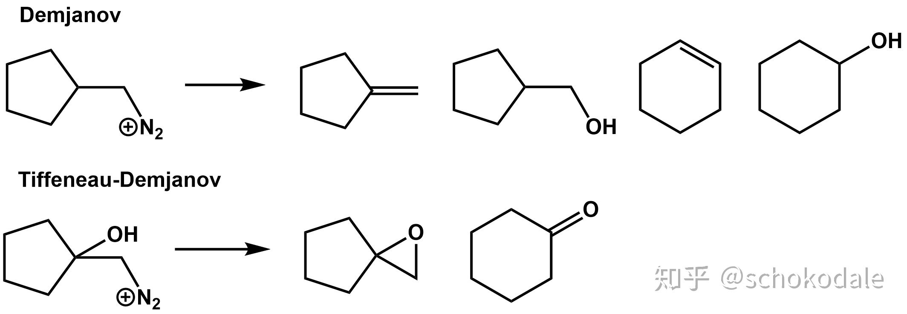

可以看到，由于羟基的引入，大大稳定了五元环上碳正离子的稳定性，从而提升了底物扩环的比例。同时消除因为没有β-H的存在而完全避免，取代反应因为邻基参与效应而分子内反应，在酸性条件下会自发扩环重排，转化为右侧的产物。由此也可以看到，通过各种方式稳定化的碳正离子能够起到远好于原底物的反应效果。

前文介绍过正常条件下的基团迁移规律，实际上很多底物分子常逆序迁移，这种现象往往发生在环中。以pinacol重排为例，在底物分子为长链的情况下，由于酮的稳定性显著大于醛，产物生成酮的倾向远大于醛，动力学控制反应。而在环中，反应产物常常以醛为主。其原因在于环中，迁移基团的分子轨道无法与正离子轨道有效重叠，因此迁移反应动力学禁阻，由热力学控制转为动力学控制，如下图：

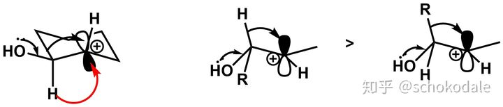

上述反应的主要驱动力是形成更稳定的碳正离子（结合亲核试剂或杂原子参与），类似的反应还有Baeyer-Villiger氧化重排，Dakin反应等，会在氧化还原反应中再次涉及。下面介绍一些因其他驱动力而进行的重排反应

双烯酮-苯酚重排：反应驱动力为芳构化，由于芳香化会提供极大的稳定化作用，因此该反应会大量放热，为了控制反应需要在较低的温度下进行。同样由于芳构化带来的稳定化作用，该反应可以多次进行[1,2]-迁移完成芳构化。

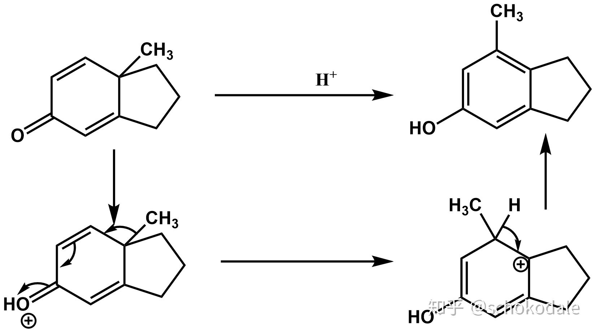

由此，不难发现对苯醌的格氏反应虽然从结果上看是一个1,4-加成反应，而实际上格氏试剂的进攻位点是羰基，并在酸性后处理时发生重排。反应的酸也不局限于质子酸，Lewis酸也能起到很好的催化效果。

Beckmann重排：反应驱动力为断裂氮氧键。氮氧键由于N，O孤对电子相互排斥，具有较小的键能，断裂这根键可以作为重排反应的驱动力

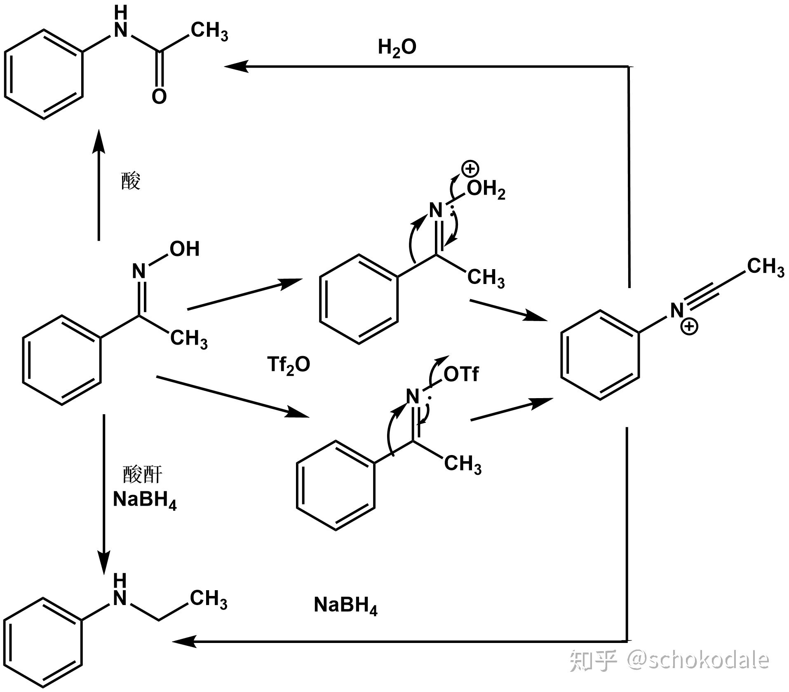

该反应不仅断裂了键能小的氮氧键，同时使得羰基化合物向稳定的羧酸衍生物转化，提供额外的稳定性。由于烷基化腈中间体亲电性非常强，只有体系中没有亲核试剂时可以以离子形式存在一定时间，此时加入硼氢化钠，可以完成对中间体的还原，给出胺。完成这个反应需要保证体系严格无水。

在前文选的四个反应中，Wagner-Meerwein重排是与亲核试剂结合的迁移类型，在W-M之上优化了正离子稳定性的Pinacol重排，在Pinacol基础上优化了迁移驱动力的双烯酮-苯酚重排，以及有着确定的迁移选择性的Beckmann重排。至此为止，大部分正离子重排已经可以被涵盖进入这四个反应构成的体系中，各位已经可以用这四个反应去对照见到的每个正离子重排反应，找到机理共通点。自然，这也存在一些特例，Fries重排由于和Claisen重排有一定相似性，在协同重排一节讨论，Pummerer重排由于属于Swern氧化的副反应，在氧化还原部分中介绍等。

------

练习2.3.1答案：

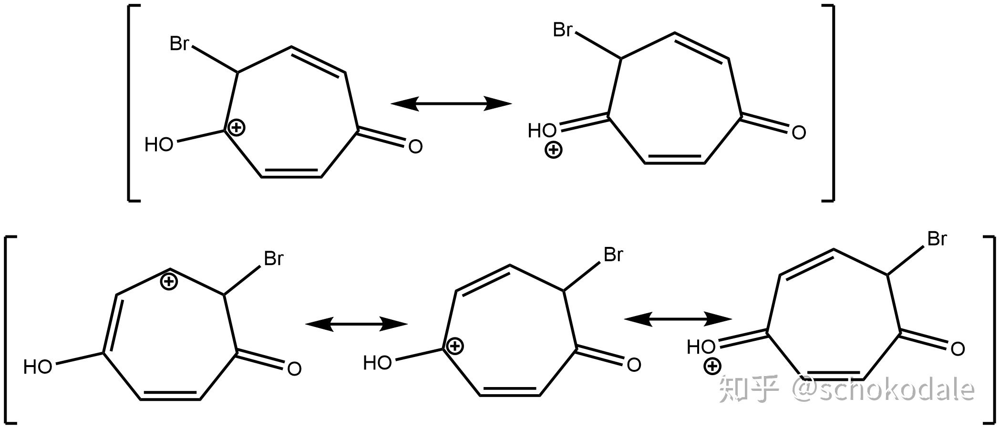

该物质溴代位点如图所示，仅有如图所示的位点溴代后形成的正离子能够将正电荷共振至氧上，从而仅有这两个位点发生溴代。可自行画出其他位点溴代的共振式，此处省略

练习2.3.2答案：

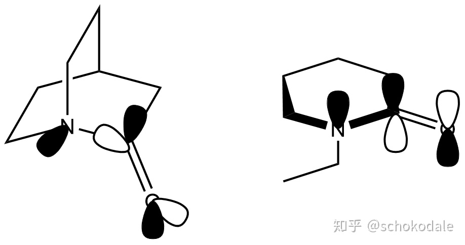

如图，左侧化合物N的孤对电子与羰基π反键轨道不处于同一平面，无法有效共轭；右侧化合物N与羰基产生共轭。因此N原子上的电子密度左侧更高，因此碱性更强。

练习3.1.1：写出如下反应的产物

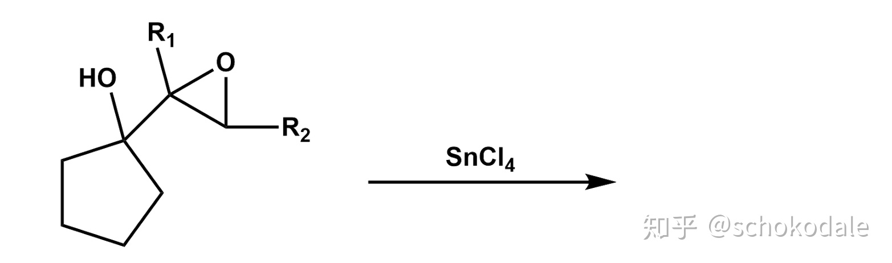

练习3.1.2：给出如下反应的分步机理

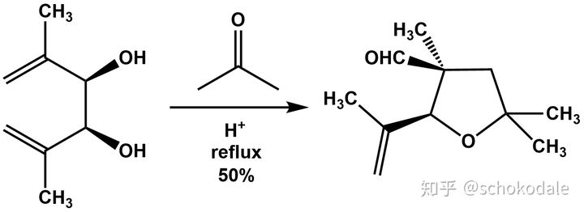