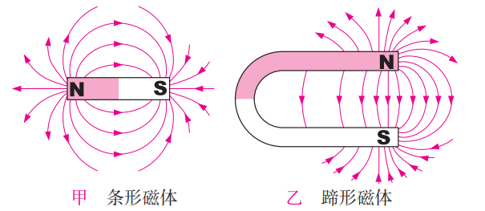
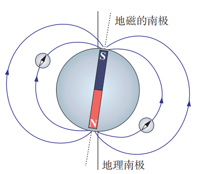
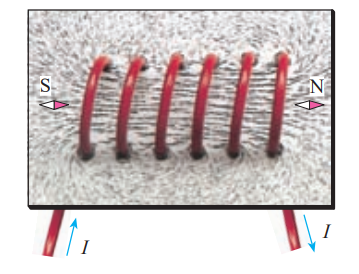
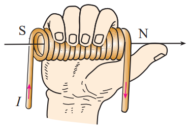
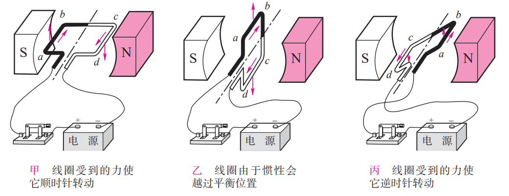
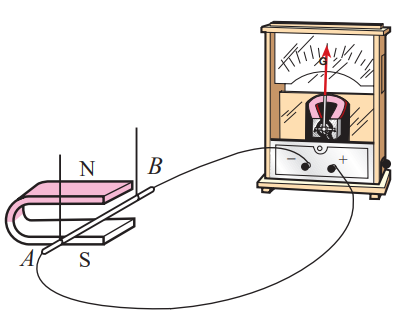

## 电与磁

### 磁现象 磁场

#### 磁现象

磁体能够吸引铁、钴、镍等物质。它的吸引能力最强的两个部位叫做**「磁极」**（Magnetic Pole）。能够自由转动的磁体，例如悬吊着的磁针，静止时指南的那个磁极叫做**「南极」**（South Pole）或 $S$ 极，指北的那个磁极叫做**「北极」**（North Pole）或 $N$ 极。

磁极间相互作用的规律是：同名磁极相互排斥，异名磁极相互吸引。

一些物体在磁体或电流的作用下会获得磁性，这种现象叫做**「磁化」**（Magnetization）。

#### 磁场

磁体周围存在一种物质，能使磁针偏转，叫做**「磁场」**。物理学中把小磁针静止时北极所指的方向规定为该点磁场的方向。

我们把小磁针在磁场中的排列情况，用一些带箭头的曲线画出来，可以方便、形象地描述磁场，这样的曲线叫做**「磁感线」**（Magnetic Induction Line）。

#### 地磁场

地磁场的形状跟条形磁体的磁场相似。

### 电生磁

#### 电流的磁效应

通电导线周围存在与电流方向有关的磁场, 这种现象叫做电流的磁效应。奥斯特发现电流的磁效应。

#### 通电螺线管的磁场

如果把导线绕在圆筒上，做成螺线管，各圈导线产生的磁场叠加在一起，磁场就会强得多。

#### 安培定则

用右手握住螺线管，让四指指向螺线管中电流的方向，则拇指所指的那端就是螺线管的 $N$ 极。

### 电磁铁 电磁继电器

#### 电磁铁

如果把一根导线绕成螺线管，再在螺线管内插入铁芯，当有电流通过时，会有较强的磁性。
这种磁体，在有电流通过时有磁性，没有电流时失去磁性。我们把这种磁体叫做**「电磁铁」** (Electromagnet)。

#### 电磁铁的磁性

匝数一定时，通入的电流越大，电磁铁的磁性越强；电流一定时，外形相同的螺线管，匝数越多，电磁铁的磁性越强。

#### 电磁继电器

电磁继电器的结构如图所示，由电磁铁、衔铁、弹簧、触点组成。其工作电路由低压控制电路和高压工作电路两部分构成。当较低的电压加在接线柱 D、E 两端，较小的电流流过线圈时，电磁铁把衔铁吸下，使 B、C 两个接线柱所连的触点接通，较大的电流就可以通过 B、C 带动机器工作了。

### 电动机

#### 磁场对通电导线的作用

通电导线在磁场中要受到力的作用，力的方向跟电流的方向、磁感线的方向都有关系，当电流的方向或者磁感线的方向变得相反时，通电导线受力的方向也变得相反。

> 右手定则

#### 电动机的基本构造

电动机由两部分组成：能够转动的线圈和固定不动的磁体。在电动机里，能够转动的部分叫做**「转子」**，固定不动的部分叫做**「定子」**。

### 磁生电

闭合电路的一部分导体在磁场中做切割磁感线运动时，导体中就产生电流。这种由于导体在磁场中运动而产生电流的现象叫做**「电磁感应」**（Electromagnetic Induction），产生的电流叫做**「感应电流」**（Induction Current）

#### 发电机

把一台手摇发电机跟灯泡连接起来，使线圈在磁场中转动，可以看到灯泡会发光。这表明，电路中有了电流。如果把手摇发电机跟电流表连接起来，线圈在磁场中转动时，可以看到电流表的指针随着线圈的转动而左右摆动。这个现象表明，发电机发出的电流的大小和方向是变化的。电路中产生的是交变电流，简称交流。