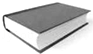
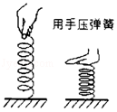
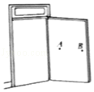
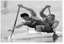
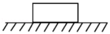
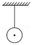
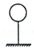
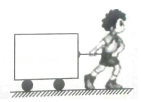

# 7 力 练习题

1. 选择题

   1. 放在桌面上的书本，受到「桌面对它的支持力」，这个力的施力物体和受力物体分别是（　　）

      

      A. 书本  桌面		B. 桌面  书本		C. 地球  书本		D. 书本  地球

   2. 以下是我们在生活中可见到的几种现象：
      ①一阵风把地面上的灰尘吹得漫天飞舞；
      ②用力揉面团，面团形状发生变化；
      ③用力握小皮球，球变瘪了；
      ④篮球撞击在篮板上被弹回。
      在这些现象中，物体因为受力而改变运动状态的是（　　）
      A. ①②		B. ②③		C. ③④		D. ①④

   3. 关于力的知识，下列说法错误的是（　　）
      A. 小孩推墙时他也受到墙的推力
      B. 足球运动员用头顶球，球的运动方向改变了，这表明力可以改变物体的运动状态
      C. 人坐在沙发上，沙发凹下去，这表明力可以改变物体的形状
      D. 只有在直接接触的物体之间，才能发生力的作用

   4. 端午节赛龙舟是我国民间传统习俗。小丽和她的同学一起在公园人工湖上举行龙舟比赛，使龙舟向前行驶的力的施力物体是（　　）
      A. 船桨		B. 湖水		C. 同学		D. 龙舟

2. 填空题

   1. 如图所示，用手拉弹簧，弹簧会伸长，用手压弹簧，弹簧会缩短，两个过程的受力物体都是 $\underline{\qquad\qquad}$ ，说明力的作用效果是力可以 $\underline{\qquad\qquad}$ ，还可以说明力的作用效果还与力的 $\underline{\qquad\qquad}$ 有关。

      

   2. 撑杆跳比赛的中，运动员在杆的作用下上升的过程中撑杆对运动员的作用力改变了运动员的 $\underline{\qquad\qquad}$ ；运动员对撑杆的作用力改变了 $\underline{\qquad\qquad}$ ，此力的施力物体为 $\underline{\qquad\qquad}$ 。

   3. 小明同学在推门的过程中，能够体验到力的三要素对力的作用效果的影响，如图所示。在门上的 $A$ 点分别用方向相同、大小不等的力推门，力越大，越容易将门推开这说明力的作用效果跟力的 $\underline{\qquad\qquad}$ 有关；在门上的 $B$ 点分别用大小相等、方向不同的力推门，能将门推开或关上，这说明力的作用效果跟力的 $\underline{\qquad\qquad}$ 有关；在门上的 $A$ 点和 $B$ 点分别用方向相同，大小相等的力推门，在 $B$ 点比 $A$ 点更容易推开门，这说明力的作用效果跟力的 $\underline{\qquad\qquad}$ 有关。

      

   4. 皮划艇是我国的奥运优势项目之一。如图所示的比赛中，当运动员向后划浆时，划艇就向前进，此时划艇的　  　发生了改变，使划艇和人向前运动的施力物体是 $\underline{\qquad\qquad}$ 。向后划水时划艇就向前进说明： $\underline{\qquad\qquad}$ 。

      

3. 作图题

   1. 如图所示，在水平向右的 $2\ N$ 拉力作用下，木块在水平桌面上向右作匀速直线运动，作出它在水平方向上力的示意图。

      

   2. 如图所示，画出静止小球受力示意图。

      

   3. 请画出如图所示氢气球的受力示意图。

      

   4. 如图所示，一个小朋友用 $30\ N$ 的水平拉力拉着小车运动，画出拉力的图示。

      

