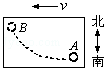
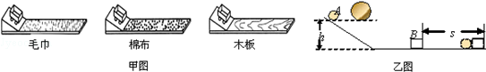
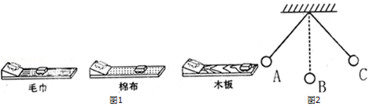

# 8 运动与力 练习题

1. 长方体木箱放在水平地面上，木箱上放一木块，则下列分析正确的是（　　）
   A. 木箱受到的重力和地面对木箱的支持力是一对平衡力
   B. 木箱对木块的支持力和木块对木箱的压力是一对平衡力
   C. 木箱对地面的压力和地面对木箱的支持力是一对相互作用力
   D. 地面对木箱的支持力和木块对木箱的压力是一对相互作用力

2. 每年都有一大批丹顶鹤从北方迁徙到我市滩涂越冬，如图所示，一只丹顶鹤正沿直线朝斜向下方向匀速滑翔，此过程中，空气对它作用力的方向（　　）

   

   A. 竖直向上
   B. 竖直向下
   C. 与运动方向相同
   D. 与运动方向相反

3. 如图所示，水平地面上放置相同材料制成的四个木块，其中两个质量为 $m$ 的木块间用不可伸长的水平轻绳相连，下面两个木块质量分别为 $2m$ 和 $3m$。现用水平拉力F拉其中一个质量为 $3m$ 的木块，使四个木块一同水平向右匀速运动，则（　　）

   

   A. 质量为 $3m$ 的木块与地面间的摩擦力为 $\frac{4F}{7}$
   B. 质量为 $2m$ 的木块与地面间的摩擦力为 $\frac{F}{2}$
   C. 轻绳对 $m$ 的拉力为 $\frac{F}{7}$
   D. 轻绳对 $m$ 的拉力为 $\frac{F}{2}$

4. 如图所示，在同一水平面上，有表面粗糙程度相同、质量不同（$m_P<m_Q$）的两个木块，按照甲、乙、丙、丁四种方式放置，分别在水平力 $F_1$，$F_2$，$F_3$ 和 $F_4$ 的作用下，做匀速直线运动，则下列关系式正确的是（　　）

   

   A. $F_1>F_2$
   B. $F_3=F_4$
   C. $F_3>F_4$
   D. $F_2>F_3$

5. 对于摩擦力，下列叙述中错误的是（　　）
   A、只要两个物体接触并相互挤压，且接触面不光滑，它们之间一定产生摩擦力
   B、运动的物体可能不受摩擦力的作用
   C、摩擦力的方向可能与物体运动的方向相同
   D、静止的物体可能受到摩擦力的作用

6. 冰壶运动员的鞋底一只是塑料的，另一只是橡胶的。他滑行时，橡胶底的鞋比塑料底的鞋受到的摩擦力大。如图他用 b 脚蹬冰面后，只用 a 脚向右滑行，可以确定的是（　　）

   

   A、滑行时冰对 a 鞋的摩擦力向右
   B、蹬冰时冰对 b 鞋的摩擦力向左
   C、a 鞋底是橡胶会滑得更远
   D、a 鞋底是塑料会滑更远

7. 为了探究滑动摩擦力，文超同学利用牙刷做实验，当用力匀速拖动牙刷时，刷毛发生了如图所示的弯曲，对这一实验的分析正确的是（　　）

   

   A. 刷毛弯曲越厉害说明牙刷受到的力越小
   B. 从刷毛弯曲的方向可以判断牙刷受到摩擦力的方向向右
   C. 牙刷受到的摩擦力作用在刷毛上
   D. 手的拉力和牙刷受到的摩擦力不平衡

8. 在做「研究滑动摩擦力大小」的实验时，将木块 A 放置水平木板 B 上，加载一个钩码，把一支测力计系在 A 上，如图所示。当向左拉动B时，测力计指针稳定。下列讨论中错误的是（　　）

   

   A. 此装置可研究滑动摩擦力大小与压力的关系
   B. A 受 B 的摩擦力与测力计拉力是一对平衡力
   C. A 受到 B 的摩擦力的大小为 $2.4\ N$，方向向左
   D. 若增大拉动 B 的速度，测力计的示数会变大

9. 在学习「物体运动状态改变的原因」时，老师做了如图所示的实验：具有一定速度的钢珠在水平面上能沿直线 AB 运动，如果在它的运动路径近旁放一磁铁，钢珠的运动路径将变成曲线 AC．对该实验的理解正确的是（　　）

   

   A. 钢珠沿直线 AB 运动时不受任何外力作用
   B. 放上磁铁后，磁铁吸引钢珠的力大于钢珠吸引磁铁的力
   C. 钢珠沿曲线 AC 运动时运动状态保持不变
   D. 若在 C 点钢珠所受的力全部消失，它将做匀速直线运动

10. 有一架飞机沿水平向右做匀速直线运动，每隔 1 秒钟从飞机上轻轻释放一只小球，当三只小球落下但均未落至地面时，若不计空气阻力，则这三只小球在空中的排列情况应是图中的（　　）
    A. 		B. 		C. 		D. 

11. 如图所示（俯视看）以速度 $v$ 匀速运动的列车车厢里有一水平桌面，桌上有一静止小球 A，突然沿图中虚线所示路线运动到 B，这时列车正在（　　）

    

    A. 减速行驶，向南转弯
    B. 减速行驶，向北转弯
    C. 加速行驶，向南转弯
    D. 加速行驶，向北转弯

12. 甲图是探究「阻力对物体运动的影响」的实验装置；乙图是探究「物体的动能与质量关系」的实验装置。关于这两个实验下列说法不正确的是（　　）

    

    A. 甲实验可以推理出如果运动的物体不受力它将做匀速直线运动
    B. 乙实验可得出物体的速度一定时，质量越大，动能越大
    C. 两个实验都控制物体从同一高度自由下滑，是为了保证物体到水平面时的初速度相同
    D. 甲、乙实验中物体运动时，机械能始终都保持不变

13. 下列现象中，属于利用惯性的是（　　）
    A. 人踩到西瓜皮上易滑倒
    B. 汽车驾乘人员系安全带
    C. 斧头松动时，握住木柄迅速向下撞击地面，斧头会紧套在木柄上
    D. 高速路上汽车限速行驶

14. 如图所示，在竖直平面内用轻质细线悬挂一个小球，将小球拉至A点，使细线处于拉直状态，由静止开始释放小球，不计摩擦，小球可在A、B两点间来回摆动。当小球摆到 B 点时，细线恰好断开，则小球将（　　）

    

    A. 在 B 点保持静止
    B. 沿 BE 方向运动
    C. 沿 BC 方向运动
    D. 沿 BD 方向运动

15. 如图所示，在探究二力平衡的条件实验中，小明用力将纸片旋转到图示的位置，放手后纸片不能保持静止，这样操作是为了探究二力平衡时两个力（　　）

    

    A. 大小是否相等
    B. 方向是否相反
    C. 是否作用在同一物体上
    D. 是否作用在同一直线上

16. 直升机沿竖直方向匀速升空时，在竖直方向上受到升力 $F$、重力 $G$ 和阻力 $f$，下面关于这三个力的关系式正确的是（　　）
    A. $F>G+f$
    B. $F<G-f$
    C. $F=G+f$
    D. $F=G-f$

17. 如图，货物随传送带匀速向下运动，请画出货物所受摩擦力的示意图。

    

18. 如图所示，一物体以某一速度冲上表面粗糙的固定斜面，请画出物体在上滑过程中所受的摩擦力的示意图。（力的作用点画在物体的中心）

19. 小明在探究力对物体运动的影响时，让同一小车从同一斜面的同一高度滑下，在表面材料不同的水平面上运动，分别停在如图所示的不同地方。

    

    1. 由实验现象我们可以得出结论：平面越光滑，小车运动的距离越远，说明小车受到的阻力越 $\underline{\qquad\qquad}$ ，速度减小得越 $\underline{\qquad\qquad}$ 。
    2. 由实验现象我们可以推断：假如表面绝对光滑，水平面上运动的物体在水平方向上不受力，它将 $\underline{\qquad\qquad\qquad}$$\underline{\qquad\qquad\qquad\qquad\qquad\qquad\qquad\qquad}$ 。
    3. 运用力和运动的知识进行判断，正确的打「✓」，错误的打「✕」
       A．物体受到平衡力的作用时，运动状态一定会改变。
       B．力是维持物体运动状态的原因。
    4. 本实验中小车在水平面上三次滑行过程中消耗的机械能大小 $\underline{\qquad\qquad}$（填「相等」或「不相等」）
    5. 通过上面的探究后，小明再思考如下问题，如图 2 所示，摆球从 A 点由静止释放摆到最右端最高点 C 时，如果小球所受的力全部消失，则摆球将 $\underline{\qquad\qquad}$（填「往回摆」「静止」或「匀速直线运动」）。

20. 如图所示，A 物体重 $40\ N$，B 物体重 $12\ N$。求：
    1. A 物体在绳子水平拉力作用下沿水平桌面向右做匀速直线运动，A 物体受到桌面的摩擦力大小和方向？
    2. 如果要使 A 物体匀速向左运动，应给它施加一个多大的水平向左的拉力？

