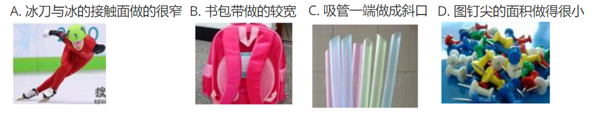
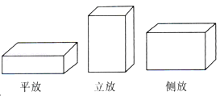
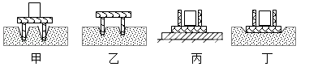
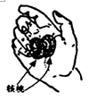

# 9 压强 练习题

1. 关于压力产生，下面的说法中正确的是（　　）
   A. 压力都是由物体的重力产生的
   B. 竖直作用在物体表面上的力叫做压力
   C. 压力的大小总是等于物体的重力
   D. 压力的大小有时等于物体的重力

2. 下列四个实例中，能够增大压强的是（　　）
   A. 骆驼的脚掌长得很宽大
   B. 菜刀刃磨得很锋利
   C. 坦克装有两条宽大的履带 
   D. 减少汽车的载重量

3. 下列实例中，属于减小压强的是  （　　）

   

4. 如图所示，将一块砖平放、立放、侧放时，它对地面的压强（　　）

   

   A. 平放时最大
   B. 立放时最大
   C. 侧放时最大 
   D. 平放、立放、侧放时，一样大

5. 下列实例中，目的是为了增大压强的是（　　）
   A. 刀刃做得很薄 
   B. 书包带做得较宽
   C. 坦克装有宽大的履带 
   D. 大型平板车装有很多轮子

6. 放在水平桌面上的茶杯，对桌面有压力，下列有关「茶杯对桌面压力」的说法，正确的是（　　）
   A. 茶杯对桌面的压力是由于茶杯发生弹性形变而产生的
   B. 茶杯对桌面的压力是作用在茶杯上的
   C. 茶杯对桌面的压力就是重力
   D. 茶杯对桌面的压力是由于桌面发生形变而产生的

7. 下列说法中正确的是（　　）
   A. 物体的重力越大，产生的压力越大
   B. 受力面积越小，产生的压强越大
   C. 压强与物体的重力成正比，与受力面积成反比
   D. 在压力相同情况下，受力面积越大，产生的压强越小

8. 下列说法中，正确的是（　　）
   A. 压力方向总是与重力方向一致
   B. 单位面积上受到的压力叫压强
   C. 压力作用效果只与压力大小有关
   D. 压力就是压强

9. 如图是我国自主研发的长航程极地漫游机器人。机器人重约 $5000\ N$，装有四条三角形履带，每条履带与地面的接触面积约为 $1000\ cm^2$。今年 2 月，首次在南极内陆冰盖完成了 $30\ km$ 的自主行走。下面选项正确的是（　　）

   

   A. 该机器人采用履带可以减小与冰雪地面的摩擦
   B. 履带能增大机器人与地面的接触面积，减小对地面的压强
   C. 该机器人静止在水平冰面上时，对冰面的压强约为 $5\times10^4\ Pa$
   D. 若本次自主行走共耗时 $3\ h$，则其平均速度为$10\ m/s$

10. 如图甲所示，一块长木板放在水平桌面上。现用一水平力 $F_1$，向右缓慢的推木板，使其一部分露出桌面如图乙所示，在推木板的过程中，木板对桌面的压力 $F$、压强 $p$ 和摩擦力f的变化情况是（　　）

    

    A. $F, p$ 不变，$f$ 变大 
    B. $F, f$ 不变，$p$ 变小
    C. $F$ 变小，$p, f$ 变大 
    D. $F, f$ 不变，$p$ 变大

11. 小华质量为 $50\ kg$，每只脚与地面的接触面积为 $200\ cm^2$，他双脚站立时对水平地面的压强为 $\underline{\qquad\qquad}$ ，他走路时对水平地面的压强会 $\underline{\qquad\qquad}$ 。（选填「变大」「变小」或「不变」）。（$g=10\ N/kg$）

12. 如图所示，用两食指同时压铅笔两端，左手指受到铅笔的压力为 $F_1$, 压强为 $p_1$；右手指受到铅笔的压力为 $F_2$, 压强为 $p_2$．则 $F_1$ $\underline{\qquad\qquad}$ $F_2$，$p_1$ $\underline{\qquad\qquad}$ $p_2$．（选填「大于」「小于」或「等于」）。

13. 正方体物块重 $0.2\ N$，边长为 $2\ cm$，静止在水平桌面上，则物块对水平桌面的压力为 $\underline{\qquad\qquad}$ 。物块对水平桌面的压强大小为 $\underline{\qquad\qquad}$ 。如果把正方体物块沿水平方向切去一半，则剩下的一半对水平桌面的压强大小为 $\underline{\qquad\qquad}$ 。

14. 小明同学在探究「压力的作用效果与压力大小的关系」时，做了如下图甲、乙所示的实验。

    

    1. 实验能够得到的结论是 $\underline{\qquad\qquad\qquad\qquad\qquad\qquad\qquad\qquad}$ 。
    2. 若想继续探究「压力的作用效果与受力面积大小的关系」，应再作图 $\underline{\qquad\qquad}$ 。（填「丙」或「丁」）所示实验。

15. 如果你曾经试过不用核桃钳子捏碎手里一个核桃的话，你就知道那几乎是不可能的！然而，手握两个核桃在一起，猛烈挤压却能把它们挤碎，如图。请解释这个出人意料的结果 $\underline{\qquad\qquad\qquad\qquad\qquad\qquad\qquad\qquad}$。

    

16. 如图所示为沈阳自动化研究所研制的救援机器人，在雅安地震救援现场首次进行作业。若该机器人的质量为 $18\ kg$，履带与地面接触的总面积为 $0.6\ m^2$．求：

    1. 该机器人的重力；

    2. 该机器人对水平地面的压强。

