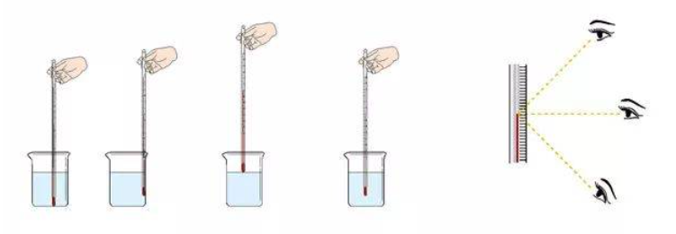
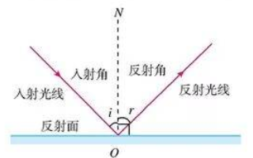
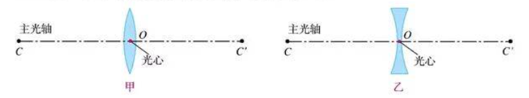
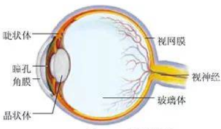
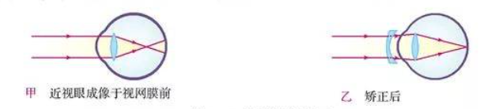
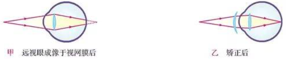

# 八年级物理讲义

[toc]

## 机械运动

### 长度和时间的测量

#### 长度的单位

长度的基本单位是「**米**」(Meter)。米的符号是 $m$。

#### 长度的测量

+ 刻度尺
  + 零刻度线
  + **量程**
    + 测量的范围
  + **分度值**
    + 决定测量的精度

#### 时间的测量

时间的基本单位是「**秒**」(Second)。秒的符号是 $s$。

### 运动的描述

#### 机械运动

物体位置的变化叫做**机械运动**。

#### 参照物

判断运动的标准叫做参照物。

> 运动是绝对的，静止是相对的。（运动也可以是相对的）

### 运动的快慢

#### 速度

路程与时间之比叫做**速度**。通常用 $v$ 表示速度，$s$ 表示路程，$t$ 表示时间。
$$
v=\frac{s}{t}
$$
速度的基本单位是**米每秒**，符号是 $m/s$ 或 $m\cdot s^{-1}$。

> $1\ m/s = 3.6\ km/h$

#### 匀速直线运动

沿着直线且速度不变的运动叫做匀速直线运动。

#### 测量平均速度

通过公式 $v=\frac{s}{t}$ 可知，测量出物体运动的路程 $s$ 和通过这段路程的时间 $t$，就可以计算出物体在这段时间内运动的平均速度。

## 声现象

### 声音的产生与传播

#### 声音的产生

声音是由物体的**振动**产生的。

#### 声音的传播

+ 声音以波的形式传播，可以称为**声波**。
+ 声音的传播需要**介质**。

### 声音的特性

#### 音调

+ 物体振动的快慢叫做**频率**，频率决定音调高低。
+ 频率的单位为赫兹，符号为 $\text{Hz}$。1 赫兹表示物体在 1 秒振动了 1 次。
+ 人的听觉范围大约是 $\text{20 Hz - 20 000 Hz}$。
  + 高于 20 000 Hz 的声称为超声波。
  + 低于 20 Hz 的声称为次声波。

#### 响度

声音的强弱叫做**响度**。物体的振动幅度叫做**振幅**，响度由振幅决定。

#### 音色

**音色**由发声体的材料决定。

### 声的利用

#### 声与信息

声音可以传递信息。

#### 声与能量

声音可以传递能量。

### 噪声的危害和控制

#### 噪声的来源

发声体做无规则振动时会发出噪声。

#### 噪声强弱的等级和噪声的危害

声音的强弱通过分贝描述，分贝的符号是 dB。

#### 控制噪声

+ 声音的产生
  + 防止噪声产生。
+ 声音的传播
  + 阻断噪声传播。

+ 听觉的产生
  + 防止噪声进入耳朵。

## 物态变化

### 温度

物体的冷热程度叫做**温度**。

#### 温度计

测量温度的工具。常用的温度计是根据液体热胀冷缩的规律制成的。

#### 摄氏温度

+ 摄氏温度的符号为 ℃。
+ 摄氏温度的定义为：在标准大气压冰水混合物的温度定为 0 ℃，沸水的温度定为 100 ℃。0 ℃ 和 100 ℃ 之间分为 100 等份，每等份代表 1 ℃。

1. 温度计玻璃泡全部浸入被测液体，不接触容器。
2. 等待温度计示数稳定。
3. 读数，玻璃泡继续留在被测液体中，实验与温度计液面平齐。

### 熔化和凝固

#### 物态变化

固体、液体和气体是最常见的三种物质状态。在一定条件下，同一物质可以在三种状态之间转化。物质各种状态之间的变化叫做物态变化。

#### 熔化和凝固

物质从固态变成液态叫做熔化，从液态变成固态叫做凝固。

#### 熔点和凝固点

有固定的熔化温度的固体叫做**晶体**，没有固定熔化温度的固体叫做**非晶体**。晶体熔化时的温度叫做**熔点**。

#### 熔化吸热 凝固放热

熔化过程温度不变，但需要继续加热才能继续，表明晶体在熔化过程中吸热。
凝固过程温度不变，但需要放热才能继续进行，表明液体在凝固成晶体的过程中放热。

### 汽化和液化

物质从液态变成气态的过程叫做汽化，从气态变成液态的过程叫做液化。

#### 沸腾

液体的剧烈汽化叫做沸腾，沸腾发生在液体的表面和内部，沸腾需要吸收热量，液体在沸腾过程中温度不变。
各种液体沸腾时都有确定的温度，这个温度叫做**沸点**。

#### 蒸发

在任何温度下都能发生的汽化现象叫做蒸发。
蒸发和沸腾时汽化的两种形式。

#### 液化

物质由气体变为液体的过程叫做汽化，汽化放热，可以通过降低温度或压缩体积的方法使气体汽化。

### 升华和凝华

物质从固态直接变成气态的过程叫做升华，升华吸热；从气态直接变成固态的过程叫做凝华，凝华放热。

## 光现象

可以发光的物体叫做光源。

### 光的直线传播

#### 光的直线传播

光在空气中沿直线传播，光在同种均匀介质中沿直线传播。

为了表示光的传播情况，通过一条带有箭头的直线表示光的传播路径和方向，这样的直线叫做光线，光线实际不存在，是为了表示方便而存在。

#### 光的传播速度

光的传播不需要介质。
光速用 $c$ 表示，真空中的光速为 $c=2.99792\times 10^8\ m/s$

### 光的反射

能看见不发光的物体，是因为物体反射的光进入了眼睛。

反射现象中，反射光线、入射光线和法线都在同一平面内；反射光线、入射光线分别位于发现两侧；反射角等于入射角。

#### 光路的可逆性

光路是可逆的。

#### 镜面反射和漫反射

一束平行光照射到镜面上后，会被平行地反射，这种反射叫做镜面反射。
凹凸不平的表面会把平行的入射光线向四面八方反射，这种反射叫做漫反射。

### 平面镜成像

#### 平面镜成像的特点

平面镜成等大、对称的虚像。

### 光的折射

光从空气斜射入水或其他介质时，折射光线向法线方向偏折，折射角小于入射角。当入射角增大时，折射角也增大。当光从空气垂直摄入水中或其他介质中时，传播方向不变。

折射现象中，光路同样可逆。

### 光的色散

太阳光是白光，(混合光)通过棱镜后被分解成各种颜色的光，这种现象叫光的**色散**。颜色依次是红-橙-黄-绿-蓝-靛-紫。

#### 色光的混合

可以通过混合三原色 - 红、绿、蓝的方式得到各种颜色的光。

#### 看不见的光

红光之外的辐射叫做红外线，紫光之外的辐射叫做紫外线。
紫外线可以使荧光物质发光，红外线传递温度效率高。

## 透镜及其应用

### 透镜

#### 凸透镜和凹透镜

中间厚、边缘薄的透镜是凸透镜。
中间薄、边缘厚的透镜是凹透镜。

通过两个球面中心的直线叫做主光轴，简称光轴。主轴上有个特殊的点，通过这个点的光传播方向不变，这个点叫做透镜的光心。可以认为薄透镜的光心就在透镜的中心。

#### 透镜对光的作用

凸透镜使光线会聚，凹透镜使光线发散。

#### 焦点和焦距

凸透镜能使跟主光轴平行的光线会聚在主光轴上的一点，这个点叫做凸透镜的焦点。焦点到凸透镜光心的距离叫做焦距。焦距越小，凸透镜对光线的汇聚作用越强。

### 生活中的透镜

#### 照相机

照相机成倒立、缩小的实像。

#### 投影仪

投影仪成倒立、放大的实像。

#### 放大镜

放大镜成正立、等大的虚像。

#### 实像和虚像

实像与物体位于透镜的两侧，虚像与物体位于透镜的同侧。

### 凸透镜成像的规律

| 物距 $u$ | 像距 $v$ | 像的性质     |
| :------: | -------- | ------------ |
|  $2f<u$  | $f<v<2f$ | 倒立缩小实像 |
| $f<u<2f$ | $2f<v$   | 倒立放大实像 |
|  $u<f$   | $u<f$    | 正立放大虚像 |
|  $u=2f$  | $v=2f$   | 倒立等大实像 |
|  $u=f$   | -        | 不成像       |

### 眼睛和眼镜

#### 眼睛

眼睛是凸透镜。

#### 近视眼及其矫正

近视眼只能看清近处物体，看不清远处的物体。近视眼晶状体太厚，折光能力强，在视网膜前成像。

利用凸透镜能使光线发散的特点，在眼睛前面放一个合格的凹透镜，就能使来自远处的物体的光会聚在视网膜上。
近视镜是凹透镜。

#### 远视眼及其矫正

远视眼只能看清远处的物体，看不清近处的物体。远视眼的原因是晶状体太薄，折光能力太弱，或眼轴过长。

凸透镜能使光会聚，在眼睛前面放一个合适的凸透镜，就能使来自近处物体的光会聚在视网膜上。
远视镜是凸透镜。

## 质量与密度

### 质量

#### 质量

物体所含物质的多少叫做质量，用 $m$ 表示。质量的基本单位是千克，符号是 kg。

#### 质量的测量

实验室测量质量的仪器是（托盘）天平。

#### 天平的使用

1. 称量的物体不能超过量程。
2. 加减砝码使用镊子。
3. 潮湿的物体和化学药品不能直接放到天平的盘中。

### 密度

#### 密度

物质组成的物体的质量与其体积之比叫做这种物质的密度。使用 $\rho$ 表示密度，$m$ 表示质量，$V$ 表示体积：
$$
\rho=\frac{m}{V}
$$
密度在数值上等于物体单位体积的质量。
密度的基本单位为千克每立方米，符号为 $\mathrm{kg/m^3}$ 。

### 测量物质的密度

#### 测量液体和固体的密度

液体可以通过量筒或量杯测量体积，形状不规则的物体可以通过排水法测量体积。