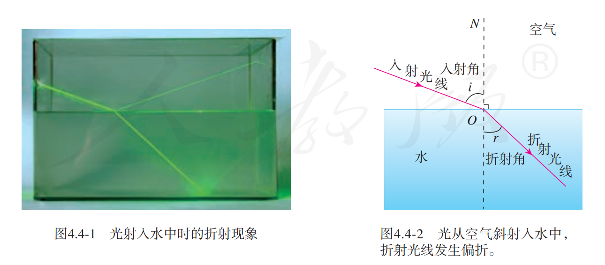
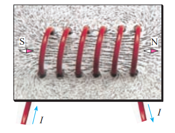
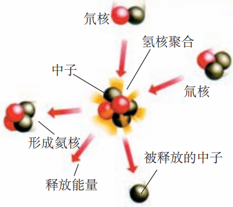

# 初中物理

---

All Rights Reserve © 2021 - 2023 Zidong Zh. (zidongzh@outlook.com)

<\center>

This work is licensed under a <a rel="license" href="http://creativecommons.org/licenses/by-nc/4.0/">Creative Commons Attribution-NonCommercial 4.0 International License</a>.

## 机械运动

### 长度和时间的测量

#### 长度的单位

长度的基本单位是「**米**」(Meter)。米的符号是 $m$。

#### 长度的测量

+ 刻度尺
  + 零刻度线
  + **量程**
    + 测量的范围
  + **分度值**
    + 决定测量的精度

#### 时间的测量

时间的基本单位是「**秒**」(Second)。秒的符号是 $s$。

使用停表测量时间。

#### 误差与错误

+ 误差
  + 测量值与真实值之间的差距
  + 不可避免
  + 可以减小
    + 多次测量求平均值
    + 选用精密的测量工具
    + 改进测量方法
    + ……
+ 错误
  + 可以避免 应该避免
  + 一般是人为造成的

### 运动的描述

#### 机械运动

物体位置随时间的变化叫做**机械运动**。

#### 参照物

判断运动的标准叫做参照物。

> 运动是绝对的，静止是相对的。（运动也可以是相对的）

### 运动的快慢

#### 速度

路程与时间之比叫做**速度**。通常用 $v$ 表示速度，$s$ 表示路程，$t$ 表示时间。
$$
\Large v=\frac{s}{t}
$$
速度的基本单位是**米每秒**，符号是 $m/s$ 或 $m\cdot s^{-1}$。

> $1\ m/s = 3.6\ km/h$

#### 匀速直线运动

沿着直线且速度不变的运动叫做匀速直线运动。

#### 测量平均速度

通过公式 $v=\frac{s}{t}$ 可知，测量出物体运动的路程 $s$ 和通过这段路程的时间 $t$，就可以计算出物体在这段时间内运动的平均速度。

## 声现象

### 声音的产生与传播

#### 声音的产生

声音是由物体的**振动**产生的。

#### 声音的传播

+ 声音以波的形式传播，可以称为**「声波」**。
+ 声音的传播需要**介质**。

### 声音的特性

#### 音调

+ 物体振动的快慢叫做**「频率」**，频率决定音调高低。
+ 频率的单位为**赫兹**，符号为 $\text{Hz}$。1 赫兹表示物体在 1 秒振动了 1 次。
+ 人的听觉范围大约是 $\text{20 Hz - 20 000 Hz}$。
  + 高于 $\mathrm{20~000\ Hz}$ 的声称为超声波。
  + 低于 $\mathrm{20\ Hz}$ 的声称为次声波。

#### 响度

声音的强弱叫做**「响度」**。物体的振动幅度叫做**「振幅」**，响度由振幅决定。

#### 音色

**音色**由发声体的材料决定。

### 声的利用

#### 声与信息

声音可以传递信息。

#### 声与能量

声音可以传递能量。

### 噪声的危害和控制

#### 噪声的来源

发声体做**无规则振动**时会发出噪声。

#### 噪声强弱的等级和噪声的危害

声音的强弱通过**「分贝」**描述，分贝的符号是 $\mathrm{dB}$。

#### 控制噪声

+ 声音的产生
  + 防止噪声产生。
+ 声音的传播
  + 阻断噪声传播。

+ 听觉的产生
  + 防止噪声进入耳朵。

## 物态变化

### 温度

物体的冷热程度叫做**「温度」**。

#### 温度计

测量温度的工具。常用的温度计是根据液体热胀冷缩的规律制成的。

#### 摄氏温度

+ 摄氏温度的符号为 ℃。
+ 摄氏温度的定义为：在标准大气压冰水混合物的温度定为 0 ℃，沸水的温度定为 100 ℃。0 ℃ 和 100 ℃ 之间分为 100 等份，每等份代表 1 ℃。

1. 温度计玻璃泡全部浸入被测液体，不接触容器。
2. 等待温度计示数稳定。
3. 读数，玻璃泡继续留在被测液体中，实验与温度计液面平齐。

### 熔化和凝固

#### 物态变化

固体、液体和气体是最常见的三种物质状态。在一定条件下，同一物质可以在三种状态之间转化。物质各种状态之间的变化叫做**「物态变化」**。

#### 熔化和凝固

物质从固态变成液态叫做**「熔化」**，从液态变成固态叫做**「凝固」**。

#### 熔点和凝固点

有固定的熔化温度的固体叫做**「晶体」**，没有固定熔化温度的固体叫做**「非晶体」**。晶体熔化时的温度叫做**「熔点」**。

#### 熔化吸热 凝固放热

熔化过程温度不变，但需要继续加热才能继续，表明晶体在熔化过程中吸热。
凝固过程温度不变，但需要放热才能继续进行，表明液体在凝固成晶体的过程中放热。

### 汽化和液化

物质从液态变成气态的过程叫做**「汽化」**，从气态变成液态的过程叫做**「液化」**。

#### 沸腾

液体的剧烈汽化叫做**「沸腾」**，沸腾发生在液体的表面和内部，沸腾需要吸收热量，液体在沸腾过程中温度不变。各种液体沸腾时都有确定的温度，这个温度叫做**「沸点」**。

#### 蒸发

在任何温度下都能发生的汽化现象叫做**「蒸发」**。
蒸发和沸腾时汽化的两种形式。

#### 液化

物质由气体变为液体的过程叫做**「汽化」**，汽化放热，可以通过降低温度或压缩体积的方法使气体汽化。

### 升华和凝华

物质从固态直接变成气态的过程叫做**「升华」**，升华吸热；从气态直接变成固态的过程叫做**「凝华」**，凝华放热。

## 光现象

可以发光的物体叫做**「光源」**。

### 光的直线传播

#### 光的直线传播

光在空气中沿直线传播，光在同种均匀介质中沿直线传播。

为了表示光的传播情况，通过一条带有箭头的直线表示光的传播路径和方向，这样的直线叫做**「光线」**。光线实际不存在，是为了方便表示的一种物理符号。

#### 光的传播速度

光的传播不需要介质。
光速用 $c$ 表示，真空中的光速为 $c=2.99792\times 10^8\ m/s$

### 光的反射

能看见不发光的物体，是因为物体反射的光进入了眼睛。

反射现象中，反射光线、入射光线和法线都在同一平面内；反射光线、入射光线分别位于发现两侧；反射角等于入射角。

#### 光路的可逆性

光路是可逆的。

#### 镜面反射和漫反射

一束平行光照射到镜面上后，会被平行地反射，这种反射叫做**「镜面反射」**。
凹凸不平的表面会把平行的入射光线向四面八方反射，这种反射叫做**「漫反射」**。

### 平面镜成像

#### 平面镜成像的特点

平面镜成等大、对称的虚像。

### 光的折射

光从空气斜射入水或其他介质时，折射光线向法线方向偏折，折射角小于入射角。
当入射角增大时，折射角也增大。当光从空气垂直摄入水中或其他介质中时，传播方向不变。

折射现象中，光路同样可逆。

### 光的色散

太阳光是白光，(混合光)通过棱镜后被分解成各种颜色的光，这种现象叫光的**「色散」**。
颜色依次是红-橙-黄-绿-蓝-靛-紫。

#### 色光的混合

可以通过混合三原色 - 红、绿、蓝的方式得到各种颜色的光。

#### 看不见的光

红光之外的辐射叫做**「红外线」**，紫光之外的辐射叫做**「紫外线」**。
紫外线可以使荧光物质发光，红外线传递温度效率高。

## 透镜及其应用

### 透镜

#### 凸透镜和凹透镜

中间厚、边缘薄的透镜是**「凸透镜」**。
中间薄、边缘厚的透镜是**「凹透镜」**。

通过两个球面中心的直线叫做**「主光轴」**，简称**「光轴」**。

主光轴上有个特殊的点，通过这个点的光传播方向不变，这个点叫做透镜的**「光心」**。
可以认为薄透镜的光心就在透镜的中心。

#### 透镜对光的作用

凸透镜使光线会聚，凹透镜使光线发散。

#### 焦点和焦距

凸透镜能使跟主光轴平行的光线会聚在主光轴上的一点，这个点叫做凸透镜的**「焦点」**。

焦点到凸透镜光心的距离叫做**「焦距」**。焦距越小，凸透镜对光线的汇聚作用越强。

### 生活中的透镜

#### 照相机

照相机成倒立、缩小的实像。

#### 投影仪

投影仪成倒立、放大的实像。

#### 放大镜

放大镜成正立、等大的虚像。

#### 实像和虚像

实像与物体位于透镜的两侧，虚像与物体位于透镜的同侧。

### 凸透镜成像的规律

| 物距 $u$ | 像距 $v$ | 像的性质     |
| :------: | -------- | ------------ |
|  $2f<u$  | $f<v<2f$ | 倒立缩小实像 |
| $f<u<2f$ | $2f<v$   | 倒立放大实像 |
|  $u<f$   | $u<f$    | 正立放大虚像 |
|  $u=2f$  | $v=2f$   | 倒立等大实像 |
|  $u=f$   | -        | 不成像       |

### 眼睛和眼镜

#### 眼睛

眼睛是凸透镜。

#### 近视眼及其矫正

近视眼只能看清近处物体，看不清远处的物体。近视眼晶状体太厚，折光能力强，在视网膜前成像。

利用凸透镜能使光线发散的特点，在眼睛前面放一个合格的凹透镜，就能使来自远处的物体的光会聚在视网膜上。

近视镜是凹透镜。

#### 远视眼及其矫正

远视眼只能看清远处的物体，看不清近处的物体。远视眼的原因是晶状体太薄，折光能力太弱，或眼轴过长。

凸透镜能使光会聚，在眼睛前面放一个合适的凸透镜，就能使来自近处物体的光会聚在视网膜上。
远视镜是凸透镜。

## 质量与密度

### 质量

#### 质量

物体所含物质的多少叫做**「质量」**，用 $m$ 表示。质量的基本单位是**「千克」**，符号是 $kg$。

#### 质量的测量

实验室测量质量的仪器是（托盘）天平。

#### 天平的使用

1. 称量的物体不能超过量程。
2. 加减砝码使用镊子。
3. 潮湿的物体和化学药品不能直接放到天平的盘中。

### 密度

#### 密度

物质组成的物体的质量与其体积之比叫做这种物质的**「密度」**。使用 $\rho$ 表示密度，$m$ 表示质量，$V$ 表示体积：
$$
\Large \rho=\frac{m}{V}
$$
密度在数值上等于物体单位体积的质量。
密度的基本单位为**「千克每立方米」**，符号为 $\mathrm{kg/m^3}$ 。

### 测量物质的密度

#### 测量液体和固体的密度

液体可以通过量筒或量杯测量体积，形状不规则的物体可以通过排水法测量体积。

## 力

### 力

#### 力

力用符号 $F$ 表示。单位为**牛顿**，简称牛，符号为 $N$。

#### 力的作用效果

+ 使物体发生形变
+ 改变物体运动状态

#### 力的三要素和力的示意图

+ 力的三要素
  + 大小
  + 方向
  + 作用点
+ 力的示意图
  + 用一条带箭头的线段表示力，在受力物体上沿着力的方向画一条线段，在线段的末端画一个箭头表示力的方向，线段的起点或终点表示力的作用点。
  + 在同一图中，力越大，线段应该越长。
  + 可以在力的示意图上用数值和单位标出力的大小。

#### 力的作用是相互的

一个物体对另一个物体施力时，另一个物体也同时对它施加力的作用，即力的作用是相互的。

### 弹力

#### 弹力

物体由于发生弹性形变而产生的力叫做**「弹力」**。
支持力、压力都是弹力。

弹性限度：物体的弹性有一定的限度，超过这个限度就不能恢复到原来的形状。

#### 弹簧测力计

+ 测量力的工具，在弹性限度内，弹簧受到的拉力越大，弹簧的伸长量就越长。
+ 使用时要看清弹簧测力计的量程，否则会损坏弹簧测力计。

> 弹簧测力计不能倒着使用。

### 重力

由于地球的吸引而使物体受到的力叫做重力，用 $G$ 表示。地球附近的所有物体都受到重力的作用。

> 重力不是引力。

#### 重力的大小

物体所受的重力与其质量成正比。如果用 $G$ 表示重力，$m$ 表示质量，$g$ 表示重力与质量的比值 $g=\frac{G}{m}$，则：
$$
\Large G=mg
$$
重力的单位是牛 $N$，质量的单位是千克 $kg$，因此 $g$ 的单位是「牛每千克」，符号是 $N/kg$，$g=9.8\ N/kg$

> g 也叫重力加速度，有另一个单位 $m/s^2$。

#### 重力的方向

重力的方向是「竖直向下」，不是「垂直向下」。

#### 重心

地球吸引物体的每一部分，但对于整个物体，重力作用的表现好像作用在某一个点上，这个点叫做物体的**「重心」**。
形状规则、质量分布均匀的物体，中心在其几何中心上。

为了表示方便，在受力物体上画力的示意图时，通常把力的作用点画在重心上。

#### 重力的由来

所有物体间均存在相互吸引的力，即**「万有引力」**。重力是地球引力的一部分，重力不是引力。

## 运动和力

### 牛顿第一定律

#### 阻力对物体运动的影响

物体的运动不需要力来维持，运动的物体之所以会停下来，是因为受到了阻力。

#### 牛顿第一定律

牛顿第一定律：一切物体在没有受到力的作用时，总保持静止状态或匀速直线运动状态。

牛顿第一定律是在大量经验事实的基础上推理概括而来的。经过检验是正确的。

#### 惯性

惯性：物体保持原来运动状态不变的性质。

惯性不是力，是物体的固有属性，惯性只与物体的质量有关。

### 二力平衡

物体受到几个力的所用时，如果保持静止或匀速直线运动状态，就说这几个力**「相互平衡」**，物体处于**平衡状态**。

#### 二力平衡的条件

作用在同一物体上的两个力，如果大小相等、方向相反，并且在同一直线上，这两个力就彼此平衡。

### 摩擦力

#### 摩擦力

两个相互接触的物体，当它们相对滑动时，在接触面上会产生一种阻碍相对运动的力，这种力叫做「滑动**摩擦力**」。

滑动摩擦力的大小跟接触面所受压力有关，跟接触面的粗糙程度有关，与接触面面积无关。

+ 摩擦力的利用与防止
  + 利用
    + 增大接触面粗糙程度
    + 增大压力

  + 防止
    + 避免接触面直接接触
      + 使用润滑油

    + 变滑动摩擦为滚动摩擦
      + 轴承

## 压强

### 压强

物体所受压力大小与受力面积之比叫做**「压强」**。如果用 $p$ 表示压强，$F$ 表示压力，$S$ 表示物体的受力面积：
$$
\Large P=\frac{F}{S}
$$
压强再数值上等于物体单位面积所受的压力。压强越大，压力产生的效果越明显。

压强的单位是「牛每平方米」，有一个专用名称叫做**「帕斯卡」**，简称帕，符号是 $\text{Pa}$。

#### 怎样增大或减小压强

+ 增大压强
  + 增大压力
  + 减小受力面积
+ 减小压强
  + 减小压力
  + 增大受力面积

### 液体的压强

#### 液体压强的特点

+ 液体内部压强大小特点
  + 在液体内部的同一深度，向各个方向的压强都相等。
  + 深度越深，压强越大。
  + 液体内部压强的大小与液体的密度有关。
    + 深度相同时，液体的密度越大，压强越大。

#### 液体压强的大小

需要计算液面下某处的压强，可以假设在该处有一个「平面」，这个平面以上的液柱对平面的压力等于液柱所受的重力，假设液柱的高度为 $h$，平面的面积为 $S$。

$$
\begin{aligned}
F_压&=G\\
&=mg\\
&=\rho V\cdot g\\
&=\rho \cdot Sh\cdot g\\
\\
p&=\frac{F}{S}\\
&=\rho g h
\end{aligned}
$$
即深度为 $h$ 处液体的压强为：
$$
\Large p=\rho gh
$$

#### 连通器

上端开口，下端联通的容器叫做**「连通器」**。

连通器里的同种液体不流动时，各容器中的液面高度总是相同的。

### 大气压强

#### 大气压强的存在

大气压强简称为**「大气压」**（atmosphere）或气压。

#### 大气压的测量

$$
\begin{aligned}
p_0&=\rho g h\\
&=1.36\times10^4\ kg\cdot m^{-3}\times 9.8\ N\cdot kg^{-1}\times 0.76\ m\\
&=1.013\times10^5\ Pa
\end{aligned}
$$
大气压能够支持多高的水柱？

---

测量大气压的仪器叫做**「气压计」**。

### 流体压强与流速的关系

#### 流体压强与流速的关系

具有流动性的液体和气体统称流体。流体中，流速越大的位置，压强越小（伯努利原理）。

#### 飞机的升力

## 浮力

### 浮力

浸在液体中的物体受到向上的力，这个力叫做**「浮力」**（buoyancy force）。

---

浮力产生的原因

#### 决定浮力大小的因素

+ 决定浮力大小的因素
  + 物体浸在液体中的体积
  + 液体的密度

### 阿基米德原理

物体排开液体的体积越大、液体的密度越大，其所受浮力就越大。

#### 浮力的大小

**浸在液体中的物体受到向上的浮力，浮力的大小等于它排开液体所受的重力。**
$$
\begin{aligned}
\Large F_浮&\Large=G_排\\
&\Large=\rho_液 g V_排 
\end{aligned}
$$

### 物体的浮沉条件及应用

#### 物体的浮沉条件

+ 浮力大于重力，物体上浮
+ 浮力等于重力，物体受力平衡，可以悬浮再液体内任何地方
+ 浮力小于重力，物体下沉

---

+ 浸没在液体中的物体：
  + 密度小于液体的密度，物体上浮
  + 密度等于液体的密度，物体悬浮
  + 密度大于液体的密度，物体下沉

## 功

### 功

#### 力学中的功

+ 做功
  + 作用在物体上的力
  + 物体在这个力的方向上移动的距离

#### 功的计算

**「功」**等于力与物体在力的方向上移动的距离的乘积。用 $F$ 表示力，$s$ 表示沿力的方向移动的距离，$W$ 表示功，则功的表达式为：
$$
\Large W=Fs
$$
功的单位是「牛米」（$N\cdot m$），有一个专门的单位叫做**「焦耳」**，简称焦，符号是 $J$。

### 功率

在物理学中，用功率表示做功的快慢。功与时间之比叫做**「功率」**（power）。用 $W$ 表示功，$t$ 表示时间，$P$ 表示功率，则功率的表达式为：
$$
\Large P=\frac{W}{t}
$$

功率在数值上等于单位时间内所做的功。

功率的单位由功的单位和时间的单位组合而成。在国际单位制中，功的单位是焦耳（$J$），时间的单位是秒（$s$），则功率的单位是「焦耳每秒」（$J/s$），它有个专门的名称叫做**「瓦特」**（watt），简称瓦，符号是 $W$。

### 动能和势能

物体能够对外做功，就说这个物体具有**「能量」**（energy），简称能。

#### 动能

物体由于运动而具有的能，叫做**「动能」**（kinetic energy）。

质量相同的物体，运动的速度越大，它的动能越大；运动速度相同的物体， 质量越大，它的动能越大。

> $E_k=\frac{1}{2}mv^2$

#### 势能

高处物体所具有的能，叫做**「重力势能」**。

物体由于发生弹性形变而具有的能叫做**「弹性势能」**。

> $E_G=mgh$

### 机械能及其转化

动能、重力势能和弹性势能统称为**「机械能」**（mechanical energy）。

#### 机械能及其转化

能量守恒定律（热力学第一定律）：能量既不会凭空产生，也不会凭空消失，它只会从一种形式转化为另一种形式，或者从一个物体转移到其它物体，而能量的总量保持不变。

## 简单机械

### 杠杆

#### 杠杆

一根硬棒，在力的作用下能绕着固定点 $O$ 转动，这根硬棒就是**「杠杆」**(lever)。

+ 支点：杠杆可以绕其转动的点 $O$
+ 动力：使杠杆转动的力 $F_1$
+ 阻力：阻碍杠杆转动的力 $F_2$
+ 动力臂：从支点 $O$ 到动力 $F_1$ 作用线的距离 $l_1$
+ 阻力臂：从支点 $O$ 到动力 $F_1$ 作用线的距离 $l_1$

#### 杠杆的平衡条件

杠杆的平衡条件是：
$$
\begin{aligned}
\Large\text{动力}\times \text{动力臂} & \Large = \text{阻力}\times \text{阻力臂}\\
\Large F_1l_1&\Large=F_2l_2
\end{aligned}
$$

#### 生活中的杠杆

+ 等臂杠杆
+ 省力杠杆
+ 费力杠杆

### 滑轮

#### 定滑轮和动滑轮

轴固定不动的滑轮叫做**「定滑轮」**。

随物体移动的滑轮叫做**「动滑轮」**。

+ 定滑轮可以改变力的方向
+ 定滑轮可以胜利
  + 不改变力的方向
  + 费距离

#### 滑轮组

通常把定滑轮和动滑轮组合在一起，构成**「滑轮组」。**

动滑轮上有几段绳子承担物重，提起物体的力就是物重的几分之一。

### 机械效率

#### 有用功和额外功

直接把钩码提升，这部分功是必须要做的，叫做**「有用功」**，用 $W_有$ 表示。

若用滑轮组提升钩码，我们还不得不克服动滑轮本身的重力和摩擦力等因素的影响而做功，这部分功叫做**「额外功」**，用 $W_额$ 表示。有用功加额外功是总共做的功，叫做**「总功」**，用 $W_总$ 表示。总功、有用功和额外功之间的关系为：
$$
\Large W_总 =W_有+W_额
$$

#### 机械效率

有用功跟总功的比值叫做**「机械效率」**。一般用 $\eta$ 表示机械效率：
$$
\Large \eta=\frac{W_有}{W_总}
$$
使用任何机械都不可避免地要做额外功，有用功总是小于总功，所以机械效率总是小于 $1$ 的。
机械效率通常用**百分数**表示。

## 内能

### 分子热运动

#### 物质的构成

常见的物质是由极其微小的粒子 —— 分子（molecule）、原子（atom）构成的。

#### 分子热运动

不同的物质在互相接触时彼此进入对方的现象，叫做**「扩散」**。

扩散现象等大量事实表明，一切物质的分子都在不停地做无规则的运动（布朗运动）。
温度越高, 分子运动越剧烈。由于分子的运动跟温度有关, 所以这种无规则运动叫做分子的热运动。

#### 分子间的作用力

分子之间存在**引力**（范德华力），分子之间还存在**斥力**。

> 分子间的引力和斥力都是电磁力。

### 内能

#### 内能

构成物体的所有分子，其**热运动的动能**与**分子势能**的总和，叫做物体的**「内能」**。
内能的单位是**「焦耳」**（J），各种形式能量的单位都是焦耳。

#### 物体内能的改变

在热传递过程中，传递能量的多少叫做热量，热量的单位也是焦耳。
物体吸收热量时内能增加, 放出热量时内能减少。物体吸收或放出的热量越多, 它的内能改变越大。

> 热量是过程量，不能说「具有」。

+ 改变内能的方式
  + 做工
  + 热传递
    + 热对流
    + 热辐射
    + 热传导

### 比热容

#### 比热容

一定质量的某种物质，在温度升高时吸收的热量与它的质量和升高的温度乘积之比，叫做这种物质的**「比热容」**。比热容用符号 $c$ 表示，它的单位是焦每千克摄氏度，符号是 $J/(kg\cdot \degree C)$。

单位质量的某种物质，温度降低 1 °C 所放出的热量，与它温度升高 1 °C 所吸收的热量相等，数值 上也等于它的比热容。

#### 热量的计算

比热容在数值上等于单位质量的某种物质温度升高 1 °C 所吸收的热量。如果知道一种物质的比热 容，再知道这种物质的质量和温度升高的度数，就能计算它吸收的热量。
$$
\Large Q=cm\Delta t
$$

## 内能的利用

### 热机

#### 热机

**「热机」**是利用内能做工的机械。

#### 汽油机

#### 柴油机

柴油机做工冲程不需要火花塞点火，柴油机机械效率高于汽油机，但污染更高。

### 热机的效率

#### 燃料的热值

某种燃料完全燃烧放出的热量与其质量之比，叫做这种燃料的**「热值」**。

热值在数值上等于 $1\ kg$ 某种燃料完全燃烧放出的热量。热值的单位由热量的单位和质量的单位组合而成。在国际单位制中，热量的单位是焦耳，质量的单位是千克，则热值的单位是焦每千克，符号 是 $J/kg$。

#### 热机的效率

用来做有用功的那部分能量，与燃料完全燃烧放出的能量之比，叫做热机的效率。（与机械效率相同）
$$
\eta=\frac{W_有}{Q_放}
$$

### 能量的转化和守恒

#### 能量守恒定律

能量既不会凭空消灭，也不会凭空产生，它只会从一种形式转化为其他形式，或者从一个物体转移到其他物体，而在转化和转移的过程中，能量的总量保持不变。（热力学第一定律）

> 永动机不可能制成，违背热力学第一定律提出的永动机称为第一类永动机。

## 电流和电路

### 两种电荷

#### 两种电荷

用摩擦的方法使物体带电，叫做**「摩擦起电」**。

自然界只有两种电荷。人们把用丝绸摩擦过的玻璃棒带的电荷叫做**「正电荷」**(positive charge)，用毛皮摩擦过的橡胶棒带的电荷叫做**「负电荷」**(negative charge)。同种电荷互相排斥，异种电荷互相吸引。

电荷的多少叫做**「电荷量」**。为了方便起见，电荷量也可简称**「电荷」**。电荷量的单位是**「库仑」** (column)，简称库，符号是 $C$。

#### 原子及其结构

在原子核周围，有一定数目的**「电子」** (electron) 在核外运动。电子是带有最小负电荷的粒子，所带电荷量为 $1.6\times 10^{-19}\ C$。

原子核带正电。在通常情况下，原子核所带的正电荷与核外所有电子所带的负电荷在数量上相等，原子整体不显电性，物体对外也不显电性。

不同物质的原子核束缚电子的本领不同。当两个物体摩擦时, 哪个物体的原子核束缚电子的本领弱, 它的一些电子就会转移到另一个物体上。失去电子的物体因为缺少电子而带正电，得到电子的物体因为有了多余电子而带等量的负电。

#### 导体和绝缘体

电荷在金属中可以定向移动，说明金属是可以导电的。
有的物体容易导电，叫做**「导体」**(conductor)。有的物体不容易导电，叫做**「绝缘体」**(insulator)。

### 电流和电路

#### 电流

电荷的定向移动形成**「电流」**（electric current）。正电荷定向移动的方向规定为电流的方向。、

回路闭合时，在电源外部，电流的方向是从电源正极经过用电器流向负极的（在电源内部，电流的方向是从电源负极流向正极）。

#### 电路

只有电路闭合时，电路中才有电流。

#### 电路图

用符号表示电路连接的图，叫做**「电路图」**。

#### 通路 断路 断路

人们把正常接通的电路, 即用电器能够工作的电路叫做**「通路」**。电路中如果某处被切断，电路中就不会有电流流过，这种情况叫做**「断路」**。直接用导线将电源的正、负极连接起来，这种情况叫做**「短路」**。

### 串联和并联

#### 串联和并联

两个小灯泡依次相连，然后接到电路中，我们说这两个小灯泡是**「串联」**(series connection) 的。

---

两个小灯泡的两端分别连在一起，然后接到电路中，我们说这两个小灯泡是**「并联」**（parallel connection）的。并联电路中两个用电器共用的那部分电路叫**「干路」**，单独使用的那部分电路叫**「支路」**。

#### 连接串联电路换并联电路

在串联电路中，开关可以控制所有用电器，开关位置的改变并不影响它对用电器的控制作用。
在并联电路中，干路开关可以控制所有用电器，支路开关只能控制其所在支路的用电器。

### 电流的测量

#### 电流的强弱

表示电流强弱的物理量是**「电流」** (electric current)，通常用字母 $I$ 表示， 它的单位是**「安培」** (ampere)， 简称安，符号是 $A$。

#### 电流的测量

电流表应该与被测用电器串联；使电流从正接线柱流入，从负接线柱流出；被测电流不得超过电流表的最大测量值（量程）。

### 串、并联电路中电流的规律

#### 串联电路的电流规律

串联电路中的电流处处相等。 

#### 并联电路的电流规律

并联电路干路中的电流等于各支路中的电流之和。

## 电压 电阻

### 电压

#### 电压

要让一段电路中有电流，它的两端就要有**「电压」**(voltage)。 电源的作用就是给用电器两端提供电压。通常用字母 $U$ 表示电压，它的单位是**「伏特」**(volt)，简称伏，符号是 $V$ 。

#### 电压的测量

电压的高低可以用电压表测量。

### 串、并联电路中电压的规律

#### 串联电路的电压规律

串联电路中电源两端电压等于各用电器两端电压之和，用符号表示时可以写为
$$
U=U_1+U_2
$$

#### 并联电路的电压规律

并联电路中电源两端电压与各支路用电器两端的电压相等，用符号表示时可以写为
$$
U=U_1=U_2
$$

### 电阻

#### 电阻

在物理学中，用**「电阻」**(resistance) 来表示导体对电流阻碍作用的大小。导体的电阻越大，表示导体对电流的阻碍作用越大。导体的电阻通常用字母 $R$ 表示，单位是**「欧姆」**(ohm)，简称欧，符号是 $\Omega$。

#### 影响电阻大小的因素

导体的电阻是导体本身的一种性质，它的大小决定于导体的材料、长度和横截面积。

### 变阻器

#### 变阻器

**「变阻器」**是能改变接入电路中电阻大小的一种元件。

## 欧姆定律

### 电流与电压和电阻的关系

### 欧姆定律

导体中的电流，跟导体两端的电压成正比，跟导体的电阻成反比。如果用 $U$ 表示导体两端的电压，$R$ 表示导体的电阻，$I$ 表示导体中的电流，那么用公式表示就是
$$
\Large I=\frac{U}{R}
$$

> 欧姆定律只适用于纯电阻电路。

### 电阻的测量

根据 $R=\frac{U}{I}$，可以通过电流和的测量计算出电阻，这种测量电阻的方法叫做伏安法。

### 欧姆定律在串、并联电路中的应用

## 电功率

### 电能 电功

#### 电能的计算

**「度」**是电能的单位，它的学名叫做**「千瓦时」**，符号是 $kW\cdot h$。

#### 电功

电能转化为其他形式的能的过程也可以说是电流做功的过程，有多少电能发生了转化就说电流做了多少功，即**「电功」**（electric work）是多少。

### 电功率

#### 电功率

在物理学中，用**「电功率」**(electric power) 表示电流做功的快慢。电功率用 $P$ 表示，它的单位是**「瓦特」**（watt)，简称瓦，符号是 $W$。

作为表示电流做功快慢的物理量，电功率等于电功与时间之比。如果电功用 $W$ 表示，完成这些电 功所用的时间用 $t$ 表示 ，电功率用 $P$ 表示，则
$$
\Large P=\frac{W}{t}
$$
将上节电功 $W = UIt$ 代入上式得
$$
\Large P=UI
$$

#### 额定电压 额定功率

用电器正常工作时的电压叫做**「额定电压」**(rated voltage)，用电器在额定电压下工作时的电功率叫做**「额定功率」**(rated power)。

#### 电功率的测量

由电功率公式 $P=UI$ 可以看出，测量出用电器两端的电压和通过用电器的电流，就可以知道用电器实际的电功率。

### 测量小灯泡的电功率

### 焦耳定律

#### 电流的热效应

电流通过导体时电能转化成内能，这种现象叫做**「电流的热效应」**。

#### 焦耳定律

电流通过导体产生的热量跟电流的二次方成正比，跟导体的电阻成正比，跟通电时间成正比。这个规律叫做**「焦耳定律」**（Joule Law）。

如果热量用 $Q$ 表示，电流用 $I$ 表示，电阻用 $R$ 表示，时间用 $t$ 表示，则焦耳定律为
$$
\Large Q=I^2Rt
$$
电流通过导体时，如果电能全部转化为内能，而没有同时转化为其他形式的能量，那么，电流产生的热量 $Q$ 就等于消耗的电能 $W$，即 $Q=W=UIt$。再根据欧姆定律 $U = IR$，就得到 $Q = I^2Rt$。

## 生活用电

### 家庭电路

#### 家庭电路的组成

+ 两根进户线
+ 电能表
+ 总开关
+ 保险装置
+ 用电器
+ 导线
+ ...

#### 火线和零线

进户的两条输电线中，一条叫做端线，俗称**「火线」**，另一条叫做**「零线」**。零线在入户之前已经和大地相连。

#### 三线插头和漏电保护器

### 家庭电路中电流过大的原因

#### 家用电器的总功率对家庭电路的影响

用电器的总功率过大是家庭电路中电流过大的原因之一。

#### 短路对家庭电路的影响

短路时电路中的电流非常大，会产生大量的热，使导线的温度急剧升高，很容易造成火灾。

#### 保险丝

保险丝是用铅锑合金制作的，电阻比较大、熔点比较低。当电流过大时，它由于温度升高而熔断，切断电路，起到保护的作用。不同粗细的保险丝有不同的额定电流，当通过保险丝的电流小于或等于额定电流时，保险丝正常工作；当通过保险丝的电流大于额定电流，达到或超过它的熔断电流时，保险丝熔断，从而切断电路。

### 安全用电

#### 电压越高越危险

人体安全电压是 $0\ - \ 36\ V$。

常见的触电类型有：人体接触火线、大地触电；人体接触火线、零线触电；电弧触电；跨步电压触电。

## 电与磁

### 磁现象 磁场

#### 磁现象

磁体能够吸引铁、钴、镍等物质。它的吸引能力最强的两个部位叫做**「磁极」**（Magnetic Pole）。能够自由转动的磁体，例如悬吊着的磁针，静止时指南的那个磁极叫做**「南极」**（South Pole）或 $S$ 极，指北的那个磁极叫做**「北极」**（North Pole）或 $N$ 极。

磁极间相互作用的规律是：同名磁极相互排斥，异名磁极相互吸引。

一些物体在磁体或电流的作用下会获得磁性，这种现象叫做**「磁化」**（Magnetization）。

#### 磁场

磁体周围存在一种物质，能使磁针偏转，叫做**「磁场」**。物理学中把小磁针静止时北极所指的方向规定为该点磁场的方向。

我们把小磁针在磁场中的排列情况，用一些带箭头的曲线画出来，可以方便、形象地描述磁场，这样的曲线叫做**「磁感线」**（Magnetic Induction Line）。

#### 地磁场

地磁场的形状跟条形磁体的磁场相似。

### 电生磁

#### 电流的磁效应

通电导线周围存在与电流方向有关的磁场, 这种现象叫做电流的磁效应。奥斯特发现电流的磁效应。

#### 通电螺线管的磁场

如果把导线绕在圆筒上，做成螺线管，各圈导线产生的磁场叠加在一起，磁场就会强得多。

#### 安培定则

用右手握住螺线管，让四指指向螺线管中电流的方向，则拇指所指的那端就是螺线管的 $N$ 极。

### 电磁铁 电磁继电器

#### 电磁铁

如果把一根导线绕成螺线管，再在螺线管内插入铁芯，当有电流通过时，会有较强的磁性。
这种磁体，在有电流通过时有磁性，没有电流时失去磁性。我们把这种磁体叫做**「电磁铁」** (Electromagnet)。

#### 电磁铁的磁性

匝数一定时，通入的电流越大，电磁铁的磁性越强；电流一定时，外形相同的螺线管，匝数越多，电磁铁的磁性越强。

#### 电磁继电器

电磁继电器的结构如图所示，由电磁铁、衔铁、弹簧、触点组成。其工作电路由低压控制电路和高压工作电路两部分构成。当较低的电压加在接线柱 D、E 两端，较小的电流流过线圈时，电磁铁把衔铁吸下，使 B、C 两个接线柱所连的触点接通，较大的电流就可以通过 B、C 带动机器工作了。

### 电动机

#### 磁场对通电导线的作用

通电导线在磁场中要受到力的作用，力的方向跟电流的方向、磁感线的方向都有关系，当电流的方向或者磁感线的方向变得相反时，通电导线受力的方向也变得相反。

> 右手定则

#### 电动机的基本构造

电动机由两部分组成：能够转动的线圈和固定不动的磁体。在电动机里，能够转动的部分叫做**「转子」**，固定不动的部分叫做**「定子」**。

### 磁生电

闭合电路的一部分导体在磁场中做切割磁感线运动时，导体中就产生电流。这种由于导体在磁场中运动而产生电流的现象叫做**「电磁感应」**（Electromagnetic Induction），产生的电流叫做**「感应电流」**（Induction Current）

#### 发电机

把一台手摇发电机跟灯泡连接起来，使线圈在磁场中转动，可以看到灯泡会发光。这表明，电路中有了电流。如果把手摇发电机跟电流表连接起来，线圈在磁场中转动时，可以看到电流表的指针随着线圈的转动而左右摆动。这个现象表明，发电机发出的电流的大小和方向是变化的。电路中产生的是交变电流，简称交流。

## 信息的传递

### 现代顺风耳 - 电话

固定电话可以通过电流传递声音信息。最简单的电话由话筒和听筒组成。为了完成通话，话筒和听筒之间要连上一对电话线。话筒把声音变成变化的电流，电流沿着导线把信息传到远方。在另一端，电流使听筒的膜片振动，携带信息的电流又变成了声音。

#### 模拟通信和数字通信

### 电磁波的海洋

#### 电磁波的传播

导线中电流的迅速变化会在空间激起电磁波。广播电台、电视台以及移动电话靠复杂的电子线路来产生迅速变化的电流。电磁波可以在真空中传播。

在一列水波的传播中，凸起的最高处，叫做波峰；凹下的最低处，叫做波谷。邻近的两个波峰（或波谷）的距离，叫做波长（Wavelength）。

### 广播、电视和移动通信

### 越来越宽的信息之路

## 能源与可持续发展

### 能源

我们今天使用的煤、石油、天然气，是千百万年前埋在地下的动、植物经过漫长的地质年代形成的，所以称为**「化石能源」**。像化石能源这样可以直接从自然界获得的能源，我们称为**「一次能源」**。风能、水能、太阳能、地热能以及核能等均属于一次能源。

由于电能无法从自然界直接获取，必须通过消耗一次能源才能得到，所以称电能这样的能源为**「二次能源」**。

### 核能

质子、中子依靠强大的核力紧密地结合在一起，因此原子核十分牢固，要使它们分裂或结合是极其困难的。但是，一旦质量较大的原子核发生分裂或者质量较小的原子核相互结合，就有可能释放出惊人的能量，这就是核能（Nuclear Energy）。

#### 裂变

1934年至1938年，科学家曾先后用中子轰击质量比较大的铀 235 ($^{235}U$)原子核，使其发生裂变，变成两个质量中等大小的原子核，同时释放出巨大的能量。

用中子轰击铀 235 原子核，铀核分裂时释放出核能，同时还会产生几个新的中子，这些中子又会轰击其他铀核……于是就导致一系列铀核持续裂变，并释放出大量核能。这就是裂变中的链式反应。

> $E=mc^2$

#### 聚变

如果将某些质量很小的原子核，例如氘核($^2H$)（由一个质子和一个中子构成）与氚核($^3H$)（由一个质子和两个中子构成），在超高温下结合成新的原子核——氦核，也会释放出巨大的核能（图22.2-5），这就是聚变，有时把聚变也称为热核反应。

### 太阳能

在太阳内部，氢原子核在超高温下发生聚变，释放出巨大的核能。

人们直接利用太阳能的方式主要是用集热器把水等物质加热、用太阳电池把太阳能转化成电能。

### 能源与可持续发展

化石能源、核能等能源越用越少，不能在短期内从自然界补充，这类能源称为**「不可再生能源」**。
像风能、水能、太阳能等可以在自然界里源源不断地得到，所以我们把它们称为**「可再生能源」**。

