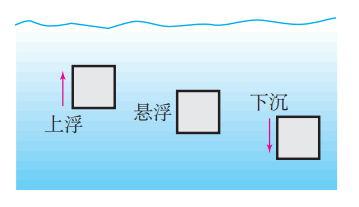

# 第 10 章 浮力

[toc]

## 浮力

### 浮力

浸在液体中的物体受到向上的力，这个力叫做浮力（buoyancy force）。

---

浮力产生的原因

### 决定浮力大小的因素

+ 决定浮力大小的因素
  + 物体浸在液体中的体积
  + 液体的密度

## 阿基米德原理

物体排开液体的体积越大、液体的密度越大，其所受浮力就越大。

### 浮力的大小

**浸在液体中的物体受到向上的浮力，浮力的大小等于它排开液体所受的重力。**
$$
\begin{aligned}
\huge F_浮&\huge=G_排\\
&\huge=\rho_液 g V_排 
\end{aligned}
$$
## 物体的浮沉条件及应用

### 物体的浮沉条件

+ 浮力大于重力，物体上浮
+ 浮力等于重力，物体受力平衡，可以悬浮再液体内任何地方
+ 浮力小于重力，物体下沉

---

+ 浸没在液体中的物体：
  + 密度小于液体的密度，物体上浮
  + 密度等于液体的密度，物体悬浮
  + 密度大于液体的密度，物体下沉

