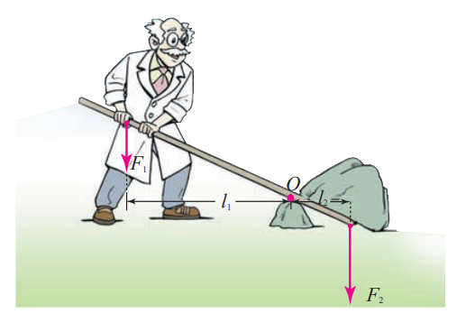
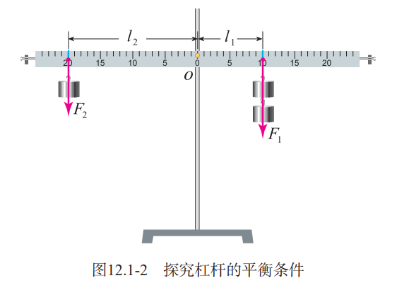
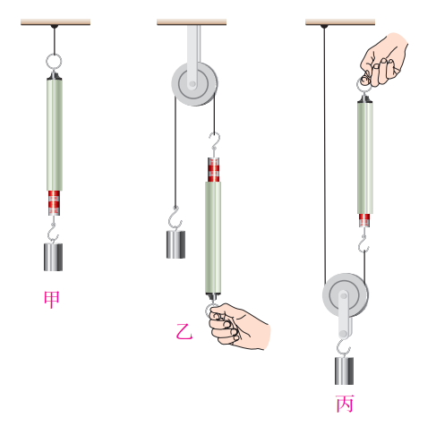
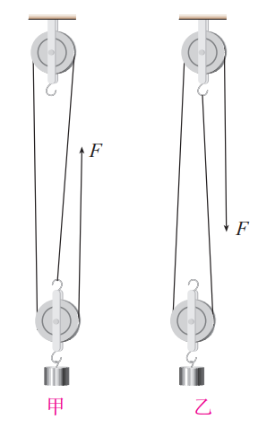

# 第 12 章简单机械

## 杠杆

### 杠杆

一根硬棒，在力的作用下能绕着固定点 $O$ 转动，这根硬棒就是杠杆(lever)。

+ 支点：杠杆可以绕其转动的点 $O$
+ 动力：使杠杆转动的力 $F_1$
+ 阻力：阻碍杠杆转动的力 $F_2$
+ 动力臂：从支点 $O$ 到动力 $F_1$ 作用线的距离 $l_1$
+ 阻力臂：从支点 $O$ 到动力 $F_1$ 作用线的距离 $l_1$

### 杠杆的平衡条件

杠杆的平衡条件是：
$$
\begin{aligned}
\huge\text{动力}\times \text{动力臂} & \huge = \text{阻力}\times \text{阻力臂}\\
\huge F_1l_1&\huge=F_2l_2
\end{aligned}
$$

### 生活中的杠杆

+ 等臂杠杆
+ 省力杠杆
+ 费力杠杆

## 滑轮

### 定滑轮和动滑轮

轴固定不动的滑轮叫做定滑轮。

随物体移动的滑轮叫做动滑轮。

+ 定滑轮可以改变力的方向
+ 定滑轮可以胜利
  + 不改变力的方向
  + 费距离

### 滑轮组

通常把定滑轮和动滑轮组合在一起，构成滑轮组。

动滑轮上有几段绳子承担物重，提起物体的力就是物重的几分之一。

## 机械效率

### 有用功和额外功

直接把钩码提升，这部分功是必须要做的，叫做有用功，用 $W_有$ 表示。

若用滑轮组提升钩码，我们还不得不克服动滑轮本身的重力和摩擦力等因素的影响而做功，这部分功叫做额外功，用 W 额表示。有用功加额外功是总共做的功，叫做总功，用 $W_总$ 表示。总功、有用功和额外功之间的关系为：
$$
\huge W_总 =W_有+W_额
$$

### 机械效率

有用功跟总功的比值叫做机械效率。一般用 $\eta$ 表示机械效率：
$$
\huge \eta=\frac{W_有}{W_总}
$$
使用任何机械都不可避免地要做额外功，有用功总是小于总功，所以机械效率总是小于 $1$ 的。
机械效率通常用**百分数**表示。