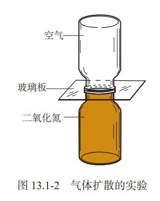
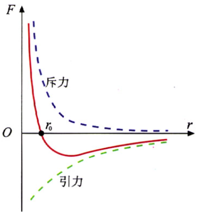
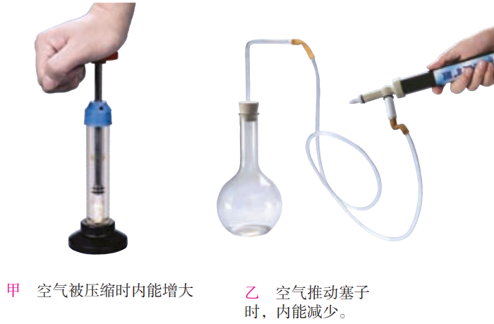

## 13 内能

### 分子热运动

#### 物质的构成

常见的物质是由极其微小的粒子 —— 分子（molecule）、原子（atom）构成的。

#### 分子热运动

不同的物质在互相接触时彼此进入对方的现象，叫做**「扩散」**。

扩散现象等大量事实表明，一切物质的分子都在不停地做无规则的运动（布朗运动）。
温度越高, 分子运动越剧烈。由于分子的运动跟温度有关, 所以这种无规则运动叫做分子的热运动。

#### 分子间的作用力

分子之间存在**引力**（范德华力），分子之间还存在**斥力**。

> 分子间的引力和斥力都是电磁力。

### 内能

#### 内能

构成物体的所有分子，其**热运动的动能**与**分子势能**的总和，叫做物体的**「内能」**。
内能的单位是**「焦耳」**（J），各种形式能量的单位都是焦耳。

#### 物体内能的改变

在热传递过程中，传递能量的多少叫做热量，热量的单位也是焦耳。
物体吸收热量时内能增加, 放出热量时内能减少。物体吸收或放出的热量越多, 它的内能改变越大。

> 热量是过程量，不能说「具有」。

+ 改变内能的方式
  + 做工
  + 热传递
    + 热对流
    + 热辐射
    + 热传导

### 比热容

#### 比热容

一定质量的某种物质，在温度升高时吸收的热量与它的质量和升高的温度乘积之比，叫做这种物质的**「比热容」**。比热容用符号 $c$ 表示，它的单位是焦每千克摄氏度，符号是 $J/(kg\cdot \degree C)$。

单位质量的某种物质，温度降低 1 °C 所放出的热量，与它温度升高 1 °C 所吸收的热量相等，数值 上也等于它的比热容。

#### 热量的计算

比热容在数值上等于单位质量的某种物质温度升高 1 °C 所吸收的热量。如果知道一种物质的比热 容，再知道这种物质的质量和温度升高的度数，就能计算它吸收的热量。
$$
\Large Q=cm\Delta t
$$

