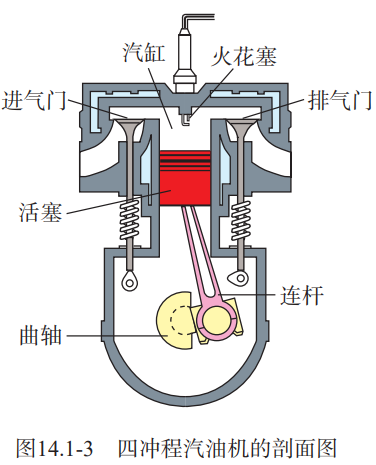
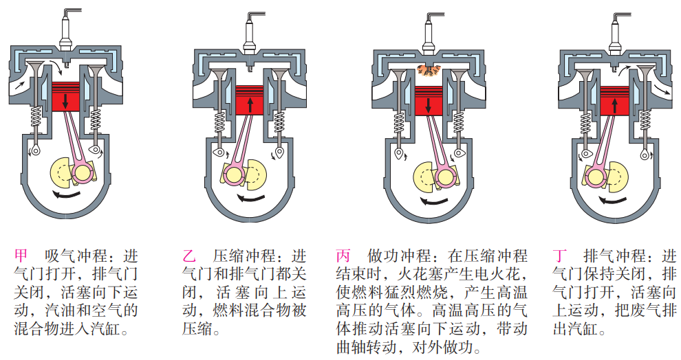

## 14 内能的利用

### 热机

#### 热机

**「热机」**是利用内能做工的机械。

#### 汽油机

#### 柴油机

柴油机做工冲程不需要火花塞点火，柴油机机械效率高于汽油机，但污染更高。

### 热机的效率

#### 燃料的热值

某种燃料完全燃烧放出的热量与其质量之比，叫做这种燃料的**「热值」**。

热值在数值上等于 $1\ kg$ 某种燃料完全燃烧放出的热量。热值的单位由热量的单位和质量的单位组合而成。在国际单位制中，热量的单位是焦耳，质量的单位是千克，则热值的单位是焦每千克，符号 是 $J/kg$。

#### 热机的效率

用来做有用功的那部分能量，与燃料完全燃烧放出的能量之比，叫做热机的效率。（与机械效率相同）
$$
\eta=\frac{W_有}{Q_放}
$$

### 能量的转化和守恒

#### 能量守恒定律

能量既不会凭空消灭，也不会凭空产生，它只会从一种形式转化为其他形式，或者从一个物体转移到其他物体，而在转化和转移的过程中，能量的总量保持不变。（热力学第一定律）

> 永动机不可能制成，违背热力学第一定律提出的永动机称为第一类永动机。