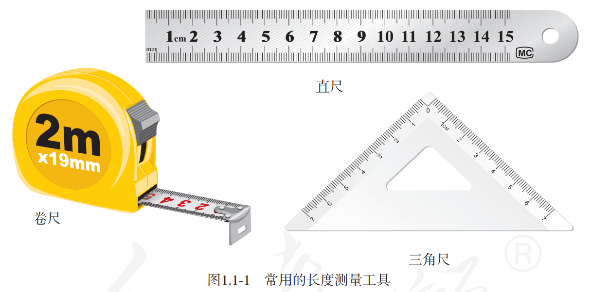
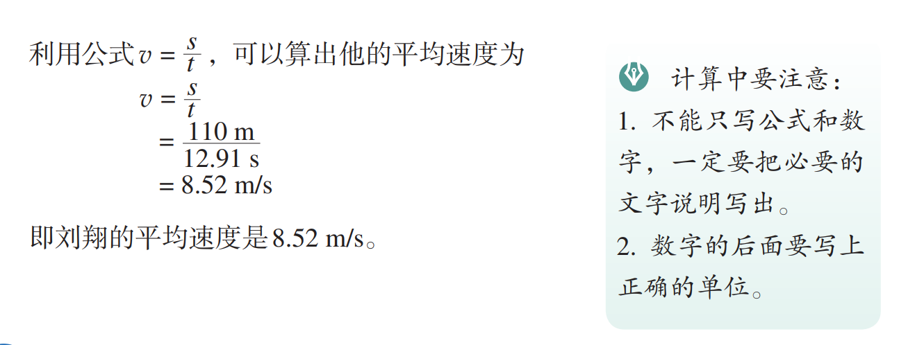

## 机械运动

### 长度和时间的测量

#### 长度的单位

长度的基本单位是「**米**」(Meter)。米的符号是 $m$。

#### 长度的测量

+ 刻度尺
  + 零刻度线
  + **量程**
    + 测量的范围
  + **分度值**
    + 决定测量的精度

#### 时间的测量

时间的基本单位是「**秒**」(Second)。秒的符号是 $s$。

使用停表测量时间。

#### 误差与错误

+ 误差
  + 测量值与真实值之间的差距
  + 不可避免
  + 可以减小
    + 多次测量求平均值
    + 选用精密的测量工具
    + 改进测量方法
    + ……
+ 错误
  + 可以避免 应该避免
  + 一般是人为造成的

### 运动的描述

#### 机械运动

物体位置随时间的变化叫做**机械运动**。

#### 参照物

判断运动的标准叫做参照物。

> 运动是绝对的，静止是相对的。（运动也可以是相对的）

### 运动的快慢

#### 速度

路程与时间之比叫做**速度**。通常用 $v$ 表示速度，$s$ 表示路程，$t$ 表示时间。
$$
\Large v=\frac{s}{t}
$$
速度的基本单位是**米每秒**，符号是 $m/s$ 或 $m\cdot s^{-1}$。

> $1\ m/s = 3.6\ km/h$

#### 匀速直线运动

沿着直线且速度不变的运动叫做匀速直线运动。

#### 测量平均速度

通过公式 $v=\frac{s}{t}$ 可知，测量出物体运动的路程 $s$ 和通过这段路程的时间 $t$，就可以计算出物体在这段时间内运动的平均速度。

