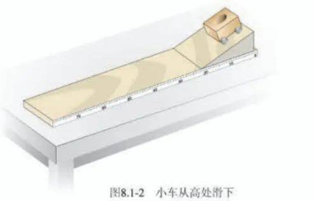

# 八年级下册

[toc]

## 力

### 力

#### 力

力用符号 F 表示。单位为**牛顿**，简称牛，符号为 N。

#### 力的作用效果

+ 使物体发生形变
+ 改变物体运动状态

#### 力的三要素和力的示意图

+ 力的三要素
  + 大小
  + 方向
  + 作用点
+ 力的示意图
  + 用一条带箭头的线段表示力，在受力物体上沿着力的方向画一条线段，在线段的末端画一个箭头表示力的方向，线段的起点或终点表示力的作用点。
  + 在同一图中，力越大，线段应该越长。
  + 可以在力的示意图上用数值和范围标出力的大小。

#### 力的作用是相互的

一个物体对另一个物体施力时，另一个物体也同时对它施加力的作用，即力的作用是相互的。

### 弹力

#### 弹力

物体由于发生弹性形变而产生的力叫做弹力。
支持力、压力都是弹力。

弹性限度：物体的弹性有一定的限度，超过这个限度就不能恢复到原来的形状。

#### 弹簧测力计

+ 测量力的工具，在弹性限度内，弹簧受到的拉力越大，弹簧的伸长量就越长。
+ 使用时要看清弹簧测力计的量程，否则会损坏弹簧测力计。

---

> 弹簧测力计不能倒着使用。

---

### 重力

由于地球的吸引而使物体受到的力叫做中立，用 G 表示。地球附近的所有物体都受到重力的作用。

> 重力不是引力。

#### 重力的大小

物体所受的重力与其质量成正比。如果用 G 表示重力，m 表示质量，g 表示重力与质量的比值 $g=\frac{G}{m}$，则：
$$
G=mg
$$
重力的单位是牛 N，质量的单位是千克 kg，因此 g 的单位是牛每千克，符号是 $N/kg$，$g=9.8\ N/kg$

---

> g 也叫重力加速度，有另一个单位 $m/s^2$。

---

#### 重力的方向

重力的方向是「竖直向下」。
不是「垂直向下」。

#### 重心

地球吸引物体的每一部分，但对于整个物体，重力作用的表现好像作用在某一个点上，这个点叫做物体的**重心**。
形状规则、质量分布均匀的物体，中心在其几何中心上。

为了表示方便，在受力物体上画力的示意图时，通常把力的作用点画在重心上。

#### 重力的由来

所有物体间均存在相互吸引的力，即**万有引力**。重力是地球引力的一部分，重力不是引力。

## 运动和力

### 牛顿第一定律

#### 阻力对物体运动的影响

物体的运动不需要力来维持，运动的物体之所以会停下来，是因为受到了阻力。

#### 牛顿第一定律

牛顿第一定律：一切物体在没有受到力的作用时，总保持静止状态或匀速直线运动状态。

牛顿第一定律是在大量经验事实的基础上推理概括而来的。经过检验是正确的。

#### 惯性

惯性：物体保持原来运动状态不变的性质。

惯性不是力，是物体的固有属性，惯性只与物体的质量有关。

### 二力平衡

物体受到几个力的所用时，如果保持静止或匀速直线运动状态，就说这几个力**相互平衡**，物体处于平衡状态。

#### 二力平衡的条件

作用在同一物体上的两个力，如果大小相等、方向相反，并且在同一直线上，这两个力就彼此平衡。

### 摩擦力

#### 摩擦力

两个相互接触的物体，当它们相对滑动时，在接触面上会产生一种阻碍相对运动的力，这种力叫做滑动**摩擦力**。

滑动摩擦力的大小跟接触面所受压力有关，跟接触面的粗糙程度有关，与接触面面积无关。

+ 摩擦力的利用与防止