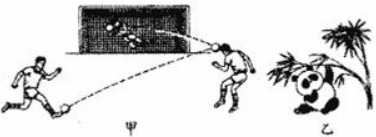
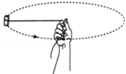
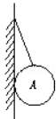
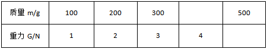
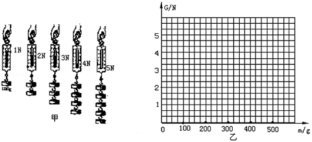
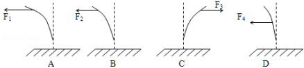

# 第 7 章 力

1. 一个中学生的体重最接近（  ）
   A. 5 N		B. 50 N		C. 500 N		D. 5000 N
2. 航天员在完全失重的太空轨道舱中进行体育锻炼，下列活动中可采用的是（  ）
   A. 举哑铃	B. 在跑步机上跑步	C. 用弹簧拉力器健身	D. 引体向上
3. 用天平和弹簧测力计分别在地球和月球上测同一物体，测量的结果是（  ）
   A. 天平、弹簧测力计测的都相同
   B. 天平测的相同，弹簧测力计测的不同
   C. 天平测的不同，弹簧测力计测的相同
   D. 天平、弹簧测力计测的都不同
4. 下列说法正确的是（）
   A. 没有物体，也可能有力的作用
   B. 磁铁吸引小铁钉时，只有铁钉收到磁铁的吸引力作用
   C. 彼此不接触的物体，也可以产生力的作用
   D. 不接触的物体，一定没有力的作用
5. 「物体间力的作用是相互的」。在下列事例中运用到这一规律的是（  ）
   A. 人把车子推走
   B. 划水船前进
   C. 磁铁把铁钉吸引过来
   D.用力拉弹簧，弹簧伸长
6. 有一把弹簧秤，秤钩上不受力时，指针不是指在零刻度位置，而是指在 0.2 N的位置上，此时用手拉弹簧秤的秤钩，使弹簧秤的示数为 4 N，则手拉弹簧的力是（  ）
   A. 4.2 N		B. 4 N		C. 3.8 N		D. 无法判断
7. 关于弹簧秤的使用，下列说法错误的是（  ）
   A. 弹簧秤必须竖直放置，不得歪斜
   B. 使用前指针要「校零」
   C. 使用过程中，弹簧秤指针不得与外壳摩擦
   D. 力不得超过弹簧秤的最大刻度
8. 用力推课桌的下部，课桌会沿地面滑动，而推课桌的上部，则课桌可能会翻倒，这说明力的作用效果（  ）
   A. 与力的大小有关
   B. 与力的方向有关
   C. 与力的作用点有关
   D. 与受力面积有关
9. 与其它三个力所产生的作用效果不同的是（  ）
   A. 运动员对弓的拉力
   B. 汽车对地面的压力
   C. 斧头对柴的力
   D. 下落小球受到的重力
10. 如图所示表示了力的作用效果，其中图甲主要表示力能改变物体的 $\underline{\qquad\qquad}$ ；图乙主要表示力能改变物体的 $\underline{\qquad\qquad}$ 。
    
11. 弹簧测力计是根据 $\underline{\qquad\qquad\qquad\qquad\qquad}$ 原理制成的，使用弹簧测力计时，所测力不能 $\underline{\qquad\qquad}$ 。
12. 物体所受的重力与它的质量 $\underline{\qquad\qquad}$，表达式为 $\underline{\qquad\qquad}$ ，一个质量是 30 kg 的物体所受重力是$\underline{\qquad\qquad}$ N．一只熊猫的体重是 490 N，它的质量是 $\underline{\qquad\qquad}$ 。
13. 体重为 400 N 的某学生站在静止的电梯里受到 $\underline{\qquad\qquad}$ 力和 $\underline{\qquad\qquad}$ 力，它们的施力物体分别是 $\underline{\qquad\qquad}$ 和 $\underline{\qquad\qquad}$ 。
14. 一个弹簧长 200 mm，下端挂 5 N 物体时长 250 mm，挂 2 N 的物体时，弹簧伸长 $\underline{\qquad\qquad}$ mm，当弹簧长 245 mm 时，弹簧受到的拉力是 $\underline{\qquad\qquad}$ N。
15. 小明同学用一根细线拴一块橡皮，甩起来，使橡皮绕手做圆周运动。请你在图中画出橡皮所受重力示意图。
    
16. 图中，物体 A 的质量是 5 kg，画出图中 A 物体受到的重力。
    
17. 在探究「物体所受的重力跟它的质量关系」的实验中，按照图甲所示，把钩码逐个挂在弹簧测力计上，分别读出钧码的质量和弹簧测力计相应的示数，并记录在下面的表格中。
    
    在表格中把空填完整，在图乙中，以质量为横坐标、重力为纵坐标描点。连接这些点，画出重力与质量之间关系的图线。由此可写出重力 G（N）和质量 m（㎏)之间的关系式是： $\underline{\qquad\qquad}$ 
18. 如图所示，让一条薄钢条的一端固定，现分别用不同的力去推它，使它发生如图中 A、B、C、D 所示的形变，如果力 $F_1＞F_2=F_3=F_4$，那么
    1. 能说明力的作用效果与力的大小有关的图是图 $\underline{\qquad\qquad}$ 、 $\underline{\qquad\qquad}$ 。
    2. 能说明力的作用效果与力的方向有关的图是图 $\underline{\qquad\qquad}$ 、 $\underline{\qquad\qquad}$ 。
    3. 能说明力的作用效果与力的作用点有关的是图 $\underline{\qquad\qquad}$ 、 $\underline{\qquad\qquad}$ 。
19. 甲、乙两个同学体重之比是 5 : 4 ，其中甲同学质量为 60 kg，则乙同学的质量和体重各是多少？
    
20. 2005 年 10 月 12 日，我国研制的神舟6号载人航天飞船成功进入太空。据报道：航天部为两位航天员（聂海胜、费俊龙）准备的食物（主食和副食）足足有 40 kg，这些食物在地球所受重力是多大？那么当飞船进入太空后这些食物的质量是多大？（g 取 10 N/Kg）

左威
陈